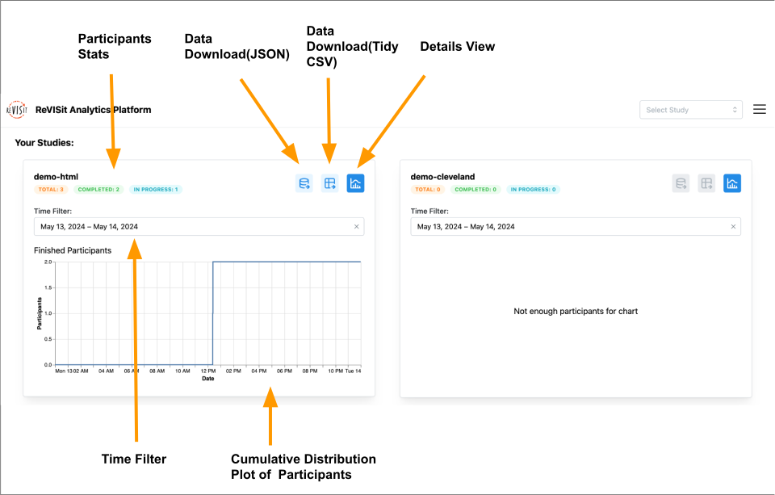

# Dashboard

The dashboard is the landing page of the analysis platform. It provides an overview of the status of each of your studies. On any page of reVISit, you can navigate to the analysis dashboard via the navigation menu in the upper right-hand corner.

The participants stats shows the total number of participants, the number of participants who have completed the experiment, and the number of participants who started but have not completed the experiment. 
We provide data download feature here. You can choose to download data in JSON format or in tidy CSV format.
The details view button brings you to details analysis page of the experiment.
You can adjust time filter to view data in different time range. The default time range is the past 24 hours.
The Cumulative Distribution Plot shows the history of completion of the experiment in selected time range.