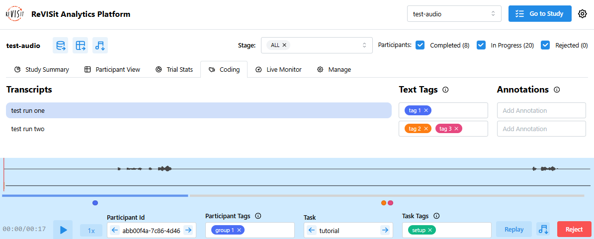

# Coding - Think Aloud

[Think Aloud](../../designing-studies/think-aloud) coding lets you review and code what participants said during your study. You can edit transcripts, add tags, write notes, and play the audio in sync with the text.

## Overview

To open Think Aloud coding, go to the **Coding** tab under **Analysis**. The first participant and task with audio will load automatically.

:::note
Coding is available only when using the Firebase storage engine. It also needs audio recordings to be turned on in your study setup (`"recordAudio" = true`).
:::

Here are the main features:

- **Transcripts**: Each line shows a small part of what the participant said. You can edit it, press **Enter** to split a line, or press **Backspace** to merge it with the line above. All changes are saved automatically.
- **Text Tags**: Labels you can add to transcript lines to organize each segment and show what was said or how it was said.
- **Annotations**: Short notes or comments about a transcript line. Use them for observations, thoughts, or extra context.
- **Replay Timeline**: Follow along as the current line highlights in blue during playback. Clicking a line jumps the audio to that part, keeping text and sound in sync.
- **Playback Speed**: Change how fast the audio plays, from **0.5×** to **8×**.
- **Participant Tags**: Labels for participants that let you group or filter them.
- **Task Tags**: Labels you can add to the current task to categorize it.

<!-- Importing links -->
import StructuredLinks from '@site/src/components/StructuredLinks/StructuredLinks.tsx';

<StructuredLinks
    demoLinks={[
        {name: "Test Audio Demo", url: "https://revisit.dev/study/analysis/stats/test-audio/tagging"}
    ]}
    referenceLinks={[
        {name: "Think Aloud", url: "../../designing-studies/think-aloud"}
    ]}
/>