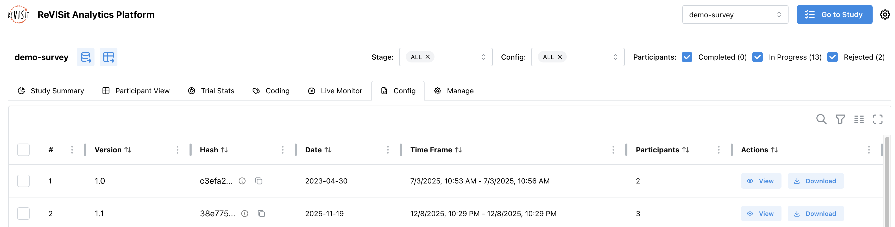
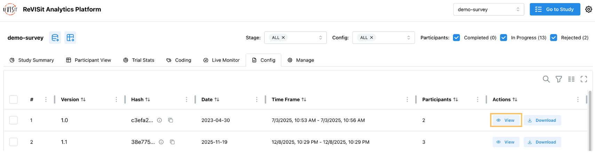
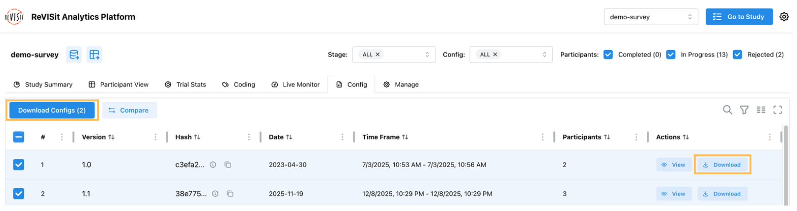
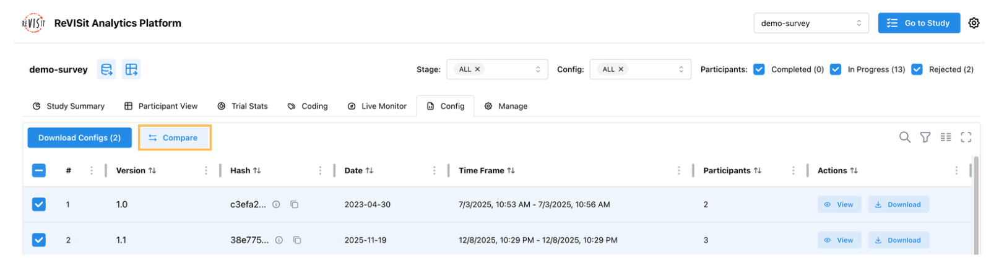

# Config

The Config tab shows all the different versions of your study configuration that participants have used.

## Overview

Each time you change your `config.json` file and deploy it, reVISit creates a unique hash for that version. 



The Config table has several columns. The version column shows the identifier from your `studyMetadata.version` field (like `1.0.0` or `pilot`). The hash column shows a unique code based on your actual config content. If anything changes in your config, you get a new hash, even if you forget to update the version number. Hover over the info icon to see the full hash, or click the copy icon to copy it.

The date column shows when you created that version (from `studyMetadata.date`). The time frame column shows when participants actually used it, from the first to the last participant. The participants column tells you how many people used each version.

Update your `studyMetadata` in `config.json` every time you make changes:

```json
{
  "studyMetadata": {
    ...
    "version": "pilot",
    "date": "2026-02-17",
  }
}
```

## View Config

Click the view icon in the Actions column to see the full JSON for any config version. This opens a modal showing the complete configuration file, which is helpful when you need to check exactly what settings were used for a particular version.



## Download Config

Download individual configs by clicking the Download button in the Actions column. The file will be named `{studyId}_{hash}_config.json`, like `study_abc123_config.json`.



For multiple configs, check the boxes next to the ones you want and click Download Configs at the top. This creates a zip file named `{studyId}_config.zip` with all the selected configs inside.
Download configs to back up your study versions, share with collaborators, archive for publication, or compare changes outside reVISit.

## Compare Config

Select exactly two configs using the checkboxes, then click Compare Configs. You'll see a side-by-side view with red highlighting for removed content, green for added content, and no highlighting for unchanged content.



:::note
Compare Config cannot track white space changes
:::

## Filter Config

The Config tab syncs with filters in other tabs. Config names are displayed as `{version}-{first 6 digits of hash}`, like `pilot-abc123`.


Select "ALL" to see everyone, or choose specific versions to analyze just those participants. This is useful when you want to analyze only your final version, compare responses across versions, exclude pilot data, or analyze different study runs separately.

<!-- Importing links -->
import StructuredLinks from '@site/src/components/StructuredLinks/StructuredLinks.tsx';

<StructuredLinks
    demoLinks={[
        {name: "Survey Demo", url: "https://revisit.dev/study/analysis/stats/demo-survey/config"}
    ]}
/>
