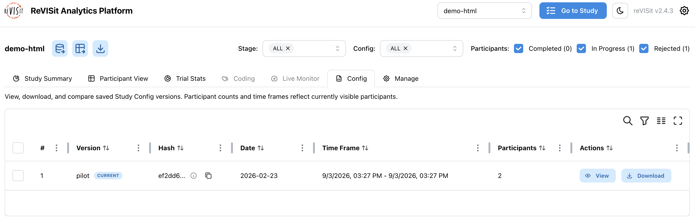
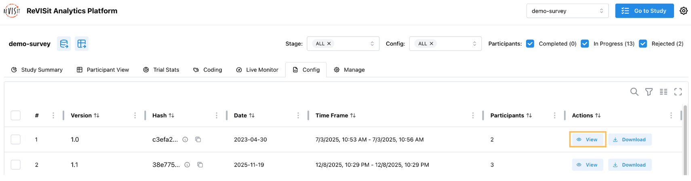
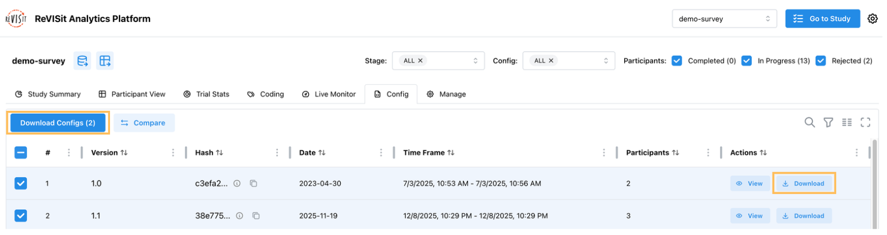
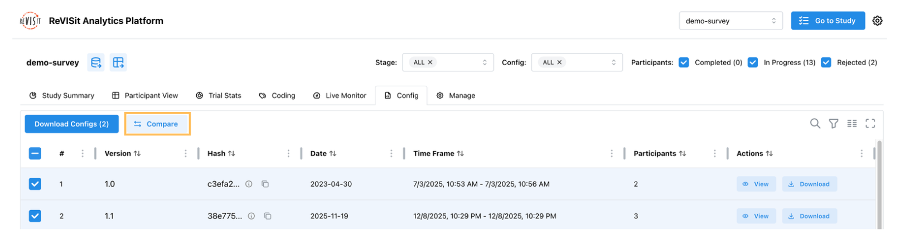
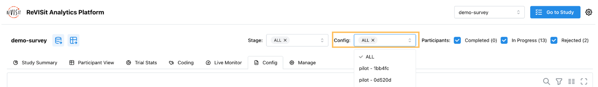

# Config

Open the **Config** tab in the Analysis platform to view, download, and compare saved Study Config versions. It includes the current version, when available, and versions used by Participants who match your current filters.

## Overview

Each time you change your `config.json` file and deploy it, reVISit creates a unique hash for that version.



The Config table has several columns. The version column shows the identifier from your `studyMetadata.version` field (like `1.0.0` or `pilot`). The latest deployed config is marked with a Current badge. The hash column shows a unique code based on your actual config content. If anything changes in your config, you get a new hash, even if you forget to update the version number. Hover over the info icon to see the full hash, or click the copy icon to copy it.

The **Date** column shows the date from `studyMetadata.date`. **Time Frame** shows the period of recorded activity for each version, and **Participants** shows how many Participants used it. Both reflect only the Participants visible under your current filters. A saved current version can appear with zero Participants; unavailable timing information is shown as `N/A`.

Update the `version` and `date` fields in your `studyMetadata` when you change your Study Config. This partial example shows the fields to update; keep your other metadata fields:

```json title="public/study-name/config.json"
{
  "studyMetadata": {
    "version": "pilot",
    "date": "2026-02-17"
  }
}
```

## View Config

Click the view icon in the Actions column to see the full JSON for any config version. This opens a modal showing the complete configuration file, which is helpful when you need to check exactly what settings were used for a particular version.



## Download Config

Download individual configs by clicking the Download button in the Actions column. The file will be named `{studyId}_{hash}_config.json`, like `study_abc123_config.json`.



For multiple configs, check the boxes next to the ones you want and click Download Configs at the top. This creates a zip file named `{studyId}_config.zip` with all the selected configs inside.
Download configs to back up your study versions, share with collaborators, archive for publication, or compare changes outside reVISit.

## Compare Config

Select exactly two configs using the checkboxes, then click Compare Configs. You'll see a side-by-side view with red highlighting for removed content, green for added content, and no highlighting for unchanged content.



:::warning
Compare Config cannot track whitespace changes.
:::

## Filter Config

The Config tab syncs with filters in other tabs. Config names are displayed as `{version}-{first 6 digits of hash}`, like `pilot-abc123`.



Select "ALL" to see everyone, or choose specific versions to analyze just those participants. This is useful when you want to analyze only your final version, compare responses across versions, exclude pilot data, or analyze different study runs separately.

## Empty Results and Loading Errors

- **No Study Config versions are available for the current filters.** No saved versions are available for this view. Check your filters and try including more Participants.
- **Unable to load saved Study Config versions.** The request failed. Check your connection and reload the page to try again.
- **Unable to identify the current Study Config version.** ReVISit could not determine which version is current. If versions used by Participants are available, you can still view, download, and compare them, but no version is marked **Current**. Reload the page to try again.

import StructuredLinks from '@site/src/components/StructuredLinks/StructuredLinks.tsx';

<StructuredLinks
    demoLinks={[
        {name: "Survey Demo", url: "https://revisit.dev/study/analysis/stats/demo-survey/config"}
    ]}
/>
