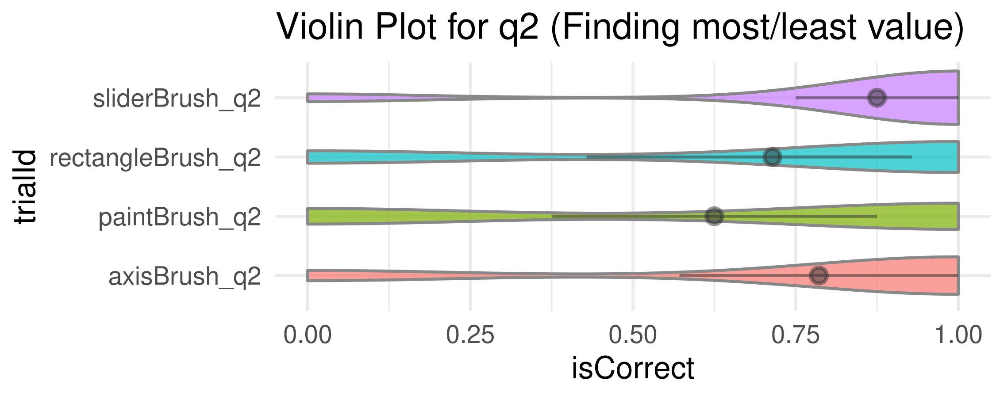

# Example Data Analysis 

Below is an example of how to analyze the data collected from the [Brush Interactions Demo](https://revisit.dev/study/analysis/stats/example-brush-interactions) study using R. The data is available in a tidy format, which makes it easy to manipulate and visualize.

## 1. Install Necessary Packages

```r
list.of.packages <- c("ggplot2", "Hmisc")
new.packages <- list.of.packages[!(list.of.packages %in% installed.packages()[,"Package"])]
if(length(new.packages)) install.packages(new.packages)

library(ggplot2)
```

## 2. Read and Preview the Data

```r
df <- read.csv("data/example-brush-interactions_all_tidy.csv")
head(df)
```

Here is a (truncated) preview of the data:


| participantId | trialId | trialOrder | responseId | stage | answer | correctAnswer | duration |
|---|---|---|---|---|---|---|---|
| b3d13c52 | rectangleBrush_q1 | 3 | response | DEFAULT | 18 | 17 | 16660 |
| b3d13c52 | axisBrush_q2 | 4 | max-response | DEFAULT | sun | sun | 22369 |
| b3d13c52 | axisBrush_q2 | 4 | min-response | DEFAULT | drizzle | drizzle | 22369 |
| b3d13c52 | sliderBrush_q2 | 5 | max-response | DEFAULT | Gentoo | Gentoo | 16142 |
| b3d13c52 | sliderBrush_q2 | 5 | min-response | DEFAULT | Chinstrap | Adelie | 16142 |
| b3d13c52 | rectangleBrush_q2 | 6 | max-response | DEFAULT | Japan | Japan | 25142 |
| b3d13c52 | rectangleBrush_q2 | 6 | min-response | DEFAULT | Europe | Europe | 25142 |

This is data for one participant. The `trialId` column indicates the task, `answer` shows the participant's answer, and `correctAnswer` shows the correct response, etc. For example, condition `sliderBrush_q2` has two responses: a `min-response` and a `max-response`. 


## 3. Filter Data for Task `q2` and Evaluate Correctness

Now, we want to only look at data for task `q2` and check if the participant's answer is correct.

```r
q2 <- subset(df, grepl("_q2", trialId) & status == "completed")


 We can create a new column `isCorrect` that indicates whether the answer matches the correct answer.

```r
q2 <- subset(df, grepl("_q2", trialId) & status == "completed")
q2$isCorrect <- ifelse(q2$answer == q2$correctAnswer, 1, 0)
```

### 4. Create a Violin Plot

The plot displays correct answers on the right and incorrect answers on the left.

```r
ggplot(q2, aes(x = isCorrect, y = trialId)) +
  geom_violin(aes(fill = trialId), color = "#888", alpha = 0.7) +
  stat_summary(fun.data = "mean_cl_boot", colour = "#333", size = 0.5, alpha=0.5) +
  theme_minimal() +
  theme(legend.position = "none") +
  labs(
    title = "Violin Plot for q2 (Finding most/least value)",
  )
```



We find accuracy using paint brush technique is much less than that of the others.

### 5. Export the generated plot.

```r
ggsave("plot.pdf", width = 5, height = 2, units = "in")
```

