# Data Export

## Download as Tidy CSV

ReVISit allows you to export data in [Tidy](https://cran.r-project.org/web/packages/tidyr/vignettes/tidy-data.html) format for analysis in Python notebooks or R.

The exported tidy data includes all the responses from the participants, including the participant ID, trial ID, trial order, and response ID. Additionally, we provide the parameters and correct answers that were set in the study configuration file (or by dynamic block). This data can be used to analyze the performance of participants, the accuracy of responses, and the time taken to complete the study.

The tidy data does not contain some data that is available in the JSON download, such as the provenance graphs. If you need this data, you can [download the JSON data](./#download-as-json) and parse it in your analysis platform.

### Steps to Download Data

1. Navigate to the **Analysis** platform for the current study.

2. Open the Participant View, then click on the **Download as tidy CSV** button. Here's a [direct link for the example below](https://revisit.dev/study/analysis/stats/example-brush-interactions/table).

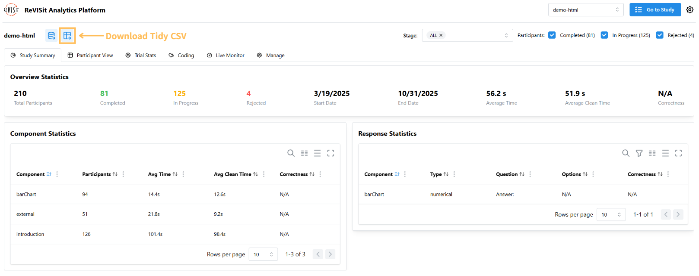

3. The **CSV Exporter** will open, where you can select the columns to export. A preview of the first five rows of the output CSV will be displayed.

4. Once ready, click the **Download** button at the bottom right.

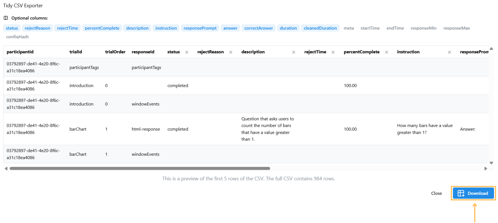

After downloading the Tidy data, you can import it into your favorite analysis platform for further analysis. Below is an example of how to work with exported data from the [Interactive Selections in Scatterplot](https://revisit.dev/study/example-brush-interactions) study in R.

:::info
**What is the Tidy data format?**  
The Tidy data format is a structured approach to organizing tabular data where each variable is a column, each observation is a row, and each type of observational unit is a separate table.
You may check more details [here](https://cran.r-project.org/web/packages/tidyr/vignettes/tidy-data.html).
:::

### Including Transcripts in Tidy CSV Export
If your study includes [audio recording](../../designing-studies/think-aloud), you can optionally include a transcript column in your tidy CSV export. This column contains the transcribed text from each trial, making it easy to analyze what participants said alongside their responses. You must be using Firebase as your storage engine and have the [Google Cloud Speech-to-Text extension](https://extensions.dev/extensions/googlecloud/speech-to-text) configured for your project.

Downloading transcripts for large datasets can take significant time. If you're downloading data for **50 or more participants** with transcripts, you'll see a warning about potential delays. The system fetches transcripts with concurrency limits to avoid overwhelming the browser.

## Download as JSON

1. Navigate to the **Analysis** platform for the current study.

2. Open the Participant View, then click on the **Download as JSON** button.

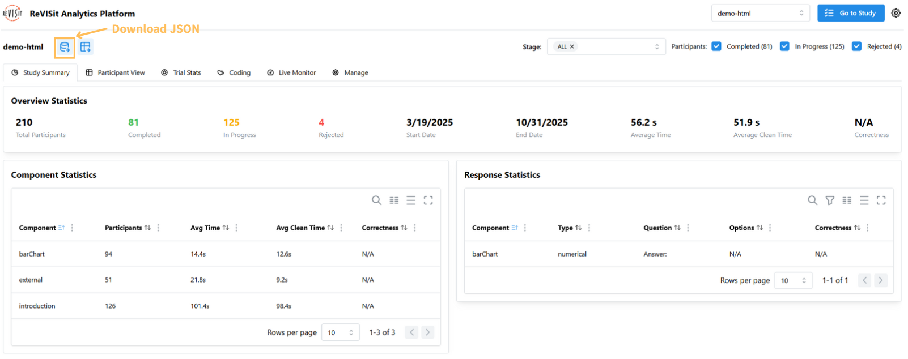

## Download Audio

You can download audio files if you have enabled `recordAudio: true` in your study. To learn how to enable audio recording in your study, please visit [Think Aloud](../../designing-studies/think-aloud).

### Bulk-Download Participants' Audio

1. Navigate to the **Analysis** platform for the current study.

2. Open the **Participant View**, then click on the **Download participants audio** button.

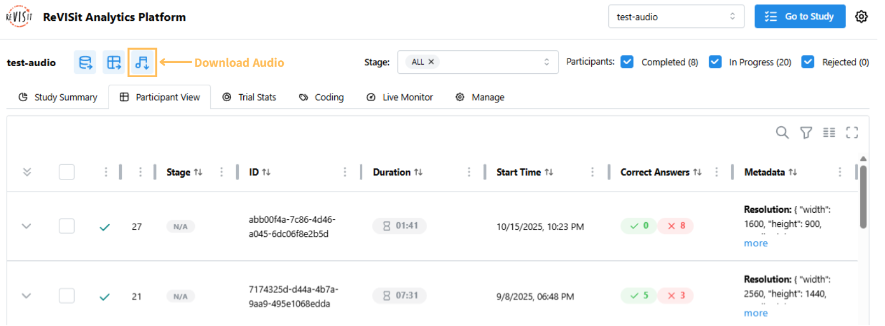

:::note
To download audio from a subset of participants, select the participants in the table before clicking download.
:::

### Download Individual Participant's Audio for a Specific Task

1. Navigate to the **Analysis** platform for the current study.

2. Open the **Participant View**, then expand the participant’s timeline by clicking the expand button.
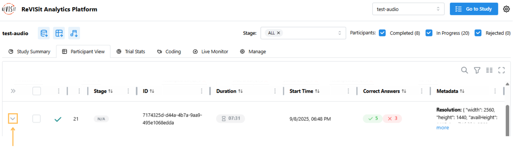

3. Click on the task.
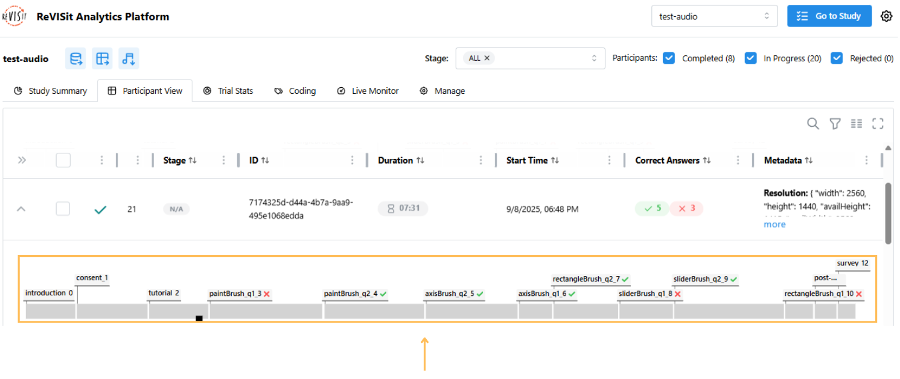

3. Click on the **Download Audio** button.
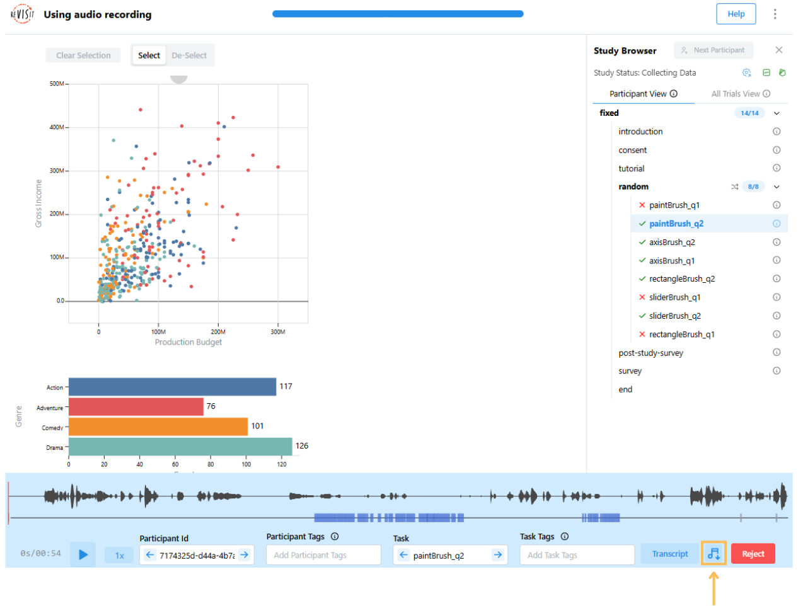

:::info
If you are using Firebase with the [Google Cloud Speech-to-Text extension](https://extensions.dev/extensions/googlecloud/speech-to-text) configured, it will download the transcript of the audio file as well.
:::

## Download Screen Recording

You can download screen recording video files if you have enabled `recordScreen: true` in your study. To learn how to enable the screen recording feature in your study, please visit [Record Screen](../../designing-studies/record-screen).

### Bulk-Download Participants' Screen Recording

1. Navigate to the **Analysis** platform for the current study.

2. Open the **Participant View**, then click on the **Download participants' screen recording** button.

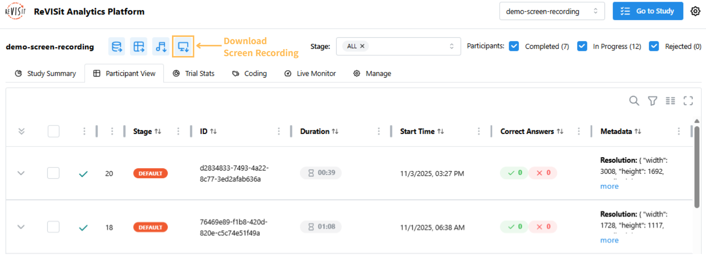

:::note
To download screen recording from specific participants, select the participants in the table.
:::

### Download Individual Participant's Screen Recording for a Specific Task

1. Navigate to the **Analysis** platform for the current study.

2. Open the **Participant View**, then expand the participant’s timeline by clicking the expand button.
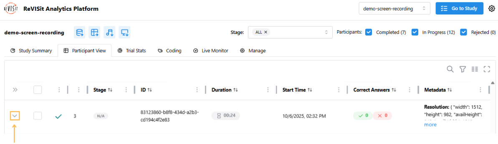

3. Click on the task.
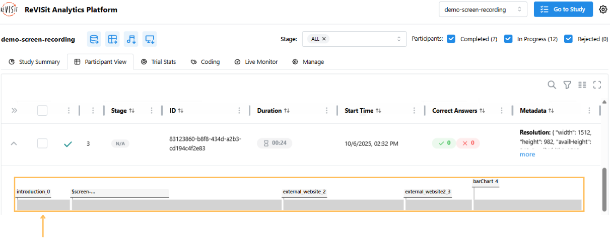

3. Click on the **Download Screen Recording** button.
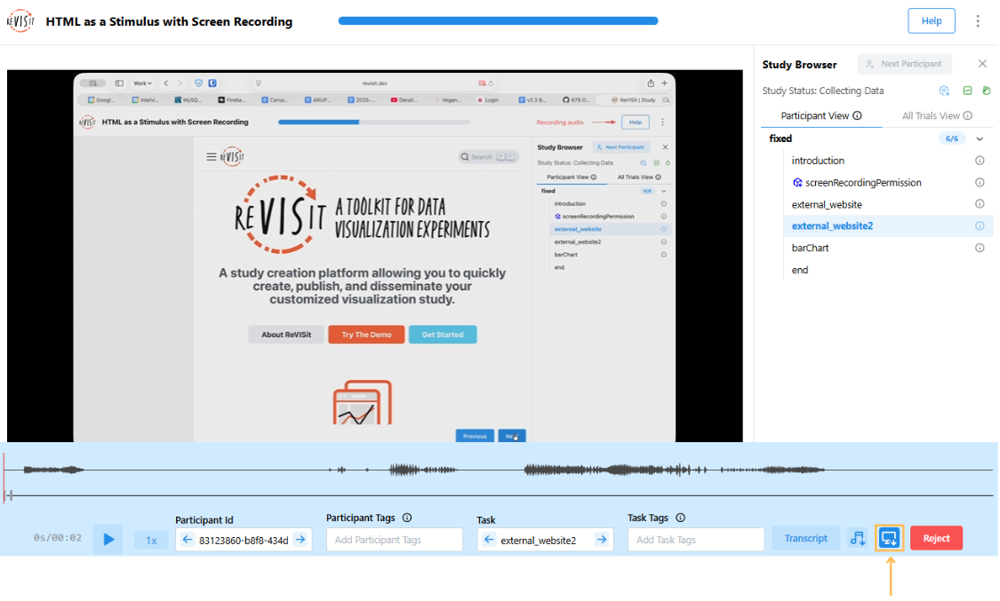

import StructuredLinks from '@site/src/components/StructuredLinks/StructuredLinks.tsx';

<StructuredLinks
    demoLinks={[
        {name: "Brush Interactions Demo", url: "https://revisit.dev/study/analysis/stats/example-brush-interactions"},
        {name: "Audio Demo", url: "https://revisit.dev/study/analysis/stats/test-audio"},
    ]}
    codeLinks={[
        {name: "Brush Interactions Code", url: "https://github.com/revisit-studies/study/tree/main/public/example-brush-interactions"},
        {name: "Audio Code", url: "https://github.com/revisit-studies/study/tree/main/public/test-audio"}
    ]}
    referenceLinks={[
        {name: "Tidy Data", url: "https://cran.r-project.org/web/packages/tidyr/vignettes/tidy-data.html"},
        {name: "R", url: "https://www.r-project.org/other-docs.html"},
        {name: "Jupyter", url: "https://docs.jupyter.org/en/latest/"},
        {name: "Think Aloud", url: "https://revisit.dev/docs/designing-studies/think-aloud"}
    ]}
/>
