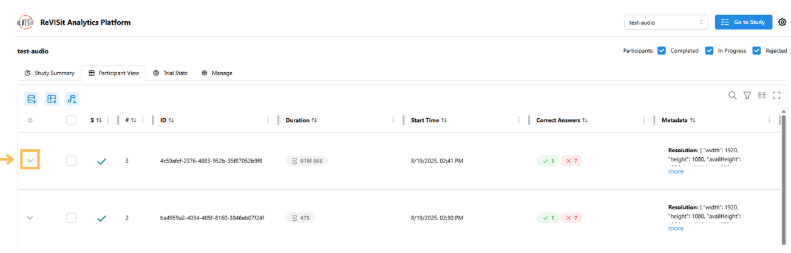
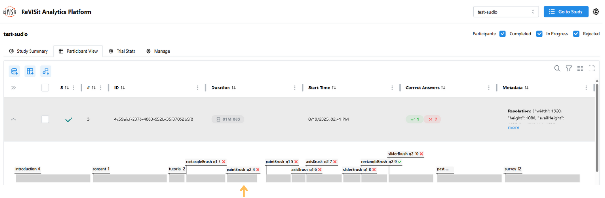

# Data Export and Basic Analysis

reVISit allows you to export in [Tidy](https://cran.r-project.org/web/packages/tidyr/vignettes/tidy-data.html) format for analysis in Python notebooks or R.

The exported tidy data includes all the responses from the participants, including the participant ID, trial ID, trial order, and response ID. Additionally, we provide the parameters and correct answers that were set in the study configuration file (or by dynamic block). This data can be used to analyze the performance of participants, the accuracy of responses, and the time taken to complete the study.

The tidy data is missing some data that is available in the JSON download, such as the provenance graphs. If you need this data, you can download the JSON data and parse it in your analysis platform, instead of using this Tidy data.

## Steps to Download Data

1. Navigate to the **Analysis** platform for the current study.

2. Open the Participant View, then click on the **Download all participants' data as a tidy CSV** button. Here's a [direct link for the example below](https://revisit.dev/study/analysis/stats/example-brush-interactions/table).


3. The **CSV Explorer** will open, where you can select the columns to export. A preview of the first five rows of the output CSV will be displayed.

4. Once ready, click the **Download** button at the bottom right.


After downloading the Tidy data, you can import it into your favorite analysis platform for further analysis. Below is an example of how to work with exported data from the [Interactive Selections in Scatterplots](https://revisit.dev/study/example-brush-interactions) study in R.

:::info What is Tidy data format?


Tidy data format is a structured approach to organizing tabular data where each variable is a column, each observation is a row, and each type of observational unit is a separate table.
You may check more details [Here](https://cran.r-project.org/web/packages/tidyr/vignettes/tidy-data.html).
:::
## Example Workflow in R

### 1. Install Necessary Packages

```r
list.of.packages <- c("ggplot2", "Hmisc")
new.packages <- list.of.packages[!(list.of.packages %in% installed.packages()[,"Package"])]
if(length(new.packages)) install.packages(new.packages)

library(ggplot2)
```

### 2. Read and Preview the Data

```r
df <- read.csv("data/example-brush-interactions_all_tidy.csv")
head(df)
```

|   | participantId                        | trialId       | trialOrder | responseId   |
|---|--------------------------------------|---------------|------------|--------------|
| 1 | 017ab8bd-33d1-4f95-ac07-5fedef30928a | introduction  | 0          | prolificId   |
| 2 | 017ab8bd-33d1-4f95-ac07-5fedef30928a | consent       | 1          | signature    |
| 3 | 017ab8bd-33d1-4f95-ac07-5fedef30928a | consent       | 1          | accept       |
| 4 | 017ab8bd-33d1-4f95-ac07-5fedef30928a | paintBrush_q1 | 5          | response     |
| 5 | 017ab8bd-33d1-4f95-ac07-5fedef30928a | paintBrush_q2 | 6          | max-response |


### 3. Filter Data for Task `q2`


```r
q2 <- subset(df, grepl("_q2", trialId) & status == "completed")
q2$isCorrect <- ifelse(q2$answer == q2$correctAnswer, 1, 0)
q2 <- subset(df, grepl("_q2", trialId) & status == "completed")
q2$isCorrect <- ifelse(q2$answer == q2$correctAnswer, 1, 0)
```


### 4. Create a Violin Plot

The plot displays correct answers on the right and incorrect answers on the left.

```r
ggplot(q2, aes(x = isCorrect, y = trialId)) +
  geom_violin(aes(fill = trialId), color = "#888", alpha = 0.7) +
  stat_summary(fun.data = "mean_cl_boot", colour = "#333", size = 0.5, alpha=0.5) +
  theme_minimal() +
  theme(legend.position = "none") +
  labs(
    title = "Violin Plot for q2 (Finding most/least value)",
  )
```


We find accuracy using paint brush technique is much less than that of the others.


### 5. Export the generated plot.

```r
ggsave("plot.pdf", width = 5, height = 2, units = "in")
```

## Download Audio 

There are two ways to download audio files if you have enabled `recordAudio: true` in your study. For applying Think Aloud in your study, please visit [Think Aloud](../../designing-studies/think-aloud).

### Download Participants' Audio

1. Navigate to the **Analysis** platform for the current study.

2. Open the **Participant View**, then click on the **Download participants audio** button.


:::note
To download audio from specific participants, select the participants in the table.
:::


### Download Single Participant's Task Audio

1. Navigate to the **Analysis** platform for the current study.

2. Open the **Participant View**, then expand the participant’s timeline by clicking the expand button.


3. Click on the task.


3. Click on the **Download Audio** button.


:::note
If you are using Firebase, it will download the transcript of the audio file as well.
:::

## Download Screen Recording 

There are two ways to download screen recording video files if you have enabled `recordScreen: true` in your study. For applying screen recording feature in your study, please visit [Record Screen](../../designing-studies/record-screen).

### Download Participants' Audio

1. Navigate to the **Analysis** platform for the current study.

2. Open the **Participant View**, then click on the **Download participants screen recording** button.


:::note
To download screen recording from specific participants, select the participants in the table.
:::


### Download Single Participant's Screen Recording

1. Navigate to the **Analysis** platform for the current study.

2. Open the **Participant View**, then expand the participant’s timeline by clicking the expand button.


3. Click on the task.


3. Click on the **Download Screen Recording** button.


import StructuredLinks from '@site/src/components/StructuredLinks/StructuredLinks.tsx';

<StructuredLinks
    demoLinks={[
        {name: "Brush Interactions Demo", url: "https://revisit.dev/study/analysis/stats/example-brush-interactions"},
        {name: "Audio Demo", url: "https://revisit.dev/study/analysis/stats/test-audio"},
    ]}
    codeLinks={[
        {name: "Brush Interactions Code", url: "https://github.com/revisit-studies/study/tree/main/public/example-brush-interactions"},
        {name: "Audio Code", url: "https://github.com/revisit-studies/study/tree/main/public/test-audio"}
    ]}
    referenceLinks={[
        {name: "Tidy Data", url: "https://cran.r-project.org/web/packages/tidyr/vignettes/tidy-data.html"},
        {name: "R", url: "https://www.r-project.org/other-docs.html"},
        {name: "Jupyter", url: "https://docs.jupyter.org/en/latest/"},
        {name: "Think Aloud", url: "https://revisit.dev/docs/designing-studies/think-aloud"}
    ]}
/>
