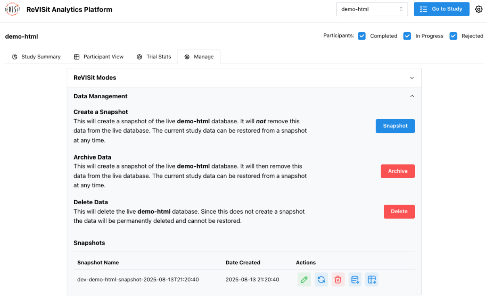

# Data Management

The reVISit analytics platform provides a robust way to manage, backup, and restore your user data.

## Snapshots

A **snapshot** of in the data management platform is an exact copy of the current state of a particular study dataset. This includes all the data gathered from each participant as well as the current study assignment sequence. To create a snapshot, you can navigate to the "Manage" tab within a particular study's analytics interface and click "Snapshot" in the "Create A Snapshot" section. When a snapshot is created, you will see the name of the snapshot in the "Snapshots" list below. This does not remove the data from the current study dataset.

## Archiving Data

When you archive your data, it first creates a snapshot of the current study data. Then, the current study data is completely removed - allowing you to essentially "reset" the study while creating a backup copy to restore at a later point.

## Restoring a Snapshot

At any point, the current study data can be restored to a snapshot. In your snapshot list, you will see a "restore" icon which will allow you to do this. When you restore a snapshot, a new snapshot of the current study data will first be created. All data from the snapshot being restored is then copied back into the current study data. Your snapshot will _not_ be removed.

## Deleting a Snapshot

A snapshot can be deleted at any time in order to free up space in your Firebase application. Simply click the "delete" icon next to any snapshot and follow the onscreen instructions to remove it.

:::danger
All data deletion is permanent. Once deleted, you will not be able to view or download this data.
:::

## Deleting Live Data

You can delete the live study data at any point. Note that this delete functionality will _not_ create a snapshot of the data first; it will instead completely clear the data for this individual study.

:::danger
All data deletion is permanent. Once deleted, you will not be able to view or download this data.
:::

:::info
Whenever live data is deleted, reVISit will automatically generate a new configuration file for the upcoming participant. Thus, if you go into your Firebase UI after deleting your live data, you will still see the `configs/` folder with one configuration inside.
:::
