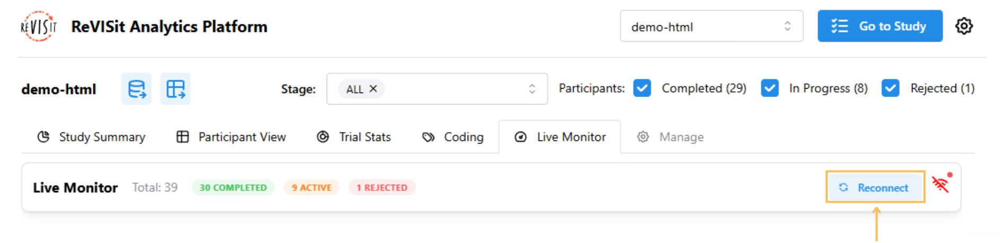

# Live Monitor

## Overview

The Live Monitor gives you a real-time view of participant progress throughout your study. It automatically updates using Firebase listeners, so you’ll see changes the moment they happen — no need to refresh the page.

Check out the [Live Monitor Demo](https://revisit.dev/study/analysis/stats/demo-dynamic/live-monitor).

:::note
The Live Monitor currently works only with the Firebase storage engine and requires an active internet connection.
:::

## Real-Time Updates

To get started, open the Live Monitor tab under Analysis and check the connection indicator to see whether you’re connected, reconnecting, or disconnected.
Hovering over the connection icon displays the last time the data was updated.

If your internet connection temporarily drops, the Live Monitor will automatically reconnect once you’re back online. You can also click the Reconnect button to refresh the connection manually.

## Tracking Participant Progress

Participants are grouped by their status, and you can expand or collapse sections as needed. You can also filter participants by status or stage using the controls at the top. They are sorted by creation time, with the most recent participants appearing first.

For participants still in progress, question blocks show task status: green for completed, gray for unanswered, teal for dynamic study items. Hovering over a question block displays the task name in a tooltip.

If your study uses a [dynamic block](../../typedoc/interfaces/DynamicBlock/), you’ll see a "?" instead of a percentage in the progress indicator. This happens because the total number of tasks in a dynamic study isn’t fixed and can’t be calculated ahead of time.

<!-- Importing Links -->
import StructuredLinks from '@site/src/components/StructuredLinks/StructuredLinks.tsx';

<StructuredLinks
    demoLinks={[
        {name: "HTML Demo", url: "https://revisit.dev/study/analysis/stats/demo-html/live-monitor"},
        {name: "Dynamic Block Demo", url: "https://revisit.dev/study/analysis/stats/demo-dynamic/live-monitor"}
    ]}
/>