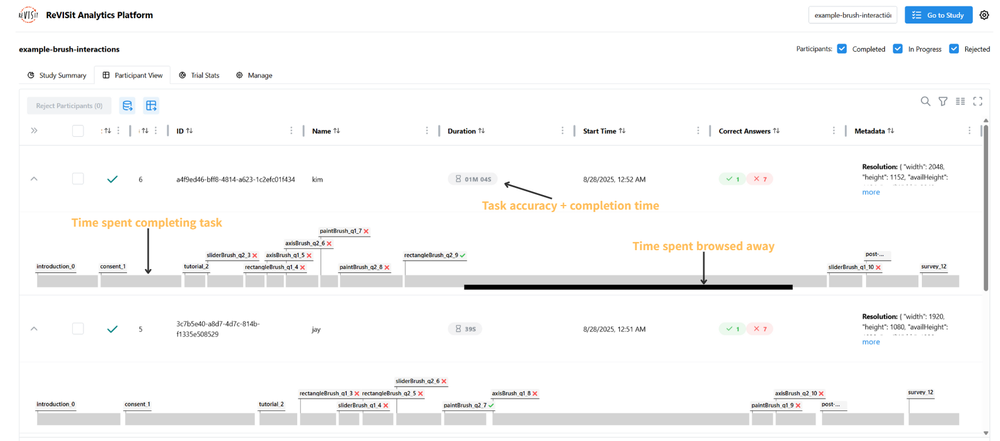
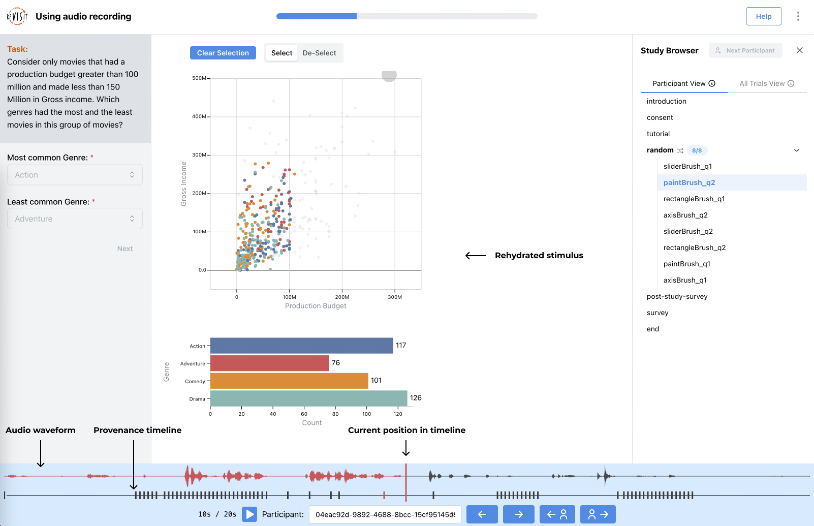
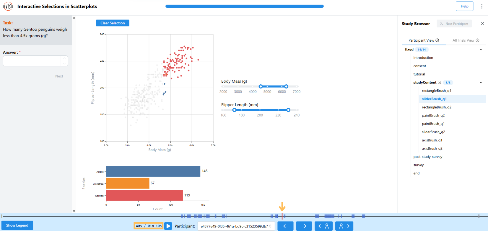

# Participant Replay

import StructuredLinks from '@site/src/components/StructuredLinks/StructuredLinks.tsx';

<StructuredLinks
    demoLinks={[
        {name: "Brush Interactions Demo", url: "https://revisit.dev/study/analysis/stats/example-brush-interactions"}
    ]}
    codeLinks={[
        {name: "Brush Interactions Code", url: "https://github.com/revisit-studies/study/tree/main/public/example-brush-interactions"}
    ]}
/>

The participant replay can be used for an overview of each participants study. 

To view the provenance or audio replay for a single participant, click on a task on the timeline. 

Task replay is intended to be used with provenance, audio recording, or both. Audio and provenance are synced, and the provenance data is used to rehydrate the task stimulus, showing researchers what participants saw while taking the study. 

If you’d like to link to a specific timestamp in the replay, you can use the `&t` query parameter in your URL.  
For example, this link will jump to 40 seconds in the replay: https://revisit.dev/study/example-brush-interactions/LzE2MTl4ZVRMTk5nSFlNYmd1ZDhjZz09?participantId=e4377e49-0f35-461a-bd9c-c31523599db7&t=40s

You can specify time in different formats:  
- Milliseconds: `&t=1000`  
- Seconds: `&t=1s`, `&t=70s`  
- Minutes: `&t=2m`, `&t=10m30s`  
- Hours: `&t=1h30m`  

If the entered time exceeds the replay’s maximum length, it will automatically be replaced with the maximum available time in milliseconds.
