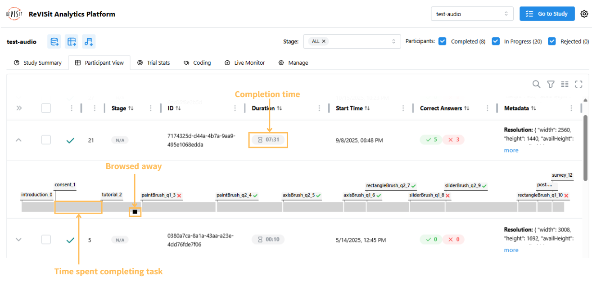
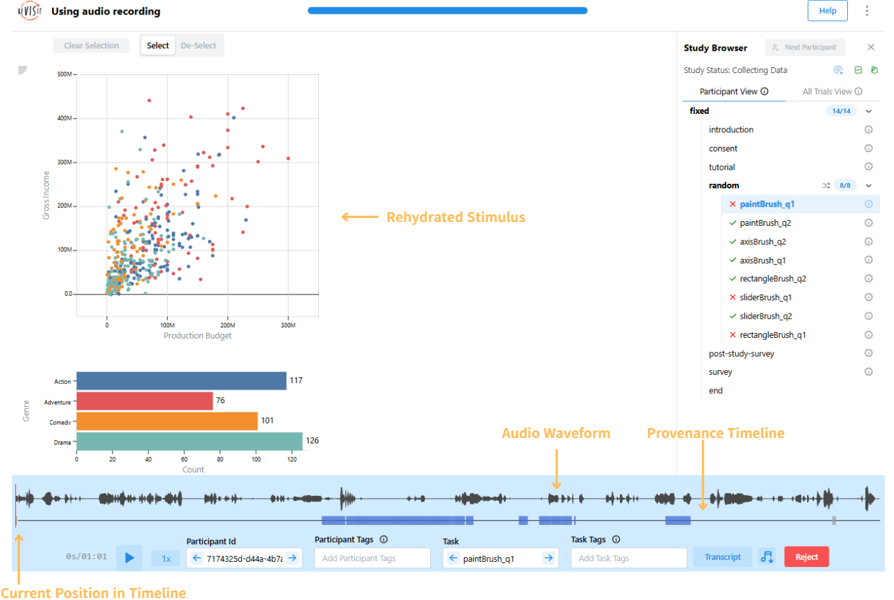
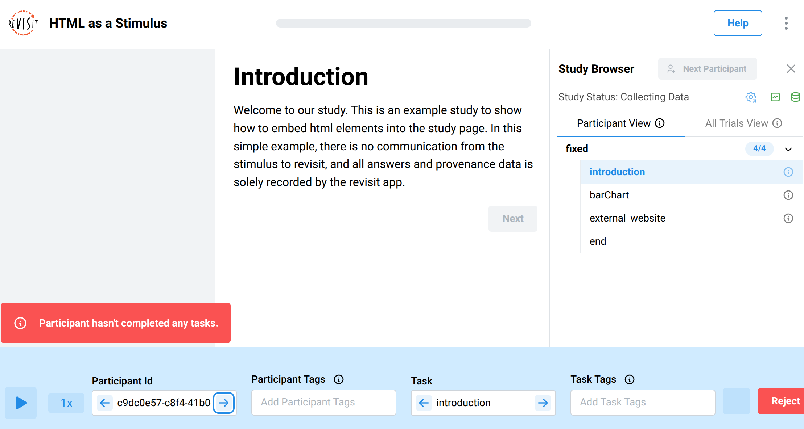
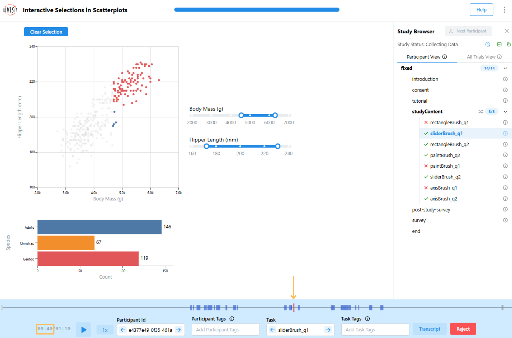

# Participant Replay

The participant replay can be used for an overview of each participant's study.

To view the provenance or audio replay for a single participant, click the expand icon to open their data row, then select a task on the timeline.

## Order Tasks in the Timeline

Use the **Order** selector in the toolbar above the participant table to choose how tasks and their labels are listed in each expanded timeline. In the **Time** layout, task bars retain their time-based positions and widths. In the **Uniform** layout, the selected order determines their left-to-right placement.

- **Sequence** (default) lists tasks in the sequence generated and recorded for that Participant.
- **Answer time** lists tasks by the time they began. Tasks that were never started appear after started tasks, in sequence order.

## Choose a Timeline Layout

Use the **Time / Uniform** control in the toolbar above the participant table to choose how task bars are sized in each expanded timeline. This setting changes the timeline layout, not the task order selected with the **Order** control.

- **Time** (default) positions and sizes task bars using their recorded start and end times. It also shows when the Participant browsed away from the study. Long periods without recorded component timing are compressed and marked with `//`; hover over the marker to see the duration of the gap.
- **Uniform** gives every task the same width, making short tasks easier to select and compare. Each task is at least 48 pixels wide. If all task bars do not fit in the table, scroll horizontally to view the rest of the timeline. Because this layout does not represent duration, browsed-away markers are hidden.

Uniform mode does not change the task order selected with the **Order** control. Task colors continue to distinguish correct, incorrect, incomplete, and recorded responses whose correctness is not configured.

Task replay is intended to be used with provenance, audio recording, or both. Audio and provenance are synced, and the provenance data is used to rehydrate the task stimulus, showing researchers what participants saw while taking the study. This includes the moment validation errors were revealed after a Participant attempted to continue, so replay shows the same highlighted validation state.

For stimuli that use managed Trrack provenance, replay follows the recorded interaction path, including undo, redo, and revisiting an existing state. Historical graph-only provenance remains replayable, but may not reproduce those traversals as faithfully.

:::info
If a participant hasn't completed any tasks yet, you'll see a warning message indicating that no task data is available for replay. This typically happens when a participant is still in progress or dropped out before submitting any responses.

:::

If you’d like to link to a specific timestamp in the replay, you can use the `&t` query parameter in your URL.
For example, this link will jump to 40 seconds in the replay: https://revisit.dev/study/example-brush-interactions/LzE2MTl4ZVRMTk5nSFlNYmd1ZDhjZz09?participantId=e4377e49-0f35-461a-bd9c-c31523599db7&t=40s

You can specify time in different formats:
- Milliseconds: `&t=1000`
- Seconds: `&t=1s`, `&t=70s`
- Minutes: `&t=2m`, `&t=10m30s`
- Hours: `&t=1h30m`

If the entered time exceeds the replay’s maximum length, it will automatically be replaced with the maximum available time in milliseconds.

import StructuredLinks from '@site/src/components/StructuredLinks/StructuredLinks.tsx';

<StructuredLinks
    demoLinks={[
        {name: "Brush Interactions Demo", url: "https://revisit.dev/study/analysis/stats/example-brush-interactions"}
    ]}
    codeLinks={[
        {name: "Brush Interactions Code", url: "https://github.com/revisit-studies/study/tree/main/public/example-brush-interactions"}
    ]}
/>
