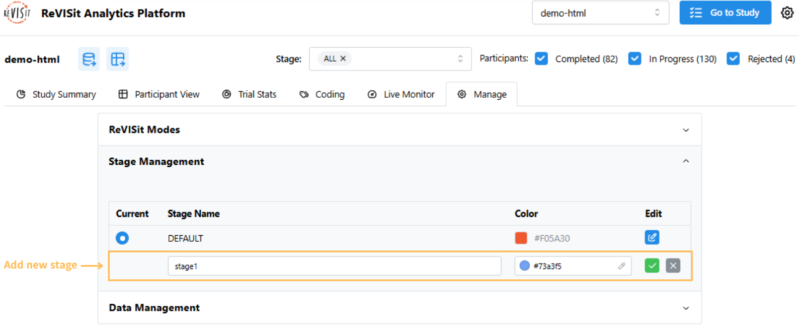
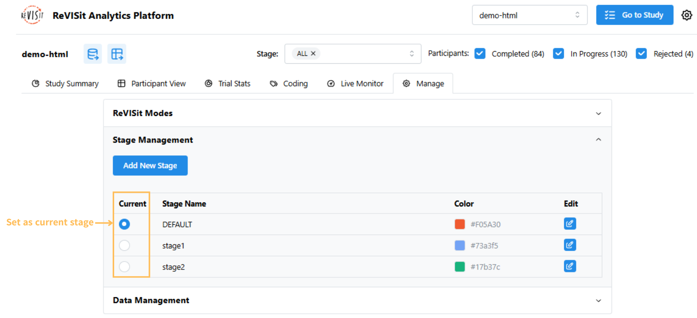
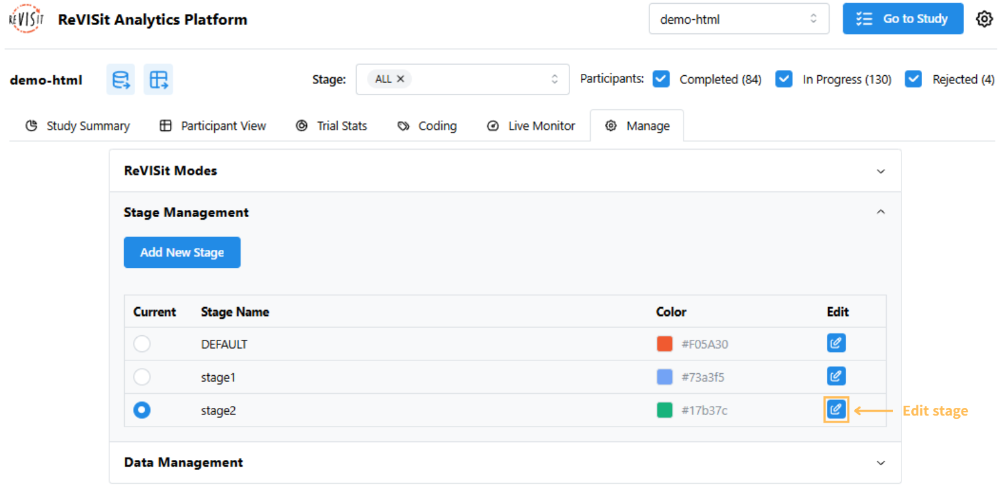
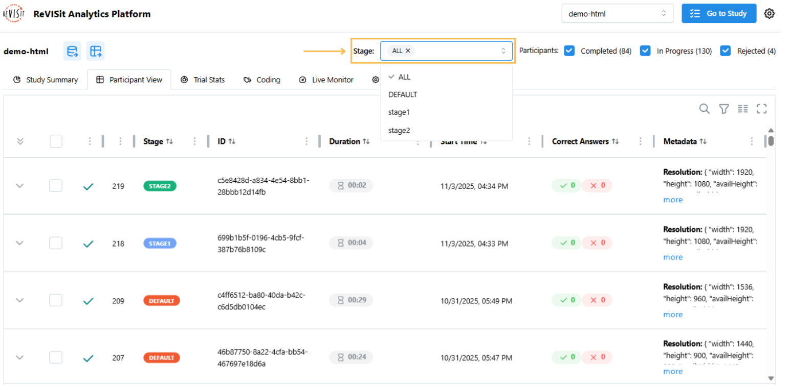

# Stage Management

## Overview

Stage Management helps you organize participants into different parts of your study. It’s useful for studies that have multiple sections or happen over time. Using stages makes it easier to track, filter, and analyze participants based on where they are in the study.

## Getting Started

Go to the **Manage** tab under **Analysis** and open the **Stage Management** section.

:::note
All studies start with a **DEFAULT** stage, which cannot be removed. The default color is orange (`#F05A30`), but you can change it if you want.
:::

## Adding a New Stage

1. Click the **Add New Stage** button.

2. Enter a stage name and pick a color. You can type a color code or choose one from the color picker.

3. Click the green check mark to save.

:::warning
Stage names cannot be `DEFAULT`, `ALL`, or `N/A`.
:::

## Setting the Current Stage

The current stage determines where all new participants will be added. To set a stage as the current one, simply click the radio button next to the stage you want. Once selected, any participants added afterward will automatically be placed in this stage.

## Changing Stage Colors

Each stage has a color to help you identify it in the analysis views. To change a stage color:

1. Click the edit icon.

2. Pick a new color or enter a color code.

3. Click the green check mark to save.

:::note
Stage names cannot be changed after you create them, but you can always change the color.
:::

## Stage Filter in Participant View

Each participant’s stage is shown in the table, making it easy to see and group participants. You can filter by stage using the filter at the top and select one or more stages.

