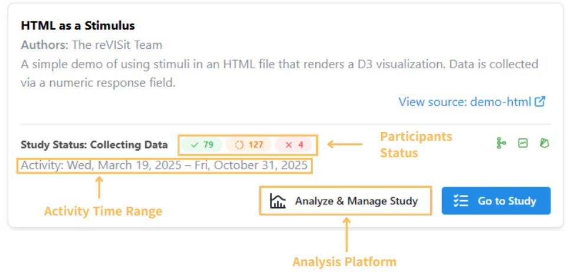

# Study Card

The study card is the access point for both the study and analysis platform. It provides an overview of participants status of each of your studies.
The participants stats shows the number of participants who have completed the experiment, the number of participants who started but have not completed the experiment and the number of participants who were rejected.

Click on Analyze & Manage Study button, you will be redirected to the study summary of analysis platform.

