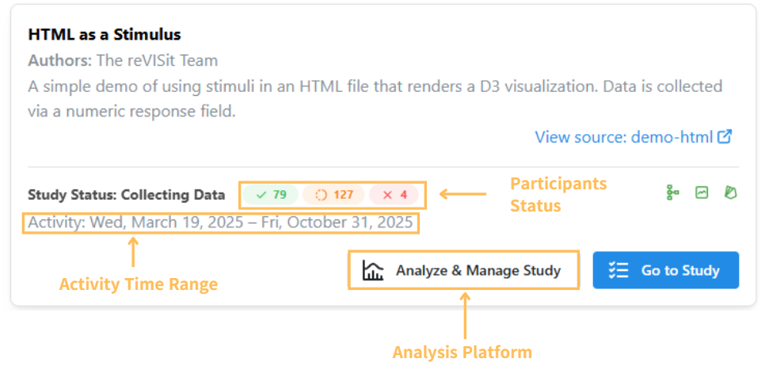

# Study Card

Each visible study has a card on the landing page. The card shows the study's title, authors, description, data-collection status, and mode icons. Click **Go to Study** to open the study.

When **Share Data and Make Analytics Interface Public** is enabled, the card also shows Participant status counts:

- **Completed** - the number of participants who have completed the experiment
- **In-Progress** - the number of participants who started but have not completed the experiment
- **Rejected** - the number of participants who were rejected

The activity time range shows the start date of the study and the date the last participant finished.

With data sharing enabled, click **Analyze & Manage Study** to open the study summary in the analysis platform.

When data sharing is off, the card remains visible, but Participant counts, configuration warnings and errors, and **Analyze & Manage Study** are hidden. The study description, status, activity dates when available, and **Go to Study** remain available.

To organize the cards into tabs or hide an entire card, see [Configuring the Landing Page](../data-and-deployment/landing-page.md).
