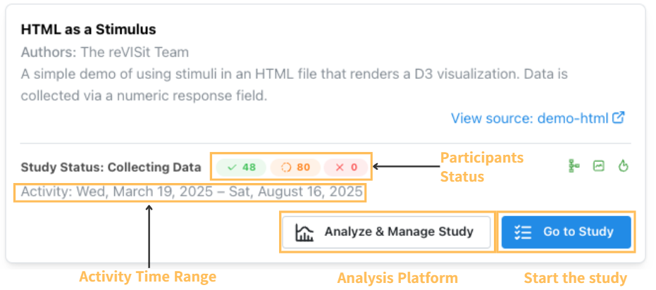

# Study Card

The study card is the access point for both the study and analysis platform. It provides an overview of participants status of each of your studies.

The participants' status shows:
- **Completed** - the number of participants who have completed the experiment
- **In-Progress** - the number of participants who started but have not completed the experiment
- **Rejected** - the number of participants who were rejected

The activity time range shows the start date of the study and the date the last participant finished.

Click on the "Analyze & Manage Study" button, you will be redirected to the study summary of analysis platform.

