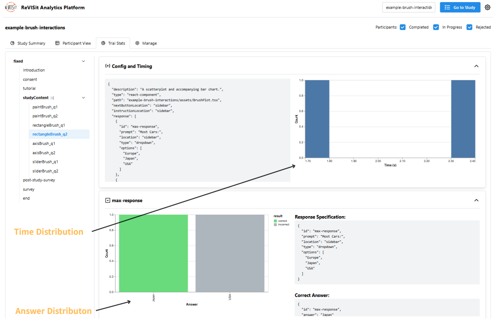

# Trial Stats

Once you click the Trial Stats tab, you will see this page that provides time distribution and answer distribution of each trial.

For example, the image below shows the result from an example study. The left side is the list of trials.
The right side shows the time distribution and answer distribution of the selected trial, along with the related config.

