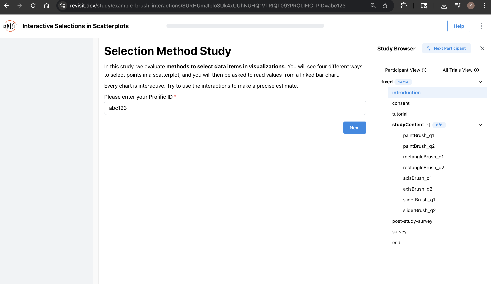

# Connecting with External Participant Platforms

import StructuredLinks from '@site/src/components/StructuredLinks/StructuredLinks.tsx';

<StructuredLinks
    referenceLinks={[
        {name: "Prolific", url: "https://prolific.com"},
        {name: "SONA", url: "https://www.sona-systems.com"}
    ]}
/>

ReVISit makes it easy to connect with participant management platforms such as Prolific, SONA Systems, and other custom services. Revisit can automatically collect participant IDs from study links, display those IDs inside the study, and redirect participants to a platform-specific return link after completion.

## General Integration

### Capture Participant ID from URL

When participants are recruited through a third-party platform, their unique ID is should be appended to the study URL. ReVISit supports automatic capture of that ID using the `urlParticipantIdParam` field in the `uiConfig`.

```ts
"uiConfig": {
  ...
  "urlParticipantIdParam": "PARTICIPANT_ID"
  ...
}
```

When a participant visits the following link, reVISit will store abc123 as their participant ID for the duration of the study:
https://revisit.dev/study/studyName?PARTICIPANT_ID=abc123


### Display the ID in the Study
You can use the captured participant ID as a response value by adding the paramCapture field to a `shortText` response. This automatically fills in the participant’s ID from the URL and disables editing to prevent manual tampering.

```ts
"introduction": {
    "type": "markdown",
    "path": "myPath/path",
    "response": [
        {
            "id": "participantId",
            "prompt": "Please enter your Participant ID",
            "required": true,
            "location": "belowStimulus",
            "type": "shortText",
            "placeholder": "Participant ID",
            "paramCapture": "PARTICIPANT_ID"
        }
    ]
},
```

### Redirecting back with Participant ID at Study End
At the end of the study, you typically need to return the participant to the platform to confirm their participation and issue credit or payment. Use the `studyEndMsg` field in `uiConfig` to display a final message with a return link. Use `{PARTICIPANT_ID}` as a placeholder. ReVISit will replace this with the actual ID from the URL.

```ts
"uiConfig": {
    ...
    "studyEndMsg": "Thank you for completing the study! Return to this link to receive credit: [Click here](https://your-platform.com/complete?participant_id={PARTICIPANT_ID}"
    ...
}
```

## Prolific
[Prolific](https://prolific.com) is a popular platform for recruiting crowd-sourced participants. 

When you create a prolific study and give it the url of your deployed reVISit study site, it will add multiple url parameters to the link. For our purposes, we want to store the `PROLIFIC_PID`. To do this, in the `uiConfig` object of your config file, add the key 

```ts
'uiConfig': {
    ...
    'urlParticipantIdParam': 'PROLIFIC_PID'
    ...
}
```

To automatically access the `PROLIFIC_PID`, use the `paramCapture` field inside of your response. The below example will automatically answer the id field in the introduction with the linked `PROLIFIC_PID`, and will not allow the participant to change it. This way, you are guaranteed to properly keep track of your participants without relying on them to enter their prolific id. 

```ts
'introduction': {
    'type': 'markdown',
    'path': 'myPath/path',
    'response': [
        {
            'id': 'prolificId',
            'prompt': 'Please enter your Prolific ID',
            'required': true,
            'location': 'belowStimulus',
            'type': 'shortText',
            'placeholder': 'Prolific ID',
            'paramCapture': 'PROLIFIC_PID'
        }
    ]
},
```

When the study is over, you want to redirect participant back to prolific, so they can be confirmed as finished and paid. This is also done in the `uiConfig` via the `studyEndMsg`, and you should use the link specific to your study that prolific provides. Be sure to use the return URL provided by Prolific, and include `{PARTICIPANT_ID}` where the participant ID should be inserted.



Here's an exmaple:

```ts
"uiConfig": {
    "urlParticipantIdParam": "PROLIFIC_PID",
    "studyEndMsg": "Thank you for completing the study! Return to Prolific: [Click here](https://app.prolific.com/submissions/complete?cc={STUDY_ID}?PROLIFIC_ID={PARTICIPANT_ID})"
}
```

## SONA
SONA Systems is another commonly used recruitment platform in academic research. SONA can append a unique participant ID `SURVEY_CODE` to the study URL. To ensure participants are redirected properly at the end of the study, you can configure reVISit as follows:

```ts
"uiConfig": {
    "urlParticipantIdParam": "SURVEY_CODE",
    "studyEndMsg": "Thank you for completing the study! Return to SONA to receive credit: [Click here](https://yourschool.sonasystems.com/webstudy_credit.aspx?experiement_id=...&credit_token=...&survey_code={PARTICIPANT_ID})"
}
```
As before, `{PARTICIPANT_ID}` will be replaced with the actual `SURVEY_CODE` value from the URL.
Just like with other platforms, you can display the SONA ID in the introduction or elsewhere in the study using:

```ts
"introduction": {
    "type": "markdown",
    "path": "myPath/path",
    "response": [
        {
            "id": "sonaSurveyCode",
            "prompt": "Please enter your SONA Survey Code",
            "required": true,
            "location": "belowStimulus",
            "type": "shortText",
            "placeholder": "SONA Survey Code",
            "paramCapture": "SURVEY_CODE"
        }
    ]
},
```