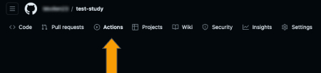
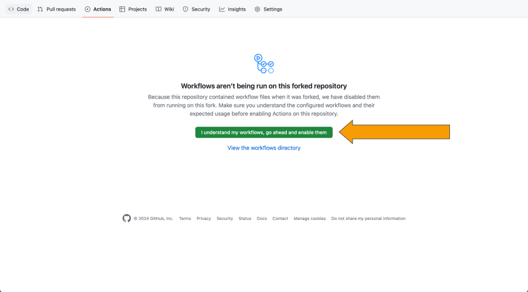
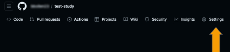
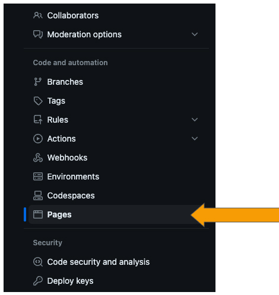
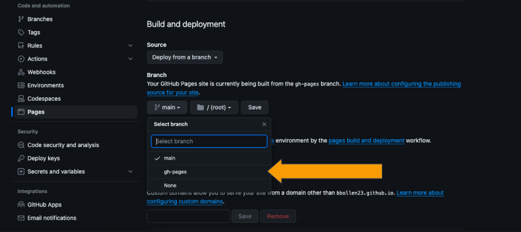

# Deploying To a Static Website

import StructuredLinks from '@site/src/components/StructuredLinks/StructuredLinks.tsx';

<StructuredLinks
    referenceLinks={[
        {name: "GitHub Pages", url: "https://docs.github.com/en/pages/quickstart"},
        {name: "GitHub Custom Domain", url: "https://docs.github.com/en/pages/configuring-a-custom-domain-for-your-github-pages-site/managing-a-custom-domain-for-your-github-pages-site"}
    ]}
/>

## Deploying using GitHub
Deploying your study should be relatively simple. We include a GitHub action that will build your study and deploy it to GitHub pages. The only item that the user must adjust is in the `.env` file in the root of the repository. At the top of this file, you should see `VITE_BASE_PATH="/study/"`. Change "/study/" to `"/<repo-name>/"`.

After this, you'll need to make sure that your Github repository has workflow actions enabled. Navigate to the actions tab in your repository as shown below.

On this page, enable workflows as shown below.

:::info
If you have enabled github pages or ran any other action in your repo, it won't be possible to enable the workflow on this screen. To enable the workflow, you will have to navigate to the `.github/workflows` folder in your repository, remove the workflow files, commit and push, then add the workflow files back, commit and push again. After that, the workflows should be enabled.
:::

After you've changed the `.env` file and enabled the workflow, go ahead and push the commit to your forked repository. Afterwards, the deploy action will run. Once that has finished, navigate to the 'settings' tab and then the 'pages' tab.

Here we will be able to deploy the site to the Github pages. In the 'Branch' section, you should see options to select a branch to deploy from. Select 'gh-pages' from the dropdown menu as shown below.

Click 'Save' once you have made the switch. After a short period of time, your reVISit application will deploy to `<username>.github.io/<repository-name>`. If you want to deploy to a custom domain, you can do that as well by following the instructions on [GitHub](https://docs.github.com/en/pages/configuring-a-custom-domain-for-your-github-pages-site/managing-a-custom-domain-for-your-github-pages-site).

:::info
If you would like to enable admin sign ins when you deploy your static website, you will have to make sure that Firebase has your domain name set as an authorized domain. Please see [here](../firebase/adding-removing-ui/#adding-authorized-domains) to add your custom domain.
:::
