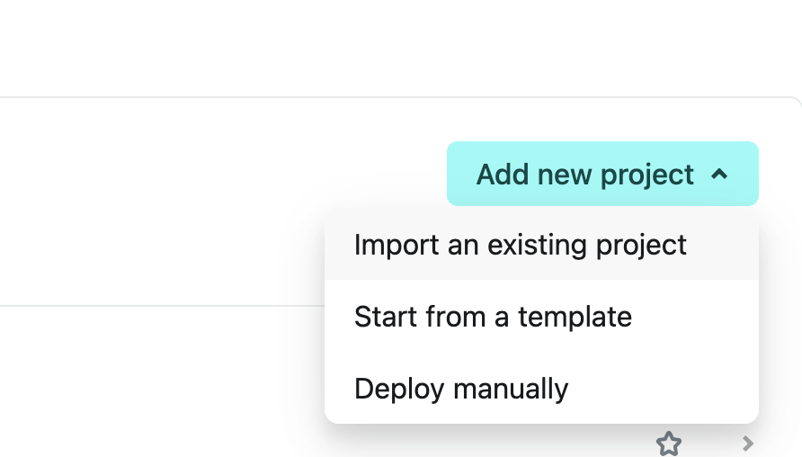
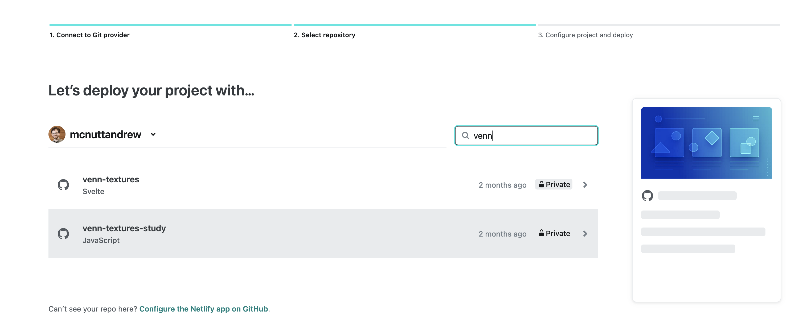

# Deploying To a Static Website

import StructuredLinks from '@site/src/components/StructuredLinks/StructuredLinks.tsx';

<StructuredLinks
referenceLinks={[
{name: "GitHub Pages", url: "https://docs.github.com/en/pages/quickstart"},
{name: "GitHub Custom Domain", url: "https://docs.github.com/en/pages/configuring-a-custom-domain-for-your-github-pages-site/managing-a-custom-domain-for-your-github-pages-site"}
]}
/>

## Deploying using GitHub

Deploying your study should be relatively simple. We include a GitHub action that will build your study and deploy it to GitHub pages. The only item that the user must adjust is in the `.env` file in the root of the repository. At the top of this file, you should see `VITE_BASE_PATH="/study/"`. Change "/study/" to `"/<repo-name>/"`.

After this, you'll need to make sure that your Github repository has workflow actions enabled. Navigate to the actions tab in your repository as shown below.


On this page, enable workflows as shown below.


:::info
If you have enabled github pages or ran any other action in your repo, it won't be possible to enable the workflow on this screen. To enable the workflow, you will have to navigate to the `.github/workflows` folder in your repository, remove the workflow files, commit and push, then add the workflow files back, commit and push again. After that, the workflows should be enabled.
:::

After you've changed the `.env` file and enabled the workflow, go ahead and push the commit to your forked repository. Afterwards, the deploy action will run. Once that has finished, navigate to the 'settings' tab and then the 'pages' tab.


Here we will be able to deploy the site to the Github pages. In the 'Branch' section, you should see options to select a branch to deploy from. Select 'gh-pages' from the dropdown menu as shown below.


Click 'Save' once you have made the switch. After a short period of time, your reVISit application will deploy to `<username>.github.io/<repository-name>`. If you want to deploy to a custom domain, you can do that as well by following the instructions on [GitHub](https://docs.github.com/en/pages/configuring-a-custom-domain-for-your-github-pages-site/managing-a-custom-domain-for-your-github-pages-site).

:::info
If you would like to enable admin sign ins when you deploy your static website, you will have to make sure that Firebase has your domain name set as an authorized domain. Please see [here](../authentication-authorization/adding-removing-ui/#adding-authorized-domains) to add your custom domain.
:::

## Deploying using Netlify

Similarly deploying your study to Netlify is relatively straightforward. First, modify the VITE_BASE_PATH in your .env to be

```
VITE_BASE_PATH="/"
```

Then create a new file called `public/_redirects`, the contents of the file should be

```
/*    /index.html   200
```

Next, navigate to netlify. This will likely require you to sign in or to make an account. From the home page, create a new project using



Then, on the next page, select Github. This will require you to authorize netlify as a GitHub app. This will then bring up a list of repos



Search for the appropriate repo and then select it. This will bring up a configuration screen for the new netlify project. You should enter a project name, which will determine the url (e.g., YOUR_PROJECT.netlify.app if your project name is YOUR_PROJECT). Scroll to the bottom of the screen and click "Deploy YOUR PROJECT NAME".

The first build will take a bit, but once it runs, your experiment should be ready!

If you are using netlify as a secondary venue for anonymization purposes, you can specify which branch netlify will use to deploy from. For instance a branch called `for-review' might remove all personnel and affiliation information.
