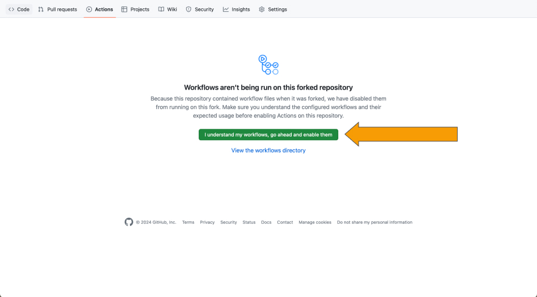
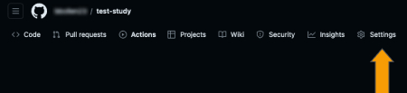
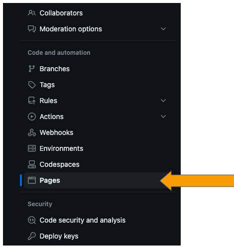
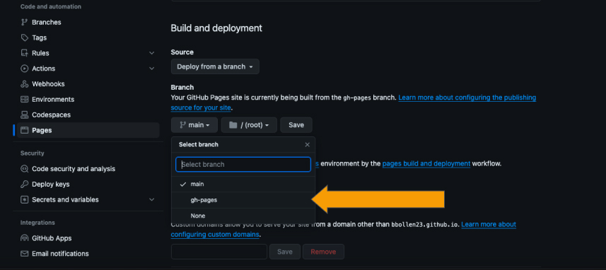
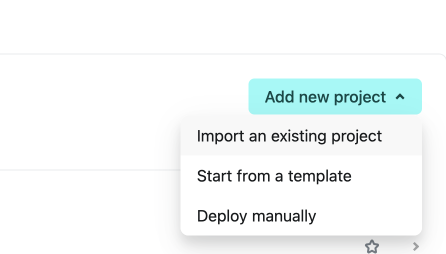
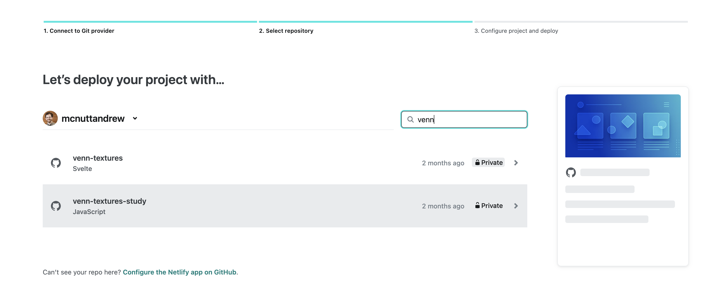
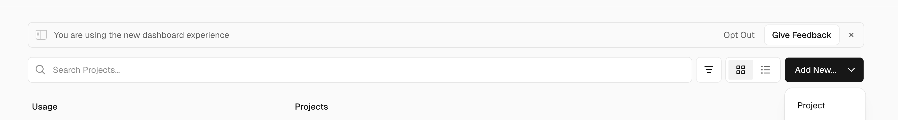
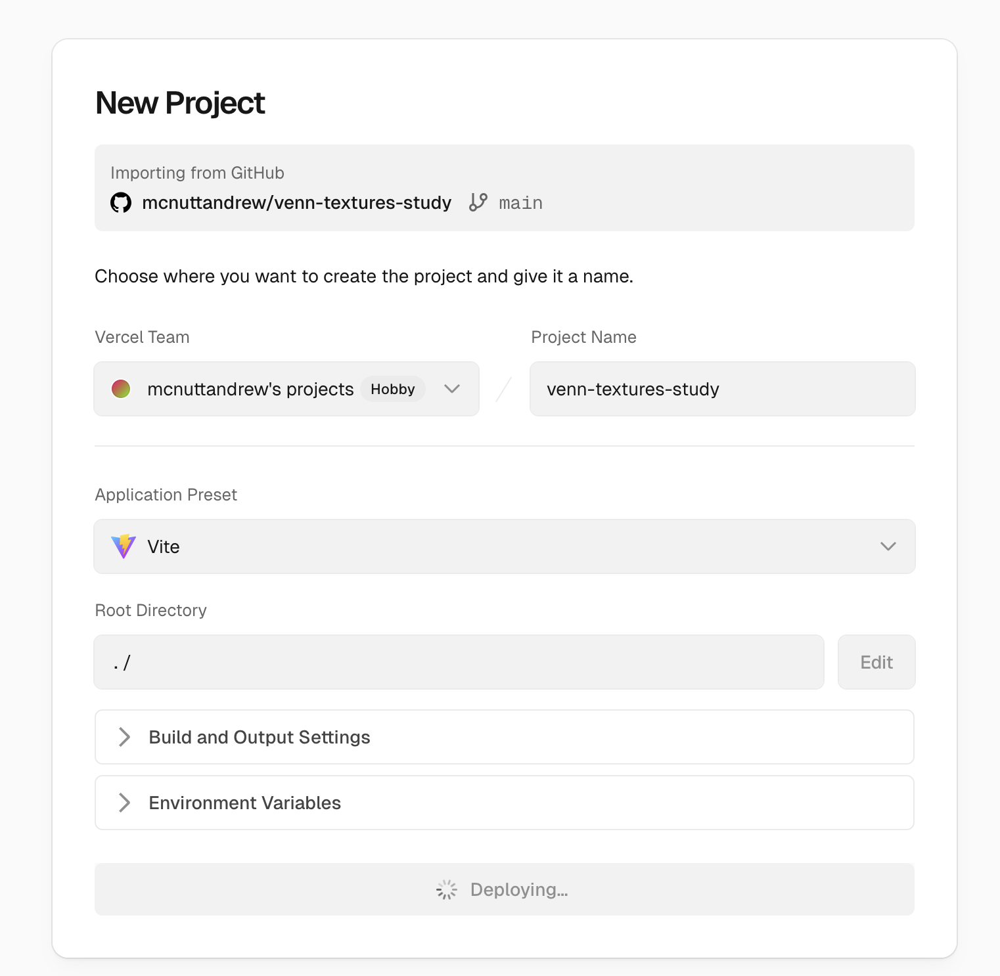
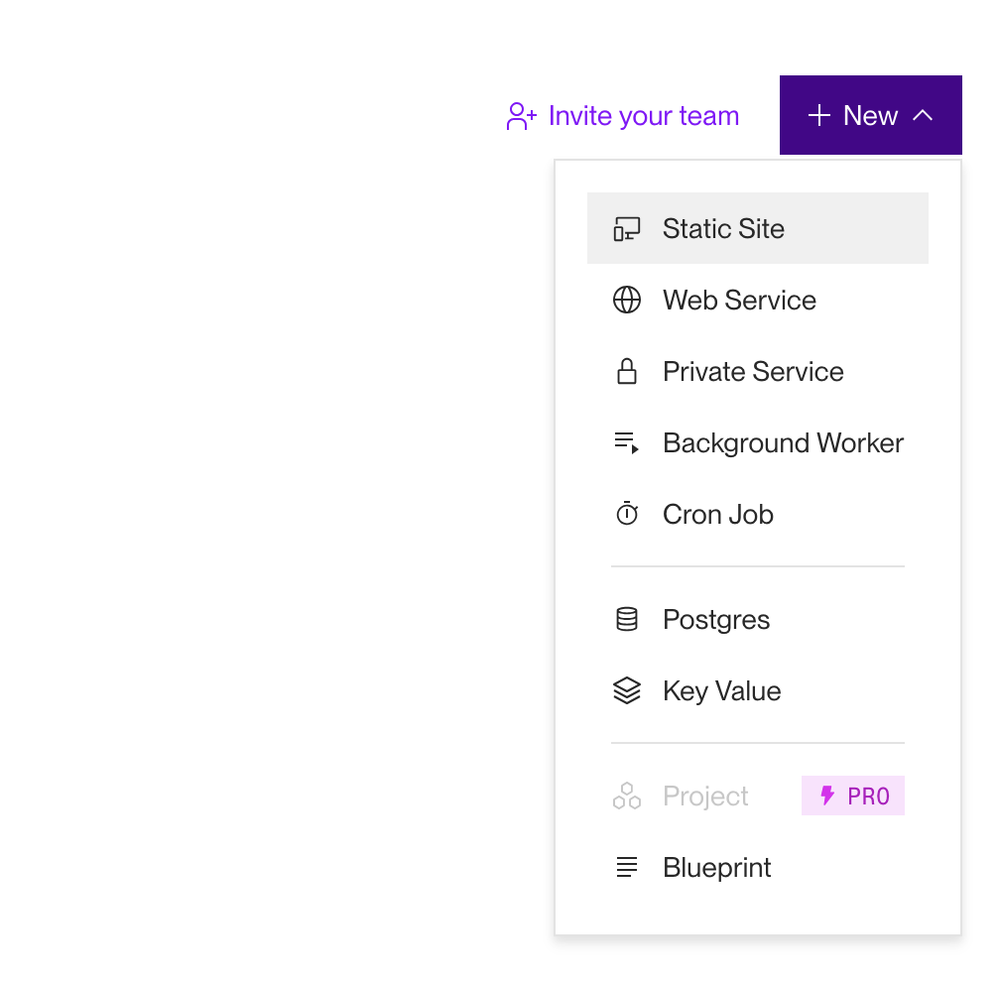
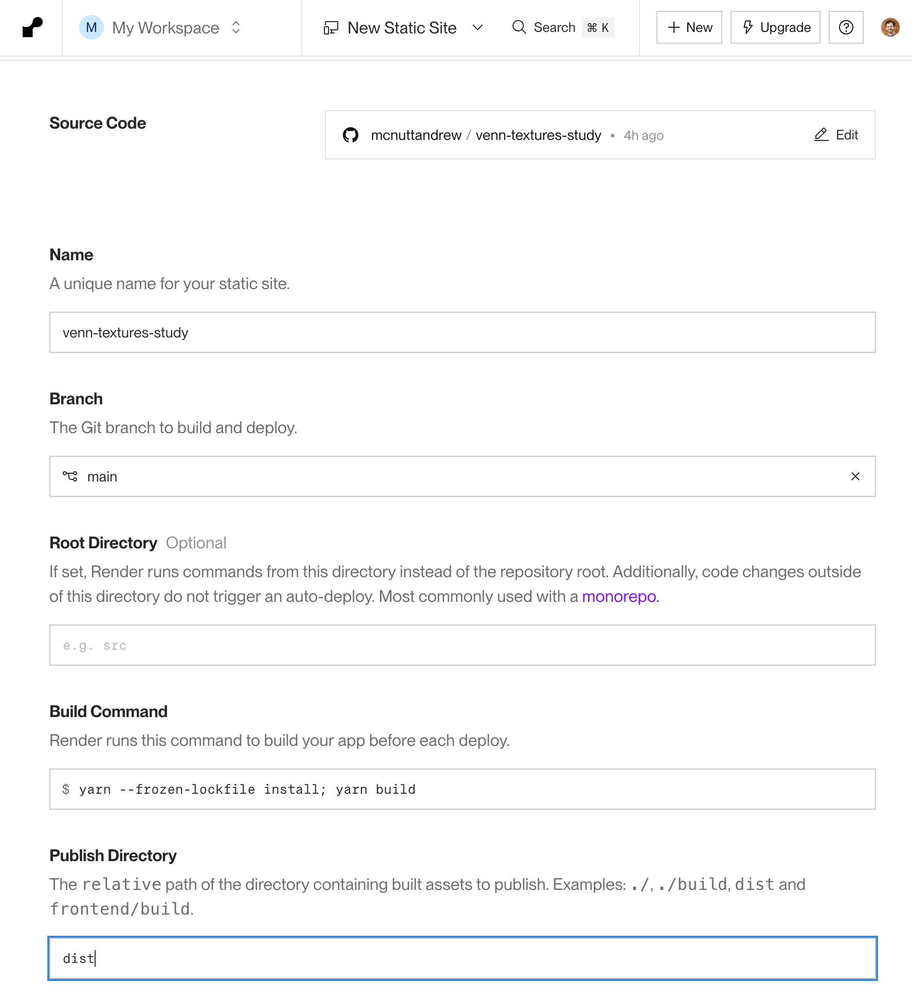

# Deploying To a Static Website

Publish your study as a static website so Participants can open it in their browsers. First, complete the [installation guide](../getting-started/installation.md) and check that your study builds locally with `yarn build` or `npm run build`.

Before collecting Participant data, configure [your own Firebase or Supabase database](./connecting-to-cloud-database.md). Hosting the website does not create a database for you.

Choose a hosting service:

- [GitHub Pages](#deploying-using-github)
- [Netlify](#deploying-using-netlify)
- [Vercel](#deploying-using-vercel)
- [render](#deploying-using-render)

## Deploying using GitHub

The workflow in `.github/workflows/deploy_website.yaml`, named **Deploy To GitHub Pages**, builds your study and writes the website files to the `gh-pages` branch. GitHub Pages then publishes that branch.

For example, a repository named `my-study` is published at `https://your-github-name.github.io/my-study/`. Replace `your-github-name` with your GitHub account or organization and `my-study` with your repository name.

Check `VITE_BASE_PATH` in your deployment workflow. If it uses `${{ github.event.repository.name }}`, the path is set automatically. If your workflow builds using `.env` without setting a base path, set `VITE_BASE_PATH="/my-study/"` in `.env` to match your repository name.

### Enable and run the workflow

1. Open your repository's **Actions** tab. If GitHub asks you to enable workflows for a fork, enable them. If **Deploy To GitHub Pages** is individually disabled, select it and choose **Enable workflow**, as described in [GitHub's workflow instructions](https://docs.github.com/en/actions/how-tos/manage-workflow-runs/disable-and-enable-workflows).

   

   

2. Check that your repository has a `gh-pages` branch. The workflow needs this branch before publishing. If it does not exist, use the branch selector on the **Code** tab to create `gh-pages` from `main`. Reserve this branch for generated website files; keep study edits on `main` or `dev`.
3. Commit and push your study and backend configuration to `main`. Alternatively, select **Actions → Deploy To GitHub Pages → Run workflow**, choose `main`, and select **Run workflow**. The workflow file must be on your repository's default branch for the manual button to appear. See [Manually running a workflow](https://docs.github.com/en/actions/how-tos/manage-workflow-runs/manually-run-a-workflow).
4. Wait for the `deploy-main` job to succeed. If it fails, open the failed step's log before continuing. The generated site should now be in `gh-pages`.

### Publish the generated website

1. Open **Settings → Pages** in your repository.

   

   

2. Under **Build and deployment**, set **Source** to **Deploy from a branch**.
3. Select `gh-pages` and the `/(root)` folder, then select **Save**. These are the [GitHub Pages publishing settings](https://docs.github.com/en/pages/getting-started-with-github-pages/configuring-a-publishing-source-for-your-github-pages-site) for this workflow.

   

4. Wait for GitHub Pages to publish, then open the site URL shown on that page. Select a study, open its direct URL in a new tab, and refresh it to check that navigation works.

For administrator sign-in, configure [Firebase authorized domains](./firebase/enabling-authentication.md#adding-authorized-domains) or the [Supabase authentication URLs](./supabase/enabling-authentication.md) for your deployed site. Test the storage connection and data collection before sharing the study with Participants.

### Custom domains and base paths

The automatic path assumes a project site at `/<repository-name>/`. It does not configure the hostname or enable Pages. If you use a [custom domain](https://docs.github.com/en/pages/configuring-a-custom-domain-for-your-github-pages-site/managing-a-custom-domain-for-your-github-pages-site) or a user/organization site hosted at `/`, adjust the workflow's `VITE_BASE_PATH` values to match the actual paths. The workflow values take precedence over `.env`.

For a Pages site hosted at `/`, also adapt the deployment-root detection in `public/404.html`: the supplied redirect assumes a repository-name segment, followed by an optional deployment segment such as `supabase`. Without this adjustment, opening or refreshing a direct study URL can fail. Check direct URLs for every destination you keep after changing the hosting layout.

For builds outside this workflow, an absent or empty `VITE_BASE_PATH` defaults to `/`. Set it explicitly only when you need a different path, using leading and trailing slashes. For example, this entry builds for a site served at `/my-study/`:

```env title=".env"
VITE_BASE_PATH="/my-study/"
```

Rebuild and redeploy after changing the base path. Local development with `yarn serve` still uses `/`.

## Deploying using Netlify

For a Netlify site served at the domain root, leave `VITE_BASE_PATH` unset or explicitly set it to `/`. If your `.env` still contains an older subpath value, remove it or replace it with:

```env title=".env"
VITE_BASE_PATH="/"
```

Then create a new file called `public/_redirects`, the contents of the file should be

```txt title="public/_redirects"
/*    /index.html   200
```

Next, navigate to Netlify. This will likely require you to sign in or to make an account. From the home page, create a new project.



Then, on the next page, select GitHub. This will require you to authorize Netlify as a GitHub app. This will then bring up a list of repos.



Search for the appropriate repo and then select it. This will bring up a configuration screen for the new Netlify project. You should enter a project name, which will determine the url (e.g., YOUR_PROJECT.netlify.app if your project name is YOUR_PROJECT). Scroll to the bottom of the screen and click "Deploy YOUR PROJECT NAME".

The first build will take a bit, but once it runs, your experiment should be ready!

If you are using Netlify as a secondary venue for anonymization purposes, you can specify which branch Netlify will use to deploy from. For instance a branch called `for-review` might remove all personnel and affiliation information.

## Deploying using Vercel

For a Vercel site served at the domain root, leave `VITE_BASE_PATH` unset or set it to `/`. Replace any existing subpath value in `.env` with:

```env title=".env"
VITE_BASE_PATH="/"
```

At the root of your project, create a `vercel.json` file with the following contents:

```json title="vercel.json"
{
  "rewrites": [{ "source": "/(.*)", "destination": "/index.html" }]
}
```

Then, navigate to Vercel. This will likely require you to sign in or to make an account. From the home page, create a new project.



Then, on the next page, select GitHub. This will require you to authorize Vercel as a GitHub app. This will then bring up a list of repos. Select the appropriate repo. This will bring up a configuration screen for the new Vercel project.



You likely will not need to make any changes to the configuration. After a short period of time, this will yield a website like `https://<APP_NAME>.vercel.app/`

## Deploying using render

For a Render site served at the domain root, leave `VITE_BASE_PATH` unset or set it to `/`. Replace any existing subpath value in `.env` with:

```env title=".env"
VITE_BASE_PATH="/"
```

Then, navigate to render.com. This will likely require you to sign in or to make an account. From the home page, create a new project. Select "Static Site" as the type of project you want to create.



Then, on the next page, select GitHub. This will require you to authorize render.com as a GitHub app. This will then bring up a list of repos. Select the appropriate repo. This will bring up a configuration screen for the new render.com project.



On this configuration screen, make sure the following options are set (or accept these defaults if Render has already filled them in for you):

- **Build Command**: `npm run build`
- **Publish Directory**: `dist`

After saving these settings, you will also need to add a rewrite rule. Go to your static site on Render → Redirects/Rewrites tab → Add Rule:

```text
Type: Rewrite
Source: /*
Destination: /index.html
```

After adding the rewrite rule, deploy your site. After a protracted period of time, this will yield a website like `https://<APP_NAME>.onrender.com/`

import StructuredLinks from '@site/src/components/StructuredLinks/StructuredLinks.tsx';

<StructuredLinks
referenceLinks={[
{name: "GitHub Pages", url: "https://docs.github.com/en/pages/quickstart"},
{name: "GitHub Custom Domain", url: "https://docs.github.com/en/pages/configuring-a-custom-domain-for-your-github-pages-site/managing-a-custom-domain-for-your-github-pages-site"},
{name: "Netlify", url: "https://www.netlify.com/"},
{name: "Vercel", url: "https://vercel.com/"},
{name: "render.com", url: "https://render.com/"}
]}/>
