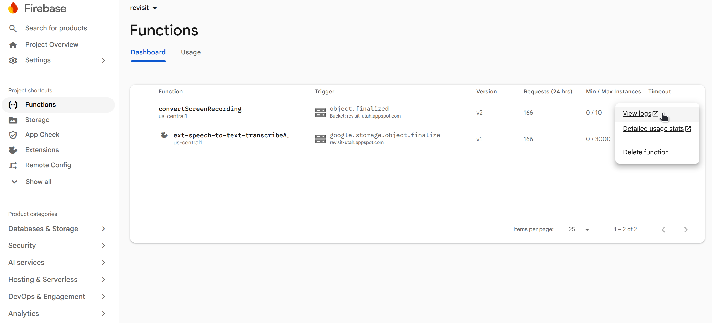

# Screen Recording Conversion

ReVISit can capture screen recordings during a study and upload them to Firebase Storage. However, the format a browser records in isn't guaranteed to play back in every other browser. For example, a recording made in Chrome may not play in Safari, and vice versa.

To handle this, reVISit ships an optional Firebase Cloud Function, `convertScreenRecording`, that automatically converts uploaded screen recordings to a `.webm` file with browser-compatible codecs. This page walks through deploying that function to your own Firebase project.

## Prerequisites

- The [Firebase CLI](https://firebase.google.com/docs/cli) installed and authenticated (`firebase login`)
- The [gcloud CLI](https://cloud.google.com/sdk/docs/install) installed and authenticated (`gcloud auth login`)
- Access to the Firebase project you want to deploy the function to
- A reVISit deployment already configured with [Firebase Storage](./setup)

## 1. Configure Environment Variables

The function reads your Firebase config from an `.env` file inside the `functions/` directory so it knows which Storage bucket to listen on.

Update `functions/.env`:

```
VITE_FIREBASE_CONFIG='
{
  apiKey: "YOUR_API_KEY",
  authDomain: "YOUR_PROJECT_ID.firebaseapp.com",
  projectId: "YOUR_PROJECT_ID",
  storageBucket: "YOUR_PROJECT_ID.appspot.com",
  messagingSenderId: "YOUR_MESSAGING_SENDER_ID",
  appId: "YOUR_APP_ID"
}
'
```

You can find these values in the Firebase console under **Project Settings > Your apps**. They should match the `VITE_FIREBASE_CONFIG` values used in the `.env` file at the root of your reVISit deployment.

:::tip
This value is parsed with [HJSON](https://hjson.github.io/), so you can paste the config object directly from the Firebase console without converting it to strict JSON.
:::

## 2. Grant IAM Permissions

Cloud Storage trigger functions rely on a Google-managed service account to deliver storage events. That service account needs permission to read from your bucket before it can invoke the function.

First, get your project number:

```bash
gcloud projects describe YOUR_PROJECT_ID --format="value(projectNumber)"
```

Replace `YOUR_PROJECT_ID` with your Firebase project ID, and save the resulting number as `PROJECT_NUMBER` for the next command.

Then grant the Storage Admin role to that service account:

```bash
gcloud projects add-iam-policy-binding YOUR_PROJECT_ID \
  --member="serviceAccount:service-PROJECT_NUMBER@gcp-sa-eventarc.iam.gserviceaccount.com" \
  --role="roles/storage.admin"
```

:::caution
This step is easy to miss but required. Without it, the function deploys successfully but never actually triggers when files are uploaded.
:::

## 3. Deploy the Function

From the `functions/` directory, install dependencies and deploy:

```bash
yarn
yarn deploy
```

`yarn deploy` deploys the function `convertScreenRecording` to your Firebase project.

## 4. Verify It's Working

Upload a screen recording to your bucket under a `<studyId>/screenRecording/` path (or run a study that records the screen), then check the function logs by navigating to Functions Page -> View Logs.



```
Downloading <studyId>/screenRecording/<file>
Converting to webm
Uploading <studyId>/screenRecording/<file>
Done: <studyId>/screenRecording/<file>
```

## Limitations

- Recordings whose codecs aren't already WebM-compatible (`vp8`, `vp9`, `av1`, `opus`, `vorbis`) are skipped rather than re-encoded.
- The function overwrites the original file at the same Storage path — once conversion succeeds, there's no separate copy of the original left behind.

import StructuredLinks from '@site/src/components/StructuredLinks/StructuredLinks.tsx';

<StructuredLinks
referenceLinks={[
{name: "Cloud Storage Triggers", url: "https://firebase.google.com/docs/functions/gcp-storage-events"},
{name: "Firebase CLI", url: "https://firebase.google.com/docs/cli"},
{name: "gcloud CLI", url: "https://cloud.google.com/sdk/docs/install"},
{name: "HJSON", url: "https://hjson.github.io/"}
]}
/>
