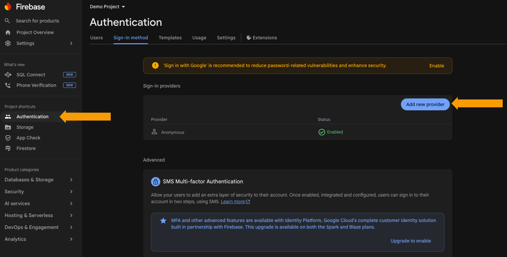
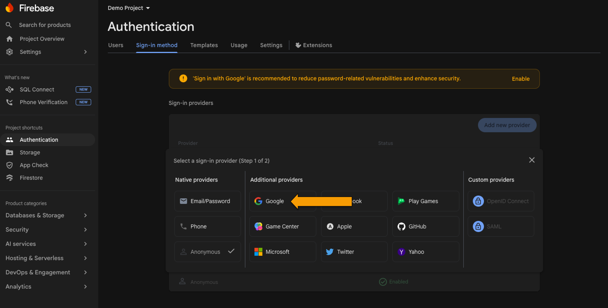
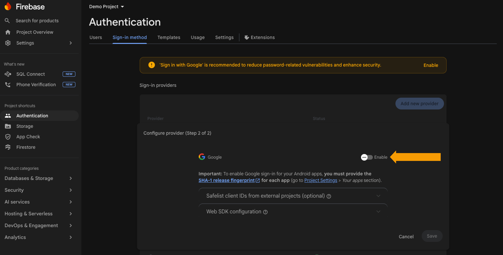
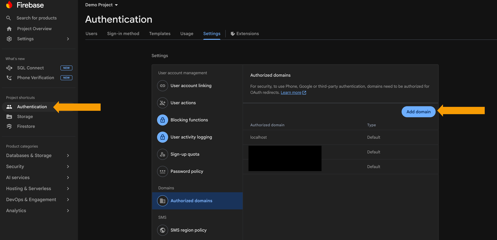
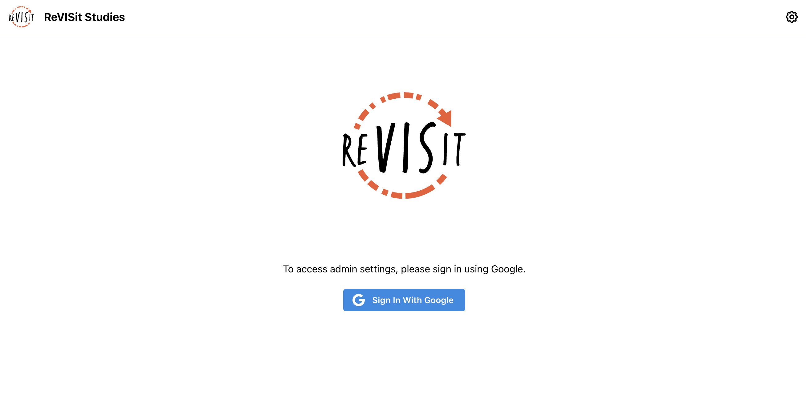
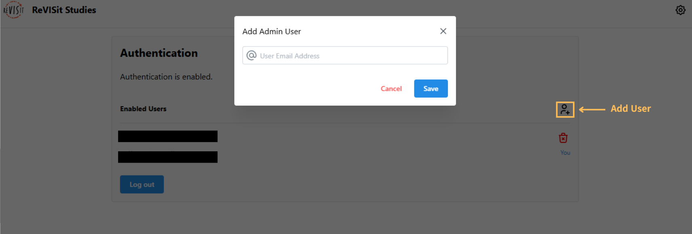
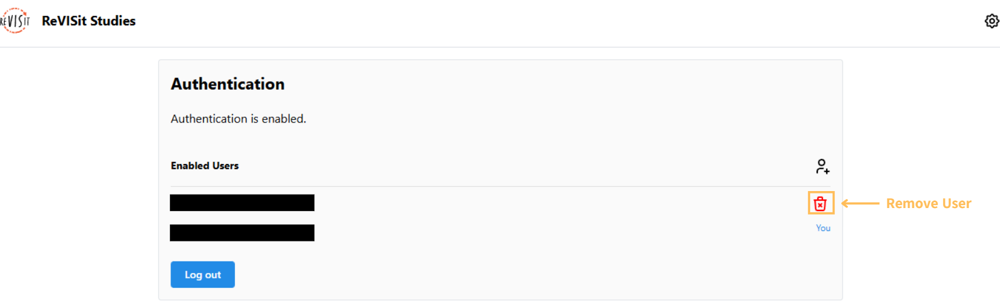

# Setting Up Authentication

:::warning
In order to use authentication, you must have a Firebase application already configured. To set up your Firebase application, please see [here](../setup).
:::

## Enabling Authentication in Firebase

Start by navigating to your Firebase application dashboard. In the left-hand sidebar, choose the "Authentication" tab.

Once here, choose the "Sign-in method" in the top sidebar. Here we can add additional providers for signing in. ReVISit only allows for Google SSO. Click on "Add New Provider".

In the provider section, click on "Google".

Upon clicking "Enable", you will be prompted with providing some information about the application. You can leave these as their defaults. Click "Save" and then Google SSO will be enabled in your application immediately.

## Adding Authorized Domains

Once you have deployed your reVISit application to a website, you'll need to ensure that Google SSO is authorized to redirect back to your website once a user has signed in. To do this, navigate to the "Authentication" section of your Firebase application. In the "Settings" tab you will see an "Authorized Domains" section. Add your domain name(s) using the "Add domain" button on the right.

## Enabling Authentication in reVISit

:::warning
Note that if your application has been deployed but you have _not_ added your custom authorized domain, then attempting to enable authentication will result in an error.
:::

Through the settings cog on the right side of your reVISit application, navigate to the "Settings" page. Authentication will be disabled by default, with a button to enable it.

When you first enable authentication, you will be prompted to sign in using Google SSO. The account you choose will automatically be added as a user. Any other account that attempts to log in to reVISit and access protected routes will be redirected to the login screen.

## Manage Administrators in reVISit

### Adding Additional Users

To add another administrator, simply navigate to the Settings page (where you enabled authentication) and click on the "Add User" icon to the right of the "Enabled Users" section. Enter the Google account email for the user and click "Save". They will now be an administrator and will immediately be able to log into your reVISit application.

### Removing A User

In the "Enabled Users" section, you will see the "Delete" icon to the right of each user except yourself. Any administrator can delete any other user from the reVISit system. The only restrictions are that you cannot delete yourself and there must always be at least one user.

<!-- Importing links -->
import StructuredLinks from '@site/src/components/StructuredLinks/StructuredLinks.tsx';

<StructuredLinks
    referenceLinks={[
        {name: "Firebase Setup", url: "../setup"},
        {name: "Firebase Authentication", url: "https://firebase.google.com/products/auth"},
    ]}
/>
