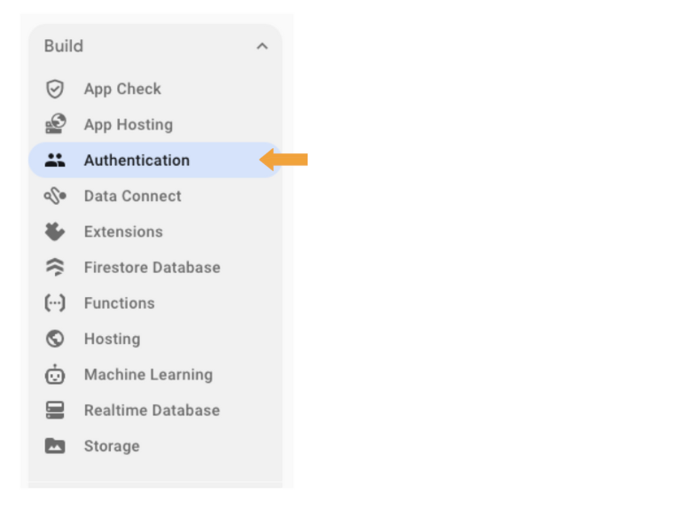

# Configuring Firebase

<a href="https://firebase.google.com/" target="_blank" >Firebase</a> is an app development platform that has extremely useful tools such as storage and real-time synchronization. With Firebase alone, a study creator can capture all data from participants and then export that data for further analysis. In what follows, there are two main products we will be using: the Firestore database and Firebase's storage product.

:::warning
As of October 1st, 2024, Firebase has changed its requirements for newly created projects. You will now be prompted to add a payment method when creating a new Firebase project. You will _only_ be charged if you exceed the limits of the "Always Free Tier".  We suggest reading over the Firebase tier limits [here](https://cloud.google.com/storage/pricing#cloud-storage-always-free). We have conducted several studies using reVISit without going over the "Always Free Tier" limits, such as [this recent study](https://vdl.sci.utah.edu/publications/2024_preprint_guardrails/), but please be proactive and set up billing alerts to ensure you do not exceed the free tier limits.
:::

### Create a Firebase Project

Navigate to <a href="https://firebase.google.com/" target="_blank">Firebase</a> and go to your console.


Create a new Firebase project


Name your Project Accordingly


:::note
Enabling google analytics is not necessary. Feel free to disable this when prompted.
:::

### Adding a Firestore Database

With your project created, we are now going to add a Firestore database to it. On the left-hand side, you should see a "Build" dropdown menu. From that, select "Firestore Database".


Click "Create Database" in the center of the screen.


For the next two steps, there is no need to change the defaults. Simply click "Next" and then "Enable".


With the new database created, we'll want to change the read/write rules to allow any user to create documents, while only authenticated users can read, update, or delete. Go to the 'rules' tab (second tab) and copy and paste the following code. Then click "publish".

```
rules_version = '2';
service cloud.firestore {
  match /databases/{database}/documents {
    match /{document=**} {
      allow create: if true;
      allow read, update, delete: if request.auth != null;
    }
  }
}
```


### Adding Firebase Storage

Once that is finished, we will enable standard Firebase storage. Click the "Build" dropdown menu again and navigate to "Storage". We can leave the options as their defaults.


Once the storage product is enabled, navigate to the "rules" tab.


Replace the existing rule with the following code and then publish:

```
rules_version = '2';

service firebase.storage {
  match /b/{bucket}/o {
    match /{allPaths=**} {
      allow create: if true;
      allow read, update, delete: if request.auth != null;
    }
  }
}
```


### Adding an App to the Firebase Project

We are now going to add an app to your Firebase project:


With the app set up, we are ready to copy over the app configuration to your reVISit project. In the image below you will see a JSON object denoted as `const firebase = { ... }`.


Copy the contents of that JSON object into the `.env` file for the variable `VITE_FIREBASE_CONFIG`. In the `.env` file, your `VITE_FIREBASE_CONFIG` variable should still be a JSON object that is escaped in single quotes.

#### Authentication

We are now going to set up the authentication so that your browser is authorized to communicate with your Firebase database.



:::info
In addition to what is shown above, you will want to enable "Google Authentication" in the same section of Firebase. You can do this by choosing the "Google" sign in method under the "Additional Providers" section. The anonymous sign-in is used for participants taking the study. It allows them to access and send data to the Firestore without external authentication. The Google sign-in method is used to authenticate administrators for managing studies and data. Please see [here](../enabling-authentication) for more detailed authentication information and set up instructions.
:::

#### App Check

Our last step is to set up App Check.


Click on register to register your app with recaptcha.


At this point you will need to navigate to [Recaptcha](https://www.google.com/recaptcha/admin/create) to create a secret key.


The important part here is filling out the domains that you will allow to access the Firebase database. Add localhost and 127.0.0.1 to test your survey on your local machine.

:::info
If you are planning on hosting this externally (such as using GitHub pages), you need to also enter the base URL for your website. For the GitHub pages deployment, you should enter your base GitHub pages URL (i.e. <code>&lt;username&gt;.github.io</code>).
:::


You should now see a SITE key and a SECRET key. First, copy the secret key and paste it back into the Firebase re-captcha page as shown in the following images.


Now, copy the SITE key. That site should now go back into your `.env` file for the variable `VITE_RECAPTCHAV3TOKEN`.

Now we will link your browser to your app through a debug key.

:::info
To see the debug token, you need to enable Firebase storage. Open up the <code>.env</code> file in the root of the repository. Change the <code>VITE_STORAGE_ENGINE</code> variable value to "firebase". Once you have Firebase already set up, you can switch between "localStorage" and "firebase" freely for development purposes.
:::

- Navigate to http://localhost:8080 and click on any demo study.

- Open up the browser console. This differs depending on the web browser that you are using. You can find the various ways to view the browser console for popular web browsers <a href="https://help.planday.com/en/articles/30207-how-to-open-the-developer-console-in-your-web-browser" target="_blank">here</a>.

- Copy the debug token from the console.
  

- Navigate to your Firebase instance and add the token as shown below:


### Allowing for CORS requests

Once that is finished, we'll have to use Google's `gsutil` function in the terminal to set up a CORS policy so that the application can communicate with Firebase storage. Follow <a href="https://cloud.google.com/storage/docs/gsutil_install" target="_blank">these steps on how to install gsutil on your local machine</a>.

After installing gsutil, you need to navigate to the `google-cloud-sdk/bin` folder on your local machine. Create a new file called "cors.json" with the following contents:

```json
[
  {
    "origin": ["*"],
    "method": ["GET"],
    "maxAgeSeconds": 3600
  }
]
```

Lastly, while still inside this same directory, call the following function:

```bash
gsutil cors set cors.json gs://<your-cloud-storage-bucket>
```

You can find the link for the storage bucket by navigating to the "storage" product in Firebase.


Assuming that you have already changed the `VITE_STORAGE_ENGINE` variable in the `.env` file to "firebase", you can now call `yarn serve` to launch the server and navigate to http://localhost:8080 to launch any demo study. All data from any participation will automatically be uploaded to the store.

:::note
When running `yarn build`, reVISit automatically uses the Firebase storage engine.
:::


### Deployment

If you are intending to deploy your reVISit application to a static website, we suggest following our [guide to deploy to GitHub pages](../../deploying-to-static-website). In this, you'll see that there is an additional step that you will need to follow in Firebase so that your custom domain can authorize users.

<!-- Importing links -->
import StructuredLinks from '@site/src/components/StructuredLinks/StructuredLinks.tsx';

<StructuredLinks
    referenceLinks={[
        {name: "Firebase", url: "https://firebase.google.com/"},
        {name: "Firebase Tier Limits", url: "https://cloud.google.com/storage/pricing#cloud-storage-always-free"},
        {name: "Google Recaptcha", url: "https://www.google.com/recaptcha/admin/create"},
        {name: "Deploying to GitHub", url: "../../deploying-to-static-website"}
    ]}
/>