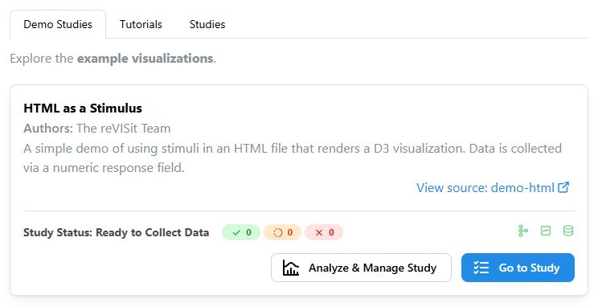
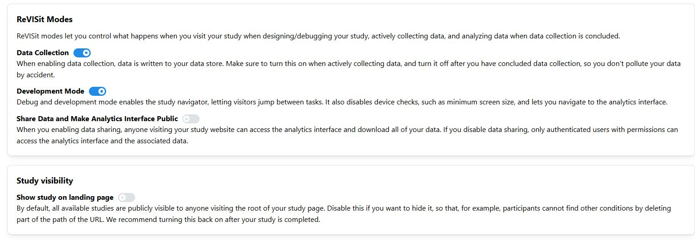
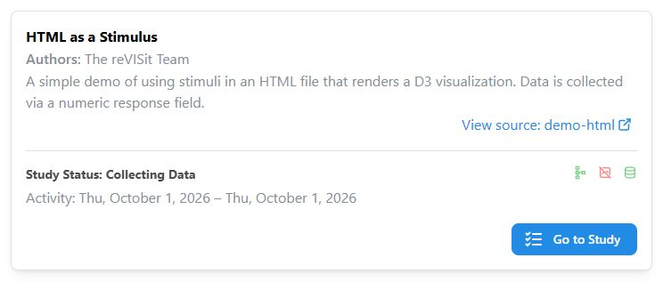

# Configuring the Landing Page

The landing page is the list of studies at the root of your ReVISit deployment. You can group studies into tabs, add descriptions, and choose which studies appear. Visitors can browse this list without needing access to your study data.

## Organize studies into tabs

Edit `public/global.json` in your study repository. This file registers the studies in your deployment; it is separate from each individual Study Config. If you have not registered a study yet, follow [Registering the Study](../getting-started/your-first-study.md#registering-the-study).

1. Add a top-level `tabs` array. Give each tab a unique, non-blank `label`. Add an optional `description` to display text above its studies. Descriptions support Markdown, including emphasis, links, and lists.
2. Add a `tab` property to each study entry in `configs` that you want to assign to a tab. Its value must match the tab's label exactly, including capitalization.
3. Keep each study's ID in `configsList`. This list determines which studies the landing page loads and their order within each tab. The order of the `tabs` array determines tab order.

The following complete example uses three studies included in the study repository. When adapting it, keep your existing study entries and replace the example study IDs and paths with your own. Each `path` is relative to `public/`.

```json title="public/global.json"
{
  "$schema": "https://raw.githubusercontent.com/revisit-studies/study/dev/src/parser/GlobalConfigSchema.json",
  "tabs": [
    {
      "label": "Demo Studies",
      "description": "Explore the **example visualizations**."
    },
    {
      "label": "Tutorials",
      "description": "Learn how to build a study."
    }
  ],
  "configsList": ["demo-html", "tutorial", "demo-vega"],
  "configs": {
    "demo-html": {
      "path": "demo-html/config.json",
      "tab": "Demo Studies"
    },
    "tutorial": {
      "path": "tutorial/config.json",
      "tab": "Tutorials"
    },
    "demo-vega": {
      "path": "demo-vega/config.json"
    }
  }
}
```

Save the file and open your landing page. With these studies visible, you will see **Demo Studies**, **Tutorials**, and **Studies**, in that order. The HTML study appears in **Demo Studies**, the tutorial in **Tutorials**, and the Vega study in **Studies** because it has no `tab` assignment.



### Defaults and tab names

- If you omit `tabs` or use an empty array, leave out study `tab` assignments too. The studies appear together under **Studies**.
- Studies without a `tab` assignment appear under **Studies**. ReVISit appends this tab after your configured tabs, unless you explicitly define a tab labeled `Studies` to set its position or description.
- Tabs with no visible studies are hidden. Assigning a hidden study to a tab does not make that study visible.
- Study names do not determine their tabs. To preserve custom grouping when updating an older configuration, add explicit tab definitions and assignments.

If you rename a tab, update every matching `configs` entry's `tab` value. Blank or duplicate labels and assignments to undefined labels prevent `global.json` from loading. To place a study in the default **Studies** tab without defining that tab yourself, omit its `tab` property.

## Show or hide a study

Use the analysis interface to change study visibility. This setting is separate from tab assignments and the [ReVISit Modes](../analysis/revisit-modes.md).

1. Open the analysis interface. If authentication is enabled, sign in as an administrator.
2. Choose your study from **Select Study**, then open **Manage**.
3. Under **Study visibility**, turn off **Show study on landing page**.
4. Return to the landing page to check that the study card is hidden. To restore it, return to **Manage** through the analysis interface and turn the switch on.



Studies are shown by default. Turning this setting off hides the entire card for everyone, including signed-in administrators. If it was the last visible study in a tab, that tab disappears too.

Hiding a study only removes it from the landing page. Participants can still open its direct study link, and existing permissions still control access to analysis and management. Keep using [authentication](./user-management.md) to control access to study data.

With Firebase or Supabase configured, the visibility setting is saved in that backend. With local storage alone, it applies only in the browser where you changed it; it does not hide the study in other browsers.

## Show a study without sharing its data

Leave **Show study on landing page** on and turn **Share Data and Make Analytics Interface Public** off in the study's **Manage** tab.

For Firebase or Supabase, make this change while the study's cloud datastore is connected. When **Use local storage for new sessions** is enabled, the sharing switch changes only the browser's local setting; it does not disable cloud data sharing or change the cloud-backed landing-page card.

The study card remains visible with its description, status, activity dates when available, mode icons, and **Go to Study** button. Participant-count badges, configuration warnings and errors, and the **Analyze & Manage Study** button are hidden. These landing-page display rules also apply to administrators.



import StructuredLinks from '@site/src/components/StructuredLinks/StructuredLinks.tsx';

<StructuredLinks
  referenceLinks={[
    {name: "GlobalConfig", url: "../../typedoc/interfaces/GlobalConfig/"}
  ]}
/>
