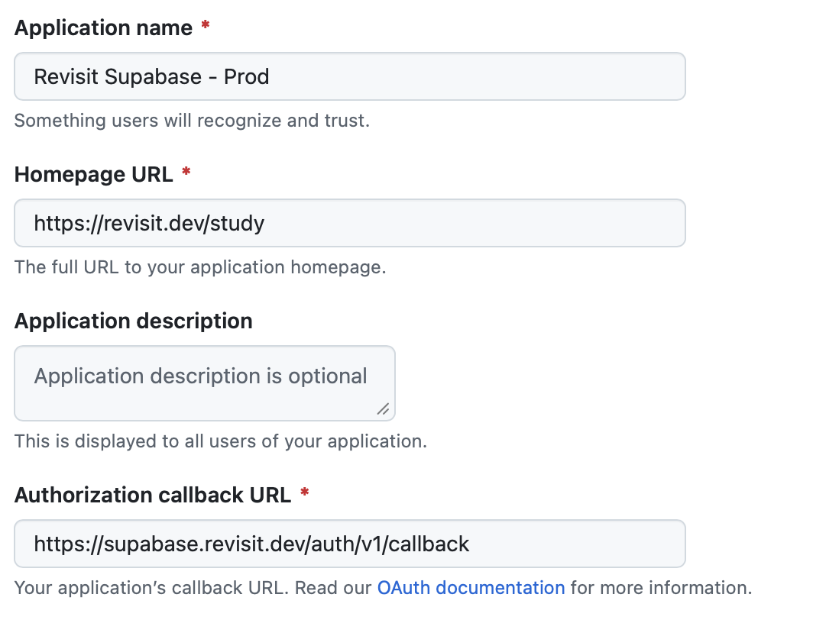

# Setting Up Authentication

:::warning
In order to use authentication, you must have a Supabase application already configured. To set up your Supabase application, please see [here](../setup).
:::

## Enabling Authentication in Supabase

Supabase provides a variety of authentication methods, but reVISit only supports GitHub OAuth for authentication. To enable GitHub OAuth, start by navigating to GitHub and creating a new OAuth application [here](http://github.com/settings/developers).

Give your application a name, such as `ReVISit Supabase`. For the “Homepage URL”, enter the URL where your reVISit application will be hosted (e.g., `https://my-revisit-app.com`). This must include the `https://` prefix.

Lastly set the “Authorization callback URL” to `https://<your-supabase-domain>/auth/v1/callback`, replacing `<your-supabase-domain>` with your actual Supabase domain (e.g., `https://supabase.organization.com/auth/v1/callback`).

After creating the OAuth application, you will be provided with a Client ID. Copy this in to the `supabase/.env` file in the `GITHUB_OAUTH_CLIENT_ID` field.

Next, generate a new Client Secret by clicking the “Generate a new client secret” button. Copy this in to the `supabase/.env` file in the `GITHUB_OAUTH_CLIENT_SECRET` field.

Now, set the `GITHUB_OAUTH_REDIRECT_URI` field in the `supabase/.env` file to the same URL you used for the "Authorization callback URL" in GitHub.

Finally, ensure that your `SITE_URL` field in the `supabase/.env` file is set to the URL where your reVISit application will be hosted (e.g., `https://my-revisit-app.com/study`). If this is not set, the redirects won't work properly.

## Enabling Authentication in reVISit

Through the settings cog on the right of your reVISit application, navigate to the “settings” page. Here, you will see that authentication will be currently disabled with a button to enable authentication.

When you first enable authentication, you will be prompted to sign in using GitHub Oauth. The account chosen will automatically be added as a user. Any other account attempting to log in to reVISit and access these protected routes will be redirected to the login screen.

## Manage Administrators in reVISit

### Adding Additional Users

To add another administrator, simply navigate to the settings page (where you enabled authentication) and click on the “Add User” icon to the right of the “Enabled Users” section. Enter the Google account email for the user and click save. They will now be an administrator and will immediately be able to log into your reVISit application.

### Removing A User

In the “Enabled Users” section, you will see the “delete” icon to the right of each user aside from yourself. Any administrator is capable of deleting any user from the reVISit system. The only restriction is that you cannot delete yourself and there can never be less than one user.

<!-- Importing Links -->
import StructuredLinks from '@site/src/components/StructuredLinks/StructuredLinks.tsx';

<StructuredLinks
    referenceLinks={[
        {name: "Supabase Setup", url: "../setup"},
        {name: "Supabase Authentication", url: "https://supabase.com/docs/guides/auth"},
    ]}
/>