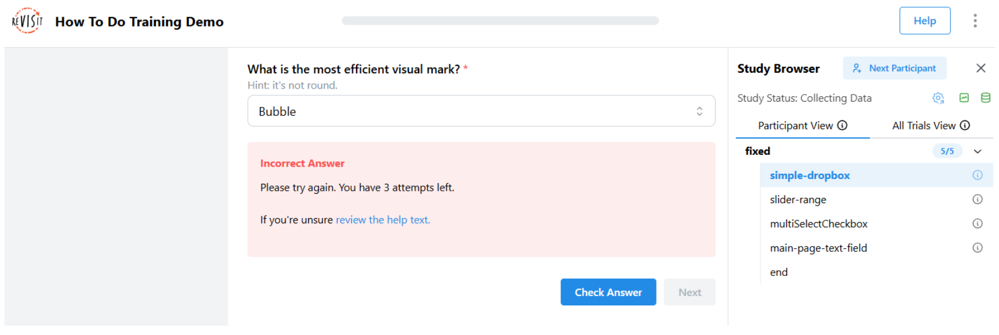
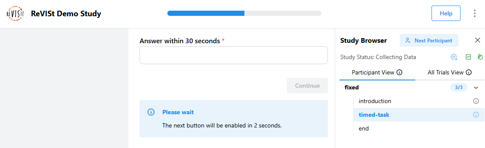

# Responses and Answers

In reVISit, a [component](../../typedoc/interfaces/BaseIndividualComponent) typically has a [response](../../typedoc/interfaces/BaseResponse) that is recorded when a participant completes a task. Responses can be provided via form elements or via some other kind of payload through your custom component and a [ReactiveResponse](../../typedoc/interfaces/ReactiveResponse).

Responses can optionally also be provided with an [Answer](../../typedoc/interfaces/Answer) that captures what the correct response is. This answer is used in several ways:

 * If an answer is present, the data export will include data for the task that lists True and False for each response.
 * In the analysis interface, tasks will be shown as correct or incorrect depending on the answer.
 * Answers can be used to check the response during the experiment, which is useful for **training**.

:::note
There might be situations when answers cannot accurately capture whether a response was correct or not (e.g., with text input). In other situations, answers may have “degrees of correctness”. In such cases, you will have to compute correct answers as part of your data analysis process.
:::

## Specifying Answers and Trainings

When you develop an online study, it's often important to train participants well before they can take a study. Typically, you want to give them an example task, but also provide help and hints at first. Here we lay out possibilities to develop trainings in reVISit leveraging responses and answers.

For a working example, refer to [the demo](https://revisit.dev/study/demo-training/) and the [associated config](https://github.com/revisit-studies/study/tree/main/public/demo-training).

Here's a simple dropdown component asking what the most efficient visual mark is. The `correctAnswer` field contains an answer for the `q-mark-type` response that specifies that the correct answer is `Bar`.

```ts
"simple-dropbox": {
  "type": "questionnaire",
  "response": [
    {
      "id": "q-mark-type",
      "type": "dropdown",
      "required": true,
      "prompt": "What is the most efficient visual mark?",
      "secondaryText": "Hint: it's not round.",
      "placeholder": "Choose mark",
      "options": [
        "Bar",
        "Bubble",
        "Pie",
        "Stacked Bar"
      ]
    }
  ],
  "correctAnswer": [
    {
      "id": "q-mark-type",
      "answer": "Bar"
    }
  ],
  "provideFeedback": true,
  "allowFailedTraining": false,
  "trainingAttempts": 4
}
```

The last three lines specify that this is used for training:

The `provideFeedback` field adds a “Check Answer” button to the UI, which can be used to validate the answer based on the provided correct answer.



The above screenshot shows an example for when the response was incorrect.

Optionally, you can specify that trainings have to be successfully completed with the `allowFailedTraining` flag. You can specify the number of attempts with the `trainingAttempts` field. When failing is not allowed and the participant exceeds the number of failed attempts, **the study will terminate**.


## Navigation Buttons

You can customize the behavior and appearance of navigation buttons in your study components. These options can be set globally in the `uiConfig` or overridden on individual components.

### Next

The next button offers several customization options. You can change the button text using `nextButtonText` (e.g., "Continue", "Next Question") and control its location with `nextButtonLocation`.

To enable keyboard navigation, set `nextOnEnter` to `true`, which allows participants to press Enter to move to the next question.

For timing control, you can use `nextButtonEnableTime` to delay when the button becomes clickable, which helps ensure participants have time to read the content, and `nextButtonDisableTime` to set a time limit after which the button becomes disabled, which is useful for time-limited tasks.

You can also combine `nextButtonDisableTime` with `timeoutReject` to automatically reject participants who do not click the next button within the time limit. This setup is useful for enforcing strict time constraints in tasks or training phases.



```js
"uiConfig": {
  ...
  "timeoutReject": true
},
"components": {
  "timed-task": {
    "type": "questionnaire",
    "nextButtonText": "Continue",
    "nextOnEnter": true,
    "nextButtonEnableTime": 2000,
    "nextButtonDisableTime": 30000,
    "response": [
      {
        "id": "q1",
        "prompt": "Answer within 30 seconds",
        "type": "shortText"
      }
    ]
  }
}
```

### Check Answer

When you set `correctAnswer` and `provideFeedback` to `true`, a "Check Answer" button appears next to the Next button. Participants can click this button to see if their answer is right or wrong before moving on.

The Check Answer button uses `trainingAttempts` to limit how many times participants can check their answer. When a participant gets the answer right, the Check Answer button turns off and the Next button turns on. If you set `trainingAttempts` to a number, the button turns off after that many tries.

You can choose what happens when participants fail training by setting `allowFailedTraining`. When set to `false`, participants who use up all their tries without getting the answer right will be rejected from the study.

```js
"components": {
  "training-task": {
    "type": "questionnaire",
    "provideFeedback": true,
    "trainingAttempts": 3,
    "allowFailedTraining": false,
    "correctAnswer": [
      {
        "id": "q1",
        "answer": "Correct Answer"
      }
    ],
    "response": [
      {
        "id": "q1",
        "prompt": "What is the correct answer?",
        "type": "dropdown",
        "options": ["Correct Answer", "Wrong Answer", "Another Wrong Answer"]
      }
    ]
  }
}
```


### Previous

You can enable the previous button by setting `previousButton` to `true`, which lets participants move back through earlier parts of the study if needed. You can also customize the button text with `previousButtonText`.

```js
"components": {
  "survey": {
    "type": "questionnaire",
    "previousButton": true,
    "previousButtonText": "Back",
    "response": [
      {
        "id": "q1",
        "prompt": "First question?",
        "type": "shortText"
      },
      {
        "id": "q2",
        "prompt": "Second question?",
        "type": "dropdown",
        "options": ["Option A", "Option B"]
      }
    ]
  }
}
```


<!-- Importing links -->
import StructuredLinks from '@site/src/components/StructuredLinks/StructuredLinks.tsx';

<StructuredLinks
  demoLinks={[
    {name: "Training Demo", url: "https://revisit.dev/study/demo-training/"}
  ]}
  codeLinks={[
    {name: "Training Code", url: "https://github.com/revisit-studies/study/tree/main/public/demo-training"}
  ]}
  referenceLinks={[
    {name: "BaseResponse", url: "../../typedoc/interfaces/BaseResponse/"},
    {name: "Answer", url: "../../typedoc/interfaces/Answer"}
  ]}
/>