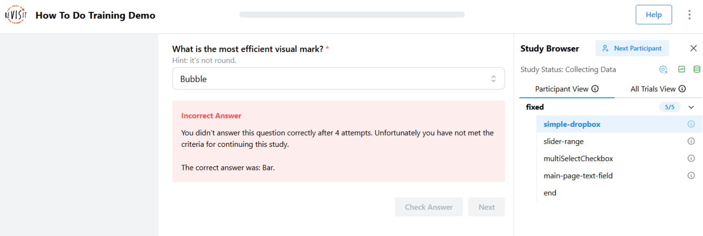

# Responses and Answers

import StructuredLinks from '@site/src/components/StructuredLinks/StructuredLinks.tsx';

<StructuredLinks
    demoLinks={[
      {name: "Training Demo", url: "https://revisit.dev/study/demo-training/"}
    ]}
    codeLinks={[
      {name: "Training Code", url: "https://github.com/revisit-studies/study/tree/main/public/demo-training"}
    ]}
    referenceLinks={[
        {name: "Base Response", url: "../../typedoc/interfaces/BaseResponse/"},
        {name: "Reactive Response", url: "../../typedoc/interfaces/ReactiveResponse/"},
        {name: "Answer", url: "../../typedoc/interfaces/Answer"}
    ]}
/>

In reVISit, a component typically has a [response](../../typedoc/interfaces/BaseResponse/) that is recorded when a participant completes a task. Responses can be provided via form elements or via some other kind of payload through your custom component and a [ReactiveResponse](../../typedoc/interfaces/ReactiveResponse). 

Responses can optionally also be provided with an [Answer](../../typedoc/interfaces/Answer/) that captures what the correct response is. This answer is used in several ways: 

 * If an answer is present, the data export will include a data for the task that lists True and False for each response. 
 * In the analysis interface, tasks will be shown as correct or incorrect depending on the answer. 
 * Answers can be used to check the response during the experiment, which is useful for **training**. 

:::note
There might be situations when answers cannot accurately capture whether a response was correct or not (e.g., with text input). In other situations, answers may have “degrees of correctness“. In such cases, you will have to compute correct answers as part of your data analysis process. 
:::


## Specifying Answers and Trainings

When you develop an online study, it's often important to train participants well before they can take a study. Typically, you want to give them an example task, but also provide help and hints at first. Here we lay out possibilities to develop trainings in reVISit leveraging responses and answers.

For a working example, refer to [the demo](https://revisit.dev/study/demo-training/) and the [associated config](https://github.com/revisit-studies/study/tree/main/public/demo-training).

Here's a simple dropbox component asking what the most efficient visual mark is. The `correctAnswer` field contains an answer for the `q-mark-type` response that specifies that the correct answer is `Bar`. 

```ts
"simple-dropbox": {
  "type": "questionnaire",
  "nextButtonLocation": "sidebar",
  "response": [
    {
      "id": "q-mark-type",
      "type": "dropdown",
      "required": true,
      "prompt": "What is the most efficient visual mark?",
      "secondaryText": "Hint: it's not round.",
      "location": "sidebar",
      "placeholder": "Choose mark",
      "options": [
        "Bar",
        "Bubble",
        "Pie",
        "Stacked Bar"
      ]
    }
  ],
  "correctAnswer": [
    {
      "id": "q-mark-type",
      "answer": "Bar"
    }
  ],
  "provideFeedback": true,
  "allowFailedTraining": false,
  "trainingAttempts": 4
}
```

The last three lines specify that this is used for training: 

The `provideFeedback` field adds a “Check Answer” button to the UI, which can be used to validated the answer based on the provided correct Answer. 



The above screenshot shows an example for when the response was incorrect. 

Optionally, you can specify that trainings have to be successfully completed with the `allowFailedTraining` flag. You can specify the number of attempts with the `trainingAttempts` field. When failing is not allowed and the participant exceeds the number of failed attempts, **the study will terminate**. 
