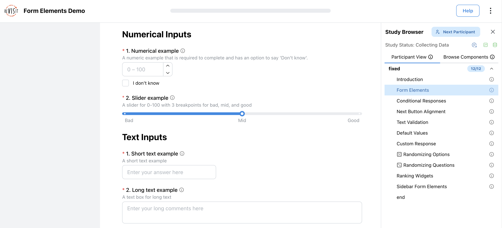
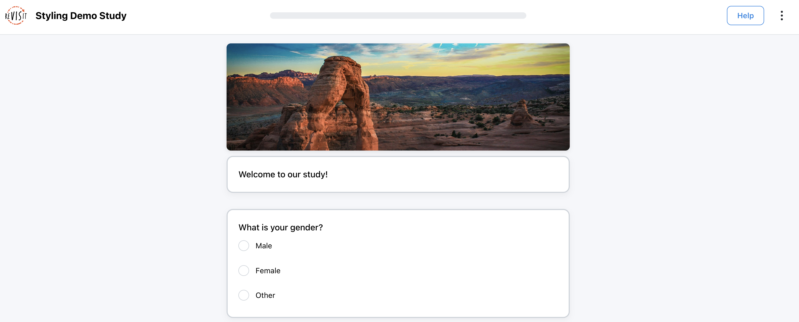
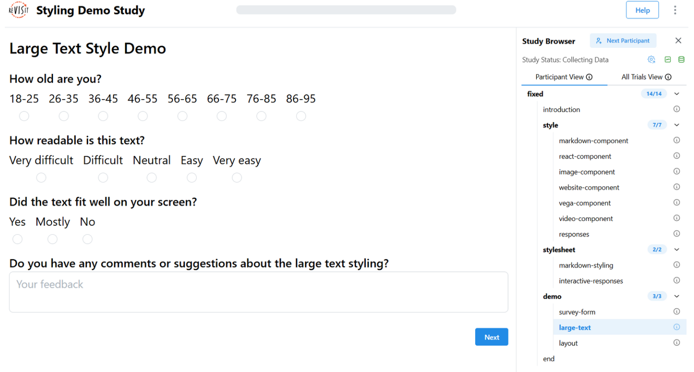
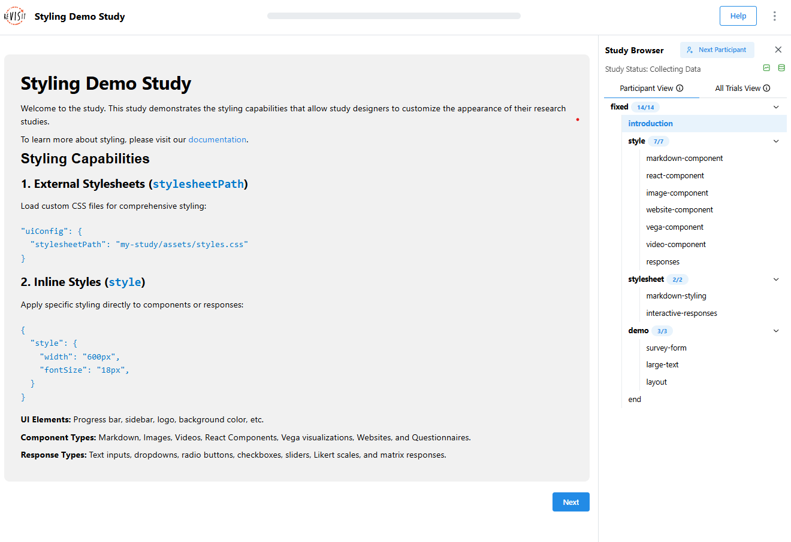
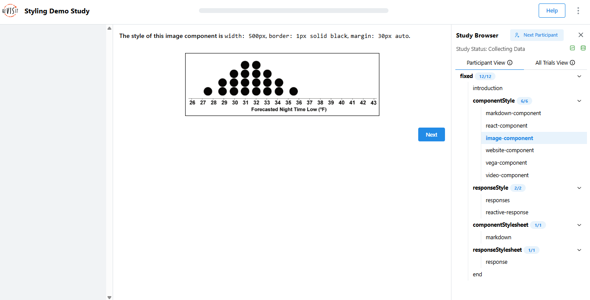
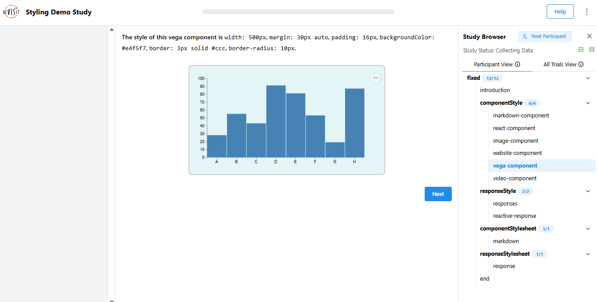
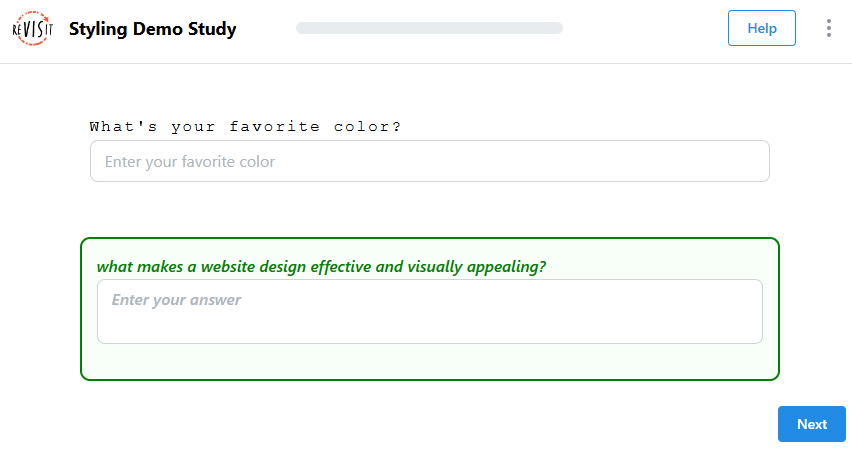
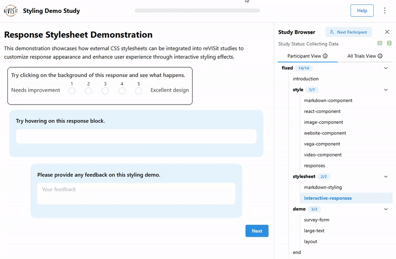

# Applying Styles

ReVISit provides flexible styling capabilities to customize the appearance of your study components and responses. You can apply styles at three levels: **globally through UI configuration**, at the **component** level, and at the **response** level.

## Default Widths and Form Styling

Response blocks above and below the stimulus are centered, with a maximum width of **880px** and space around the responses. They shrink to fit narrower screens. Sidebar blocks keep their own layout.

ReVISit limits the width of compact answer fields while allowing their question text to use the form's width:

- **Up to 150px:** `numerical`, `date` (date/month/year), and `shortText` with `phoneNumber` or `usPhoneNumber` validation.
- **Up to 180px:** `time`.
- **Up to 280px:** other `shortText` responses and single- or multi-select `dropdown` responses.
- **Full form width, up to 1600px:** all remaining response types.

Explore the response types and their appearance in the [Form Elements Demo](https://revisit.dev/study/demo-form-elements).

To customize the layout, [change the column width](#change-the-column-width-with-css), [resize individual responses](#response-styling), or apply a [Google Forms style](#form-style) without writing CSS.



## Color Mode

Set `uiConfig.colorMode` in your Study Config to choose the study's appearance:

```json title="public/study-name/config.json"
"uiConfig": {
  "colorMode": "dark"
}
```

| Value            | Behavior                                                                 |
| ---------------- | ------------------------------------------------------------------------ |
| `light`          | Always use light mode. This is the default when `colorMode` is omitted.  |
| `dark`           | Always use dark mode.                                                    |
| `userPreference` | Use the Participant's system color preference when they start the study. |

:::note

The chosen mode is saved with the Participant's data and used when they resume the study or when an Analyst replays it. Later changes to the system theme do not change that Participant's study mode.

Participants do not have a theme toggle within the study. The theme toggle on the home page and in Analysis controls the application appearance separately and does not override the Study Config.

:::

### HTML and Embedded Websites

Components with `"type": "website"` inherit the study's color mode by default. To give an embedded page a different mode, set `colorMode` on that component to `light` or `dark`:

```json title="public/study-name/config.json"
"components": {
  "chart": {
    "type": "website",
    "path": "study-name/assets/chart.html",
    "colorMode": "light",
    "response": []
  }
}
```

This passes a CSS color scheme to the iframe; the embedded page must support it. It does not recolor a page's hard-coded backgrounds, text, or chart colors.

:::note

Built-in study controls support both modes. Custom CSS, images, and visualizations may need their own color adjustments. For example, a Vega chart with dark axis labels needs lighter labels to remain readable on a dark background. Check your stimuli in each mode your study allows.

Try the [Dark Mode Demo](https://revisit.dev/study/demo-dark-mode) to see forms, a Vega chart, and an embedded page in a dark study.

:::

## Styling Methods

There are two primary ways to apply styles to your study:

### 1. External CSS Files (`stylesheetPath`)

For comprehensive styling with complex rules, pseudo-classes, etc. across all components, you can load external CSS files.

```json title="public/study-name/config.json"
"uiConfig": {
  "stylesheetPath": "study-name/assets/style.css"
}
```

When styling elements with external CSS files, target them using the appropriate selectors:

**Class Selectors:**

- Sidebar: `.sidebar`
- Study Browser: `.studyBrowser`
- Header/Title Bar: `.header`
- Main Content Area: `.main`
- Logo Image: `.logoImage`
- Study Title: `.studyTitle`
- Progress Bar: `.progressBar`
- Help Modal: `.helpModal`
- Stimulus Container: `.stimulus`, or its component type class (e.g., `.markdown`, `.image`)
- Response Type: `.response--responseType` (e.g., `.response--textOnly`, `.response--likert`, `.response--divider`)
- Response Block Container: `.responseBlock`
- Response Block Container with Location: `.responseBlock-location` (e.g., `.responseBlock-aboveStimulus`, `.responseBlock-belowStimulus`, `.responseBlock-sidebar`)
- Individual Response: `.response`

**ID Selectors:**

- Component: `#componentName` (e.g., `#introduction`, `#survey-question`)
- Response: `#responseId` (e.g., `#final-feedback`, `#user-rating`)

A stylesheet can affect any matching element while it is loaded, even when attached to one component or response. Use an ID selector to target a single element. When rules conflict, more specific selectors take precedence; equally specific rules use load order. Inline `style` values override ordinary stylesheet rules on the same element.

You can override the default widths with the selectors above without adding `!important`.

### 2. Inline Styles (`style`)

For basic styling like sizing, colors, and fonts, apply specific CSS properties directly to components or responses:

```json title="public/study-name/config.json"
"component": {
    "style": {
        "width": "800px",
        "margin": "20px auto",
        "padding": "30px",
        "backgroundColor": "#96dcf5",
        "border": "1px solid #aeaeae",
        "borderRadius": "12px"
    }
},
```

## UIConfig Styling

### Using External CSS Files

Apply global styles that affect the entire study interface:

```json title="public/study-name/config.json"
"uiConfig": {
  "contactEmail": "your@email.com",
  "logoPath": "study-name/assets/logo.svg",
  "withProgressBar": true,
  "withSidebar": true,
  "stylesheetPath": "study-name/assets/globalStyle.css"
}
```

### Examples

#### Form Style

Use `revisitAssets/googleForm.css` to display responses as centered cards with rounded borders and a subtle shadow. Cards are up to 640px wide, and colors follow the study's light or dark theme.

Try the [Shared Form Style page in the Styling Demo](https://revisit.dev/study/demo-style/reviewer-shared-form-style) to see the cards and section divider.

To style one page, add `stylesheetPath` to that component. The following partial Study Config defines a questionnaire without a header image. Add `survey` to your study's `sequence` to display it.

```json title="public/study-name/config.json"
{
  "components": {
    "survey": {
      "type": "questionnaire",
      "stylesheetPath": "revisitAssets/googleForm.css",
      "response": [
        {
          "id": "survey-title",
          "type": "textOnly",
          "prompt": "# Your experience"
        },
        {
          "id": "survey-frequency",
          "type": "radio",
          "prompt": "How often do you create surveys?",
          "options": ["Often", "Sometimes", "Rarely"]
        },
        {
          "id": "survey-section-break",
          "type": "divider"
        },
        {
          "id": "survey-feedback",
          "type": "longText",
          "prompt": "What would make a survey easier to complete?",
          "required": false
        }
      ]
    }
  }
}
```

For the same style throughout a study, set `"stylesheetPath": "revisitAssets/googleForm.css"` in `uiConfig` instead. This shared stylesheet is already included in `public/revisitAssets/`.



#### Large Text



```json title="public/demo-style/config.json"
"uiConfig": {
  "stylesheetPath": "demo-style/assets/style/largeText.css"
},
```

```css title="public/demo-style/assets/style/largeText.css"
.studyTitle {
  font-size: 24px;
  font-weight: bold;
}

.progressBar {
  min-height: 18px;
}

.response {
  margin-bottom: 40px;
}
.responseBlock p {
  font-size: 24px;
}

.responseBlock input,
.responseBlock textarea,
.responseBlock button {
  font-size: 22px;
}
```

## Stimulus Width

By default, the stimulus container and response blocks above and below it are centered with a maximum width of **880px**. Response blocks have **16px to 40px** of horizontal padding on each side, depending on browser width. The stimulus does not receive that form padding. Sidebar response blocks keep their own layout.

### Change the Column Width with CSS

Create `public/study-name/assets/style.css` and load it through `uiConfig.stylesheetPath` as shown in [External CSS Files](#1-external-css-files-stylesheetpath). Replace `study-name` with your study directory's name. This rule widens the stimulus and response blocks together:

```css title="public/study-name/assets/style.css"
.stimulus,
.responseBlock-aboveStimulus,
.responseBlock-belowStimulus {
  max-width: 1000px;
}
```

The column still shrinks to fit the available space. Use `max-width: none` in the same rule to remove the column's maximum width. Individual responses retain their own default limits unless you [override their widths](#response-styling).

To change only the stimulus width, use `.stimulus` alone.

These rules override the default layout. If you have also set `width` or `maxWidth` in the component's inline `style`, adjust or remove those values before controlling the same properties with CSS.

### Set One Component's Width

Set `style.width` and `style.maxWidth` on a component to size its stimulus container. The response blocks retain their own widths.

This partial Study Config sets an image stimulus to 800px, shrinking on narrower screens. Replace the image path with your study's asset path.

```json title="public/study-name/config.json"
{
  "components": {
    "chart": {
      "type": "image",
      "path": "study-name/assets/chart.png",
      "style": {
        "width": "800px",
        "maxWidth": "100%"
      },
      "response": []
    }
  }
}
```

## Component Styling

### Using External CSS Files

Components can load their own CSS files using `stylesheetPath`:

```json title="public/study-name/config.json"
"markdown-intro": {
  "type": "markdown",
  "path": "study-name/assets/introduction.md",
  "stylesheetPath": "study-name/assets/style/componentStyle.css",
  "response": []
}
```

**Example CSS file**

You can select components with their name. For example, if your component name is `markdown-intro`, that will be the `id` in your CSS.
Use `#markdown-intro` to select your component. You can also use `#markdown-intro code` to select code elements inside that component.
If you would like to target all markdown components across your study, use the class selector `.markdown`.

```css title="public/study-name/assets/style/componentStyle.css"
.markdown {
  color: blue;
}

#markdown-intro {
  background: lightblue;
  border: 1px solid #ccc;
  padding: 20px;
  border-radius: 10px;
  margin: 20px auto;
  max-width: 800px;
}

#markdown-intro code {
  background: #f8f8f8;
  padding: 2px 4px;
  border-radius: 3px;
}
```

### Using Inline Styles

Apply styles directly to component configurations:

```json title="public/study-name/config.json"
"chart": {
  "type": "image",
  "path": "study-name/assets/chart.png",
  "style": {
    "width": "500px",
    "border": "2px solid #333",
    "borderRadius": "10px",
    "margin": "20px auto"
  },
  "response": []
}
```

:::info

If you set `width` in `style` without setting `maxWidth`, reVISit automatically applies `maxWidth: '100%'` so the component cannot overflow its container on smaller screens. Set `maxWidth` explicitly to override this clamp.

:::

### Component Styling Examples

#### Markdown Component styling



```json title="public/study-name/config.json"
"components": {
  "introduction": {
    "type": "markdown",
    "path": "study-name/assets/introduction.md",
    "stylesheetPath": "study-name/assets/style/introductionStylesheet.css",
    "response": []
  }
}
```

```css title="public/study-name/assets/style/introductionStylesheet.css"
.markdown {
  background-color: #f1f1f1;
  padding: 30px;
  border-radius: 10px;
  margin: 20px auto;
}

#introduction h2 {
  font-family: 'Gill Sans', sans-serif;
  font-weight: 700;
}

#introduction code {
  color: #0079cd;
}
```

#### Image Component Styling



```json title="public/demo-style/config.json"
"components": {
  "chart": {
    "type": "image",
    "path": "demo-style/assets/image.png",
    "response": [
      {
        "id": "image-component-style",
        "prompt": "The style of this image component is `width: 500px`, `border: 1px solid black`, `margin: 30px auto`.",
        "type": "textOnly",
        "location": "aboveStimulus"
      }
    ],
    "style": {
      "width": "500px",
      "border": "1px solid black",
      "margin": "30px auto"
    }
  }
}
```

#### Vega Component Styling



```json title="public/demo-style/config.json"
"components": {
  "vega-component": {
    "type": "vega",
    "path": "demo-style/specs/vegademo1.specs.json",
    "response": [
      {
        "id": "vega-path-component-style",
        "prompt": "The style of this vega component is `width: 500px`, `margin: 30px auto`, `padding: 16px`, `backgroundColor: #e4f5f7`, `border: 3px solid #ccc`, `border-radius: 10px`.",
        "type": "textOnly",
        "location": "aboveStimulus"
      }
    ],
    "style": {
      "width": "500px",
      "margin": "30px auto",
      "padding": "16px",
      "backgroundColor": "#e4f5f7",
      "border": "3px solid #ccc",
      "borderRadius": "10px"
    }
  }
}
```

## Response Styling

The [default answer widths](#default-widths-and-form-styling) keep compact input fields narrower than their question text. Choose whether to resize just the answer field or the entire response, including its prompt.

### Change Only the Answer Field Width

To widen a short-text answer field while keeping its question text wide, set `--response-field-max-width` in a stylesheet loaded by the study. This example changes the default for short-text responses to 400px:

```css title="public/study-name/assets/style.css"
.response--shortText {
  --response-field-max-width: 400px;
}
```

Use a response ID such as `#user-comments` instead of `.response--shortText` to target one response. This variable changes the default cap; it does not apply when that response defines `style.width`, `style.minWidth`, or `style.maxWidth`.

### Using External CSS Files

Responses can load a stylesheet through `stylesheetPath`. Use an ID such as `#user-feedback` to style one response, or a class such as `.response--likert` to style all responses of that type.

Create `public/study-name/assets/responseStyle.css` with the CSS below. Add this response to a component's `response` array, replacing `study-name` with your study directory's name:

```json title="public/study-name/config.json"
{
  "id": "user-feedback",
  "prompt": "Rate your experience:",
  "type": "likert",
  "numItems": 5,
  "leftLabel": "Poor",
  "rightLabel": "Excellent",
  "stylesheetPath": "study-name/assets/responseStyle.css",
  "location": "belowStimulus"
}
```

```css title="public/study-name/assets/responseStyle.css"
#user-feedback {
  background: #f8f9fa;
  border: 1px solid #dee2e6;
  padding: 15px;
  border-radius: 8px;
  margin: 10px 0;
}

.response--likert {
  background: #e9ecef;
  border-radius: 4px;
  padding: 8px 12px;
}
```

### Using Inline Styles

Apply `style` to an entry in a component's `response` array. Setting `width`, `minWidth`, or `maxWidth` here replaces that response's default width limit. Unlike component styling, response styling does not automatically add `maxWidth: "100%"`; include it to keep a fixed width within the form on narrower screens.

The following response uses the available width up to 600px:

```json title="public/study-name/config.json"
{
  "id": "user-comments",
  "prompt": "Additional comments:",
  "type": "longText",
  "placeholder": "Share your thoughts...",
  "location": "belowStimulus",
  "style": {
    "width": "100%",
    "maxWidth": "600px",
    "margin": "20px auto",
    "padding": "15px",
    "border": "1px solid #ccc",
    "borderRadius": "6px",
    "backgroundColor": "#fafafa"
  }
}
```

### Response Styling Examples

#### Text Response Styling

This excerpt defines a component's `response` array. Both responses request a width of 700px and shrink to fit a narrower form.



```json title="public/demo-style/config.json"
"response": [
  {
    "id": "short-text-response-style",
    "prompt": "What's your favorite color?",
    "type": "shortText",
    "location": "belowStimulus",
    "placeholder": "Enter your favorite color",
    "required": false,
    "style": {
      "fontFamily": "'Courier New', monospace",
      "width": "700px",
      "maxWidth": "100%",
      "margin": "25px auto",
      "padding": "10px",
      "letterSpacing": "2px"
    }
  },
  {
    "id": "long-text-response-style",
    "type": "longText",
    "prompt": "What makes a website design effective and visually appealing?",
    "location": "belowStimulus",
    "placeholder": "Enter your answer",
    "required": false,
    "style": {
      "width": "700px",
      "maxWidth": "100%",
      "margin": "25px auto",
      "padding": "15px",
      "border": "2px solid green",
      "borderRadius": "10px",
      "backgroundColor": "#f8fff9",
      "color": "green",
      "fontStyle": "italic",
      "fontWeight": "600",
      "textTransform": "lowercase"
    }
  }
]
```

#### Interactive Response Styling

You can also make responses interactive using CSS. For example, you can change the background color when a user clicks on a response. You might also make the text appear larger when the user starts typing. Adding interactions like these can improve the overall usability of your study.



```json title="public/demo-style/config.json"
"interactive-responses": {
  "type": "markdown",
  "path": "demo-style/assets/responseStylesheet.md",
  "response": [
    {
      "id": "likert-response",
      "prompt": "Try clicking on the background of this response and see what happens.",
      "type": "likert",
      "location": "belowStimulus",
      "numItems": 5,
      "leftLabel": "Needs improvement",
      "rightLabel": "Excellent design",
      "required": false,
      "stylesheetPath": "demo-style/assets/style/responseStylesheet.css"
    },
    {
      "id": "short-text-response",
      "prompt": "Try hovering on this response block.",
      "type": "shortText",
      "location": "belowStimulus",
      "required": false,
      "stylesheetPath": "demo-style/assets/style/responseStylesheet.css"
    },
    {
      "id": "final-feedback",
      "prompt": "Please provide any feedback on this styling demo.",
      "type": "longText",
      "location": "belowStimulus",
      "placeholder": "Your feedback",
      "required": false,
      "stylesheetPath": "demo-style/assets/style/responseStylesheet.css"
    }
  ]
},
```

```css title="public/demo-style/assets/style/responseStylesheet.css"
.responseBlock {
  display: flex;
  flex-direction: column;
  align-items: center;
}

#likert-response {
  border: 1px solid black;
  padding: 10px;
  border-radius: 10px;
  margin: 10px;
  width: 70%;
  color: #333333;
  transition:
    background 0.3s ease-in-out,
    color 0.3s ease-in-out,
    width 0.3s ease-in-out;
}

#likert-response:hover {
  width: 100%;
}

#likert-response:active {
  background: #000000;
  color: #ffffff;
}

#short-text-response {
  padding: 20px;
  margin: 15px;
  background-color: #e5f3fd;
  border-radius: 15px;
  transition: all 0.3s ease-in-out;
}

#short-text-response:hover {
  transform: scale(1.02);
  box-shadow: 0 15px 40px #9abddc;
}

#short-text-response input {
  border: none;
  border-radius: 10px;
  margin: 12px auto;
}

#final-feedback {
  width: 80%;
  padding: 20px;
  margin: 20px auto;
  background-color: #e5f3fd;
  border-radius: 15px;
  transition: all 0.5s ease;
}

#final-feedback textarea {
  border: none;
  margin: 12px auto;
  transition: all 0.3s ease;
}

#final-feedback textarea:focus {
  font-size: 20px;
  letter-spacing: 1px;
  transform: scale(1.01);
  animation: typing-glow 1.5s ease-in-out infinite;
}

@keyframes typing-glow {
  0%,
  100% {
    box-shadow: 0 15px 40px #9abddc;
  }
  50% {
    box-shadow:
      0 25px 80px #9abddc,
      0 0 30px #9abddc,
      inset 0 0 20px rgba(154, 189, 220, 0.3);
  }
}
```

import StructuredLinks from '@site/src/components/StructuredLinks/StructuredLinks.tsx';

<StructuredLinks
  demoLinks={[
    { name: 'Style Demo', url: 'https://revisit.dev/study/demo-style' },
    { name: 'Dark Mode Demo', url: 'https://revisit.dev/study/demo-dark-mode' },
  ]}
  codeLinks={[
    {
      name: 'Style Code',
      url: 'https://github.com/revisit-studies/study/blob/main/public/demo-style',
    },
    {
      name: 'Dark Mode Demo Code',
      url: 'https://github.com/revisit-studies/study/blob/main/public/demo-dark-mode',
    },
  ]}
  referenceLinks={[
    { name: 'UIConfig', url: '../../typedoc/interfaces/UIConfig' },
    {
      name: 'BaseIndividualComponent',
      url: '../../typedoc/interfaces/BaseIndividualComponent',
    },
    { name: 'BaseResponse', url: '../../typedoc/interfaces/BaseResponse' },
    {
      name: 'CSS Properties',
      url: 'https://developer.mozilla.org/en-US/docs/Web/CSS/Properties',
    },
  ]}
/>
