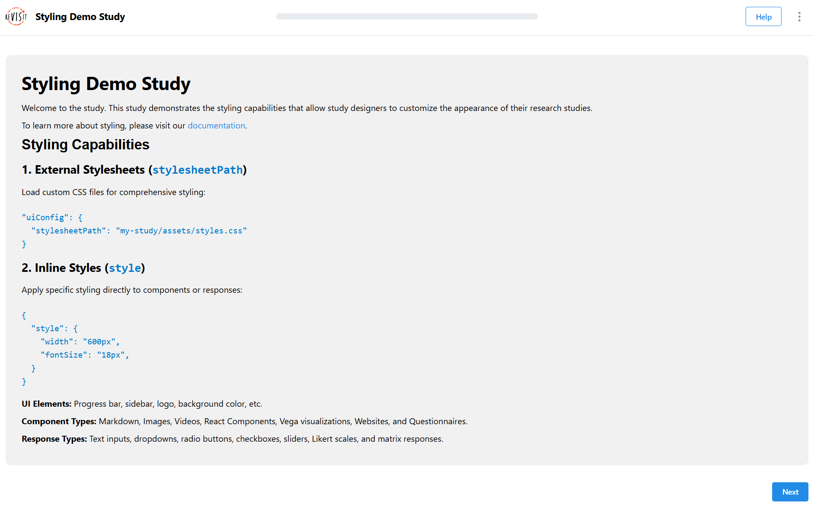

# Applying Styles

import StructuredLinks from '@site/src/components/StructuredLinks/StructuredLinks.tsx';

<StructuredLinks
    demoLinks={[
        {name: "Style Demo", url: "https://revisit.dev/study/demo-style"}
    ]}
    codeLinks={[
        {name: "Style Demo Code", url: "https://github.com/revisit-studies/study/blob/main/public/demo-style"}
    ]}
    referenceLinks={[
        {name: "UIConfig", url: "../../typedoc/interfaces/UIConfig"},
        {name: "BaseIndividualComponent", url: "../../typedoc/interfaces/BaseIndividualComponent"},
        {name: "BaseResponse", url: "../../typedoc/interfaces/BaseResponse"},
        {name: "CSS Properties", url:"https://developer.mozilla.org/en-US/docs/Web/CSS/Properties"}
    ]}
/>

ReVISit provides flexible styling capabilities to customize the appearance of your study components and responses. You can apply styles at three levels: **globally through UI configuration**, at the **component** level, and at the **response** level.

This comprehensive styling feature allows you to create accessible and visually appealing study interfaces that enhance the participant experience. 

## Styling Methods

There are two primary ways to apply styles to your study:

### 1. External CSS Files (`stylesheetPath`)
For comprehensive styling with multiple rules, pseudo-classes.
Load external CSS files for comprehensive styling across components:

```ts
"uiConfig": {
  ...
  "stylesheetPath": "study-name/assets/style.css"
  ...
}
```

When styling elements with external CSS files, target them using the appropriate selectors:

**Class Selectors:**
- Sidebar: `.sidebar`
- Study Browser: `.studyBrowser`
- Header/Title Bar: `.header`
- Main Content Area: `.main`
- Logo Image: `.logoImage`
- Study Title: `.studyTitle`
- Progress Bar: `.progressBar`
- Help Modal: `.helpModal`
- Component Container: `.componentType` (e.g., `.markdown`, `.image`)
- Response Block Container: `.responseBlock`
- Individual Response: `.response`
- Response type: `.responseType` (e.g., `.textOnly`, `.likert`)

**ID Selectors:**
- Component: `#componentName` (e.g., `#introduction`, `#survey-question`)
- Response: `#responseId` (e.g., `#final-feedback`, `#user-rating`)

:::note
Styles are applied in the following order (later styles override earlier ones):

1. **Global UI Styles** (`uiConfig.stylesheetPath`)
2. **Component Styles** (`component.stylesheetPath` and `component.style`)
3. **Response Styles** (`response.stylesheetPath` and `response.style`)
:::

### 2. Inline Styles (`style`)
For basic styling like sizing, colors, and fonts.
Apply specific CSS properties directly to components or responses:

```ts
"component": {
    ...
    "style": {
        "width": "800px",
        "margin": "20px auto",
        "padding": "30px",
        "backgroundColor": "#96dcf5",
        "border": "1px solid #aeaeae",
        "borderRadius": "12px"
    }
    ...
},
```

## UIConfig Styling

### Using External CSS Files

Apply global styles that affect the entire study interface:

```ts
"uiConfig": {
  "contactEmail": "contact@revisit.dev",
  "logoPath": "study-name/assets/logo.svg",
  "withProgressBar": true,
  "withSidebar": true,
  "stylesheetPath": "study-name/assets/globalStyle.css"
}
```

### Examples


#### Form style
```ts
"uiConfig": {
  ...
  "stylesheetPath": "demo-style/assets/style/form.css"
  ...
},
```

`form.css`

```css
.main {
  background-color: #f5f7fa;
}

.image {
  height: 200px;
  width: 80%;
  object-fit: cover;
  border-radius: 8px;
  box-shadow: 0 2px 8px rgba(0, 0, 0, 0.1);
  margin: 0 auto;
}

.responseBlock {
  display: flex;
  flex-direction: column;
  gap: 20px;
}

.response {
  width: 80%;
  background-color: #ffffff;
  margin: 15px auto 0;
  padding: 20px;
  box-sizing: border-box;
  box-shadow: 0 4px 12px rgba(0, 0, 0, 0.05);
  border: 2px solid #e3e8ed;
  border-radius: 12px;
}

label {
  margin-bottom: 10px;
}

#form-title p {
  font-size: 32px;
  font-weight: bold;
}
```

#### Large Text


```ts
"uiConfig": {
  ...
  "stylesheetPath": "demo-style/assets/style/largeText.css"
  ...
},
```

`largeText.css`

```css
.studyTitle {
  font-size: 24px;
  font-weight: bold;
}

.progressBar {
  min-height: 18px;
}

.response {
  margin-bottom: 40px;
}
.responseBlock p {
  font-size: 24px;
}

.responseBlock input,
.responseBlock textarea,
.responseBlock button {
  font-size: 22px;
}
```

## Component Styling

### Using External CSS Files

Components can load their own CSS files using `stylesheetPath`:

```ts
{
  "markdown-intro": {
    "type": "markdown",
    "path": "study-name/assets/introduction.md",
    "stylesheetPath": "study-name/assets/componentStyle.css",
    "response": []
  }
}
```

**Example CSS file**

You can select components with their name. For example, if your component name is `markdown-intro`, that will be the `id` in your CSS.
Use `#markdown-intro` to select your component. You can also use `#markdown-intro code` to select code elements inside that component.
If you would like to target all markdown components across your study, use the class selector `.markdown`.

`componentStyle.css`

```css
.markdown {
  color: blue;
}

#markdown-intro {
  background: lightblue;
  border: 1px solid #ccc;
  padding: 20px;
  border-radius: 10px;
  margin: 20px auto;
  max-width: 800px;
}

#markdown-intro code {
  background: #f8f8f8;
  padding: 2px 4px;
  border-radius: 3px;
}
```

### Using Inline Styles

Apply styles directly to component configurations:

```ts
{
  "chart": {
    "type": "image",
    "path": "assets/chart.png",
    "style": {
      "width": "500px",
      "border": "2px solid #333",
      "borderRadius": "10px",
      "margin": "20px auto",
      "boxShadow": "0 4px 8px rgba(0,0,0,0.1)"
    },
    "response": []
  }
}
```

### Component Styling Examples

#### Markdown Component styling



`config.json`
```ts
"components": {
  "introduction": {
    "type": "markdown",
    "path": "demo-style/assets/introduction.md",
    "stylesheetPath": "demo-style/assets/style/introductionStylesheet.css",
    "response": []
  }
}
```

`introductionStylesheet.css`

```css
.markdown {
  background-color: #f1f1f1;
  padding: 30px;
  border-radius: 10px;
  margin: 20px auto;
}

#introduction h2 {
  font-family: "Gill Sans", sans-serif;
  font-weight: 700;
}

#introduction code {
  color: #0079cd;
}
```

#### Image Component Styling


```ts
"components": {
  "chart": {
    "type": "image",
    "path": "demo-image/assets/image.png",
    "response": [
      {
        "id": "image-component-style",
        "prompt": "The style of this image component is `width: 500px`, `border: 1px solid black`, `margin: 30px auto`.",
        "type": "textOnly",
        "location": "aboveStimulus"
      }
    ],
    "style": {
      "width": "500px",
      "border": "1px solid black",
      "margin": "30px auto"
    }
  }
}
```

#### Vega Component Styling


```ts
"components": {
  "vega-component": {
    "type": "vega",
    "path": "demo-vega/specs/vegademo1.specs.json",
    "response": [
      {
        "id": "vega-path-component-style",
        "prompt": "The style of this vega component is `width: 500px`, `margin: 30px auto`, `padding: 16px`, `backgroundColor: #e4f5f7`, `border: 3px solid #ccc`, `border-radius: 10px`.",
        "type": "textOnly",
        "location": "aboveStimulus"
      }
    ],
    "style": {
      "width": "500px",
      "margin": "30px auto",
      "padding": "16px",
      "backgroundColor": "#e4f5f7",
      "border": "3px solid #ccc",
      "borderRadius": "10px"
    }
  }
}
```

## Response Styling

### Using External CSS Files

Responses can have their own stylesheets. You can target them using their type (as a class) or by their specific id.
- To select a specific response, use its `id` (e.g., `#final-feedback`).
- To target responses by `type`, use the class name (e.g., `.likert`, `.textOnly`).
- Use `.responseBlock` to select the whole block that holds the responses.
- Use `.response` to target any individual response element across the study.

```ts
"components": {
  "component": {
    ...
    "response": [
      "feedback-question": {
        "id": "user-feedback",
        "prompt": "Rate your experience:",
        "type": "likert",
        "numItems": 5,
        "leftLabel": "Poor",
        "rightLabel": "Excellent",
        "stylesheetPath": "study-name/assets/responseStyle.css",
        "location": "belowStimulus"
      }
    ]
    ...
  }
}
```

`responseStyle.css`

```css
#user-feedback {
  background: #f8f9fa;
  border: 1px solid #dee2e6;
  padding: 15px;
  border-radius: 8px;
  margin: 10px 0;
}

#user-feedback .likert-scale {
  gap: 15px;
}

#user-feedback .likert-item {
  background: #e9ecef;
  border-radius: 4px;
  padding: 8px 12px;
}
```

### Using Inline Styles

Apply styles directly to response configurations:

```ts
"components": {
  "component": {
    ...
    "response": [
      "comments": {
        "id": "user-comments",
        "prompt": "Additional comments:",
        "type": "longText",
        "placeholder": "Share your thoughts...",
        "location": "belowStimulus",
        "style": {
          "width": "100%",
          "maxWidth": "600px",
          "margin": "20px auto",
          "padding": "15px",
          "border": "1px solid #ccc",
          "borderRadius": "6px",
          "backgroundColor": "#fafafa"
        }
      }
    ]
    ...
  }
}
```

### Response Styling Examples

#### Text Input Styling
```ts
{
  "participant-name": {
    "id": "name-input",
    "prompt": "Enter your name:",
    "type": "shortText",
    "placeholder": "Full name",
    "style": {
      "width": "400px",
      "padding": "12px",
      "fontSize": "16px",
      "border": "2px solid #007bff",
      "borderRadius": "6px",
      "backgroundColor": "#f8f9fa"
    }
  }
}
```

#### Dropdown Styling
```ts
{
  "country-select": {
    "id": "country",
    "prompt": "Select your country:",
    "type": "dropdown",
    "options": ["USA", "Canada", "UK", "Australia"],
    "style": {
      "width": "300px",
      "padding": "10px",
      "fontSize": "14px",
      "border": "1px solid #6c757d",
      "borderRadius": "4px"
    }
  }
}
```

#### Button Response Styling
```ts
{
  "quick-choice": {
    "id": "preference",
    "prompt": "Choose your preference:",
    "type": "buttons",
    "options": ["Option A", "Option B", "Option C"],
    "style": {
      "display": "flex",
      "gap": "10px",
      "justifyContent": "center",
      "margin": "20px 0"
    }
  }
}
```
#### Interactive Response Styling


```ts
"interactive-responses": {
  "type": "markdown",
  "path": "demo-style/assets/responseStylesheet.md",
  "response": [
    {
      "id": "likert-response",
      "prompt": "Try clicking on the background of this response and see what happens.",
      "type": "likert",
      "location": "belowStimulus",
      "numItems": 5,
      "leftLabel": "Needs improvement",
      "rightLabel": "Excellent design",
      "required": false,
      "stylesheetPath": "demo-style/assets/style/responseStylesheet.css"
    }
  ]
}
```

`responseStylesheet.css`

```css
.responseBlock {
  display: flex;
  flex-direction: column;
  align-items: center;
}

#likert-response {
  border: 1px solid black;
  padding: 10px;
  border-radius: 10px;
  margin: 10px;
  width: 70%;  
  color: #333333;
  transition: background 0.3s ease-in-out, color 0.3s ease-in-out, width 0.3s ease-in-out;
}

#likert-response:hover {
  width: 100%;
}

#likert-response:active {
  background: #000000;
  color: #ffffff;
}
```