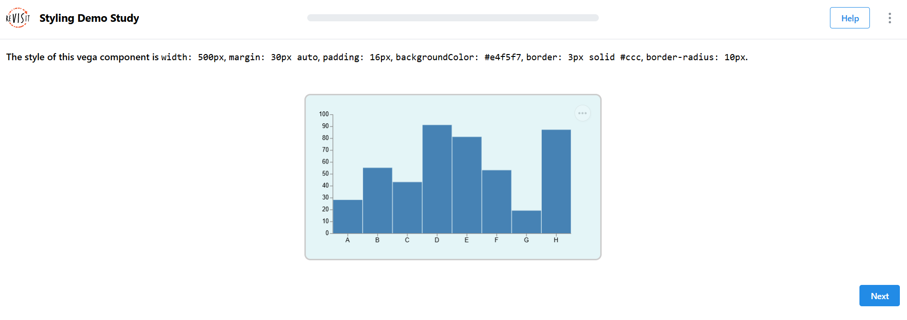

# Applying Styles

import StructuredLinks from '@site/src/components/StructuredLinks/StructuredLinks.tsx';

<StructuredLinks
    demoLinks={[
        {name: "Style Demo", url: "https://revisit.dev/study/demo-style"}
    ]}
    codeLinks={[
        {name: "Style Demo Code", url: "https://github.com/revisit-studies/study/blob/main/public/demo-style"}
    ]}
    referenceLinks={[
        {name: "UIConfig", url: "../../typedoc/interfaces/UIConfig"},
        {name: "BaseIndividualComponent", url: "../../typedoc/interfaces/BaseIndividualComponent"},
        {name: "BaseResponse", url: "../../typedoc/interfaces/BaseResponse"},
        {name: "CSS Properties", url:"https://developer.mozilla.org/en-US/docs/Web/CSS/Properties"}
    ]}
/>

ReVISit provides flexible styling capabilities to customize the appearance of your study components and responses. You can apply styles at three levels: **globally through UI configuration**, at the **component** level, and at the **response** level.

This comprehensive styling feature allows you to create accessible and visually appealing study interfaces that enhance the participant experience. 

## Styling Methods

There are two primary ways to apply styles to your study:

### 1. External CSS Files (`stylesheetPath`)
For comprehensive styling with multiple rules, pseudo-classes.
Load external CSS files for comprehensive styling across components:

```ts
{
  "uiConfig": {
    ...
    "stylesheetPath": "study-name/assets/style.css"
    ...
  }
}
```
:::note
Target elements using their IDs in CSS:
- **Component**: Use the component key as the ID (e.g., `#markdown-component`)
- **Response**: Use the response `id` field as the ID (e.g., `#dropdown-response`)
:::

### 2. Inline Styles (`style`)
For basic styling like sizing, colors, and fonts.
Apply specific CSS properties directly to components or responses:

```ts
"component": {
    ...
    "style": {
        "width": "800px",
        "margin": "20px auto",
        "padding": "30px",
        "fontFamily": "Georgia, serif", 
        "fontSize": "16px",
        "lineHeight": "2",
        "backgroundColor": "#96dcf5",
        "border": "1px solid #aeaeae",
        "borderRadius": "12px"
    }
    ...
},
```

## Styling Hierarchy

Styles are applied in the following order (later styles override earlier ones):

1. **Global UI Styles** (`uiConfig.stylesheetPath`)
2. **Component Styles** (`component.stylesheetPath` and `component.style`)
3. **Response Styles** (`response.stylesheetPath` and `response.style`)

## UIConfig Styling

Apply global styles that affect the entire study interface:

```ts
{
  "uiConfig": {
    "contactEmail": "contact@revisit.dev",
    "logoPath": "study-name/assets/logo.svg",
    "withProgressBar": true,
    "withSidebar": true,
    "stylesheetPath": "assets/global-styles.css"
  }
}
```

## Component Styling

### Using External CSS Files

Components can load their own CSS files using `stylesheetPath`:

```ts
{
  "markdown-intro": {
    "type": "markdown",
    "path": "study-name/assets/introduction.md",
    "stylesheetPath": "assets/component-styles.css",
    "response": []
  }
}
```

**Example CSS file (`study-name/assets/component-styles.css`):**

You can select components with their name. For example, if your component name is `markdown-intro`, that will be the `id` in your CSS.
Use `#markdown-intro` to select your component. You can also use `#markdown-intro code` to select code elements inside that component.

```css
#markdown-intro {
  background: lightblue;
  border: 1px solid #ccc;
  padding: 20px;
  border-radius: 10px;
  margin: 20px auto;
  max-width: 800px;
}

#markdown-intro code {
  background: #f8f8f8;
  padding: 2px 4px;
  border-radius: 3px;
}
```

### Using Inline Styles

Apply styles directly to component configurations:

```ts
{
  "image-component": {
    "type": "image",
    "path": "assets/chart.png",
    "style": {
      "width": "500px",
      "border": "2px solid #333",
      "borderRadius": "10px",
      "margin": "20px auto",
      "boxShadow": "0 4px 8px rgba(0,0,0,0.1)"
    },
    "response": []
  }
}
```

### Component Examples

#### Image Component Styling


```ts
{
  "image-component": {
      "type": "image",
      "path": "demo-image/assets/image.png",
      "response": [
        {
          "id": "image-component-style",
          "prompt": "The style of this image component is `width: 500px`, `border: 1px solid black`, `margin: 30px auto`.",
          "type": "textOnly",
          "location": "aboveStimulus"
        }
      ],
      "style": {
        "width": "500px",
        "border": "1px solid black",
        "margin": "30px auto"
      }
    },
}
```

#### Vega Component Styling



```ts
{
  "vega-component": {
      "type": "vega",
      "path": "demo-vega/specs/vegademo1.specs.json",
      "response": [
        {
          "id": "vega-path-component-style",
          "prompt": "The style of this vega component is `width: 500px`, `margin: 30px auto`, `padding: 16px`, `backgroundColor: #e4f5f7`, `border: 3px solid #ccc`, `border-radius: 10px`.",
          "type": "textOnly",
          "location": "aboveStimulus"
        }
      ],
      "style": {
        "width": "500px",
        "margin": "30px auto",
        "padding": "16px",
        "backgroundColor": "#e4f5f7",
        "border": "3px solid #ccc",
        "borderRadius": "10px"
      }
    },
}
```

## Response Styling

### Using External CSS Files

Responses can have their own stylesheets:

```ts
{
  "feedback-question": {
    "id": "user-feedback",
    "prompt": "Rate your experience:",
    "type": "likert",
    "numItems": 5,
    "leftLabel": "Poor",
    "rightLabel": "Excellent",
    "stylesheetPath": "study-name/assets/response-styles.css",
    "location": "belowStimulus"
  }
}
```

**Example CSS file (`study-name/assets/response-styles.css`):**
```css
#user-feedback {
  background: #f8f9fa;
  border: 1px solid #dee2e6;
  padding: 15px;
  border-radius: 8px;
  margin: 10px 0;
}

#user-feedback .likert-scale {
  gap: 15px;
}

#user-feedback .likert-item {
  background: #e9ecef;
  border-radius: 4px;
  padding: 8px 12px;
}
```

### Using Inline Styles

Apply styles directly to response configurations:

```ts
{
  "comments": {
    "id": "user-comments",
    "prompt": "Additional comments:",
    "type": "longText",
    "placeholder": "Share your thoughts...",
    "location": "belowStimulus",
    "style": {
      "width": "100%",
      "maxWidth": "600px",
      "margin": "20px auto",
      "padding": "15px",
      "border": "1px solid #ccc",
      "borderRadius": "6px",
      "backgroundColor": "#fafafa"
    }
  }
}
```

### Response Type Examples

#### Text Input Styling
```ts
{
  "participant-name": {
    "id": "name-input",
    "prompt": "Enter your name:",
    "type": "shortText",
    "placeholder": "Full name",
    "style": {
      "width": "400px",
      "padding": "12px",
      "fontSize": "16px",
      "border": "2px solid #007bff",
      "borderRadius": "6px",
      "backgroundColor": "#f8f9fa"
    }
  }
}
```

#### Dropdown Styling
```ts
{
  "country-select": {
    "id": "country",
    "prompt": "Select your country:",
    "type": "dropdown",
    "options": ["USA", "Canada", "UK", "Australia"],
    "style": {
      "width": "300px",
      "padding": "10px",
      "fontSize": "14px",
      "border": "1px solid #6c757d",
      "borderRadius": "4px"
    }
  }
}
```

#### Button Response Styling
```ts
{
  "quick-choice": {
    "id": "preference",
    "prompt": "Choose your preference:",
    "type": "buttons",
    "options": ["Option A", "Option B", "Option C"],
    "style": {
      "display": "flex",
      "gap": "10px",
      "justifyContent": "center",
      "margin": "20px 0"
    }
  }
}
```

