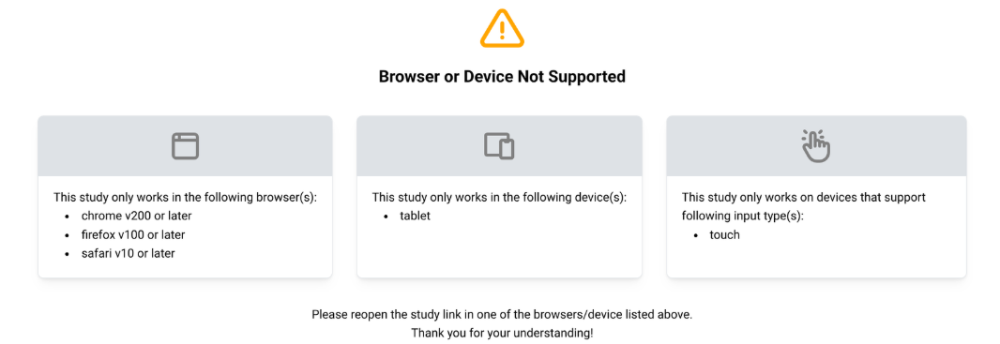

# Device Restrictions

ReVISit lets you specify requirements for your study to ensure participants have compatible devices, browsers, and input methods. Study rules are defined in the `studyRules` section of your configuration file and can include display size, browser, device type, and input method restrictions.

If a participant's device or browser doesn't meet your requirements, they'll see a message explaining what's needed and won't be able to continue with the study.

## Setting Display Requirements

Specify minimum screen dimensions in the `studyRules` section using `minHeight` and `minWidth` properties (measured in pixels):

```json
{
  "studyRules": {
    "display": {
      "minHeight": 800,
      "minWidth": 400
    }
  }
}
```

When a participant starts the study, reVISit checks whether their browser window meets the minimum screen size requirements. If the screen is too small, a warning screen appears with a one-minute countdown timer showing the current and required dimensions.

The participant has one minute to resize their browser window. During this time, reVISit continuously monitors the window size. Once both the width and height meet the requirements, the warning disappears and the study begins.

If the timer runs out and the screen is still too small, the participant will see a training failed page and will not be able to continue the study.


In the participant table, the participant will be listed as rejected with the reason "Screen resolution too small."


## Setting Browser Requirements

You can restrict your study to specific browsers and their minimum versions to ensure compatibility with your study design.

Configure browser restrictions in the `studyRules` section:

```json
{
  "studyRules": {
    "browsers": {
      "allowed": [
        {
          "name": "chrome",
          "minVersion": 100
        },
        {
          "name": "firefox",
          "minVersion": 100
        },
        {
          "name": "safari",
          "minVersion": 15
        }
      ],
      "blockedMessage": "This study requires Chrome, Firefox, or Safari with the minimum versions specified."
    }
  }
}
```

You can specify browser restrictions for:
- `chrome` 
- `firefox` 
- `safari` 
- `edge`

Each browser can have an optional `minVersion` to ensure participants have a recent version with necessary features.

## Setting Device Type Requirements

You can control which device types (desktop, tablet, mobile) can access your study based on your research needs.

Configure device type restrictions in the `studyRules` section:

```json
{
  "studyRules": {
    "devices": {
      "allowed": ["desktop", "tablet", "mobile"],
      "blockedMessage": "This study requires a desktop or tablet device."
    }
  }
}
```

The `allowed` array specifies which device types can participate. You can include any combination of:
- `desktop`
- `tablet`
- `mobile`

## Setting Input Requirements

You can specify which input methods your study supports, such as mouse and/or touch input.

Configure input restrictions in the `studyRules` section:

```json
{
  "studyRules": {
    "inputs": {
      "allowed": ["mouse", "touch"],
      "blockedMessage": "This study requires a device with mouse or touch input capability."
    }
  }
}
```

The `allowed` array specifies which input methods are supported:
- `mouse` - Mouse or trackpad input
- `touch` - Touch input (touchscreen or touch-enabled device)

## Example

Here's a complete example combining all restriction types:

```json
{
  "studyRules": {
    "display": {
      "minHeight": 400,
      "minWidth": 800
    },
    "browsers": {
      "allowed": [
        {
          "name": "chrome",
          "minVersion": 100
        },
        {
          "name": "firefox",
          "minVersion": 100
        },
        {
          "name": "safari",
          "minVersion": 10
        }
      ],
    },
    "devices": {
      "allowed": ["tablet", "desktop", "mobile"]
    },
    "inputs": {
      "allowed": ["touch"],
      "blockedMessage": "Only touch devices are supported"
    }
  },
}
```



<!-- Importing links -->
import StructuredLinks from '@site/src/components/StructuredLinks/StructuredLinks.tsx';

<StructuredLinks
  demoLinks={[
    {name: "HTML Demo", url: "https://revisit.dev/study/demo-html/"}
  ]}
  codeLinks={[
    {name: "HTML Demo Code", url: "https://github.com/revisit-studies/study/tree/main/public/demo-html"}
  ]}
  referenceLinks={[
    {name: "Study Rules", url:"../../typedoc/interfaces/StudyRules"},
    {name: "Display Rules", url:"../../typedoc/type-aliases/DisplayRules"},
    {name: "Browser Rules", url:"../../typedoc/type-aliases/BrowserRules"},
    {name: "User Browser", url:"../../typedoc/type-aliases/UserBrowser"},
    {name: "Device Rules", url:"../../typedoc/type-aliases/DeviceRules"},
    {name: "User Device", url:"../../typedoc/type-aliases/UserDevice"},
    {name: "Input Rules", url:"../../typedoc/type-aliases/InputRules"},
    {name: "User Input", url:"../../typedoc/type-aliases/UserInput"}
  ]}
/>