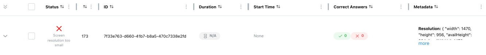

# Device Restrictions

ReVISit lets you set a minimum screen size for your study to make sure participants have enough space to view the content and complete tasks. If their screen is too small, they’ll see a message asking them to resize their browser window or switch to a larger device.

## Setting Screen Size Requirements

You can specify minimum screen dimensions in the `studyRules.display` section of your study configuration file by setting the `minWidth` and `minHeight` properties. These values are measured in pixels.

```json
{
  "studyRules": {
    "display": {
      "minHeight": 800,
      "minWidth": 400
    }
  }
}
```

## How It Works

When a participant starts the study, reVISit checks whether their browser window meets the minimum screen size requirements. If the screen is too small, a warning screen appears with a one-minute countdown timer showing the current and required dimensions.


The participant has one minute to resize their browser window. During this time, reVISit continuously monitors the window size. Once both the width and height meet the requirements, the warning disappears and the study begins.

If the timer runs out and the screen is still too small, the participant will see a training failed page and will not be able to continue the study.


In the participant table, the participant will be listed as rejected with the reason "Screen resolution too small."



<!-- Importing links -->
import StructuredLinks from '@site/src/components/StructuredLinks/StructuredLinks.tsx';

<StructuredLinks
  demoLinks={[
    {name: "HTML Demo", url: "https://revisit.dev/study/demo-html/"}
  ]}
  codeLinks={[
    {name: "HTML Demo Code", url: "https://github.com/revisit-studies/study/tree/main/public/demo-html"}
  ]}
  referenceLinks={[
    {name: "UI Config", url:"../../typedoc/interfaces/UIConfig"}
  ]}
/>