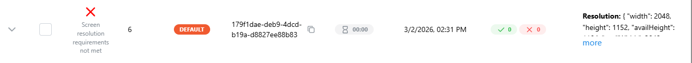
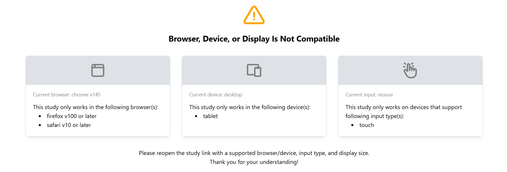

# Device Restrictions

ReVISit lets you control whether participants can enter a study based on screen size, browser version, device type, and input method.
These checks are configured in `studyRules`.

## Configuring Study Rules

`studyRules` supports:

- `display`: allowed display sizes
- `browsers`: allowed browser names and optional minimum versions
- `devices`: allowed device types (`desktop`, `tablet`, `mobile`)
- `inputs`: allowed input types (`mouse`, `touch`)

:::note
`minWidth` and `minHeight` are now configured under `studyRules.display` instead of `uiConfig`.

The previous properties `minWidthSize` and `minHeightSize` have been renamed to `minWidth` and `minHeight`. The `minWidthSize` and `minHeightSize` property is now removed and should no longer be used.
:::

The following snippet shows how to configure device restrictions:

```json title="public/study-name/config.json"
"studyRules": {
  "display": {
    "minHeight": 400,
    "minWidth": 800
  },
  "browsers": {
    "allowed": [
      {
        "name": "chrome",
        "minVersion": 100
      },
      {
        "name": "firefox",
        "minVersion": 100
      },
      {
        "name": "safari",
        "minVersion": 10
      }
    ],
    "blockedMessage": "You must be on a relatively modern browser, Chrome > 100, Firefox > 100, Safari > 10."
  },
  "devices": {
    "allowed": ["tablet", "desktop", "mobile"]
  },
  "inputs": {
    "allowed": ["touch", "mouse"]
  }
}
```

## How It Works

When a participant starts the study, reVISit validates the participant environment against `studyRules`.
If any browser, device, input, or display requirement is not met, a blocking screen lists every rule that failed alongside the participant's currently detected browser, device, input, and display values.

When [Development Mode](../../analysis/revisit-modes#development-mode) is enabled, the blocking screen and the display-size countdown are suppressed and replaced with a "Device Requirement Not Met" badge in the header. This lets study designers explore the study on devices that don't meet the configured rules without being blocked or rejected.

## Setting Display Requirements

You can restrict your study to specific screen-size requirements to ensure participants use a supported display.

Configure display restrictions in the `studyRules` section. Use `studyRules.display` to define minimum and optional maximum screen dimensions.

```json title="public/study-name/config.json"
"studyRules": {
  "display": {
    "minHeight": 600,
    "minWidth": 1024,
    "maxHeight": 1440,
    "maxWidth": 2560,
    "blockedMessage": "This study requires a screen between 1024x600 and 2560x1440."
  }
}
```

If the current display is below `minWidth` or `minHeight`, participants see a warning screen with a one-minute countdown timer showing current and required dimensions.

The participant has one minute to resize their browser window. During this time, reVISit continuously monitors the window size. Once both the width and height meet the requirements, the warning disappears and the study begins.

If the timer runs out and the screen is still too small, the participant will see a training failed page and will not be able to continue the study.

In the participant table, the participant will be listed as rejected with the reason "Screen resolution requirements not met."



## Setting Browser Requirements

You can restrict your study to specific browsers and their minimum versions to ensure compatibility with your study design.

Configure browser restrictions in the `studyRules` section:

```json title="public/study-name/config.json"
"studyRules": {
  "browsers": {
    "allowed": [
      {
        "name": "chrome",
        "minVersion": 100
      },
      {
        "name": "firefox",
        "minVersion": 100
      },
      {
        "name": "safari",
        "minVersion": 15
      }
    ],
    "blockedMessage": "This study requires Chrome, Firefox, or Safari with the minimum versions specified."
  }
}
```

You can specify browser restrictions for:
- `chrome`
- `firefox`
- `safari`
- `edge`

Each browser can have an optional `minVersion` to ensure participants have a recent version with necessary features.

## Setting Device Type Requirements

You can control which device types (desktop, tablet, mobile) can access your study based on your research needs.

Configure device type restrictions in the `studyRules` section:

```json title="public/study-name/config.json"
"studyRules": {
  "devices": {
    "allowed": ["desktop", "tablet", "mobile"],
    "blockedMessage": "This study requires a desktop or tablet device."
  }
}
```

The `allowed` array specifies which device types can participate. You can include any combination of:
- `desktop`
- `tablet`
- `mobile`

## Setting Input Requirements

You can specify which input methods your study supports, such as mouse and/or touch input.

Configure input restrictions in the `studyRules` section:

```json title="public/study-name/config.json"
"studyRules": {
  "inputs": {
    "allowed": ["mouse", "touch"],
    "blockedMessage": "This study requires a device with mouse or touch input capability."
  }
}
```

The `allowed` array specifies which input methods are supported:
- `mouse` - Mouse or trackpad input
- `touch` - Touch input (touchscreen or touch-enabled device)

## Example

Here's a complete example combining all restriction types:

```json title="public/study-name/config.json"
"studyRules": {
  "display": {
    "minHeight": 400,
    "minWidth": 800
  },
  "browsers": {
    "allowed": [
      {
        "name": "chrome",
        "minVersion": 100
      },
      {
        "name": "firefox",
        "minVersion": 100
      },
      {
        "name": "safari",
        "minVersion": 10
      }
    ],
  },
  "devices": {
    "allowed": ["tablet", "desktop", "mobile"]
  },
  "inputs": {
    "allowed": ["touch"],
    "blockedMessage": "Only touch devices are supported"
  }
},
```



<!-- Importing links -->
import StructuredLinks from '@site/src/components/StructuredLinks/StructuredLinks.tsx';

<StructuredLinks
  demoLinks={[
    {name: "HTML Demo", url: "https://revisit.dev/study/demo-html/"}
  ]}
  codeLinks={[
    {name: "HTML Demo Code", url: "https://github.com/revisit-studies/study/tree/main/public/demo-html"}
  ]}
  referenceLinks={[
    {name: "Study Rules", url:"../../typedoc/interfaces/StudyRules"},
    {name: "Display Rules", url:"../../typedoc/type-aliases/DisplayRules"},
    {name: "Browser Rules", url:"../../typedoc/type-aliases/BrowserRules"},
    {name: "User Browser", url:"../../typedoc/type-aliases/UserBrowser"},
    {name: "Device Rules", url:"../../typedoc/type-aliases/DeviceRules"},
    {name: "User Device", url:"../../typedoc/type-aliases/UserDevice"},
    {name: "Input Rules", url:"../../typedoc/type-aliases/InputRules"},
    {name: "User Input", url:"../../typedoc/type-aliases/UserInput"}
  ]}
/>
