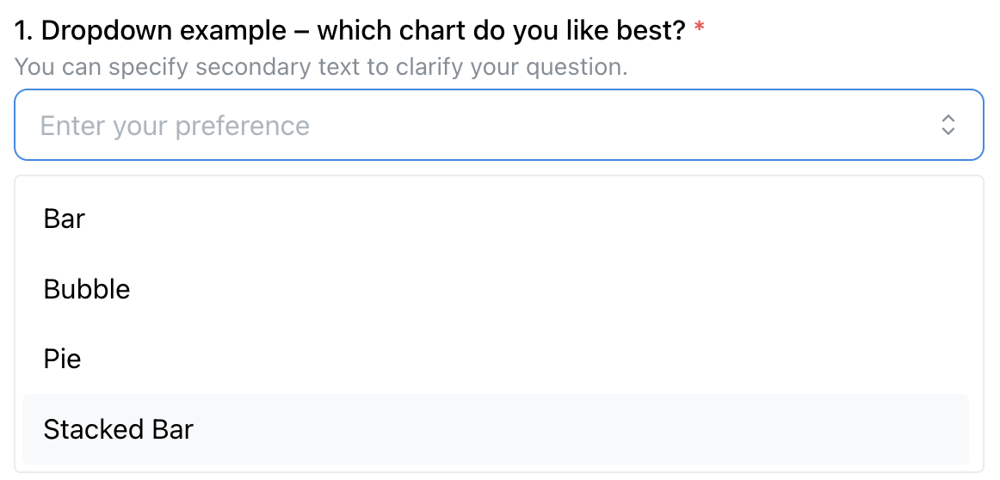
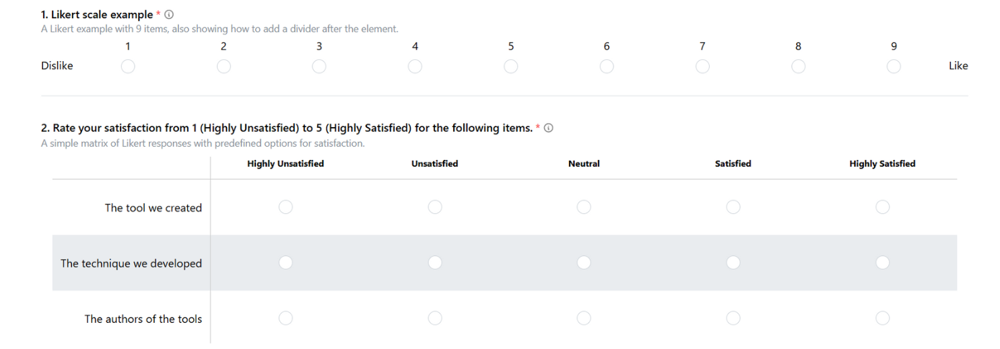
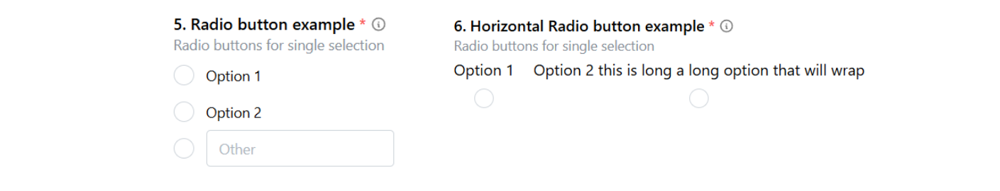
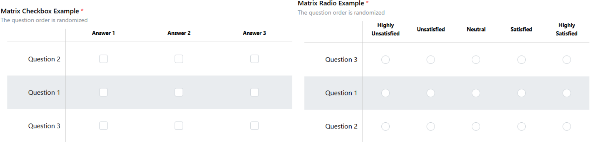
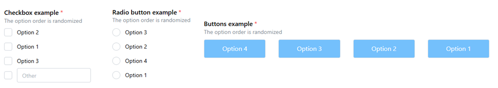
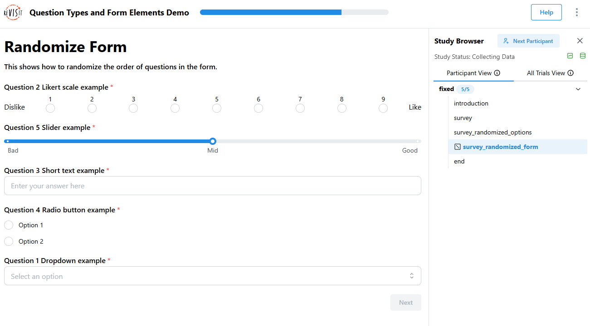

# Designing Forms

import StructuredLinks from '@site/src/components/StructuredLinks/StructuredLinks.tsx';

<StructuredLinks
    demoLinks={[
        {name: "Survey Demo", url: "https://revisit.dev/study/demo-survey"}
    ]}
    codeLinks={[
        {name: "Survey Code", url: "https://github.com/revisit-studies/study/blob/main/public/demo-survey"}
    ]}
    referenceLinks={[
        {name: "Form Elements Overview", url:"../../typedoc/#form-elements"}
    ]}
/>

Form elements are essential for most studies to capture user responses. reVISit provides rich form elements, such as slides, check-boxes, text fields, etc, so that you can efficiently design your forms.

This tutorial does not give a comprehensive introduction into all form elements. For this, refer to the demo and other links in the relevant links panel. Instead, we introduce some high-level principles that apply to all form elements.

## Principles

Form elements are components of type `questionnaire`. Here is a simple example with a drop-down element:

```js
"components": {
    "survey": {
        "type": "questionnaire",
        "response": [
        {
            "id": "q-dropdown",
            "prompt": "Dropdown example – which chart do you like best?",
            "secondaryText": "You can specify secondary text to clarify your question.",
            "location": "aboveStimulus",
            "type": "dropdown",
            "placeholder": "Enter your preference",
            "options": [
                "Bar",
                "Bubble",
                "Pie",
                "Stacked Bar"
            ]
        }
        ]
    }
}
```

This renders like that:



In this example, the drop-down is rendered in the main window, as indicated by the `"location": "aboveStimulus"` line. As documented in the [`BaseResponse`](../../typedoc/interfaces/BaseResponse/), the other options are `sidebar` and `belowStimulus`.

Form elements can be placed either in a side-bar, or as the main content of a study page. The side-bar version is useful if you're showing another kind of stimulus in the main part of the window. The main page location is useful for stand-alone survey questions, or if you want to integrate your response with your stimulus.

Because form elements are so commonly combined with other stimuli, a standalone questionnaire component as shown above is just a stripped down component with “only” a response.

:::note
You can also add form-based responses to all other stimuli using exactly the same syntax!
:::

## Notable Features

Below we list some notable features that apply to all or most form elements.

### Prompts and Descriptions

Each form element requires a `prompt` that introduces the question. You can also provide a more detailed description in `secondaryText` that is shown below the prompt; both are demonstrated in the above example.

### Required Fields

You can make a field required, in which case a red star is rendered (see above) and it is necessary that a response is given before the “Next” button is activated and the participant can proceed. Required is the default, set `"required": false` if an answer is optional.

### “Don't Know” Option

You can explicitly allow participants to state that they don't know the response with a dedicated checkbox:


To achieve that, add the `"withDontKnow": true` option to your form element.

### Dividers

You can structure your forms by adding a divider between form elements. To add a divider, add `"withDivider": true` to the question that you want the divider to appear after. In the following figure, there's a divider added between question 3 and 4.



### Radio and Checkbox Features

Radio buttons and checkboxes have some shared noteworthy features. Here is an example showing different configurations of radio buttons:



#### Vertical and Horizontal Layouts

Radios and check-boxes can be rendered either vertically (the default) or horizontally. The above figure shows radios for both. Set `"horizontal": true` to get the horizontal version.

#### “Other” Option

You can allow an “other” option for radios and checkboxes, as shown for the first radio group above. To enable that, set `"withOther": true`.

### Randomization of form elements 
Randomizing the order of answers or questions can help reduce bias and improve the quality of your study results. ReVISit allows you to shuffle options within a question, or even the order of entire questions on a page.

Each participant will see their own consistent order during the study, and the same order is recorded and shown in the replay, so you can always see exactly what they saw.

#### Randomizing Matrix checkbox, Matrix radio
For matrix questions (e.g., matrix radio or matrix checkbox), you can randomize the questions. Set `questionOrder = "random"` to randomize questions.

Here is an example to show how to set up questions in random order:

```js
"response": [
    {
        "id": "5items-response",
        "prompt": "To what extent do you agree that this visual representation is...?",
        "location": "belowStimulus",
        "type": "matrix-radio",
        "answerOptions": "satisfaction5",
        "questionOrder": "random", //set randomization here
        "questionOptions": [
            "enjoyable",
            "likable",
            "pleasing",
            "nice",
            "appealing"
        ]
    }
]        
```




#### Randomizing Checkbox, radio, button
To shuffle the options in a radio, checkbox, or button question, set `optionOrder = "random"`.

Here is an example to show how to set up options in random order:

```js
"response": [
    {
        "id": "fruitPreference",
        "prompt": "What’s your favorite fruit?",
        "location": "aboveStimulus",
        "type": "radio",
        "optionOrder": "random", //set randomization here
        "options": [
        "Apple",
        "Banana",
        "Grape"
        ]
    }
]
```



#### Randomizing form elements in a single page
You can also randomize the order of multiple questions that appear on the same page. To do so, apply `responseOrder = "random"`, which will shuffle the order in which the form elements themselves appear on the page.
If the form is randomized, a dice icon will appear in the sidebar to indicate that the response order is random.

Here is an example to show how to set up responses in random order:

```js
"survey_randomized_form": {
  "type": "questionnaire",
  "responseOrder": "random", //set randomization here
  "response": [
    {
      "id": "favoriteFeature",
      "prompt": "What's your favorite feature?",
      "type": "shortText",
      "placeholder": "Enter your answer"
    },
    {
      "id": "recommend",
      "prompt": "Would you recommend our app?",
      "type": "dropdown",
      "options": [
        "Yes",
        "No"
      ]
    }
  ]
}
```



