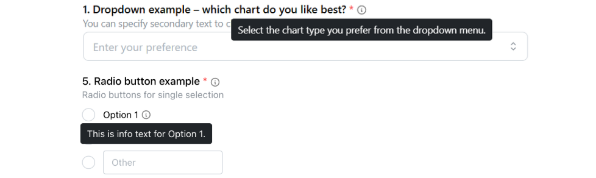
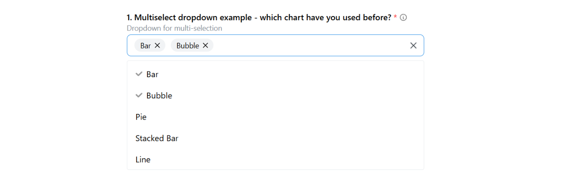
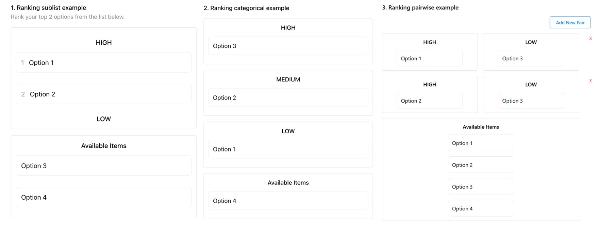
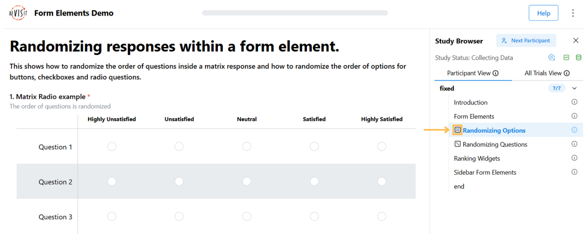
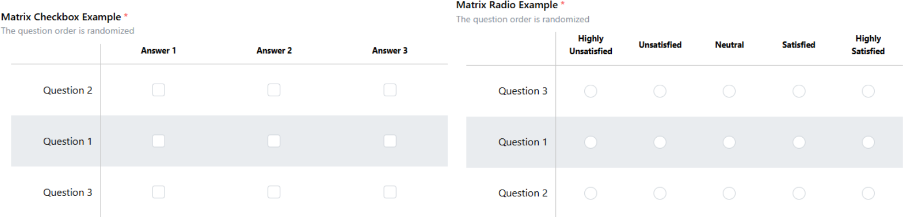
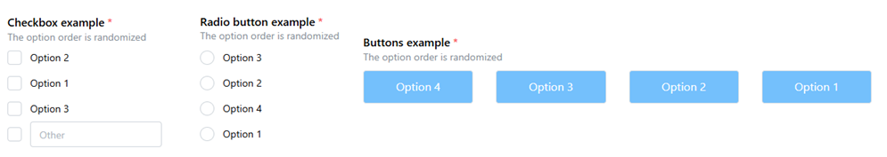

# Designing Forms

Form elements are essential for most studies to capture user [responses](../typedoc/interfaces/BaseResponse.md). ReVISit provides rich form elements, such as [sliders](../typedoc/interfaces/SliderResponse.md), [checkboxes](../typedoc/interfaces/CheckboxResponse.md), text fields, etc., so that you can efficiently design your forms.

This tutorial does not give a comprehensive introduction into all form elements. For this, refer to the demo and other links in the relevant links panel. Instead, we introduce some high-level principles that apply to all form elements.

## Principles

Form elements are components of type `questionnaire`. Here is a simple example with a drop-down element:

```json
"components": {
  "survey": {
    "type": "questionnaire",
    "response": [
      {
        "id": "q-dropdown",
        "prompt": "Dropdown example – which chart do you like best?",
        "secondaryText": "You can specify secondary text to clarify your question.",
        "infoText": "Select the chart type you prefer from the dropdown menu.",
        "location": "aboveStimulus",
        "type": "dropdown",
        "placeholder": "Enter your preference",
        "options": [
          "Bar",
          "Bubble",
          "Pie",
          "Stacked Bar"
        ]
      }
    ]
  }
}
```

This renders like that:


In this example, the drop-down is rendered in the main window, as indicated by the `"location": "aboveStimulus"` line. As documented in the [`BaseResponse`](../../typedoc/interfaces/BaseResponse/), the other options are `sidebar` and `belowStimulus`.

Form elements can be placed either in a sidebar, or as the main content of a study page. The sidebar version is useful if you're showing another kind of stimulus in the main part of the window. The main page location is useful for stand-alone survey questions, or if you want to integrate your response with your stimulus.

Because form elements are so commonly combined with other stimuli, a standalone questionnaire component as shown above is just a stripped down component with "only" a response.

:::note
You can also add form-based responses to all other stimuli using exactly the same syntax!
:::

## Notable Features

Below we list some notable features that apply to all or most form elements.

### Prompts and Descriptions

Each form element requires a `prompt` that introduces the question. You can also provide a more detailed description in `secondaryText` that is shown below the prompt; both are demonstrated in the above example.

### Additional Descriptions

The `infoText` allows you to provide additional description for survey questions or response options that appears when participants hover over an information icon. This helps clarify questions or scales while keeping the `prompt` simple.


:::note
For response option, `infoText` is only supported in `button`, `checkbox`, `radio`, and `ranking` responses.
:::

### Required Fields

You can make a field required, in which case a red star is rendered (see above) and it is necessary that a response is given before the "Next" button is activated and the participant can proceed. Required is the default, set `"required": false` if an answer is optional.

You can also force participants to provide a specific answer value using `requiredValue`. This is useful for attention checks, training tasks, or ensuring participants read instructions carefully. The participant must provide an exact match with the specified value to proceed.

For single-select responses (`radio`, `shortText`, `longText`, `numerical`, etc.), `requiredValue` requires an exact match:

```json
{
  "id": "accept",
  "prompt": "Do you consent to the study and wish to continue?",
  "requiredValue": "Accept",
  "location": "belowStimulus",
  "type": "radio",
  "options": [
    "Decline",
    "Accept"
  ]
}
```

For multi-select responses (`checkbox`, `dropdown` with multiple selections), `requiredValue` can be an array of values that must all be selected:

```json
{
  "id": "multi-check",
  "prompt": "Please select both Option 1 and Option 2",
  "type": "checkbox",
  "options": ["Option 1", "Option 2", "Option 3"],
  "requiredValue": ["Option 1", "Option 2"]
}
```

When using `requiredValue` with arrays, the system checks that the participant has selected exactly the specified values, in any order. If the participant selects different values or a different number of values, they will see a message asking them to select the required options.

The `requiredLabel` property is similar to `requiredValue` but is more user-friendly. Instead of matching against the value stored in the data, it matches against the label displayed to participants. This is particularly useful when options have both labels and values, as it allows you to specify requirements using the human-readable label.

```json
{
  "id": "attention-check",
  "prompt": "Please select 'I agree' to continue",
  "type": "radio",
  "options": [
    { "label": "I agree", "value": "agree" },
    { "label": "I disagree", "value": "disagree" }
  ],
  "requiredLabel": "I agree"
}
```

### "Don't Know" Option

You can explicitly allow participants to state that they don't know the response with a dedicated checkbox:


To achieve that, add the `"withDontKnow": true` option to your form element.

### Dividers

You can structure your forms by adding a divider between form elements. This is useful when your study has multiple multiple topics or transitioning between different types of tasks. To add a divider, add `"withDivider": true` to the question that you want the divider to appear after. In the following figure, there's a divider added between question 1 and 2.

```json
"response": [
  {
    "id": "q-likert",
    "type": "likert",
    "numItems": 9,
    ...
    "withDivider": true
  }
]
```

Alternatively, if you want to position dividers independently of specific questions, you can use [`DividerResponse`](../../docs/typedoc/interfaces/DividerResponse.md) as a standalone response element.

```json
"components": {
  ...
  "barChart": {
    ...
    "response": [
      {
        "id": "divider",
        "type": "divider"
      }
    ]
  }
}
```


### Enumerating Questions

You can automatically number questions by setting `"enumerateQuestions": true`. This will prepend each question with its index number (starting from 1). This feature should only be used when all questions are in the same location (e.g., all questions are in the sidebar).


### Radio and Checkbox Features

Radio buttons and checkboxes have some shared noteworthy features. Here is an example showing different configurations of radio buttons:


#### Vertical and Horizontal Layouts

Radios and checkboxes can be rendered either vertically (the default) or horizontally. The above figure shows radios for both. Set `"horizontal": true` to get the horizontal version.

#### "Other" Option

You can allow an "other" option for radios and checkboxes, as shown for the first radio group above. To enable that, set `"withOther": true`.

#### Selection Requirements for Checkboxes

For checkboxes, you can specify the minimum and maximum number of selections required using `minSelections` and `maxSelections`. These properties control how many options must be selected before the participant can proceed.

```json
{
  "id": "checkbox-min",
  "prompt": "Select at least 2 options",
  "type": "checkbox",
  "options": ["Option 1", "Option 2", "Option 3", "Option 4"],
  "minSelections": 2
}
```

### Matrix Features

Matrix questions let you ask several questions at the same time, using the same set of answer choices. You can either provide your own custom answers or use our built-in answer options.

Built-in options include:

- `likely5` or `likely7`: ranges from Highly Unlikely to Highly Likely
- `satisfaction5` or `satisfaction7`: ranges from Highly Unsatisfied to Highly Satisfied

Here is an example of Matrix Radio questions using `"answerOptions": "likely7"` and `"answerOptions": "satisfaction5"`.


If any question in the matrix is left unanswered, participants will see a validation message: "Please answer all questions in the matrix to continue."


### Dropdown Features

A dropdown allows participants to choose one or more from a list. By default, they can only pick one item. If you want to allow multiple selections, add `minSelections` or `maxSelections` and the dropdown will then automatically become a multiselect dropdown.



When `minSelections` or `maxSelections` are specified for a dropdown, it automatically becomes a multiselect dropdown, allowing participants to choose multiple options. 

Example with minimum selections:

```json
{
  "id": "dropdown-multi",
  "prompt": "Select at least 2 options",
  "type": "dropdown",
  "options": ["Option 1", "Option 2", "Option 3", "Option 4"],
  "minSelections": 2
}
```

Example with both minimum and maximum:

```json
{
  "id": "dropdown-range",
  "prompt": "Select between 2 and 3 options",
  "type": "dropdown",
  "options": ["Option 1", "Option 2", "Option 3", "Option 4"],
  "minSelections": 2,
  "maxSelections": 3
}
```

### Likert Features

A Likert response allows participants to rate something on a scale. You can customize the scale in several ways -- you can set where the scale starts, how large the steps between values are, the label locations, and how many options it has.

For example, here is a Likert example with `"start": 1`, `"spacing": 2`, and `"numItems": 10`.


You can control the label location in Likert responses to better fit your layout. The `labelLocation` property supports multiple options: `above`, `inline` (default), and `below`. The `above` and `below` options are useful when the width of the section containing the Likert question is limited and the `inline` layout does not work well.


### Numerical Response Features

Numerical response inputs support `min` and `max` fields that define the acceptable range of values for the answer. These constraints help ensure that participants provide values within the expected bounds, and warnings will be displayed if their input falls outside this range.

```json
{
  "id": "q-numerical",
  "prompt": "Numerical example",
  "location": "aboveStimulus",
  "type": "numerical",
  "placeholder": "Enter your age, range from 0 - 120",
  "max": 120,
  "min": 0
}
```

The `min` and `max` properties work together to define a range. When participants enter values outside this range, they will see a warning message indicating the acceptable range.


You can also define a range of acceptable answers using the `acceptableLow` and `acceptableHigh` properties in the `Answer` interface. This is particularly useful for numerical answers where you want to accept values within a certain range rather than requiring an exact match.

```json
{
  "correctAnswer": [{
    "id": "q-numerical",
    "answer": 5,
    "acceptableLow": 4,
    "acceptableHigh": 6
  }]
}
```

For example, if the correct answer is 5, and you set `acceptableLow` to 4 and `acceptableHigh` to 6, then any answer between 4 and 6 (inclusive) will be considered correct. This is useful for questions where there might be slight variations in correct answers, or where you want to account for rounding or measurement precision.

### Slider Features

A slider response lets participants pick a value by moving a handle on a line. You can change how the slider works by setting where it starts, how big each step is, and how far apart the tick marks are.
Here is a slider example with `"step": 10` and `"spacing": 10`.


You can also hide the label above the handle by using `snap`, and choose whether to show the bar with `withBar`.
The example below shows a slider with `"snap": true` and `"withBar": false`.


### Ranking Widget Features

A ranking widget allows participants to order or group items rather than simply selecting them. They are useful when you want to capture relative preferences, priorities, or categories of interest.

#### The "numItems" option

For sublist and categorical rankings, you can use the `numItems` option to control how many items participants must assign:

- In a sublist, `numItems` sets how many items they have to rank (e.g., top 2 out of 5).
- In a categorical ranking, `numItems` can limit how many items may be placed in each category (e.g., only 3 items per category).  

:::note
The `numItems` option cannot be used in pairwise rankings, since their purpose is to compare and rank items by pairs.
:::

This option is useful when you want participants to focus on their strongest preferences rather than distributing all items.



## Randomization of form elements

Randomizing the order of answers or questions can help reduce bias and improve the quality of your study results. ReVISit allows you to shuffle options within a question, or even the order of entire questions on a page.

A dice icon is shown in the sidebar to indicate that at least one item on this page has a randomized order.



Each participant will see their own consistent order during the study, and the same order is recorded and shown in the replay, so you can always see exactly what they saw.

### Randomizing Matrix Checkbox, Matrix Radio

For matrix questions (e.g., matrix radio or matrix checkbox), you can randomize the questions. Set `"questionOrder": "random"` to randomize questions.

Here is an example to show how to set up questions in random order:

```json
"response": [
  {
    "id": "5items-response",
    "prompt": "To what extent do you agree that this visual representation is...?",
    "location": "belowStimulus",
    "type": "matrix-radio",
    "answerOptions": "satisfaction5",
    "questionOrder": "random", // Set randomization here
    "questionOptions": [
        "enjoyable",
        "likable",
        "pleasing",
        "nice",
        "appealing"
    ]
  }
]
```



### Randomizing Checkbox, Radio, Button

To shuffle the options in a radio, checkbox, or button question, set `"optionOrder": "random"`.

Here is an example to show how to set up options in random order:

```json
"response": [
  {
    "id": "fruitPreference",
    "prompt": "What’s your favorite fruit?",
    "location": "aboveStimulus",
    "type": "radio",
    "optionOrder": "random", // Set randomization here
    "options": [
        "Apple",
        "Banana",
        "Grape"
    ]
  }
]
```



### Randomizing form elements in a single page

You can randomize the order of multiple questions that appear on the same page by setting `"responseOrder": "random"`, which will shuffle the order in which the form elements themselves appear on the page. In some cases, however, you may want certain responses to stay in a fixed position. To exclude a specific response from randomization, set `"excludeFromRandomization": true` on that response element. This setting overrides the component-level `responseOrder` configuration and ensures the specified response maintains its original position while other responses are randomized.

Here is an example to show how to set up responses in random order:

```json
"survey_randomized_form": {
  "type": "questionnaire",
  "responseOrder": "random", // Set randomization here
  "response": [
    {
      "id": "demographics",
      "prompt": "What is your gender?",
      "type": "shortText",
      "placeholder": "Enter your answer",
      "excludeFromRandomization": true // Exclude from randomization here
    },
    {
      "id": "duration",
      "prompt": "How long have you used this webite?",
      "type": "shortText",
      "placeholder": "Enter your answer"
    },
    {
      "id": "favoriteFeature",
      "prompt": "What's your favorite feature?",
      "type": "shortText",
      "placeholder": "Enter your answer"
    },
    {
      "id": "recommend",
      "prompt": "Would you recommend our app?",
      "type": "dropdown",
      "options": [
        "Yes",
        "No"
      ]
    }
  ]
}
```
If the form is randomized, a die icon will appear in the sidebar to indicate that the response order is random.


## Sidebar Configuration

The sidebar is a left panel that can be used to display form elements alongside your stimulus. This is particularly useful when you want participants to see both the stimulus and the questions simultaneously.

### Enabling the Sidebar

To use the sidebar, you must set `"withSidebar": true` in your component or globally in the `uiConfig`. The sidebar is required if any of your responses have `"location": "sidebar"`.

```json
"components": {
  "survey": {
    "type": "questionnaire",
    "withSidebar": true,
    "response": [
      {
        "id": "q-sidebar",
        "prompt": "Rate this visualization",
        "location": "sidebar",
        "type": "likert",
        "numItems": 5
      }
    ]
  }
}
```

### Sidebar Width

You can customize the width of the sidebar by setting `"sidebarWidth"` (in pixels). The default width is 300 pixels. This can be set globally in `uiConfig` or overridden on individual components.

```json
"components": {
  "survey": {
    "type": "questionnaire",
    "withSidebar": true,
    "sidebarWidth": 400,
    "response": [
      {
        "id": "q-sidebar",
        "prompt": "Rate this visualization",
        "location": "sidebar",
        "type": "likert",
        "numItems": 5
      }
    ]
  }
}
```

For more details on sidebar configuration, see the [`UIConfig`](../../typedoc/interfaces/UIConfig/) and [`BaseIndividualComponent`](../../typedoc/interfaces/BaseIndividualComponent/) documentation.

<!-- Importing links -->
import StructuredLinks from '@site/src/components/StructuredLinks/StructuredLinks.tsx';

<StructuredLinks
  demoLinks={[
    {name: "Survey Demo", url: "https://revisit.dev/study/demo-survey"}
  ]}
  codeLinks={[
    {name: "Survey Code", url: "https://github.com/revisit-studies/study/blob/main/public/demo-survey"}
  ]}
  referenceLinks={[
    {name: "Answer", url: "../../typedoc/interfaces/Answer"},
    {name: "BaseResponse", url: "../../typedoc/interfaces/BaseResponse"},
    {name: "ButtonsResponse", url: "../../typedoc/interfaces/ButtonsResponse"},
    {name: "CheckboxResponse", url: "../../typedoc/interfaces/CheckboxResponse"},
    {name: "DividerResponse", url: "../../typedoc/interfaces/DividerResponse"},
    {name: "DropdownResponse", url: "../../typedoc/interfaces/DropdownResponse"},
    {name: "LikertResponse", url: "../../typedoc/interfaces/LikertResponse"},
    {name: "LongTextResponse", url: "../../typedoc/interfaces/LongTextResponse"},
    {name: "MatrixResponse", url: "../../typedoc/interfaces/MatrixResponse"},
    {name: "NumericalResponse", url: "../../typedoc/interfaces/NumericalResponse"}, 
    {name: "RadioResponse", url: "../../typedoc/interfaces/RadioResponse"},
    {name: "RankingResponse", url: "../../typedoc/interfaces/RankingResponse"},
    {name: "ShortTextResponse", url: "../../typedoc/interfaces/ShortTextResponse"},
    {name: "SliderResponse", url: "../../typedoc/interfaces/SliderResponse"},
  ]}
/>