# Designing Forms

Form elements are essential for most studies to capture user [responses](../typedoc/interfaces/BaseResponse.md). ReVISit provides rich form elements, such as [sliders](../typedoc/interfaces/SliderResponse.md), [checkboxes](../typedoc/interfaces/CheckboxResponse.md), text fields, etc., so that you can efficiently design your forms.

This guide explains how to configure form responses, validate answers, and show follow-up questions. Try the [Form Elements Demo](https://revisit.dev/study/demo-form-elements) to explore the available controls. The reference links at the end of this page list the full configuration options.

## Principles

Form elements are components of type `questionnaire`. Here is a simple example with a drop-down element:

```json title="public/study-name/config.json"
"components": {
  "survey": {
    "type": "questionnaire",
    "response": [
      {
        "id": "q-dropdown",
        "prompt": "Dropdown example – which chart do you like best?",
        "secondaryText": "You can specify secondary text to clarify your question.",
        "infoText": "Select the chart type you prefer from the dropdown menu.",
        "location": "aboveStimulus",
        "type": "dropdown",
        "placeholder": "Enter your preference",
        "options": [
          "Bar",
          "Bubble",
          "Pie",
          "Stacked Bar"
        ]
      }
    ]
  }
}
```

This renders like that:

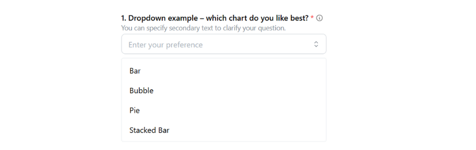

In this example, the drop-down is rendered in the main window, as indicated by the `"location": "aboveStimulus"` line. As documented in the [`BaseResponse`](../../typedoc/interfaces/BaseResponse/), the other options are `sidebar` and `belowStimulus`.

Form elements can be placed either in a sidebar, or as the main content of a study page. The sidebar version is useful if you're showing another kind of stimulus in the main part of the window. The main page location is useful for stand-alone survey questions, or if you want to integrate your response with your stimulus.

Because form elements are so commonly combined with other stimuli, a standalone questionnaire component as shown above is just a stripped down component with "only" a response.

:::note
You can also add form-based responses to all other stimuli using exactly the same syntax!
:::

## Notable Features

Below we list some notable features that apply to all or most form elements.

### Prompts and Descriptions

Each form element requires a `prompt` that introduces the question. You can also provide a more detailed description in `secondaryText` that is shown below the prompt; both are demonstrated in the above example.

A response's `prompt`, `secondaryText`, and `infoText` support [`{{variable}}` templating](./templating.md), so you can reuse one component across trials and swap in per-trial values or even reference a participant's answer from an earlier trial.
Option labels and option-level `infoText` can use the same templates; give templated labels an explicit `value` when the saved answer must stay stable.

### Additional Descriptions

The `infoText` allows you to provide additional description for survey questions or response options that appears when participants hover over an information icon. This helps clarify questions or scales while keeping the `prompt` simple.
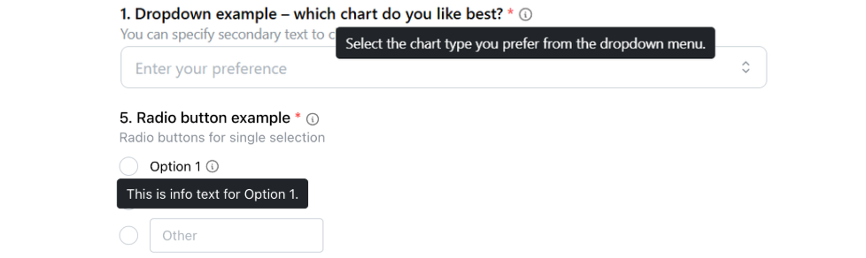

:::info
For response option, `infoText` is only supported in `button`, `checkbox`, `radio`, `dropdown`, `matrix` and `ranking` responses.
:::

### Required Fields

Responses are required by default and show an asterisk beside the prompt. Set `"required": false` if an answer is optional. You can [style the required asterisk](./applying-style.md#styling-required-asterisks) without changing validation.

The **Next** button is available before a Participant answers. When they select it, ReVISit checks required fields and validation rules. If a required response is unanswered or invalid, the page stays open, highlights the affected fields, and shows a summary of unanswered questions and invalid answers. The Participant can then correct the highlighted fields and select **Next** again.

This check includes `requiredValue`, text and format rules, numeric ranges, selection counts, matrix questions, incomplete **Other** entries, and custom response validation. Optional responses can show validation feedback but do not block **Next**, even when an entered answer is invalid. Keep a response required when its constraints must be satisfied before continuing.


#### Requiring a Specific Answer

You can also force participants to provide a specific answer value using `requiredValue`. This is useful for attention checks, training tasks, or ensuring participants read instructions carefully. The participant must provide an exact match with the specified value to proceed.

For single-select responses (`radio`, `shortText`, `longText`, `numerical`, etc.), `requiredValue` requires an exact match:

```json title="public/study-name/config.json"
{
  "id": "accept",
  "prompt": "Do you consent to the study and wish to continue?",
  "requiredValue": "Accept",
  "location": "belowStimulus",
  "type": "radio",
  "options": [
    "Decline",
    "Accept"
  ]
}
```

For multi-select responses (`checkbox`, `dropdown` with multiple selections), use an array in `requiredValue` to require exactly that set of selections:

```json title="public/study-name/config.json"
{
  "id": "multi-check",
  "prompt": "Please select both Option 1 and Option 2",
  "type": "checkbox",
  "options": ["Option 1", "Option 2", "Option 3"],
  "requiredValue": ["Option 1", "Option 2"]
}
```

For these checkbox and dropdown arrays, the system checks that the participant has selected exactly the specified values, in any order. If the participant selects different values or a different number of values, they will see a message asking them to select the required options.

Use `requiredLabel` together with `requiredValue` to supply a readable name for the expected answer in the validation message. It does not compare against option labels or impose a requirement by itself. For options with separate labels and values, put the stored value in `requiredValue`:

```json title="public/study-name/config.json"
{
  "id": "attention-check",
  "prompt": "Please select 'I agree' to continue",
  "type": "radio",
  "options": [
    { "label": "I agree", "value": "agree" },
    { "label": "I disagree", "value": "disagree" }
  ],
  "requiredValue": "agree",
  "requiredLabel": "I agree"
}
```

#### Requiring a Value from a Stimulus

A `reactive` response receives an answer from a [React](./react-stimulus.md), [HTML](./html-stimulus.md), or [Vega](./vega-stimulus.md) stimulus. Add `requiredValue` to require a particular reported answer, and use `requiredLabel` to explain the expected value in the validation message:

```json title="public/study-name/config.json"
{
  "id": "selectedRegion",
  "type": "reactive",
  "prompt": "Select the West region in the visualization.",
  "required": true,
  "requiredValue": "west",
  "requiredLabel": "the West region"
}
```

Add this response to the component containing your stimulus, and have the stimulus report its selected region under the answer key `selectedRegion`. The answer must be `"west"` to pass this check. Reporting a successful stimulus interaction alone does not satisfy `requiredValue`; the stimulus must also send the matching answer. Follow the linked stimulus guide to connect your interaction to ReVISit.

:::info

Reactive values are compared without converting types: `3` and `"3"` are different. Arrays must match in order, and objects must match in structure and values. Use a simple string, number, or boolean when a single completion value is sufficient.

:::

### Text Length and Content Validation

For `shortText` and `longText`, add any of these properties to the response:

- `minCharLength` and `maxCharLength` set the minimum and maximum number of characters, including spaces.
- `minWordLength` and `maxWordLength` set the minimum and maximum number of whitespace-separated words. Punctuation-only entries do not count as words.

Use nonnegative whole numbers, with the minimum no greater than the maximum. For required responses, maximum lengths must be greater than zero. Character counting uses JavaScript string length, so some symbols, such as emoji, can count as more than one character.

This response requires between 10 and 50 words, with a maximum of 500 characters:

```json title="public/study-name/config.json"
{
  "id": "explanation",
  "type": "longText",
  "prompt": "Explain your choice in 10–50 words.",
  "secondaryText": "Use no more than 500 characters.",
  "minWordLength": 10,
  "maxWordLength": 50,
  "maxCharLength": 500
}
```

For content rules, add a `textValidation` array. Every rule must pass; ReVISit checks rules in array order and displays the first failing rule's message.

- `matchesRegex`: Set `value` to a JavaScript regular expression pattern the answer must match.
- `contains`: Set `value` to text that must appear in the answer.
- `doesNotContain`: Set `value` to text that must not appear in the answer.
- `equals`: Set `value` to the complete expected answer.
- `doesNotEqual`: Set `value` to a complete answer to reject.

Text comparisons are case-sensitive and preserve spaces. Regex patterns are strings without surrounding `/` delimiters. Use `^` and `$` to match the entire answer, and double backslashes inside JSON: `\d` represents a digit in a regular expression.

```json title="public/study-name/config.json"
{
  "id": "text-validation-regex",
  "type": "shortText",
  "prompt": "Enter a code with three uppercase letters, a hyphen, and three digits.",
  "secondaryText": "For example: ABC-123. This response uses matchesRegex with the pattern ^[A-Z]{3}-\\d{3}$.",
  "placeholder": "ABC-123",
  "textValidation": [
    {
      "type": "matchesRegex",
      "value": "^[A-Z]{3}-\\d{3}$"
    }
  ]
}
```

Describe your expected format in `prompt` or `secondaryText` so Participants know how to correct an answer. Length checks run before built-in format checks, followed by the `textValidation` rules. Invalid regex syntax causes a Study Config error; correct the pattern before running the study.

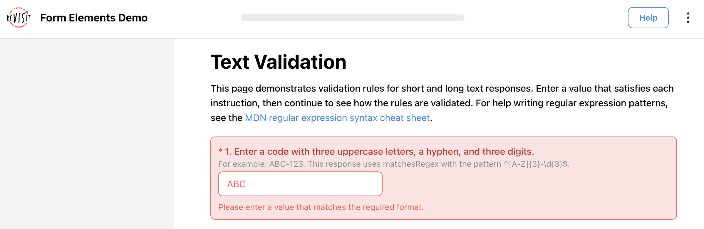

### Built-in Formats, Dates, and Times

For common text formats, use `builtInValidation` on a `shortText` response:

- `email`: An address such as `test@revisit.dev`.
- `phoneNumber`: 7–15 digits, with an optional leading `+` and hyphens between digits; spaces and parentheses are not accepted.
- `usPhoneNumber`: Exactly `000-000-0000`: ten digits with two hyphens.
- `url`: An absolute URL beginning with `http://` or `https://`, with a valid hostname.

These checks validate formatting; they do not verify that an address, phone number, or website exists.

```json title="public/study-name/config.json"
{
  "id": "email",
  "type": "shortText",
  "prompt": "Enter your email address.",
  "placeholder": "participant@example.org",
  "builtInValidation": "email"
}
```

You can combine a built-in format with length and `textValidation` rules. The Form Elements Demo shows prompts and placeholders for each built-in format:

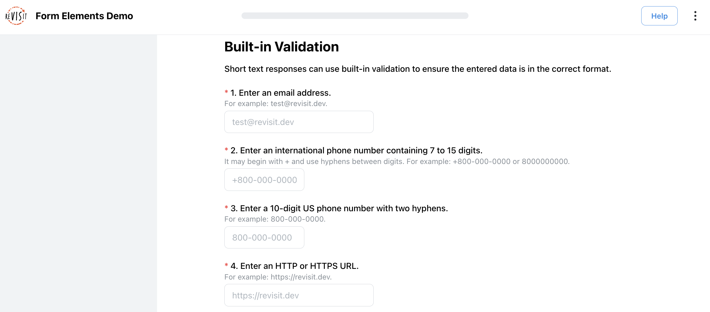

For dates and times, use the dedicated `date` and `time` response types instead of `builtInValidation`.

For a `date` response, `options` selects the input and stored format:

- `date` (default): Stores `MM/DD/YYYY`, such as `09/28/2026`.
- `month`: Stores `MM/YYYY`, such as `09/2026`.
- `year`: Stores `YYYY`, such as `2026`.

Use the same format for `default`, `min`, `max`, and `requiredValue`. Bounds are inclusive, and supported years range from `0100` through `9999`.

```json title="public/study-name/config.json"
{
  "id": "session-date",
  "type": "date",
  "prompt": "Select your September 2026 session date.",
  "min": "09/01/2026",
  "max": "09/30/2026"
}
```

A `time` response stores a 24-hour `HH:mm` string, or `HH:mm:ss` when `withSeconds` is `true`. Setting `format` to `12h` changes the display only; `default`, `min`, `max`, and `requiredValue` still use the 24-hour stored format. The default display format is `24h`, and bounds are inclusive.

```json title="public/study-name/config.json"
{
  "id": "session-time",
  "type": "time",
  "prompt": "Select a session time between 9 AM and 5 PM.",
  "format": "12h",
  "min": "09:00",
  "max": "17:00"
}
```

The Form Elements Demo illustrates the different date and time controls:

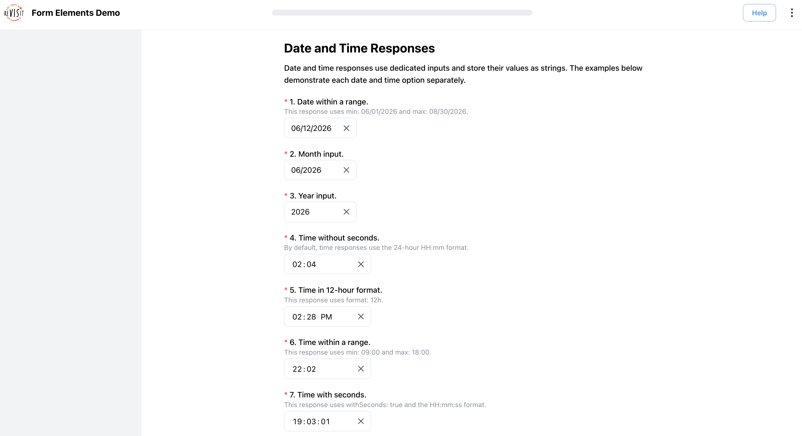

### Conditional Follow-up Questions

Use `visibleIf` to show a response only when another response in the **same component** satisfies a condition. For example, place this component inside your Study Config's `components` object and include `education` in your study sequence:

```json title="public/study-name/config.json"
{
  "education": {
    "type": "questionnaire",
    "response": [
      {
        "id": "attendedUniversity",
        "type": "radio",
        "prompt": "Did you attend university?",
        "options": [
          { "label": "Yes", "value": "yes" },
          { "label": "No", "value": "no" }
        ]
      },
      {
        "id": "universityName",
        "type": "shortText",
        "prompt": "Name of your university",
        "visibleIf": {
          "responseId": "attendedUniversity",
          "comparison": "equals",
          "value": "yes"
        }
      }
    ]
  }
}
```

In this example, selecting **Yes** reveals the university question, which is required by default. Selecting **No** or leaving the first question unanswered keeps it hidden.

The three properties in `visibleIf` define the condition:

- `responseId` identifies the question whose answer to check.
- `comparison` specifies the check. Here, `equals` checks for an exact match.
- `value` is the expected answer. Use the stored value (`"yes"`), not the displayed label (`"Yes"`).

#### What Happens to Hidden Answers

If a Participant enters a university name and then selects **No**, ReVISit hides the university question and clears its answer. Hidden answers are omitted from the saved trial answers and do not block **Next** or correctness checks. Any associated **Other** text and **I don't know** selection are cleared too.

If the Participant selects **Yes** again, the previous university name is not restored. The question starts with its configured `default`, if any. Earlier interactions may still appear in replay history.

Try this sequence when testing your form: select **Yes**, enter a university name, then select **No**. Confirm that the follow-up disappears and that its answer is absent from the saved trial answers after continuing.

#### Other Conditions

You can check answers from `radio`, `dropdown`, `buttons`, `checkbox`, `shortText`, `numerical`, or `date` responses in the same component. Choose the comparison that fits your question:

- `equals` or `doesNotEqual`: Check whether the answer matches a value. For checkboxes and multiselect dropdowns, use an array such as `["A", "B"]`; matching requires the same selections, regardless of order. For numerical answers, use a number such as `18`, without quotes.
- `contains`, `doesNotContain`, or `matchesRegex`: Check text in a single answer. These cannot check whether a checkbox selection contains an option.
- `lessThan`, `lessThanOrEqual`, `greaterThan`, or `greaterThanOrEqual`: Compare a `numerical` answer with a number.
- `isCorrect`: Check whether an answer is correct. Define `correctAnswer` on the component and set the condition's `value` to `true` or `false`. See [Answers and Training](./answers-trainings.md).

### Default Values

Most form elements can include `default` to set an initial answer when the question loads. **Clear selection** leaves the response unanswered instead of restoring this default. If you use `paramCapture` to get a value from the URL, that value overrides the default.

```json title="public/study-name/config.json"
{
  "id": "q-likert",
  "type": "likert",
  "prompt": "How difficult was this task?",
  "numItems": 5,
  "default": 3
}
```

For matrix questions, `default` sets a value for each row: use one string for `matrix-radio`, and an array of strings for `matrix-checkbox`, including when only one choice is selected.

```json title="public/study-name/config.json"
{
  "id": "matrix-default",
  "type": "matrix-checkbox",
  "prompt": "Which apply to each item?",
  "questionOptions": ["Q1", "Q2"],
  "answerOptions": ["A", "B"],
  "default": {
    "Q1": ["A", "B"],
    "Q2": ["A"]
  }
}
```

### "Don't Know" Option

You can explicitly allow participants to state that they don't know the response with a dedicated checkbox:


To achieve that, add the `"withDontKnow": true` option to your form element. Selecting **I don't know** counts as a completed answer and bypasses that response's validation rules.

### Dividers

You can structure your forms by adding a divider between form elements. This is useful when your study has multiple topics or transitioning between different types of tasks. To add a divider, add `"withDivider": true` to the question that you want the divider to appear after. In the following figure, there's a divider added between question 1 and 2.

```json title="public/study-name/config.json"
"response": [
  {
    "id": "q-likert",
    "type": "likert",
    "numItems": 9,
    ...
    "withDivider": true
  }
]
```

Alternatively, if you want to position dividers independently of specific questions, you can use [`DividerResponse`](/docs/typedoc/interfaces/DividerResponse.md) as a standalone response element.

```json title="public/study-name/config.json"
"components": {
  ...
  "barChart": {
    ...
    "response": [
      {
        "id": "divider",
        "type": "divider"
      }
    ]
  }
}
```

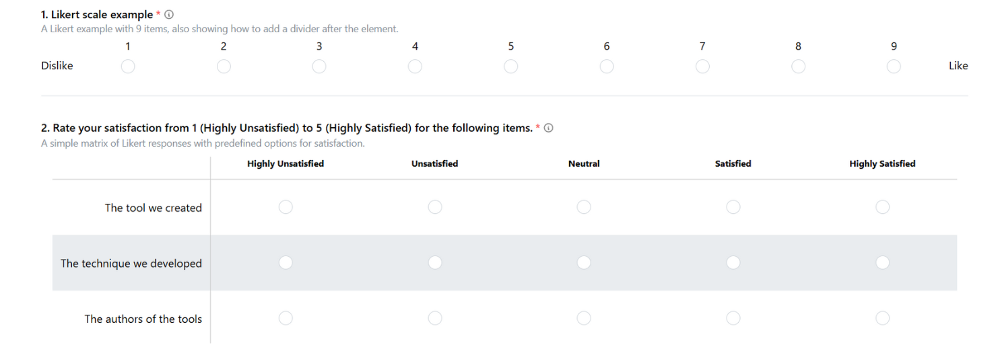

### Enumerating Questions

You can automatically number questions by setting `"enumerateQuestions": true`. This will prepend each question with its index number (starting from 1). This feature should only be used when all questions are in the same location (e.g., all questions are in the sidebar).

:::note
`textOnly` and `divider` responses do not count as numbered questions.
:::


### Radio and Checkbox Features

Radio buttons and checkboxes have some shared noteworthy features. Here is an example showing different configurations of radio buttons:

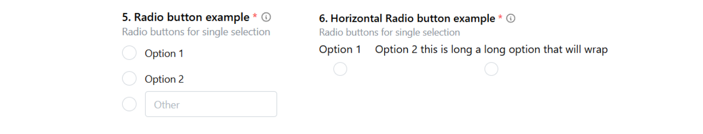

#### Vertical and Horizontal Layouts

Radios and checkboxes can be rendered either vertically (the default) or horizontally. The above figure shows radios for both. Set `"horizontal": true` to get the horizontal version.

#### "Other" Option

You can allow an "other" option for radios and checkboxes, as shown for the first radio group above. To enable that, set `"withOther": true`.

When a Participant selects **Other** in a required response, they must complete its text field before continuing. If they select **Next** without entering text, ReVISit highlights the incomplete field.

#### Clearing Selections

Participants can click a selected radio option again to deselect it. This also applies to Likert scales and individual rows in `matrix-radio` responses.

For `radio`, `likert`, `buttons`, `matrix-radio`, and `matrix-checkbox` responses with a prompt, **Clear selection** appears beside the prompt after an answer is selected. It clears that response; for a matrix, it clears every row. The control disappears when nothing is selected and is disabled when the response is read-only. No additional configuration is needed.

Clearing a required response does not make it optional: the Participant must answer it again before continuing. Ordinary checkbox options can still be unchecked individually.

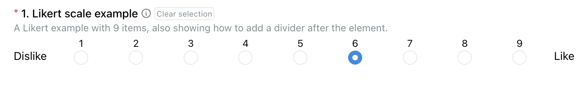

#### Selection Requirements for Checkboxes

For checkboxes, you can specify the minimum and maximum number of selections required using `minSelections` and `maxSelections`. For required responses, these properties control how many options must be selected before the Participant can proceed. Set both to the same number to require an exact count.

```json title="public/study-name/config.json"
{
  "id": "checkbox-min",
  "prompt": "Select at least 2 options",
  "type": "checkbox",
  "options": ["Option 1", "Option 2", "Option 3", "Option 4"],
  "minSelections": 2
}
```

### Matrix Features

Matrix questions let you ask several questions at the same time, using the same set of answer choices. You can either provide your own custom answers or use our built-in answer options.

Built-in options include:

- `likely5` or `likely7`: ranges from Highly Unlikely to Highly Likely
- `satisfaction5` or `satisfaction7`: ranges from Highly Unsatisfied to Highly Satisfied

Here is an example of Matrix Radio questions using `"answerOptions": "likely7"` and `"answerOptions": "satisfaction5"`.

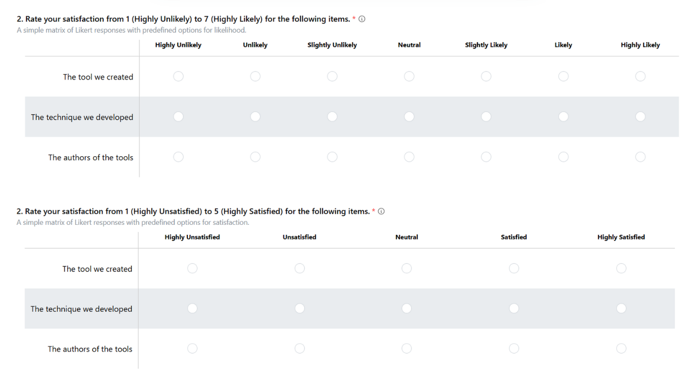

#### Selection Counts per Matrix Row

For `matrix-checkbox`, use `min` and `max` to limit the number of choices **in each row**. These are different from the `minSelections` and `maxSelections` properties used by ordinary checkboxes and dropdowns. Set `min` and `max` to the same value to require an exact count per row.

```json title="public/study-name/config.json"
{
  "id": "chart-uses",
  "type": "matrix-checkbox",
  "prompt": "Select one or two uses for each chart.",
  "questionOptions": ["Bar chart", "Line chart"],
  "answerOptions": ["Comparison", "Trends", "Distribution"],
  "min": 1,
  "max": 2
}
```

A required matrix must have an answer in every row. With `withDontKnow`, selecting **I don't know** satisfies that row without applying its selection-count limits.

#### Bipolar Matrix Row Labels

For `matrix-radio` and `matrix-checkbox`, each `questionOptions` item can be a string or an object. Use `leftLabel` and `rightLabel` on an object to place opposing terms at the left and right ends of a row without changing the value stored for that row.

```json title="public/study-name/config.json"
{
  "id": "ueq-response",
  "type": "matrix-radio",
  "answerOptions": ["1", "2", "3", "4", "5", "6", "7"],
  "questionOptions": [
    {
      "label": "Obstructive - Supportive",
      "value": "obstructive-supportive",
      "leftLabel": "Obstructive",
      "rightLabel": "Supportive"
    }
  ]
}
```

- `label` is the fallback display label.
- `value` is the optional key stored in the Participant's response and defaults to `label`.
- `leftLabel` replaces `label` at the left end of the row when supplied.
- `rightLabel` adds a label at the right end. The right-hand label column appears when at least one matrix row has a `rightLabel`; rows without one leave that cell empty.

Matrix row randomization and saved answers continue to use `value`, so adding left and right display labels does not change existing response keys.

If a Participant selects **Next** with a matrix question unanswered, they will see a validation message: "Please answer all questions in the matrix to continue."

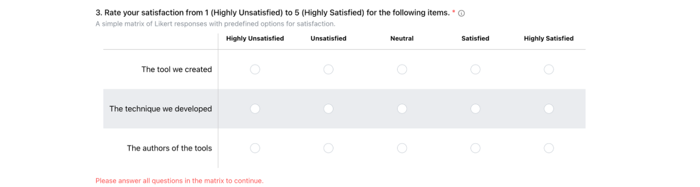

For `matrix-radio` and `matrix-checkbox`, setting `"withDontKnow": true` adds an "I don't know" column on the right side of the matrix, separated from the other answer options by a vertical line. In `matrix-checkbox`, selecting "I don't know" deselects any other answers in that row, and selecting any other option deselects "I don't know".

### Dropdown Features

A dropdown allows participants to choose one or more from a list. By default, they can only pick one item. To allow multiple selections, set `minSelections` to at least `1` or `maxSelections` to greater than `1`. Setting only `"maxSelections": 1` keeps it single-select.

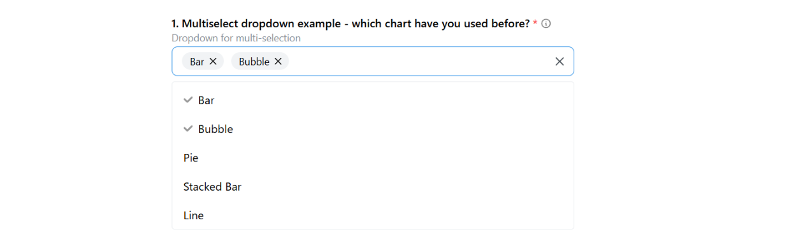

Use `minSelections` and `maxSelections` to set the accepted count for a required multiselect dropdown. Set them to the same number to require exactly that many selections.

Example with minimum selections:

```json title="public/study-name/config.json"
{
  "id": "dropdown-multi",
  "prompt": "Select at least 2 options",
  "type": "dropdown",
  "options": ["Option 1", "Option 2", "Option 3", "Option 4"],
  "minSelections": 2
}
```

Example with both minimum and maximum:

```json title="public/study-name/config.json"
{
  "id": "dropdown-range",
  "prompt": "Select between 2 and 3 options",
  "type": "dropdown",
  "options": ["Option 1", "Option 2", "Option 3", "Option 4"],
  "minSelections": 2,
  "maxSelections": 3
}
```

#### Country Dropdowns

Set `"options": "countries"` to use a searchable list of English country names with flag emoji. Answers store uppercase ISO alpha-2 codes, such as `"US"`, rather than country names or flags. Use these codes in `default`, `requiredValue`, and `visibleIf` comparisons.

```json title="public/study-name/config.json"
{
  "id": "country",
  "type": "dropdown",
  "prompt": "Which country do you live in?",
  "options": "countries",
  "placeholder": "Select a country"
}
```

For multiple countries, add selection-count limits as described above; the saved answer is then an array of country codes.

### Likert Features

A Likert response allows participants to rate something on a scale. You can customize the scale in several ways -- you can set where the scale starts, how large the steps between values are, the label locations, and how many options it has.

For example, here is a Likert example with `"start": 1`, `"spacing": 2`, and `"numItems": 10`.


You can control the label location in Likert responses to better fit your layout. The `labelLocation` property supports multiple options: `above`, `inline` (default), and `below`. The `above` and `below` options are useful when the width of the section containing the Likert question is limited and the `inline` layout does not work well.

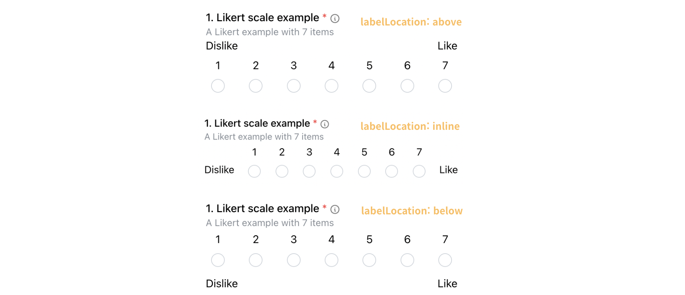

### Numerical Response Features

Numerical responses support inclusive `min` and `max` bounds. For a required response, a value outside the range prevents the Participant from continuing when they select **Next**.

```json title="public/study-name/config.json"
{
  "id": "q-numerical",
  "prompt": "Numerical example",
  "location": "aboveStimulus",
  "type": "numerical",
  "placeholder": "Enter your age, range from 0 - 120",
  "max": 120,
  "min": 0
}
```

Use `strictMin` or `strictMax` for exclusive bounds. For example, `"strictMin": 0` requires a value greater than zero, while `"min": 0` also accepts zero. `"strictMax": 100` rejects 100 itself. All supplied bounds must be satisfied; either end of a range can be omitted.

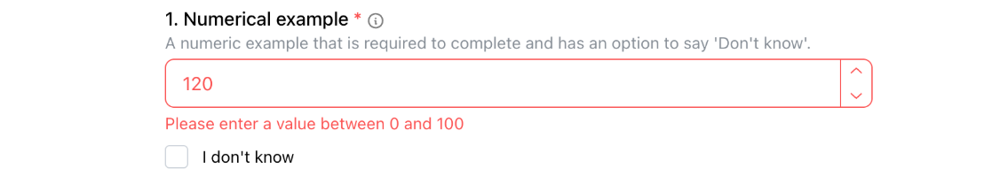

Separately, you can define a range of correct answers using the `acceptableLow` and `acceptableHigh` properties in the `Answer` interface. These belong to the component's `correctAnswer` array and control correctness checks; they do not replace input bounds on the response. This is particularly useful for numerical answers where you want to accept values within a certain range rather than requiring an exact match.

```json title="public/study-name/config.json"
{
  "correctAnswer": [{
    "id": "q-numerical",
    "answer": 5,
    "acceptableLow": 4,
    "acceptableHigh": 6
  }]
}
```

For example, if the correct answer is 5, and you set `acceptableLow` to 4 and `acceptableHigh` to 6, then any answer between 4 and 6 (inclusive) will be considered correct. This is useful for questions where there might be slight variations in correct answers, or where you want to account for rounding or measurement precision.

### Slider Features

A slider response lets participants pick a value by moving a handle on a line. You can change how the slider works by setting where it starts, how big each step is, and how far apart the tick marks are.
Here is a slider example with `"step": 10` and `"spacing": 10`.


You can also hide the label above the handle by using `snap`, and choose whether to show the bar with `withBar`.
The example below shows a slider with `"snap": true` and `"withBar": false`.


### Ranking Widget Features

A ranking widget allows participants to order or group items rather than simply selecting them. They are useful when you want to capture relative preferences, priorities, or categories of interest.

#### Item and Pair Counts

Use `min` and `max` to set the accepted count for a required ranking response:

- `ranking-sublist`: Counts items placed in the ranked list.
- `ranking-categorical`: Counts items in **each** of the HIGH, MEDIUM, and LOW categories, including empty categories.
- `ranking-pairwise`: Counts complete pairs, rather than individual items.

Set `min` and `max` to the same number for an exact count. This response asks the Participant to rank exactly two items:

```json title="public/study-name/config.json"
{
  "id": "top-charts",
  "type": "ranking-sublist",
  "prompt": "Rank your two preferred charts, best first.",
  "options": ["Bar", "Line", "Scatterplot", "Area"],
  "min": 2,
  "max": 2
}
```

For `ranking-categorical`, `numItems` requires an exact **total** across all categories. Use `categorizeAll: true` to require every configured item to be categorized. These requirements apply together with any per-category `min` and `max`; choose limits that allow all requirements to be met. For example, a minimum of one item per category requires at least three items in total.

For `ranking-sublist`, `numItems` is a fallback maximum when `max` is absent; it does not require an exact count. Prefer explicit `min` and `max` in new configurations. For `ranking-pairwise`, use `min` and `max` instead of `numItems`.

#### Pairwise ranking validation

In a `ranking-pairwise` response, a complete pair has exactly one item in **HIGH** and one different item in **LOW**. A required pairwise ranking must contain at least one complete pair before the Participant can continue. If the Participant creates additional pairs, every pair must be complete or removed before continuing.

ReVISit prevents the following invalid arrangements and displays an error explaining what to correct:

- placing more than one item in either side of a pair;
- placing the same item in both **HIGH** and **LOW**;
- creating the same pair more than once; or
- leaving a pair unfinished.

For all three ranking types, the widget becomes read-only after the response is finalized: items can no longer be dragged, and any applicable controls for adding or removing pairs are disabled.

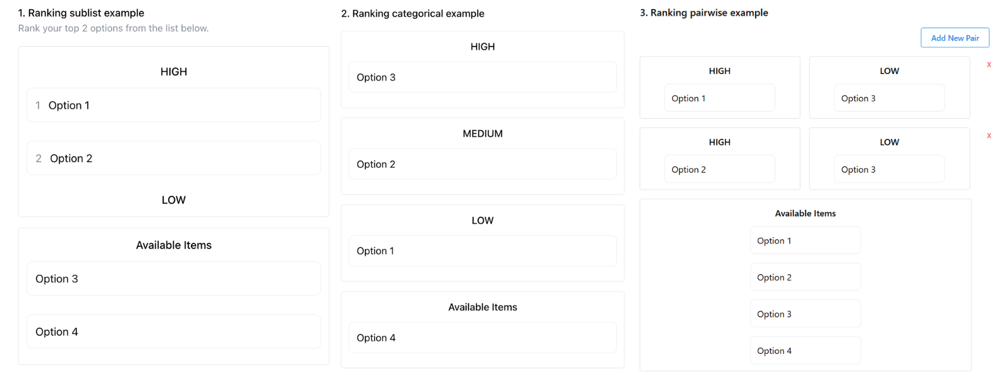

## Randomization of form elements

Randomizing the order of answers or questions can help reduce bias and improve the quality of your study results. ReVISit allows you to shuffle options within a question, or even the order of entire questions on a page.

A die icon is shown in the sidebar to indicate that at least one item on this page has a randomized order.

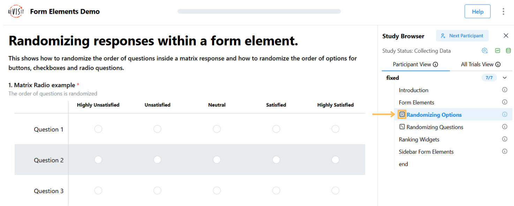

Each participant will see their own consistent order during the study, and the same order is recorded and shown in the replay, so you can always see exactly what they saw.

### Randomizing Matrix Checkbox, Matrix Radio

For matrix questions (e.g., matrix radio or matrix checkbox), you can randomize the questions. Set `"questionOrder": "random"` to randomize questions.

Here is an example to show how to set up questions in random order:

```json title="public/study-name/config.json"
"response": [
  {
    "id": "5items-response",
    "prompt": "To what extent do you agree that this visual representation is...?",
    "location": "belowStimulus",
    "type": "matrix-radio",
    "answerOptions": "satisfaction5",
    "questionOrder": "random", // Set randomization here
    "questionOptions": [
        "enjoyable",
        "likable",
        "pleasing",
        "nice",
        "appealing"
    ]
  }
]
```

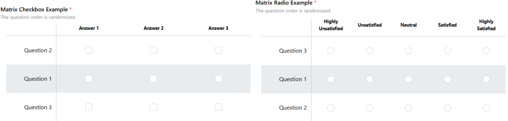

### Randomizing Checkbox, Radio, Button

To shuffle the options in a radio, checkbox, or button question, set `"optionOrder": "random"`.

Here is an example to show how to set up options in random order:

```json title="public/study-name/config.json"
"response": [
  {
    "id": "fruitPreference",
    "prompt": "What’s your favorite fruit?",
    "location": "aboveStimulus",
    "type": "radio",
    "optionOrder": "random", // Set randomization here
    "options": [
        "Apple",
        "Banana",
        "Grape"
    ]
  }
]
```

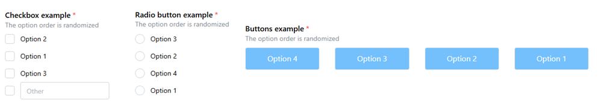

### Randomizing form elements in a single page

You can randomize the order of multiple questions that appear on the same page by setting `"responseOrder": "random"`, which will shuffle the order in which the form elements themselves appear on the page. In some cases, however, you may want certain responses to stay in a fixed position. To exclude a specific response from randomization, set `"excludeFromRandomization": true` on that response element. This setting overrides the component-level `responseOrder` configuration and ensures the specified response maintains its original position while other responses are randomized.

Here is an example to show how to set up responses in random order:

```json title="public/study-name/config.json"
"survey_randomized_form": {
  "type": "questionnaire",
  "responseOrder": "random", // Set randomization here
  "response": [
    {
      "id": "demographics",
      "prompt": "What is your gender?",
      "type": "shortText",
      "placeholder": "Enter your answer",
      "excludeFromRandomization": true // Exclude from randomization here
    },
    {
      "id": "duration",
      "prompt": "How long have you used this website?",
      "type": "shortText",
      "placeholder": "Enter your answer"
    },
    {
      "id": "favoriteFeature",
      "prompt": "What's your favorite feature?",
      "type": "shortText",
      "placeholder": "Enter your answer"
    },
    {
      "id": "recommend",
      "prompt": "Would you recommend our app?",
      "type": "dropdown",
      "options": [
        "Yes",
        "No"
      ]
    }
  ]
}
```
If the form is randomized, a die icon will appear in the sidebar to indicate that the response order is random.

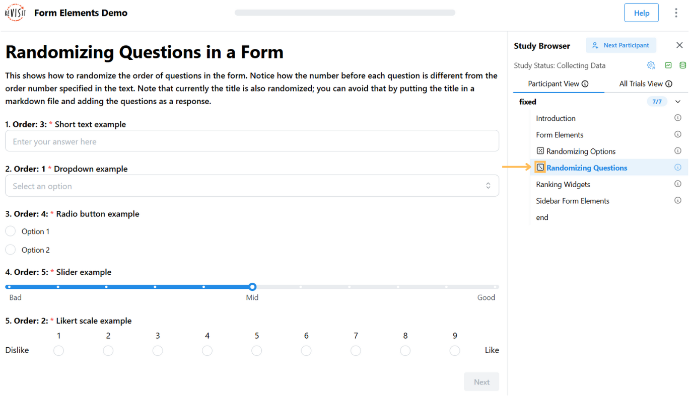

## Sidebar Configuration

The sidebar is a left panel that can be used to display form elements alongside your stimulus. This is particularly useful when you want participants to see both the stimulus and the questions simultaneously.

### Enabling the Sidebar

To use the sidebar, you must set `"withSidebar": true` in your component or globally in the `uiConfig`. The sidebar is required if any of your responses have `"location": "sidebar"`.

```json title="public/study-name/config.json"
"components": {
  "survey": {
    "type": "questionnaire",
    "withSidebar": true,
    "response": [
      {
        "id": "q-sidebar",
        "prompt": "Rate this visualization",
        "location": "sidebar",
        "type": "likert",
        "numItems": 5
      }
    ]
  }
}
```

### Sidebar Width

You can customize the width of the sidebar by setting `"sidebarWidth"` (in pixels). The default width is 300 pixels. This can be set globally in `uiConfig` or overridden on individual components.

```json title="public/study-name/config.json"
"components": {
  "survey": {
    "type": "questionnaire",
    "withSidebar": true,
    "sidebarWidth": 400,
    "response": [
      {
        "id": "q-sidebar",
        "prompt": "Rate this visualization",
        "location": "sidebar",
        "type": "likert",
        "numItems": 5
      }
    ]
  }
}
```

For more details on sidebar configuration, see the [`UIConfig`](../../typedoc/interfaces/UIConfig/) and [`BaseIndividualComponent`](../../typedoc/interfaces/BaseIndividualComponent/) documentation.

See [Applying Styles](./applying-style.md#default-widths-and-form-styling) for default response widths and form styling options.

import StructuredLinks from '@site/src/components/StructuredLinks/StructuredLinks.tsx';

<StructuredLinks
  demoLinks={[
    {name: "Form Elements Demo", url: "https://revisit.dev/study/demo-form-elements"}
  ]}
  codeLinks={[
    {name: "Form Elements Code", url: "https://github.com/revisit-studies/study/blob/main/public/demo-form-elements/"}
  ]}
  referenceLinks={[
    {name: "Answer", url: "../../typedoc/interfaces/Answer"},
    {name: "BaseResponse", url: "../../typedoc/interfaces/BaseResponse"},
    {name: "ButtonsResponse", url: "../../typedoc/interfaces/ButtonsResponse"},
    {name: "CheckboxResponse", url: "../../typedoc/interfaces/CheckboxResponse"},
    {name: "DividerResponse", url: "../../typedoc/interfaces/DividerResponse"},
    {name: "DropdownResponse", url: "../../typedoc/interfaces/DropdownResponse"},
    {name: "LikertResponse", url: "../../typedoc/interfaces/LikertResponse"},
    {name: "LongTextResponse", url: "../../typedoc/interfaces/LongTextResponse"},
    {name: "MatrixResponse", url: "../../typedoc/interfaces/MatrixResponse"},
    {name: "NumericalResponse", url: "../../typedoc/interfaces/NumericalResponse"},
    {name: "ReactiveResponse", url: "../../typedoc/interfaces/ReactiveResponse"},
    {name: "RadioResponse", url: "../../typedoc/interfaces/RadioResponse"},
    {name: "RankingResponse", url: "../../typedoc/interfaces/RankingResponse"},
    {name: "ShortTextResponse", url: "../../typedoc/interfaces/ShortTextResponse"},
    {name: "SliderResponse", url: "../../typedoc/interfaces/SliderResponse"},
  ]}
/>
