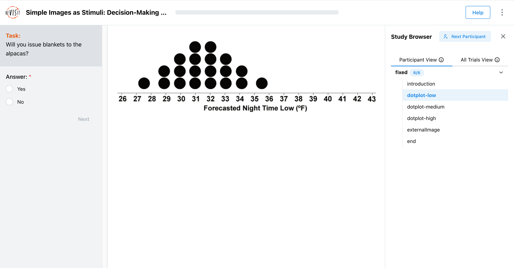
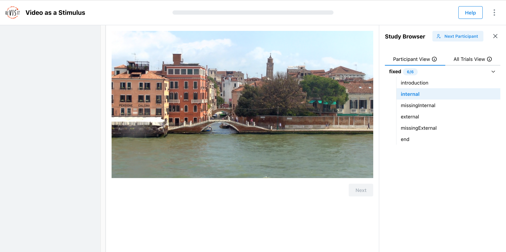
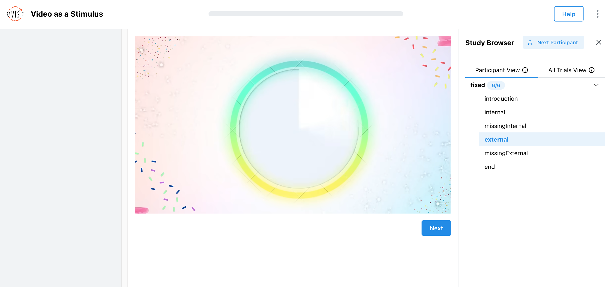

# Designing Image/Video Stimuli

Image and video stimuli are essential for most studies. They can be used to present visual information, such as charts, images, or videos, to participants. This tutorial provides an overview of how to use image and video stimuli in your study.

## Image Stimuli

Image stimuli are components of type `image`. Here is a simple example with an image element:

```json title="public/demo-image/config.json"
"components": {
  "dotplot-low": {
    "type": "image",
    "path": "demo-image/assets/uncertainty-1.png",
    "instruction": "Will you issue blankets to the alpacas?",
    "style": {
      "width": "800px"
    },
    "nextButtonLocation": "sidebar",
    "response": [
      {
        "id": "demo-image/assets-response",
        "prompt": "Answer:",
        "location": "sidebar",
        "type": "radio",
        "options": [
          "Yes",
          "No"
        ]
      }
    ]
  }
}
```

This renders like that:



In this example, the image is rendered in the main window with a response in the sidebar. The image is given an optional parameter [`style`](./applying-style.md) to specify the width of the image. This object supports arbitrary CSS properties.

## Video Stimuli

### Internal Videos

Video stimuli are components of type `video`. Here is a simple example with a video element:

```json title="public/demo-video/config.json"
"components": {
  "internal": {
    "type": "video",
    "path": "demo-video/assets/venice.mp4",
    "forceCompletion": true,
    "response": []
  },
}
```

This renders as so:



In this example, the video is rendered in the main window. The video is given an optional parameter `forceCompletion` to specify whether the video must be watched in full before the Participant can proceed. This is useful for ensuring that Participants watch the entire video before answering questions.

When `forceCompletion` is `true`, a Participant who selects **Next** before playback finishes stays on the component and sees: “Please finish the video to continue.”


#### Troubleshoot a missing internal video

If an internal video request returns an error in a production deployment, ReVISit reports that the stimulus could not be loaded instead of leaving an empty video that prevents the Participant from continuing. Check that:

- the `path` is relative to the app's `public` directory;
- the file exists at that path and was included in the deployment; and
- the capitalization of every folder and filename matches the Study Config. Production hosts commonly use case-sensitive paths even when a local development machine does not.

After correcting the path or deployment, rebuild and redeploy the study before testing it again.

### External Videos

You can also embed external videos, such as YouTube or Vimeo videos in your study, using the same syntax. Here is an example with a YouTube video element:

```json title="public/demo-video/config.json"
"components": {
  "external": {
    "type": "video",
    "path": "https://www.youtube.com/watch?v=icPHcK_cCF4",
    "forceCompletion": false,
    "withTimeline": true,
    "response": []
  },
}
```

This renders as so:



In this example, the video is rendered in the main window. The video is given an optional parameter `forceCompletion` to specify whether the video must be watched in full before the participant can proceed. In this case, the video does not need to be watched in full, so the `forceCompletion` parameter is set to `false`. The `withTimeline` parameter adds a timeline to the video, allowing participants to skip/scrub to specific parts of the video.

:::note Vimeo can appear blank during local development
Vimeo may appear blank in local development because of a known [plyr-react 6.0.0 Strict Mode issue](https://github.com/chintan9/plyr-react/issues/1253). Production builds are not affected by the extra development-only lifecycle cycle, so test Vimeo with a production build before treating it as a Study Config error. Until the upstream issue is fixed, use an internal video or another supported provider when local testing is required.
:::

import StructuredLinks from '@site/src/components/StructuredLinks/StructuredLinks.tsx';

<StructuredLinks
  demoLinks={[
    {name: "Image Demo", url: "https://revisit.dev/study/demo-image/"},
    {name: "Video Demo", url: "https://revisit.dev/study/demo-video/"}
  ]}
  codeLinks={[
    {name: "Image Code", url: "https://github.com/revisit-studies/study/tree/main/public/demo-image"},
    {name: "Video Code", url: "https://github.com/revisit-studies/study/tree/main/public/demo-video"}
  ]}
  referenceLinks={[
    {name: "ImageComponent", url: "../../typedoc/interfaces/ImageComponent/"},
    {name: "VideoComponent", url: "../../typedoc/interfaces/VideoComponent/"}
  ]}
/>
