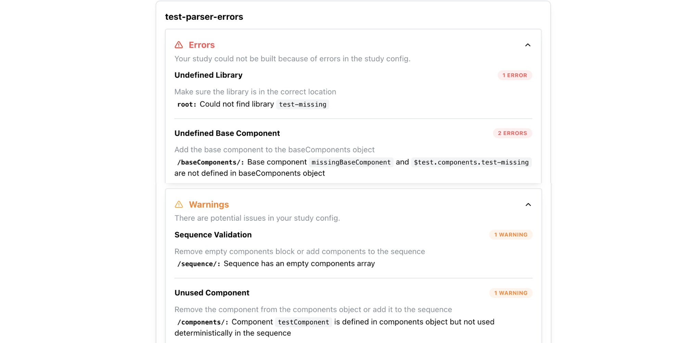

# Parser Errors and Warnings

When ReVISit parses your Study Config, it checks for issues that could prevent the study from running correctly. Errors must be fixed before the study can run. Warnings identify potential problems but do not, by themselves, prevent the study from running. Errors are expanded and warnings are collapsed by default.



The tables below cover common issues. Actual messages may include the names of your components or other configured values.

## Errors

| Category | Message | Action |
|---|---|---|
| Invalid Config | There was an issue validating your config file | Fix the errors in your file or make sure the global config references the right file path |
| Invalid Config | Missing required properties, unsupported values, or incorrect value types | Check the reported configuration path and update the property to match the Study Config schema |
| Invalid Library Config | Library config is not valid | Fix the errors in the library config |
| Undefined Library | Library not found in imported libraries | Check the library name and make sure the library is imported correctly |
| Undefined Library | Could not find library | Make sure the library is in the correct location |
| Undefined Base Component | Base component is not defined in baseComponents object | Add the base component to the baseComponents object |
| Undefined Base Component | Base component is not defined in baseComponents object in library | Add the base component to the baseComponents object |
| Undefined Component | Component is not defined in components object | Add the component to the components object |
| Undefined Component | Unresolved path | Make sure the React component exists under `src/public/` and that its `path` is relative to `src/public/`, not `public/` |
| Sequence Validation | Component is a base component and cannot be used in the sequence | Remove the base component from the sequence |
| Sequence Validation | Sequence not found in library| Check the sequence name |
| Sequence Validation | Conditional URL parameter assignment cannot be combined with random or latinSquare sequence ordering | Use fixed ordering when using conditional blocks, or remove conditional blocks |
| Skip Validation | Skip target does not occur after the skip block it is used in | Add the target to the sequence after the skip block |

### Unresolved React component paths

ReVISit checks React component paths that can be determined before the study runs, including paths defined in `baseComponents`, inherited paths, and component-level path overrides. For example, the following component definition belongs inside `components` and expects the file at `src/public/my-study/assets/Chart.tsx`:

```json title="public/my-study/config.json"
{
  "type": "react-component",
  "path": "my-study/assets/Chart.tsx",
  "response": []
}
```

If the file cannot be found, the parser reports an **Unresolved path** error before the study starts. React component files belong under `src/public/`; most non-React assets, such as images and videos, belong under `public/`.

Paths containing runtime placeholders, such as `my-study/assets/{{chart}}.tsx`, are skipped by this file-existence check. If you use [templating](./templating.md) to select a React file, verify that each resulting path points to an existing file. Passing parser validation does not confirm that every dynamically selected file exists.


## Warnings

| Category | Message | Action |
|---|---|---|
| Sequence Validation | Sequence has an empty components array | Remove empty components block |
| Unused Component | Component is defined in components object but not used deterministically in the sequence | Remove the component from the components object or add it to the sequence |
| Disabled Sidebar | Component uses sidebar locations but sidebar is disabled | Enable the sidebar or move the location to belowStimulus or aboveStimulus |
| Empty Sidebar | The sidebar is enabled but no component puts content in it | Set `uiConfig.withSidebar` to `false`, or add sidebar instructions, responses, or navigation buttons. See [Sidebar Configuration](./forms.md#sidebar-configuration) |
| Default Contact Email | The contact email is set to the default value `contact@revisit.dev`. Please update it to your own email address | Update the contactEmail field in uiConfig to your own email address |

### Default contact email

The default contact email warning is suppressed on recognized local development hosts, such as `localhost`. Even if no warning appears during local testing, set `uiConfig.contactEmail` to your study team's address before collecting data. See [Set a Contact Email for Error Pages](#set-a-contact-email-for-error-pages).

## After the Config Loads

Parser validation checks your configuration, but it does not verify that every stimulus asset can load successfully when the study runs.

If a stimulus shows **404** or **Next** stays disabled, see [When a Stimulus Cannot Load](./answers-trainings.md#when-a-stimulus-cannot-load).

### A Study URL Shows 404

A **404** page can mean that the study ID is unknown or the link points to an invalid step. This includes malformed or out-of-range steps, reviewer links to nonexistent components, and invalid dynamic-block iteration links. Unknown studies or tabs in the analysis interface also show **404**.

Check the study ID and configuration `path` in `public/global.json`; see [Registering the Study](../getting-started/your-first-study.md#registering-the-study). Open the study's entry URL and use its navigation controls instead of editing individual step links. For reviewer links, check that the component still exists in `components`. For analysis links, select the study and an available tab from the interface.

If the study ID is recognized but its configuration file cannot be fetched or validated, ReVISit reports a configuration loading or validation error. Check the file path and the reported parser errors in that case.

### Set a Contact Email for Error Pages

Set `uiConfig.contactEmail` to an address monitored by your study team. ReVISit displays it as a clickable email link on invalid-step pages and missing-resource pages such as missing images, Markdown, videos, help content, and custom response modules.

This partial Study Config shows the field to update inside your existing `uiConfig`. Keep the other settings and replace `contact@revisit.dev` with your team's address.

```json title="public/study-name/config.json"
{
  "uiConfig": {
    "contactEmail": "contact@revisit.dev"
  }
}
```

An unknown study ID has no Study Config from which to read an email address, so its **404** page shows general contact guidance without an email link. Empty or unavailable email values also omit the link. Participants should check the study link they received and contact the study team using the displayed email or the contact details in their invitation.

Before collecting data, temporarily reference a missing image in a local test copy of your study. Confirm that its **404** message displays the intended email link, then restore the correct image path.
