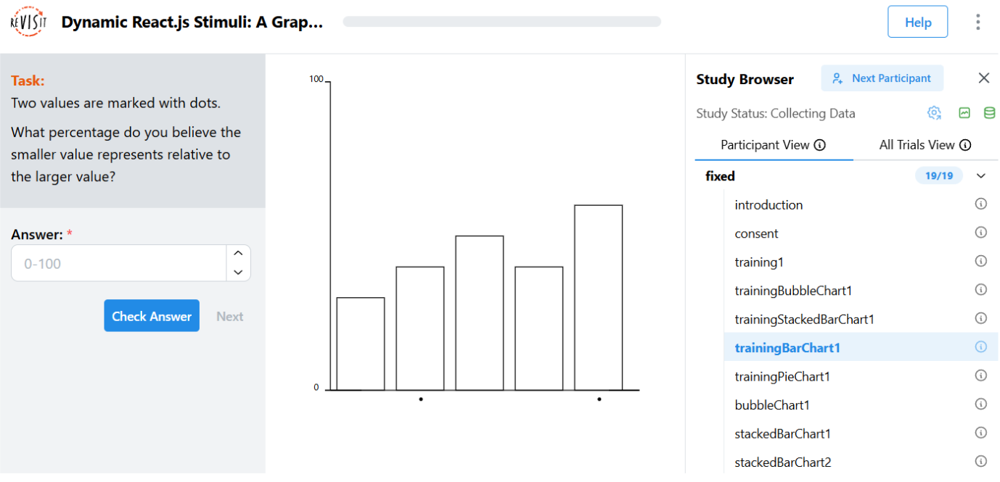
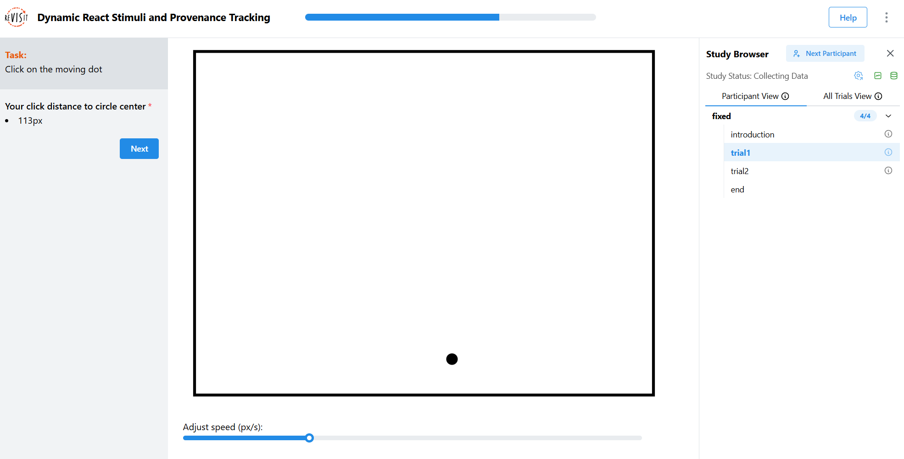

# Designing a React Stimulus

React is a popular JavaScript library for building user interfaces, primarily for single-page applications. You can find more details on the official [React documentation](https://react.dev/).

Here we will introduce how to create a React stimulus for reVISit studies through two examples.

**Example 1** is a stimulus from the [graphical perception experiment](https://doi.org/10.1080/01621459.1984.10478080). This example will demonstrate how to pass data from the config file to the stimulus.

**Example 2** is a stimulus for the click accuracy test. This example will demonstrate how to retrieve user answers from the React component.

## Example 1: Graphical Perception Experiment

The React component stimulus should be put into the `src/public/your-exp-name/assets` folder. As stated in other tutorials, we suggest always making an `assets` directory inside your experiment directory for the best organization possible. In our example, we name the experiment "example-cleveland," so we put this code into `src/public/example-cleveland/assets/BarChart.tsx`. Please replace it with another experiment name.

We have a few reusable components and hooks available in the `src/public/example-cleveland/assets/hooks` and `src/public/example-cleveland/assets/chartcomponents` folders, which are required in this demo. These reusable components and hooks help creating charts using D3.js in React. You may copy them to your own experiment folder.

Please note, there is a **"parameters"** prop in the BarChart component. This is used to pass data from the config file to the React component.
In this example, we pass two data arrays to the BarChart component. One is the data array contains 5 objects, each object has a name and a value. The other is the selectedIndices array, which contains the indices of the data array that we want to highlight with dots.

```ts
import * as d3 from 'd3';
import { useChartDimensions } from './hooks/useChartDimensions';
import { Bars } from './chartcomponents/Bars';
import { NumericAxisV } from './chartcomponents/NumericAxisV';
import { OrdinalAxisHWithDotMarks } from './chartcomponents/OrdinalAxisHWithDotMarks';

// Chart dimensions
const chartSettings = {
  marginBottom: 40,
  marginLeft: 40,
  marginTop: 15,
  marginRight: 15,
  width: 400,
  height: 400,
};

// This React component renders a bar chart with 5 bars and 2 of them highlighted by dots.
// The data value comes from the config file and pass to this component by parameters.
function BarChart({ parameters }: { parameters: any }) {
  const tickLength = 6;
  const [ref, dms] = useChartDimensions(chartSettings);

    // Define axis scales
    // Data comes from parameters is used here
  const xScale = d3
    .scaleBand()
    .domain(parameters.data.map((d: { name: any }) => d.name))
    .range([0, dms.boundedWidth])
    .padding(0.2);

  const yScale = d3
    .scaleLinear()
    .domain([100, 0])
    .range([0, dms.boundedHeight]);

  // Define ticks
  const yAxisTickFilter = (ticks: any[]) => ticks.filter((t, i) => i === 0 || i === ticks.length - 1);

  // selectedIndices is used here to draw dots on the x-axis
  const xAxisTickFilter = (ticks: any[]) => ticks.filter((t, i) => parameters.selectedIndices.includes(i));

  return (
    <div className="Chart__wrapper" ref={ref} style={{ height: 400 }}>
      <svg width={dms.width} height={dms.height}>
        <g
          transform={`translate(${[dms.marginLeft, dms.marginTop].join(',')})`}
        >
          <g
            transform={`translate(${[tickLength, dms.boundedHeight].join(
              ',',
            )})`}
          >
            <OrdinalAxisHWithDotMarks
              domain={xScale.domain()}
              range={xScale.range()}
              withTick
              tickLen={0}
              tickFilter={xAxisTickFilter}
            />
          </g>
          <g transform={`translate(${[0, 0].join(',')})`}>
            <NumericAxisV
              domain={yScale.domain()}
              range={yScale.range()}
              withTick
              tickLen={tickLength}
              tickFilter={yAxisTickFilter}
            />
          </g>
          <g transform={`translate(${[0, 0].join(',')})`}>
            <Bars
              data={parameters.data}
              xScale={xScale}
              yScale={yScale}
              height={dms.boundedHeight}
            />
          </g>
        </g>
      </svg>
    </div>
  );
}

export default BarChart;
```

In the config file, we will set parameters for the BarChart component.
The parameters contain data and selectedIndices. Both are decoded in the above code and used to create the stimulus.

The parameters are an object; you can change the format to suit your needs.

```json
"barChart": {
  "meta": {
    "difficulty": 5,
    "chart": "Bar"
  },
  "description": "A chart with correct answer of 0.66",
  "instruction": "Two values are marked with dots. \n\nWhat percentage do you believe the smaller value represents relative to the larger value?",
  "type": "react-component",
  "path": "example-cleveland/assets/BarChart.tsx",
  "parameters": {
    "data": [
      {
        "name": "A",
        "value": "30"
      },
      {
        "name": "B",
        "value": "40"
      },
      {
        "name": "C",
        "value": "50"
      },
      {
        "name": "D",
        "value": "40"
      },
      {
        "name": "E",
        "value": "60"
      }
    ],
    "selectedIndices": [
      1,
      4
    ]
  }
}
```



## Example 2: Click Accuracy Experiment
The click accuracy experiment requires participants to click on a moving dot on the screen. The dot will move inside a bounded box. The faster the dot moves, the more difficult it is for the participants to click on it.

In this example, the response from the user is no longer the traditional response type that can be reused from reVISit. Instead, you will use the `reactive` response type, which will receive the user's click data and send it to reVISit.

In this example, the React component will take `parameters` and `setAnswer` as props. The parameters work just like in Example 1; it will pass data from the config file to the React component.
The `setAnswer` function is a built-in function that is used to pass the user's response to the reVISit framework.

We will use 'demo-click-accuracy-test' as experiment name in this example. Start by creating the `demo-click-accuracy-test` directory in the `src/public` directory. Make sure to also add the `assets` directory within the `demo-click-accuracy-test` directory for the best organization.

Now, create a new file called `ClickAccuracyTest.tsx` with the following contents:

```ts
import * as d3 from 'd3';
import {
  useCallback, useEffect, useState,
} from 'react';
import { Box, Slider } from '@mantine/core';
import { useChartDimensions } from '../../example-cleveland/assets/hooks/useChartDimensions';
import { StimulusParams } from '../../../store/types';

const chartSettings = {
  marginBottom: 40,
  marginLeft: 40,
  marginTop: 15,
  marginRight: 15,
  height: 650,
  width: 850,
};

interface ClickAccuracyTest {
  distance: number;
  speed: number;
  clickX: number;
  clickY: number;
}

// eslint-disable-next-line @typescript-eslint/no-explicit-any
function ClickAccuracyTest({ parameters, setAnswer }: StimulusParams<any>) {
  // useChartDimensions is a custom hook to create a chart with D3.js in React, you can find it in src/public/example-cleveland/assets/hooks/useChartDimensions.ts
  const [ref, dms] = useChartDimensions(chartSettings);
  const [x, setX] = useState(100);
  const [y, setY] = useState(100);
  const [speed, setSpeed] = useState(300);
  const { taskid } = parameters;

  const clickCallback = useCallback((e: React.MouseEvent) => {
    const circle = d3.select('#movingCircle');
    const svg = d3.select('#clickAccuracySvg');
    const pointer = d3.pointer(e, svg.node());
    const circlePos = [+circle.attr('cx'), +circle.attr('cy')];
    const distance = `${Math.round(Math.sqrt((pointer[0] - circlePos[0]) ** 2 + (pointer[1] - circlePos[1]) ** 2))}px`;
    // This will record the distance between the click location and the center of the dot, passing answer to reVISit.
    setAnswer({
      status: true,
      answers: {
        [taskid]: distance,
      },
    });
  }, [setAnswer, taskid]);

  // Making the moving dot
  useEffect(() => {
    const nxtX = Math.random() * 800;
    const nxtY = Math.random() * 600;
    const distance = Math.sqrt((nxtX - x) ** 2 + (nxtY - y) ** 2);
    const time = (distance / speed) * 1000;
    const svgElement = d3.select(ref.current);
    svgElement.select('circle')
      .transition()
      .duration(time)
      .ease(d3.easeLinear)
      .attr('cx', nxtX)
      .attr('cy', nxtY)
      .on('end', () => {
        setX(nxtX);
        setY(nxtY);
      });
  }, [ref, speed, x, y]);

  return (
    <>
      <div className="Chart__wrapper" ref={ref} onClick={clickCallback} style={{ height: '650px' }}>
        <svg id="clickAccuracySvg" width={dms.width} height={dms.height}>
          <g
            transform={`translate(${[dms.marginLeft / 2, dms.marginTop / 2].join(
              ',',
            )})`}
          >
            <rect width="800" height="600" stroke="black" strokeWidth="5" fill="none" />
            <circle id="movingCircle" cx="100" cy="100" r="10" />

          </g>
        </svg>
      </div>
      <Box>
        Adjust speed (px/s):
        <Slider w={800} min={10} max={1000} value={speed} onChange={setSpeed} />

      </Box>
    </>

  );
}

export default ClickAccuracyTest;
```

In the config file, we pass the `taskid` and speed as parameters. Notice the response type for the trial is `'reactive'`.

```json
"trial": {
  "description": "try to click on the center of the moving dot",
  "instruction": "Click on the moving dot",
  "type": "react-component",
  "path": "demo-click-accuracy-test/assets/ClickAccuracyTest.tsx",
  "parameters": {
    "speed": 100,
    "taskid": "accuracy"
  },
  "nextButtonLocation": "sidebar",
  "response": [
    {
      "id": "accuracy",
      "prompt": "Your click distance to circle center",
      "required": true,
      "location": "sidebar",
      "type": "reactive"
    }
  ]
}
```

At this point, the click accuracy test will be running and be able to collect participant's data.



<!-- As an additional We have three assignments for you.
1) If you notice, we did not use the speed parameter in this React component, can you modify the code to use the speed parameter as the initial speed?
2) The distance we record is between the click location and the center of the dot. Can you modify the code to record the distance between click location and the edge of the dot?
3) We can make this stimulus more challenge, adding multiple moving dots and ask the participants to click on the highlighted one. -->

<!-- Importing links -->
import StructuredLinks from '@site/src/components/StructuredLinks/StructuredLinks.tsx';

<StructuredLinks
  demoLinks={[
    {name: "Graphical Perception Demo", url: "https://revisit.dev/study/example-cleveland/"},
    {name: "Click Accuracy Demo", url: "https://revisit.dev/study/demo-click-accuracy-test/"}
  ]}
  codeLinks={[
    {name: "Graphical Perception Code", url: "https://github.com/revisit-studies/study/tree/main/public/example-cleveland"},
    {name: "Click Accuracy Code", url: "https://github.com/revisit-studies/study/tree/main/public/demo-click-accuracy-test"}
  ]}
  referenceLinks={[
    {name: "React", url: "https://react.dev/"},
    {name: "ReactComponent", url: "../../typedoc/interfaces/ReactComponent"},
    {name: "ReactiveResponse", url: "../../typedoc/interfaces/ReactiveResponse"}
  ]}
/>