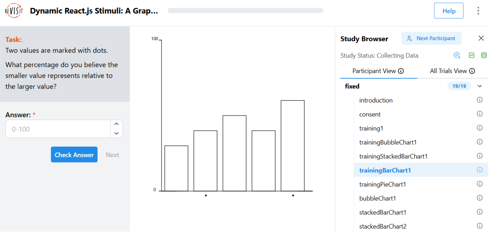

# Designing a React Stimulus

React is a popular JavaScript library for building user interfaces, primarily for single-page applications. You can find more details on the official [React documentation](https://react.dev/).

Here we will introduce how to create a React stimulus for reVISit studies through two examples.

**Example 1** is a stimulus from the [graphical perception experiment](https://doi.org/10.1080/01621459.1984.10478080). This example will demonstrate how to pass data from the config file to the stimulus.

**Example 2** is a Stroop color experiment. This example will demonstrate how to retrieve user answers from the React component using the `reactive` response type.

## Example 1: Graphical Perception Experiment

The React component stimulus should be put into the `src/public/your-exp-name/assets` folder. As stated in other tutorials, we suggest always making an `assets` directory inside your experiment directory for the best organization possible. In our example, we name the experiment "example-cleveland," so we put this code into `src/public/example-cleveland/assets/BarChart.tsx`. Please replace it with another experiment name.

We have a few reusable components and hooks available in the `src/public/example-cleveland/assets/hooks` and `src/public/example-cleveland/assets/chartcomponents` folders, which are required in this demo. These reusable components and hooks help creating charts using D3.js in React. You may copy them to your own experiment folder.

Please note, there is a **"parameters"** prop in the BarChart component. This is used to pass data from the config file to the React component.
In this example, we pass two data arrays to the BarChart component. One is the data array contains 5 objects, each object has a name and a value. The other is the selectedIndices array, which contains the indices of the data array that we want to highlight with dots.

```ts
import * as d3 from 'd3';
import { useChartDimensions } from './hooks/useChartDimensions';
import { Bars } from './chartcomponents/Bars';
import { NumericAxisV } from './chartcomponents/NumericAxisV';
import { OrdinalAxisHWithDotMarks } from './chartcomponents/OrdinalAxisHWithDotMarks';

// Chart dimensions
const chartSettings = {
  marginBottom: 40,
  marginLeft: 40,
  marginTop: 15,
  marginRight: 15,
  width: 400,
  height: 400,
};

// This React component renders a bar chart with 5 bars and 2 of them highlighted by dots.
// The data value comes from the config file and pass to this component by parameters.
function BarChart({ parameters }: { parameters: any }) {
  const tickLength = 6;
  const [ref, dms] = useChartDimensions(chartSettings);

    // Define axis scales
    // Data comes from parameters is used here
  const xScale = d3
    .scaleBand()
    .domain(parameters.data.map((d: { name: any }) => d.name))
    .range([0, dms.boundedWidth])
    .padding(0.2);

  const yScale = d3
    .scaleLinear()
    .domain([100, 0])
    .range([0, dms.boundedHeight]);

  // Define ticks
  const yAxisTickFilter = (ticks: any[]) => ticks.filter((t, i) => i === 0 || i === ticks.length - 1);

  // selectedIndices is used here to draw dots on the x-axis
  const xAxisTickFilter = (ticks: any[]) => ticks.filter((t, i) => parameters.selectedIndices.includes(i));

  return (
    <div className="Chart__wrapper" ref={ref} style={{ height: 400 }}>
      <svg width={dms.width} height={dms.height}>
        <g
          transform={`translate(${[dms.marginLeft, dms.marginTop].join(',')})`}
        >
          <g
            transform={`translate(${[tickLength, dms.boundedHeight].join(
              ',',
            )})`}
          >
            <OrdinalAxisHWithDotMarks
              domain={xScale.domain()}
              range={xScale.range()}
              withTick
              tickLen={0}
              tickFilter={xAxisTickFilter}
            />
          </g>
          <g transform={`translate(${[0, 0].join(',')})`}>
            <NumericAxisV
              domain={yScale.domain()}
              range={yScale.range()}
              withTick
              tickLen={tickLength}
              tickFilter={yAxisTickFilter}
            />
          </g>
          <g transform={`translate(${[0, 0].join(',')})`}>
            <Bars
              data={parameters.data}
              xScale={xScale}
              yScale={yScale}
              height={dms.boundedHeight}
            />
          </g>
        </g>
      </svg>
    </div>
  );
}

export default BarChart;
```

In the config file, we will set parameters for the BarChart component.
The parameters contain data and selectedIndices. Both are decoded in the above code and used to create the stimulus.

The parameters are an object; you can change the format to suit your needs.

```json
"barChart": {
  "meta": {
    "difficulty": 5,
    "chart": "Bar"
  },
  "description": "A chart with correct answer of 0.66",
  "instruction": "Two values are marked with dots. \n\nWhat percentage do you believe the smaller value represents relative to the larger value?",
  "type": "react-component",
  "path": "example-cleveland/assets/BarChart.tsx",
  "response": [
    {
      "id": "barChartAnswer",
      "prompt": "Your answer (1-100):",
      "required": true,
      "location": "belowStimulus",
      "type": "numerical",
      "min": 1,
      "max": 100
    }
  ],
  "parameters": {
    "data": [
      {
        "name": "A",
        "value": "30"
      },
      {
        "name": "B",
        "value": "40"
      },
      {
        "name": "C",
        "value": "50"
      },
      {
        "name": "D",
        "value": "40"
      },
      {
        "name": "E",
        "value": "60"
      }
    ],
    "selectedIndices": [
      1,
      4
    ]
  }
}
```



## Example 2: Stroop Color Experiment (with `reactive` response)

When building experiments with React, we can allow users to interact with a component to answer questions. In this example, we will build a Stroop color test using a React component and a reactive response type.
In the Stroop color test, you are required to identify the color of the word, not what the word says. For example, for the word RED printed in blue ink, you should type 'BLUE.' The text content and text color are passed from the config file through `parameters`.

The component uses:
- `parameters` for trial-specific values (`displayText`, `textColor`, `taskid`)
- `setAnswer` to send typed responses to reVISit
- a `reactive` response in config

We will use `demo-react-trrack` as the experiment name. Create the React stimulus file in `src/public/demo-react-trrack/assets/`.

```ts
import { useState } from 'react';
import { Box, Center, Stack, Text, TextInput } from '@mantine/core';
import { StimulusParams } from '../../../store/types';

// Trial parameters from config: displayText and textColor
interface StroopTrialParams {
  displayText?: string;
  textColor?: string;
}

// Normalize input to uppercase for consistent answers
const toCapped = (value: string) => value.toUpperCase();

// eslint-disable-next-line @typescript-eslint/no-explicit-any
function StroopColorTask({ parameters, setAnswer }: StimulusParams<any>) {
  const { taskid } = parameters;
  const { displayText = '', textColor = 'black' } = parameters as StroopTrialParams;

  const [responseText, setResponseText] = useState('');

  return (
    <Stack gap="xl" style={{ maxWidth: 520, margin: '0 auto' }}>
      {/* Display the Stroop word in the configured color */}
      <Center>
        <Box>
          <Text fw={700} size="2rem" style={{ color: textColor }}>
            {displayText}
          </Text>
        </Box>
      </Center>

      {/* Text input for participant's color response */}
      <Center>
        <TextInput
          value={responseText}
          onChange={(event) => {
            const value = toCapped(event.currentTarget.value);
            setResponseText(value);
            setAnswer({
              status: value.trim().length > 0,
              answers: { [taskid]: value },
            });
          }}
        />
      </Center>
    </Stack>
  );
}

export default StroopColorTask;
```

Below is a minimal config with two Stroop trials. Each trial passes `displayText` (the word shown) and `textColor` (the color of the text) via `parameters`. The `reactive` response type receives the typed answer from the component.

```json
{
  "baseComponents": {
    "trial": {
      "description": "identify the text color in a Stroop trial",
      "instruction": "In this experiment you are required to say the color of the word, not what the word says. For example, for the word, RED, you should say \"Blue.\"",
      "type": "react-component",
      "path": "demo-react-trrack/assets/DemoReactTrrack.tsx",
      "nextButtonLocation": "sidebar",
      "response": [
        {
          "id": "stroopAnswer",
          "prompt": "Your typed Stroop color response",
          "location": "sidebar",
          "type": "reactive"
        }
      ]
    }
  },
  "components": {
    "trial-red-blue": {
      "baseComponent": "trial",
      "parameters": {
        "taskid": "stroopAnswer",
        "displayText": "RED",
        "textColor": "blue"
      }
    },
    "trial-green-pink": {
      "baseComponent": "trial",
      "parameters": {
        "taskid": "stroopAnswer",
        "displayText": "GREEN",
        "textColor": "pink"
      }
    }
  },
  "sequence": {
    "order": "fixed",
    "components": ["trial-red-blue", "trial-green-pink"]
  }
}
```

### Adding provenance tracking

To record user interactions and enable replay, you can add provenance tracking with Trrack. This involves:
- Creating a Trrack registry and actions for state changes
- Passing `provenanceGraph` in `setAnswer` so reVISit stores the provenance
- Using `provenanceState` to restore the textbox during replay

For a full walkthrough, see the [Provenance Tracking](provenance-tracking.md) tutorial.

<!-- As an additional We have three assignments for you.
1) If you notice, we did not use the speed parameter in this React component, can you modify the code to use the speed parameter as the initial speed?
2) The distance we record is between the click location and the center of the dot. Can you modify the code to record the distance between click location and the edge of the dot?
3) We can make this stimulus more challenge, adding multiple moving dots and ask the participants to click on the highlighted one. -->

<!-- Importing links -->
import StructuredLinks from '@site/src/components/StructuredLinks/StructuredLinks.tsx';

<StructuredLinks
  demoLinks={[
    {name: "Graphical Perception Demo", url: "https://revisit.dev/study/example-cleveland/"},
    {name: "React Stroop Demo", url: "https://revisit.dev/study/demo-react-trrack/"}
  ]}
  codeLinks={[
    {name: "Graphical Perception Code", url: "https://github.com/revisit-studies/study/tree/main/public/example-cleveland"},
    {name: "React Stroop Code", url: "https://github.com/revisit-studies/study/tree/main/public/demo-react-trrack"}
  ]}
  referenceLinks={[
    {name: "React", url: "https://react.dev/"},
    {name: "ReactComponent", url: "../../typedoc/interfaces/ReactComponent"},
    {name: "ReactiveResponse", url: "../../typedoc/interfaces/ReactiveResponse"},
    {name: "Provenance Tracking", url: "provenance-tracking"}
  ]}
/>
