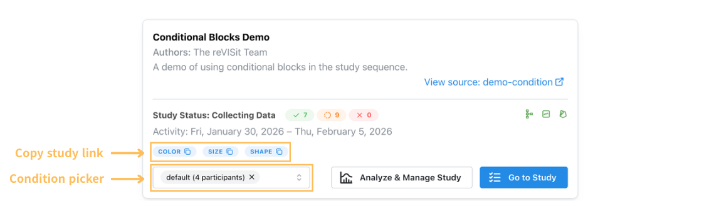

# Conditions based on URL Parameters

You can choose to assign participants to specific study conditions via URL parameters. This is useful to manually balance between subject designs and results in clean condition-level analysis.

To pass conditions, use the`condition` query parameter, for example `/path/to/study?condition=color`. When the study starts, reVISit reads the URL and only runs conditional blocks whose `id` matches one of the values. Non-conditional blocks still run as usual for every participant.

:::info
Conditions will be available as a column in your data automatically.
:::

To define conditional blocks, use `"conditional": true` on a block in `sequence`, and give that block an `id`. The `id` is the condition name used in the URL.

```json
{
  "sequence": {
    "order": "fixed",
    "components": [
      "introduction",
      {
        "id": "color",
        "conditional": true,
        "components": ["color-trial-1", "color-trial-2"],
        "order": "random"
      },
      {
        "id": "shape",
        "conditional": true,
        "components": ["shape-trial-1", "shape-trial-2"],
        "order": "fixed"
      }
    ]
  }
}
```

With this setup, `/path/to/study?condition=color` includes the `color` block and skips `shape`. 
**You can also pass multiple conditions like `/path/to/study?condition=color,shape`.** The `introduction` component is shown to all participants regardless of condition.

:::warning
We strongly recommend using conditions only at the top levels of your sequence and not nesting conditional blocks inside other conditional blocks, as this can lead to unexpected behavior.

If you'd like to combine multiple conditions, like in the following example: 

- rectangle
  - dark
  - light
- circle
  - dark
  - light

we recommend flattening the conditions into components, like this: 

- rectangle-dark
- rectangle-light
- circle-dark
- circle-light

:::


### Choosing a Condition from the Study Card

The landing page study card lets you pick one or more conditions and copy a link with those values set.



The condition picker lists the available conditions and the current participant counts. Select a condition and click Go to Study.

:::note
After the initial assignment that happens when you visit a URL with a condition, changing conditions is not possible, even in dev mode, except by starting as a new participant with the “Next Participant” button.
:::

<!-- Importing links -->
import StructuredLinks from '@site/src/components/StructuredLinks/StructuredLinks.tsx';


<StructuredLinks
  demoLinks={[
    {name: "Study Condition Demo", url: "https://revisit.dev/study/demo-condition/"}
  ]}
  codeLinks={[
    {name: "Study Condition Code", url: "https://github.com/revisit-studies/study/blob/main/public/demo-condition"}
  ]}
  referenceLinks={[
    {name: "ComponentBlock", url: "../../typedoc/interfaces/ComponentBlock/"},
    {name: "DynamicBlock", url: "../../typedoc/interfaces/DynamicBlock/"},
  ]}
/>