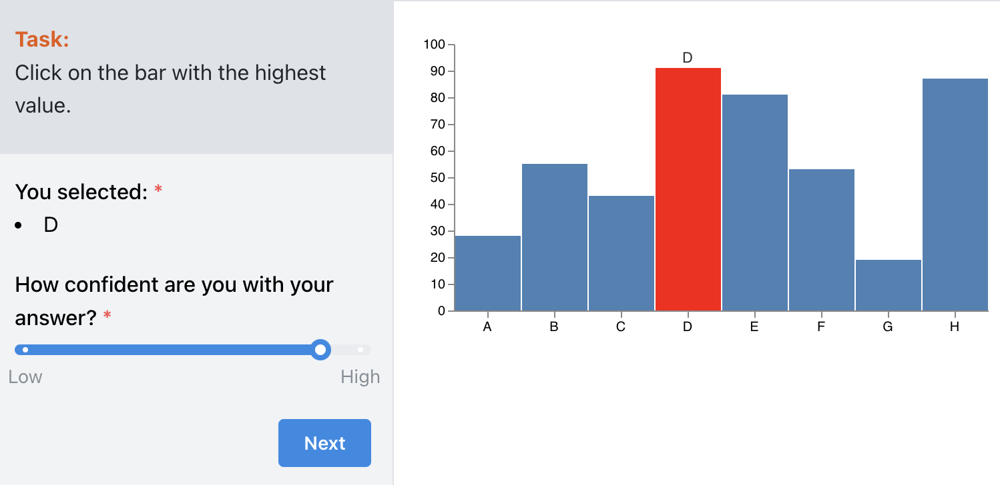

# Designing a Vega Stimulus

[Vega](https://vega.github.io/vega/) and [Vega-Lite](https://vega.github.io/vega-lite/) are popular visualization grammars for creating data visualizations.
Vega allows you to define the visual appearance and interactive behavior of a visualization in JSON format and generate web-based views using Canvas or SVG.

A key benefit of using Vega with reVISit is that **you get provenance tracking (interaction logs) and the detailed replay of every single participant's interactions for free!**

This guide demonstrates how to integrate a Vega-based component into reVISit.

You can check out the [live demo](https://revisit.dev/study/demo-vega/) and the [code for these examples](https://github.com/revisit-studies/study/tree/main/public/demo-vega).

Also Review the relevant reference for
* [Vega Components](https://revisit.dev/docs/typedoc/interfaces/VegaComponentConfig/)
* [Vega Paths](https://revisit.dev/docs/typedoc/interfaces/VegaComponentPath/)

There are two ways to add a Vega component: directly in the config, and in an external file.

### 1. Adding Vega Specs Directly to the reVISit Config

To include Vega specifications directly in the reVISit configuration, set the `type` field of your component to `vega` and add your Vega specifications within the `config` field, as shown below:

```js
"components": {
  "vegademo1": {
    ...
    "type": "vega",
    "config": {... your vega config...}
    ...
  }
}
```

### 2. Linking to Vega Specs in the reVISit Config

Including Vega specifications directly in the configuration may make your config file long and also mixes two languages. To address this, you can also manage the specifications in a separate file and link to it.

In this case, the `type` remains `vega`, but instead of using the _config_ field, you use the `path` field to specify the location of the Vega specifications file.

```js
"components": {
  "vegademo2": {
    ...
    "type": "vega",
    "path": "demo-vega/specs/vegademo2.specs.json",
    ...
  }
}
```

## User Interactions and Data Passing

One of the key reasons for using Vega for user studies is its ability to create interactive visualizations. For example, you can design stimuli that allow participants to interact with the visualization and capture their responses with little effort compared to using HTML or React stimuli. These responses can then be sent directly to reVISit for further processing.

To achieve this, you can use [Vega signals](https://vega.github.io/vega/docs/signals/).
Specifically, a signal with the reserved name `revisitAnswer` is used to pass participant responses to reVISit.
Here's an example of how to define the `revisitAnswer` signal:

```js
{
  "name": "revisitAnswer",
  "value": {},
  "on": [
    {
      "events": "rect:click",
      "update": "{responseId: 'vegaDemoResponse1', response: datum.category}"
    }
  ]
}
```

In this example:

- The `events` field specifies the user interaction to listen for (`rect:click` in this instance).
- The `update` field defines the response structure, which includes a `responseId` and the participant's selection (e.g., `datum.category`). The `responseId` should match the id in your response field described below.

:::note
Ensure that you are using Vega when adding signals. If you are using Vega-Lite, you can convert your specifications to lower-level Vega specifications to add signals.
:::

### Capturing Responses
Once the signal is defined in your Vega specifications, you can configure the response field in the reVISit configuration. By setting the response type to `reactive`, the signal emitted by the Vega component is captured and sent to the reVISit platform.

```js
{
  ...
  "response": [
    {
      "id": "vegaDemoResponse1",
      "prompt": "You selected:",
      "location": "sidebar",
      "type": "reactive"
    }
  ]
  ...
}
```

This setup ensures that the participant's interaction with the visualization is seamlessly recorded and displayed in the reVISit interface.

:::note
Make sure that the `response.id` matches the one in vega signal's `responseId`.
:::

## Example Config with Complete Vega Specifications

Below is an example (partial – the component part) configuration for a study with a bar chart including a complete Vega specification.
In this setup, participants are asked to select the highest bar.
When a bar is clicked, the response is sent to reVISit and rendered in the sidebar.
An additional prompt is added to assess how confident participants are in their answers.
The figure shows the result:



Remember that all events in this example are fully tracked, so you can inspect the interactions of each participants in the [replay view](https://revisit.dev/study/analysis/stats/demo-vega/table).


```js
"components": {
  "vegademo1": {
    "meta": {
      "metadata": 1
    },
    "description": "Select the highest bar.",
    "instruction": "Click on the bar with the highest value.",
    "type": "vega",
    "config": {
      "$schema": "https://vega.github.io/schema/vega/v5.json",
      "width": 400,
      "height": 200,
      "padding": {
        "left": 5,
        "right": 5,
        "top": 5,
        "bottom": 5
      },
      "data": [
        {
          "name": "table",
          "values": [
            {
              "category": "A",
              "amount": 28
            },
            {
              "category": "B",
              "amount": 55
            },
            {
              "category": "C",
              "amount": 43
            },
            {
              "category": "D",
              "amount": 91
            },
            {
              "category": "E",
              "amount": 81
            },
            {
              "category": "F",
              "amount": 53
            },
            {
              "category": "G",
              "amount": 19
            },
            {
              "category": "H",
              "amount": 87
            }
          ]
        }
      ],
      "config": {
        "signals": [
          {
            "name": "tooltip",
            "value": {},
            "on": [
              {
                "events": "rect:mouseover",
                "update": "datum"
              },
              {
                "events": "rect:mouseout",
                "update": "{}"
              }
            ]
          },
          {
            "name": "revisitAnswer",
            "value": {},
            "on": [
              {
                "events": "rect:click",
                "update": "{responseId: 'vegaDemoResponse1', response: datum.category}"
              }
            ]
          }
        ]
      },
      "scales": [
        {
          "name": "xscale",
          "type": "band",
          "domain": {
            "data": "table",
            "field": "category"
          },
          "range": "width"
        },
        {
          "name": "yscale",
          "domain": {
            "data": "table",
            "field": "amount"
          },
          "nice": true,
          "range": "height"
        }
      ],
      "axes": [
        {
          "orient": "bottom",
          "scale": "xscale"
        },
        {
          "orient": "left",
          "scale": "yscale"
        }
      ],
      "marks": [
        {
          "type": "rect",
          "from": {
            "data": "table"
          },
          "encode": {
            "enter": {
              "x": {
                "scale": "xscale",
                "field": "category",
                "offset": 1
              },
              "width": {
                "scale": "xscale",
                "band": 1,
                "offset": -1
              },
              "y": {
                "scale": "yscale",
                "field": "amount"
              },
              "y2": {
                "scale": "yscale",
                "value": 0
              }
            },
            "update": {
              "fill": [
                {
                  "test": "datum.category === tooltip.category",
                  "value": "red"
                },
                {
                  "value": "steelblue"
                }
              ]
            }
          }
        },
        {
          "type": "text",
          "encode": {
            "enter": {
              "align": {
                "value": "center"
              },
              "baseline": {
                "value": "bottom"
              },
              "fill": {
                "value": "#333"
              }
            },
            "update": {
              "x": {
                "scale": "xscale",
                "signal": "tooltip.category",
                "band": 0.5
              },
              "y": {
                "scale": "yscale",
                "signal": "tooltip.amount",
                "offset": -2
              },
              "text": {
                "signal": "tooltip.category"
              },
              "fillOpacity": [
                {
                  "test": "datum.category === tooltip.category",
                  "value": 0
                },
                {
                  "value": 1
                }
              ]
            }
          }
        }
      ]
    },
    "nextButtonLocation": "sidebar",
    "response": [
      {
        "id": "vegaDemoResponse1",
        "prompt": "You selected:",
        "location": "sidebar",
        "type": "reactive"
      },
      {
        "id": "vegaDemoConfidence1",
        "prompt": "How confident are you with your answer?",
        "location": "sidebar",
        "type": "slider",
        "options": [
          {
            "label": "Low",
            "value": 0
          },
          {
            "label": "High",
            "value": 100
          }
        ]
      }
    ]
  }
}
```

<!-- Importing links  -->
import StructuredLinks from '@site/src/components/StructuredLinks/StructuredLinks.tsx';

<StructuredLinks
  demoLinks={[
    {name: "Vega Demo", url: "https://revisit.dev/study/demo-vega/"}
  ]}
  codeLinks={[
    {name: "Vega Code", url: "https://github.com/revisit-studies/study/tree/main/public/demo-vega"}
  ]}
  referenceLinks={[
    {name: "Vega", url: "https://vega.github.io/vega/"},
    {name: "Vega-Lite", url: "https://vega.github.io/vega-lite/"},
    {name: "VegaComponentConfig", url: "../../typedoc/interfaces/VegaComponentConfig/"},
    {name: "VegaComponentPath", url: "../../typedoc/interfaces/VegaComponentPath/"}
  ]}
/>