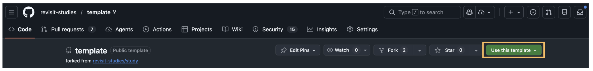
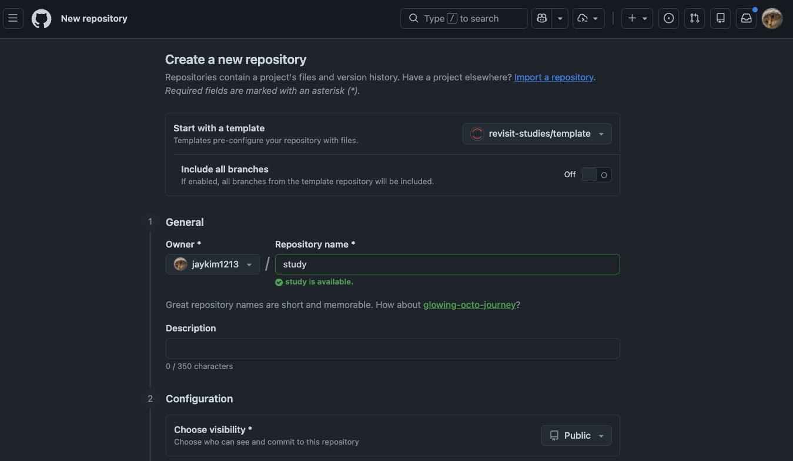
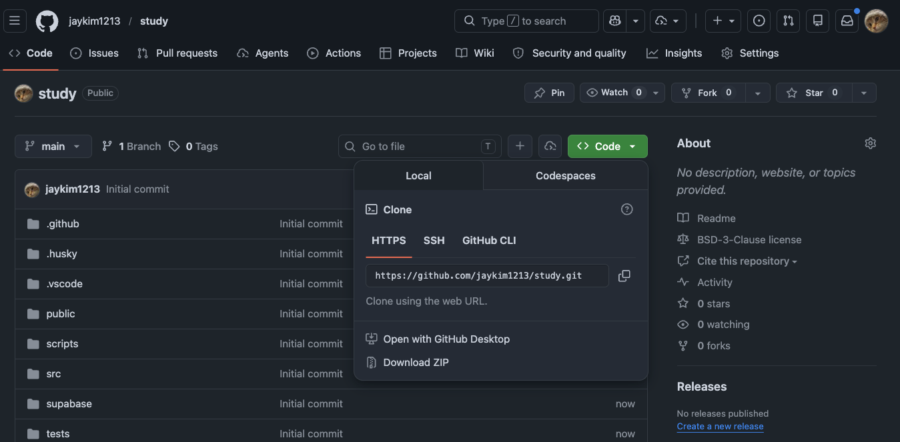
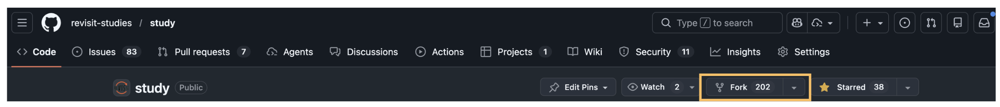

# Installation

ReVISit project is open-source – meaning anyone can see the entire codebase. Most of the work that is done to create a new study is done by making changes to this codebase.

For most users, the best place to start is the template repository (first option below). If you want all demos and tighter upstream parity, or are considering contributing to reVISit, we recommend you fork the repository instead.

## Installing Required Software

Install these tools before cloning and running a study locally:

- [Visual Studio Code](https://code.visualstudio.com/), or another editor with JSON support.
- [Git](https://git-scm.com/downloads), so you can clone the template repository and share changes with collaborators.
- The Active LTS version of [Node.js](https://nodejs.org/), which also installs NPM.

:::info
NPM is installed with Node.js. You usually do not need to install NPM separately: install Node.js first, then use NPM to install Yarn. If NPM is not installed for any reason, review the [NPM documentation](https://docs.npmjs.com/downloading-and-installing-node-js-and-npm) to get started.
:::

You can check whether Git, Node.js, and NPM are already installed with:

```bash
git --version
node --version
npm --version
```

Yarn can be installed using NPM. Run the following command to install Yarn:

```bash
npm i -g yarn
```

:::note
If your machine restricts global installs, run the command with administrator permissions:

```bash
sudo npm i -g yarn
```
:::

After installing Yarn, check that it was installed correctly:

```bash
yarn --version
```

## Starting from the Template Repository (Recommended)

Navigate to the [template repository](https://github.com/revisit-studies/template), and click the "Use this template" button. This will create a new repository in your GitHub account with the same files as the template repository, based on the latest stable release of reVISit.



:::info
You can choose a name for the repository to suit your needs, but if you choose anything other than `study`, you also need to adjust the `VITE_BASE_PATH` in your [`.env`](https://github.com/revisit-studies/study/blob/main/.env) file to reflect that change.
:::



You can then clone this new repository to your local machine and start making changes to it and share it with collaborators as desired.

This template is a minimal setup intended for creating your own study project quickly. Unlike the main `study` repository, it does not include all demo studies, so the codebase is easier to navigate and customize.

This is the preferred approach when you do not need cutting-edge changes (for example, from `dev`) and want a more stable baseline to build from. Unlike a fork, the new repository is not linked to the upstream repository's fork network, which helps keep your project lightweight and focused on your own study. You can also create as many repositories as you want from the template, which is not possible with forking.

:::info
Most likely, you will **receive a warning from GitHub about a potential security issue** as an API key is being shared, with a subject like "Possible valid secrets detected".
You can safely ignore this warning. The reason for this is that the Firebase API key is not a secret key, and it is intended to be shared publicly in client-side code. For more information, see the [Firebase documentation on API keys](https://firebase.google.com/docs/projects/api-keys#api_key_security_recommendations).
:::

### Clone your template repository

After GitHub creates your repository from the template, open the repository page and click "Code". Copy the clone URL from the HTTPS and clone it to your computer:

```bash
git clone https://github.com/your-github-name/your-repository-name.git
cd your-repository-name
```



:::note
If you have not configured GitHub authentication locally, you can use "Download ZIP". 
:::

## Run the Local Server

After cloning your repository, make sure you are inside the repository folder:

```bash
cd your-repository-name
```

Then install the packages that reVISit needs to run:

```bash
yarn install
```

Once this is finished, start the local server:

```bash
yarn serve
```

This will launch a local web server where you can view and interact with reVISit. By default, you can access it by visiting [http://localhost:8080/](http://localhost:8080/). Any change you make to the code will automatically update the website.

:::warning
If `yarn install` or `yarn serve` says it cannot find `package.json`, you are probably not inside the repository folder. Run `cd your-repository-name` first, then try the command again.
:::

When you visit the site, you'll see the studies registered in your local `public/global.json` file. You can interact with any of these studies to get some familiarity (and hopefully some inspiration) for how reVISit can help you quickly launch a crowd-sourced visualization study.

:::note
If you started from the template repository, this will be a smaller set of starter tutorial studies.
:::

:::warning
We do not support using `npm` to run reVISit. Please use `yarn` for all package management and running commands.
:::

## Forking Repository (Advanced Alternative to Template Repository)

Forking the repository is a more advanced option that allows you to have a copy of the entire `study` repository in your GitHub account. This means that you will have access to all the demo studies and that you can choose to follow the latest changes from the main repository (e.g., by following the `dev` branch). However, it also means that your repository will be linked to the upstream repository's fork network, which can make it more complex to manage.

To fork, start by navigating to the following GitHub repository: https://github.com/revisit-studies/study

You should see a "fork" button on the same row as the name of the repository. When you fork a repository, you are essentially creating your own copy of the repository in your GitHub account. This means that any changes you commit and push to this new repository will not affect the main source code.



:::info
GitHub only allows you to fork a repository once. If you have already forked the repository, you will need to clone the repository to your local machine, create a new repo on your account, and run `git remote set-url origin new.git.url/here` to allow you to have 2 versions of the repository in your account.
:::

When forking the repository, you will be prompted for some basic information about this repository (such as the desired name). Once you've forked the repository into your own GitHub account, you can [clone the repository to your local computer](https://docs.github.com/en/repositories/creating-and-managing-repositories/cloning-a-repository).

:::info
You can rename the repository to suit your needs, but if you change the name, you also need to adjust the `VITE_BASE_PATH` in your [`.env`](https://github.com/revisit-studies/study/blob/main/.env) file to reflect that change.
:::

After the repository is on your local machine, you will have the entire codebase for your personal use. Any changes that you make to this repository can be committed and then pushed to your forked repository for other users in your organization to see.

import StructuredLinks from '@site/src/components/StructuredLinks/StructuredLinks.tsx';

<StructuredLinks
    codeLinks={[
        {name: "ReVISit Template Repository", url: "https://github.com/revisit-studies/template"},
        {name: "ReVISit Main Repository", url: "https://github.com/revisit-studies/study"}
    ]}
    referenceLinks={[
        {name: "Cloning Repository", url: "https://docs.github.com/en/repositories/creating-and-managing-repositories/cloning-a-repository"},
        {name: "Visual Studio Code Installation", url: "https://code.visualstudio.com/"},
        {name: "Git Installation", url: "https://git-scm.com/downloads"},
        {name: "Node.js Installation", url: "https://nodejs.org/en"},
        {name: "NPM Installation", url: "https://docs.npmjs.com/downloading-and-installing-node-js-and-npm"},
        {name: "Yarn Installation", url: "https://yarnpkg.com/getting-started/install"}
    ]}
/>
