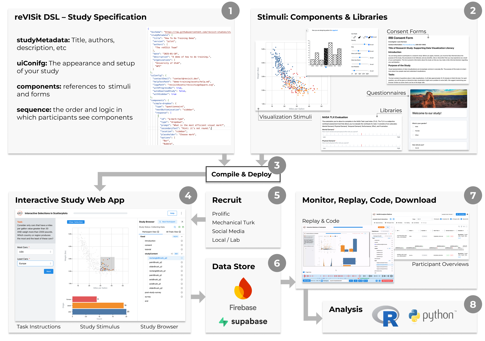

# Introduction

ReVISit lets you create interactive, web-based studies using a **JSON-based domain-specific language (the reVISit DSL)** and a set of **stimuli contained in components**.  
The overall process is illustrated in the figure below:

First, specify the details of your study in the **reVISit DSL (1)** — including which components to use, what data to collect, and in what sequence they will appear.

**Your stimuli live in components (2).** Components can be images, videos, interactive HTML pages, React components, or Vega code. You can use existing components from the reVISit library or create your own custom ones.

Next, use the **(3) Compile & Deploy** process to combine your reVISit specification and components into an **(4) interactive study web app.** You can then deploy this app to any web server.

When you’re ready to run your study, **(5) recruit participants** through platforms like Prolific or Mechanical Turk, or via social media, e-mail, or in-person recruitment.

Participant responses are automatically stored in the **(6) data store**, which can be local storage or cloud-based options such as Firebase or Supabase.

You can then **(7) monitor your study** using ReVISit’s replay tools and participant overviews to review preliminary results.

Finally, **(8) download your data** for analysis in your preferred environment, such as R or Python.

In the tutorials section, we’ll walk you through a simple example to create your first study with ReVISit!