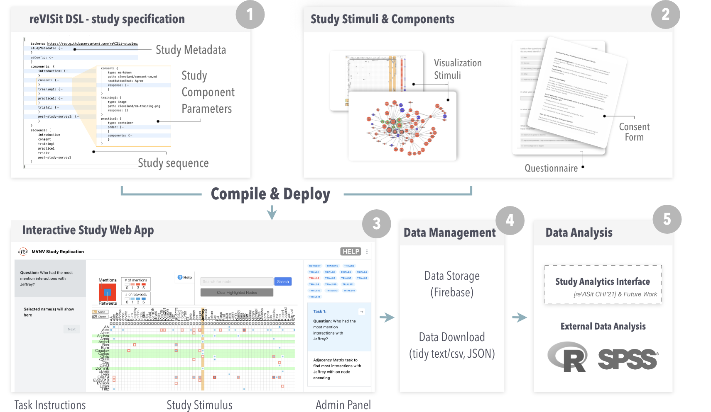

# Introduction

reVISit lets you create interactive, web-based studies using a **JSON domain-specific language (DSL), called reVISit Spec, and a set of stimuli contained in components**. Once you have created a spec and the stimuli, you can build your study and deploy it to the web. You can use stimuli that are images, (interactive) html pages, or react components. 

The overall process is shown in the following figure: 

Based on your custom reVISit Spec and the components, you will use the reVISit software to compile your spec and stimuli into an interactive webpage. You can then deploy that web-page to a web-server. Your study automatically tracks all the responses of participants, and you can download the data after participants completed your study.  

In the tutorials section, we'll walk you through a simple example to create your first study with reVISit! 
