# config.json

In this part of the tutorial, you will build [`public/tutorial/config.json`](https://github.com/revisit-studies/template/blob/main/public/tutorial/config.json). The completed version is [`public/tutorial/_answers/config.json`](https://github.com/revisit-studies/template/blob/main/public/tutorial/_answers/config.json). Use the completed version to check the step you just finished, not as something to copy all at once.

## Step 1: Run the local server

Start the local server from the root of your template repository:

```bash
yarn serve
```

Before editing the tutorial Study Config, open `public/global.json`. The template already registers the tutorial config. You should see `tutorial` listed in both `configsList` and `configs`.

```json title="public/global.json"
{
  "$schema": "https://raw.githubusercontent.com/revisit-studies/study/v2.4.2/src/parser/GlobalConfigSchema.json",
  "configsList": ["tutorial"],
  "configs": {
    "tutorial": {
      "path": "tutorial/config.json"
    }
  }
}
```

:::note
The `path` value is `tutorial/config.json` because paths in `public/global.json` are relative to the `public/` folder. The full file path in the repository is `public/tutorial/config.json`.
:::

Open [http://localhost:8080](http://localhost:8080). You should see the tutorial study listed. If you do not see it, check that `public/global.json` still points to the Study Config at `public/tutorial/config.json` and that `yarn serve` is still running.

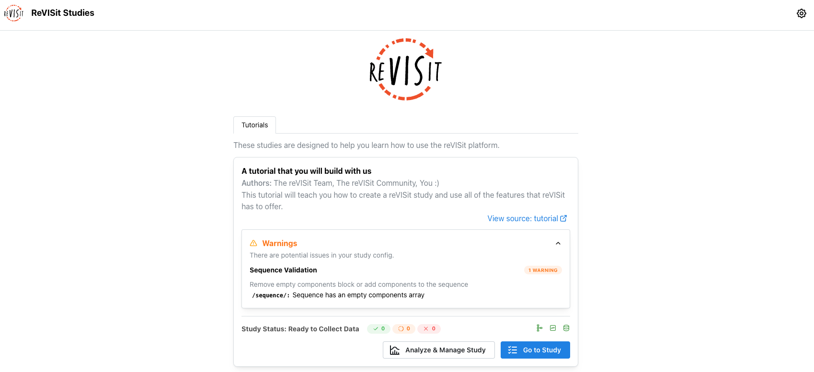

:::warning
At this point, the tutorial config should show a warning that the sequence is empty. You can ignore this warning for now. It is intentional because `public/tutorial/config.json` currently has an empty `sequence.components` array. If you enter the study now, reVISit may go directly to the study end page because no components have been added to the sequence yet.
:::

### Before adding components: understand the config file

Open `public/tutorial/config.json`. The starter file already has the main parts of a Study Config:

- [`$schema`](../typedoc/interfaces/StudyConfig.md#schema) points to the Study Config schema.
- [`studyMetadata`](../typedoc/interfaces/StudyMetadata.md) describes the study.
- [`uiConfig`](../typedoc/interfaces/UIConfig.md) controls reVISit interface behavior, such as the contact email, help text, progress bar, sidebar, logo, and recording settings.
- [`components`](../typedoc/interfaces/BaseIndividualComponent.md) defines the stimuli and tasks that the Participant can see.
- [`sequence`](../typedoc/interfaces/Sequence.md) decides which components appear and in what order.

The tutorial is mostly about the last two pieces: add a component, then add that component's id to the sequence.

## Step 2: Add the welcome component

If you go into the tutorial study right now, you will be directed straight to the end page, which should look like this.

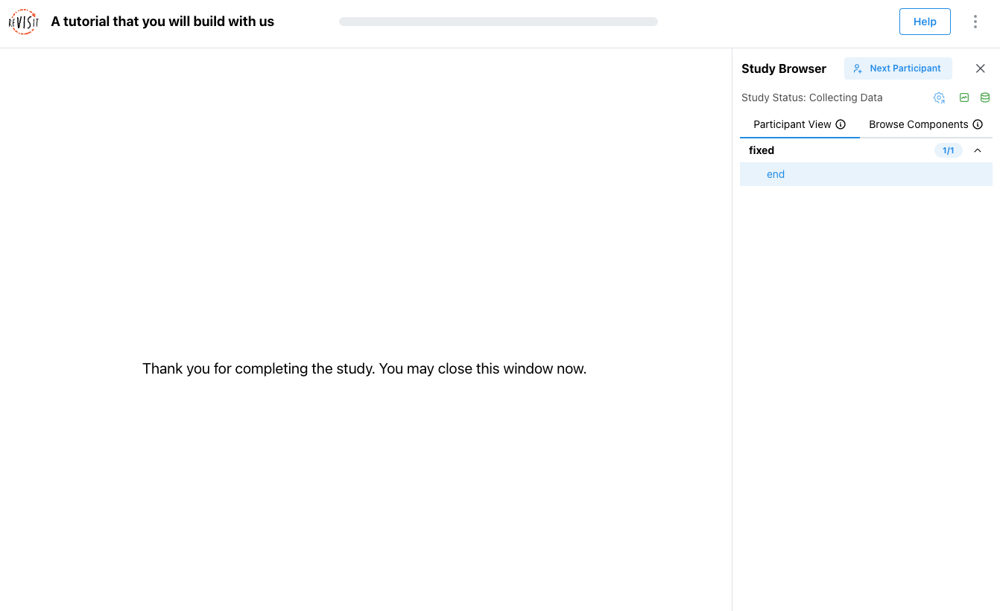

Inside the empty `components` object, add a basic [Markdown component](../typedoc/interfaces/MarkdownComponent.md) named `welcome`.

```json title="public/tutorial/config.json"
"components": {
  "welcome": {
    "type": "markdown",
    "path": "tutorial/assets/welcome.md",
    "response": []
  }
}
```

This component displays the Markdown file at `public/tutorial/assets/welcome.md`. The empty `response` array means Participants do not answer a question on this page; they only read the content and continue.

Every component needs a `type` and a `response`. Markdown and image components also need a `path`. Paths are relative to the root `public/` folder, so `tutorial/assets/welcome.md` points to `public/tutorial/assets/welcome.md`.

Now add `welcome` to the sequence:

```json title="public/tutorial/config.json"
"sequence": {
  "order": "fixed",
  "components": [
    "welcome"
  ]
}
```

Because the sequence is fixed, Participants see the component names in this array from top to bottom.

Refresh the local study. If you are already inside a participant session, click "Next participant" to reload the Study Config and start a fresh preview. You should now see the welcome page.

A common mistake is to add the component but forget the sequence entry. If the component exists in `components` but is not listed in `sequence.components`, Participants will not see it.

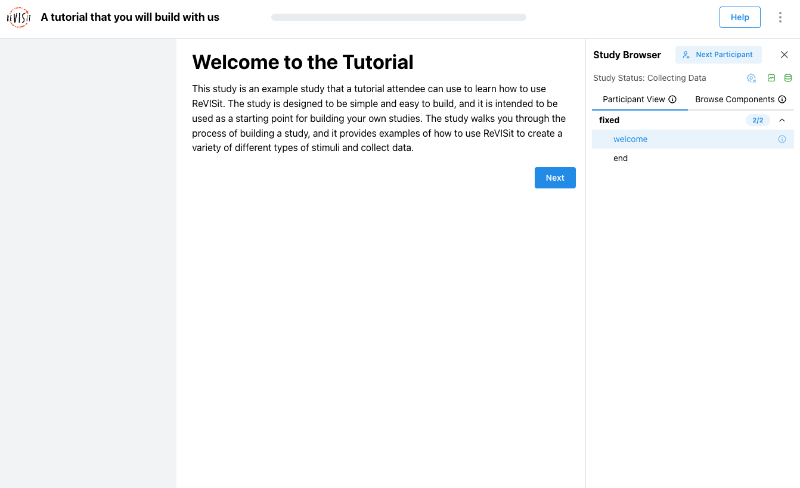


## Step 3: Add the consent component

Add a comma after the `welcome` component, then add a second Markdown component named `consent`.

```json title="public/tutorial/config.json"
"components": {
  "welcome": { ... },
  "consent": {
    "type": "markdown",
    "path": "tutorial/assets/consent.md",
    "nextButtonText": "I agree",
    "response": []
  }
}
```

This component displays `public/tutorial/assets/consent.md`. The `nextButtonText` field changes the text on the next button, which is useful for consent pages because the button can say exactly what the Participant is agreeing to.

Add `consent` after `welcome` in the sequence:

```json title="public/tutorial/config.json"
"sequence": {
  "order": "fixed",
  "components": [
    "welcome",
    "consent"
  ]
}
```

Refresh the study or click "Next participant". You should see the welcome page first, then the consent page with an "I agree" button.

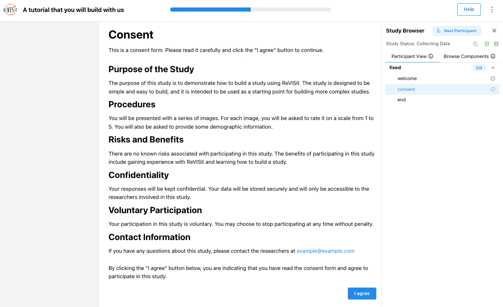

## Step 4: Add demographics with several form elements

Add a questionnaire component named `demographics`. A [`questionnaire`](../typedoc/interfaces/QuestionnaireComponent.md) component is used to collect form-based answers from the Participant, such as demographic information, survey responses, or post-task feedback.

ReVISit supports many response types inside a questionnaire, including numerical inputs, Likert scales, dropdowns, checkboxes, sliders, dividers, and matrix questions. For the full list of available response types, see the [Response reference](../typedoc/interfaces/BaseResponse.md).

```json title="public/tutorial/config.json"
"components": {
  "welcome": { ... },
  "consent": { ... },
  "demographics": {
    "type": "questionnaire",
    "response": [
      {
        "id": "age",
        "type": "numerical",
        "prompt": "What is your age?"
      },
      {
        "id": "health",
        "type": "likert",
        "prompt": "How would you rate your overall health?",
        "secondaryText": "1 being the worst health and 5 being the best health",
        "numItems": 5,
        "rightLabel": "Best health",
        "leftLabel": "Worst health"
      },
      {
        "id": "dividerResponse",
        "type": "divider",
        "location": "belowStimulus"
      },
      {
        "id": "fruits",
        "type": "matrix-checkbox",
        "prompt": "Which of these fruits do you like at each time of day?",
        "answerOptions": ["Breakfast", "Lunch", "Dinner"],
        "questionOptions": ["Banana", "Apple", "Orange", "Grapes", "Strawberry"]
      },
      {
        "id": "q-short-text",
        "type": "shortText",
        "prompt": "What is your favorite sports team?",
        "placeholder": "Enter your team here"
      },
      {
        "id": "operating-systems",
        "type": "checkbox",
        "prompt": "Which of these operating systems do you use?",
        "minSelections": 1,
        "maxSelections": 2,
        "options": ["Windows", "macOS", "Linux"],
        "withOther": true
      },
      {
        "id": "q-slider",
        "type": "slider",
        "prompt": "How would you rate this tutorial so far?",
        "secondaryText": "Your answer is not legally binding.",
        "startingValue": 50,
        "options": [
          { "label": "Bad", "value": 0 },
          { "label": "Alright", "value": 50 },
          { "label": "Good", "value": 100 }
        ]
      }
    ]
  }
}
```

This one component introduces several form elements: [numerical input](../typedoc/interfaces/NumericalResponse.md), [Likert scale](../typedoc/interfaces/LikertResponse.md), [divider](../typedoc/interfaces/DividerResponse.md), [matrix checkbox](../typedoc/interfaces/MatrixCheckboxResponse.md), [short text](../typedoc/interfaces/ShortTextResponse.md), [checkbox](../typedoc/interfaces/CheckboxResponse.md), and [slider](../typedoc/interfaces/SliderResponse.md). Each response has an `id`; ReVISit uses that id when saving the Participant's answer.

:::tip
Each response `id` becomes a column in the exported data, so pick descriptive names (e.g. `health` rather than `q1`). Ids must be unique within a component.
:::

All responses inside one component appear on the same page. If you want these questions split across multiple pages, create multiple questionnaire components and add each component to the sequence separately.

Add `demographics` to the sequence:

```json title="public/tutorial/config.json"
"sequence": {
  "order": "fixed",
  "components": [
    "welcome",
    "consent",
    "demographics"
  ]
}
```

Refresh the study and confirm that the demographics page appears after consent.

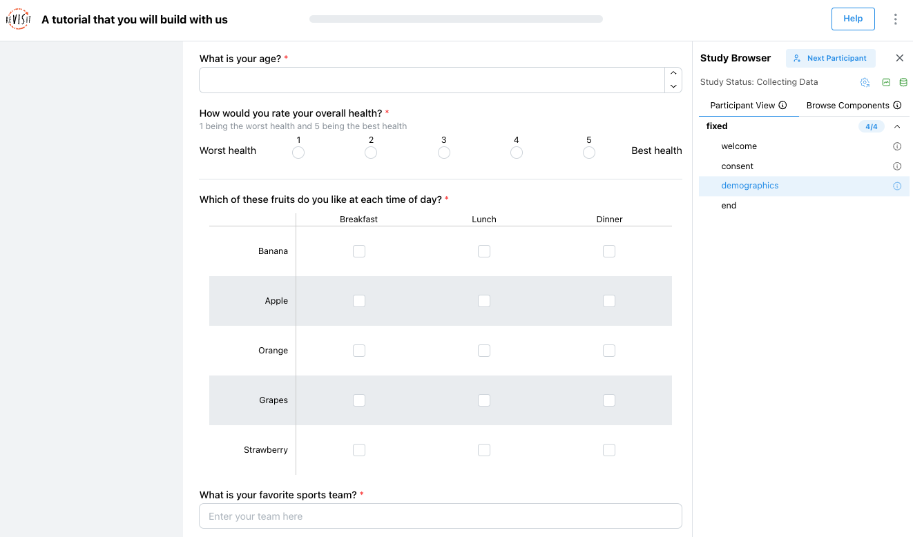

## Step 5: Add training with feedback

Add a questionnaire component named `trainingWithFeedback`.

```json title="public/tutorial/config.json"
"components": {
  "welcome": { ... },
  "consent": { ... },
  "demographics": { ... },
  "trainingWithFeedback": {
    "type": "questionnaire",
    "response": [
      {
        "id": "training",
        "type": "radio",
        "prompt": "Yes is the correct answer, click it",
        "options": ["Yes", "No"]
      }
    ],
    "correctAnswer": [
      {
        "id": "training",
        "answer": "Yes"
      }
    ],
    "provideFeedback": true,
    "trainingAttempts": 2,
    "allowFailedTraining": false,
    "nextButtonDisableTime": 5000
  }
}
```

This is a training component because it defines a correct answer and asks reVISit to provide feedback.

- [`correctAnswer`](../typedoc/interfaces/Answer.md) says which answer is correct. The `id` must match the response id, `training`.
- `provideFeedback: true` tells reVISit to show feedback after the Participant answers.
- `trainingAttempts: 2` gives the Participant two attempts.
- `allowFailedTraining: false` prevents the Participant from continuing after failing the allowed attempts.
- `nextButtonDisableTime: 5000` disables the next button briefly, using milliseconds.

Add `trainingWithFeedback` to the sequence after `demographics`.

When you preview this page, the next button becomes a **Check answer** button. If the Participant answers incorrectly twice, reVISit stops them from continuing. If they answer correctly, they can move forward.

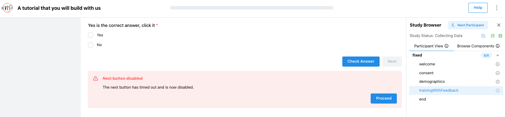

## Step 6: Add the coin image component

Add an [image component](../typedoc/interfaces/ImageComponent.md) named `coinImage`.

```json title="public/tutorial/config.json"
"components": {
  "welcome": { ... },
  "consent": { ... },
  ...,
  "trainingWithFeedback": { ... },
  "coinImage": {
    "type": "image",
    "path": "tutorial/assets/coins.png",
    "nextButtonLocation": "sidebar",
    "response": [
      {
        "id": "cost-effective",
        "type": "radio",
        "prompt": "Which coin is most effective to produce?",
        "location": "sidebar",
        "options": ["Penny", "Nickel", "Dime", "Quarter", "Half Dollar"]
      },
      {
        "id": "cost-ineffective",
        "type": "dropdown",
        "prompt": "Which coin is least cost effective to produce?",
        "location": "sidebar",
        "options": ["Penny", "Nickel", "Dime", "Quarter", "Half Dollar"]
      }
    ]
  }
}
```

This component displays `public/tutorial/assets/coins.png` and places the questions in the sidebar. The starter `uiConfig` already has `"withSidebar": true`, so sidebar responses can be used here.

Image paths work the same way as Markdown paths: they are relative to `public/`. You can also use a full external URL when the stimulus is hosted elsewhere.

:::info
`location: "sidebar"` moves that response into the sidebar. It does not change the stimulus itself. If sidebar responses do not appear, make sure `uiConfig.withSidebar` is `true`.
:::

:::tip
`nextButtonLocation: "sidebar"` (set on the component, not the response) moves the **Next** button into the sidebar — useful when the stimulus is large and the participant is reading from the sidebar. This is separate from per-response `location` settings.
:::

Add `coinImage` to the sequence after `trainingWithFeedback`.

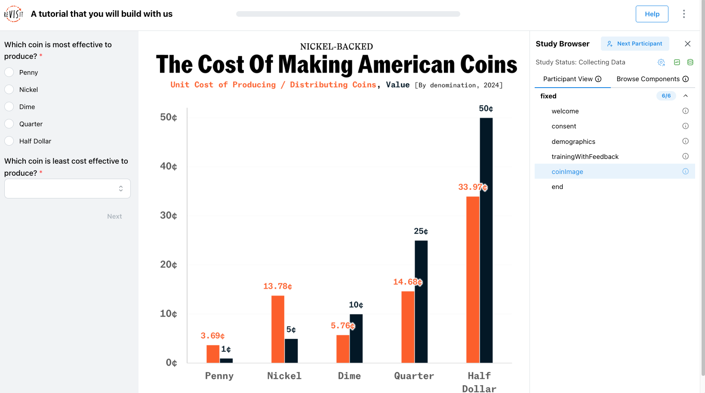

## Step 7: Add Vega components

Add [`vegaPath`](../typedoc/interfaces/VegaComponentPath.md), which loads a Vega chart from a separate file.

```json title="public/tutorial/config.json"
"components": {
  "welcome": { ... },
  "consent": { ... },
  ...,
  "coinImage": { ... },
  "vegaPath": {
    "type": "vega",
    "path": "tutorial/assets/simpleChart.json",
    "response": [
      {
        "id": "simple-vega",
        "type": "radio",
        "prompt": "What is the value of bar A?",
        "options": ["10", "28", "50"]
      }
    ]
  }
}
```

Then add [`vegaConfig`](../typedoc/interfaces/VegaComponentConfig.md), which puts the Vega-Lite chart definition directly in the Study Config.

```json title="public/tutorial/config.json"
"components": {
  "welcome": { ... },
  "consent": { ... },
  ...,
  "vegaPath": { ... },
  "vegaConfig": {
    "type": "vega",
    "config": {
      "$schema": "https://vega.github.io/schema/vega-lite/v5.json",
      "description": "A simple bar chart with embedded data.",
      "data": {
        "values": [
          { "category": "A", "value": 28 },
          { "category": "B", "value": 55 },
          { "category": "C", "value": 43 }
        ]
      },
      "mark": "bar",
      "encoding": {
        "x": {
          "field": "category",
          "type": "nominal",
          "axis": { "labelAngle": 0 }
        },
        "y": {
          "field": "value",
          "type": "quantitative"
        }
      }
    },
    "response": [
      {
        "id": "dynamic-vega",
        "type": "radio",
        "prompt": "What is the value of bar A?",
        "options": ["10", "28", "50"]
      }
    ]
  }
}
```

Both approaches are useful. Use `path` when the visualization specification is easier to maintain as its own file. Use `config` when the chart is small enough to keep inside the Study Config.

:::info
reVISit can render Vega and Vega-Lite specifications. Vega is especially useful for interactive visualization studies because reVISit can capture interactions from the visualization.
:::

Add `vegaPath` and `vegaConfig` to the sequence.

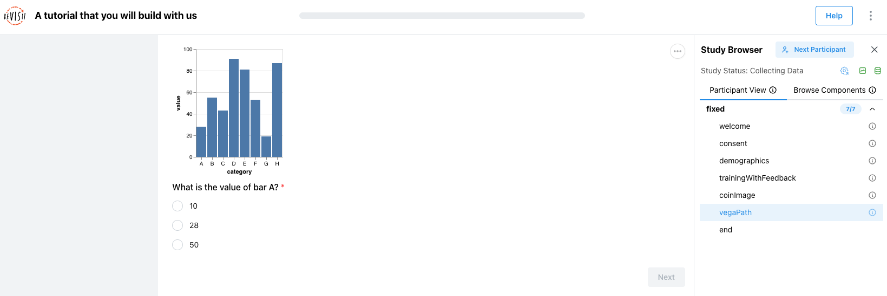

## Step 8: Add reactive Vega

Add `reactiveVega`.

```json title="public/tutorial/config.json"
"components": {
  "welcome": { ... },
  "consent": { ... },
  ...,
  "vegaConfig": { ... },
  "reactiveVega": {
    "type": "vega",
    "path": "tutorial/assets/reactive.json",
    "response": [
      {
        "id": "reactiveResponse",
        "type": "reactive",
        "prompt": "What is the value of bar A? Click it to show here"
      }
    ]
  }
}
```

A [reactive response](../typedoc/interfaces/ReactiveResponse.md) records an interaction from the visualization itself. In this example, the Participant clicks a mark in the Vega chart and that interaction becomes the response.

Add `reactiveVega` to the sequence.

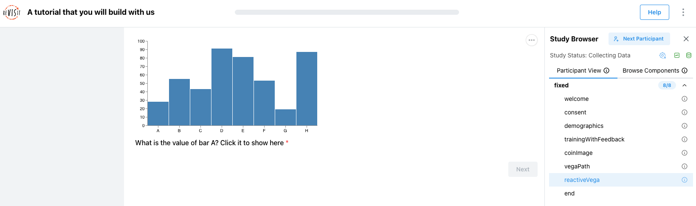

## Step 9: Add website components

First, add a simple [website component](../typedoc/interfaces/WebsiteComponent.md). This embeds a web page in the study as an iframe.

```json title="public/tutorial/config.json"
"components": {
  "welcome": { ... },
  "consent": { ... },
  ...,
  "reactiveVega": { ... },
  "website": {
    "type": "website",
    "path": "https://revisit.dev",
    "response": []
  }
}
```

This is useful when a study asks Participants to inspect a website or web-based visualization. The empty `response` array means the page is shown without collecting a form response.

:::warning
Many external sites block being loaded in iframes via `X-Frame-Options` or CSP headers (e.g. Google, GitHub). If the page does not appear, check the browser console — and either host the page locally under `public/` or pick a site that allows iframe embedding.
:::

Add `website` to the sequence.


Next, add a reactive website named `reactiveWebsite`.

```json title="public/tutorial/config.json"
"components": {
  "welcome": { ... },
  "consent": { ... },
  ...,
  "website": { ... },
  "reactiveWebsite": {
    "type": "website",
    "path": "tutorial/assets/bar-chart-interaction.html",
    "instructionLocation": "aboveStimulus",
    "description": "A trial for the user to click the largest bar",
    "instruction": "Click on the largest bar",
    "response": [
      {
        "id": "barChart",
        "prompt": "Your selected answer:",
        "location": "sidebar",
        "type": "reactive"
      }
    ],
    "parameters": {
      "barData": [0.32, 0.01, 1.2, 1.3, 0.82, 0.4, 0.3]
    }
  }
}
```

This component loads a local HTML page and passes `barData` into it through `parameters`. The page can render a different chart based on those values. The response is `reactive`, so the HTML page can send the Participant's selection back to reVISit.

Add `reactiveWebsite` to the sequence after `website`.

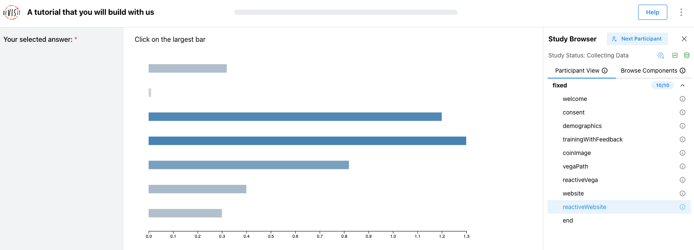

## Step 10: Add reactExampleCars

Add the first [React component](../typedoc/interfaces/ReactComponent.md) trial.

```json title="public/tutorial/config.json"
"components": {
  "welcome": { ... },
  "consent": { ... },
  ...,
  "reactiveWebsite": { ... },
  "reactExampleCars": {
    "type": "react-component",
    "path": "tutorial/assets/ReactExample.tsx",
    "instruction": "How many cars from Japan have a Miles Per Gallon value greater than 35?",
    "response": [
      {
        "id": "response",
        "prompt": "Answer:",
        "location": "sidebar",
        "type": "numerical",
        "max": 100,
        "min": 0
      }
    ],
    "correctAnswer": [
      {
        "id": "response",
        "answer": 17
      }
    ],
    "parameters": {
      "dataset": "cars",
      "x": "Miles per Gallon",
      "y": "Weight (lbs)",
      "category": "Origin",
      "ids": "id",
      "brushType": "Rectangular Selection"
    }
  }
}
```

This component renders `ReactExample.tsx`. The `parameters` object tells the React component which dataset and fields to use.

:::note
Values in `parameters` are passed into the `.tsx` file as the `parameters` prop, alongside reVISit's `setAnswer` callback. The same React file can therefore power many trials with different data, fields, or behavior.
:::

Add `reactExampleCars` to the sequence.

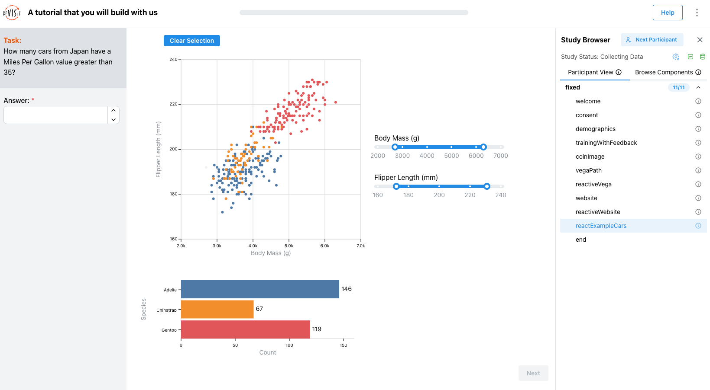

## Step 11: Add reactExamplePenguins

Add a second React component trial that uses the same React file with different parameters.

```json title="public/tutorial/config.json"
"components": {
  "welcome": { ... },
  "consent": { ... },
  ...,
  "reactExampleCars": { ... },
  "reactExamplePenguins": {
    "type": "react-component",
    "path": "tutorial/assets/ReactExample.tsx",
    "instruction": "Which species of penguin has the largest body mass on average?",
    "response": [
      {
        "id": "response",
        "prompt": "Answer:",
        "location": "sidebar",
        "type": "numerical",
        "max": 100,
        "min": 0
      }
    ],
    "correctAnswer": [
      {
        "id": "response",
        "answer": 15
      }
    ],
    "parameters": {
      "dataset": "penguin",
      "x": "Body Mass (g)",
      "y": "Flipper Length (mm)",
      "category": "Species",
      "ids": "id",
      "brushType": "Slider Selection"
    }
  }
}
```

This step shows why parameters are useful. The Study Config can reuse the same React component while changing the task, dataset, fields, and interaction style.

Add `reactExamplePenguins` to the sequence.

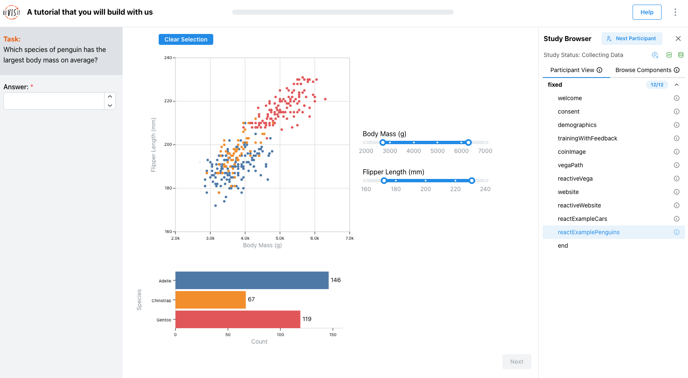

## Step 12: Add example1 and example2

Add two simple questionnaire components.

```json title="public/tutorial/config.json"
"components": {
  "welcome": { ... },
  "consent": { ... },
  ...,
  "reactExamplePenguins": { ... },
  "example1": {
    "type": "questionnaire",
    "response": [
      {
        "id": "q-example-1",
        "type": "shortText",
        "prompt": "Example question"
      }
    ]
  },
  "example2": {
    "type": "questionnaire",
    "response": [
      {
        "id": "q-example-2",
        "type": "dropdown",
        "prompt": "Example question",
        "options": ["Option 1", "Option 2"]
      }
    ]
  }
}
```

These components are intentionally simple. You will reuse them in the interruption examples in the next step.

Do not add `example1` and `example2` directly to the top-level sequence yet. They will appear inside nested sequence blocks.

## Step 13: Add attention checks and interruptions

Before adding interruptions, it helps to understand [sequence blocks](../typedoc/interfaces/ComponentBlock.md). A sequence block can be `fixed`, `random`, or `latinSquare`. A fixed block shows components in the order you list them. A random block shuffles the components for each Participant. A Latin square block balances ordering across Participants.

You can also nest sequence blocks. For example, keep `welcome` and `consent` fixed, then randomize later tasks:

```json title="public/tutorial/config.json"
"sequence": {
  "order": "fixed",
  "components": [
    "welcome",
    "consent",
    {
      "id": "randomizedTasks",
      "order": "random",
      "components": [
        "coinImage",
        "vegaPath",
        "reactiveVega"
      ]
    }
  ]
}
```

For between-subject conditions, mark nested fixed-order blocks as [conditional](../typedoc/interfaces/ComponentBlockCondition.md) and enter the study with a URL parameter such as `?condition=vega`. Multiple conditions can be combined with a comma, such as `?condition=general,vega`. Do not place conditional blocks inside `random` or `latinSquare` blocks.

[Dynamic sequence blocks](../typedoc/interfaces/DynamicBlock.md) are also available when the next component should be chosen by a function. Those blocks use a function path instead of only a static component list, and they are useful for adaptive studies where a correct answer leads to a harder task or an incorrect answer leads to a follow-up.

:::tip
If you need one part of the study to stay in order and another part to be randomized, use a nested block: keep the top-level sequence `fixed`, list the introduction and consent first, and put the randomized trials inside a nested block with `"order": "random"` or `"order": "latinSquare"`.
:::

First, add an `attentionCheck` component.

```json title="public/tutorial/config.json"
"components": {
  "welcome": { ... },
  "consent": { ... },
  ...,
  "example2": { ... },
  "attentionCheck": {
    "type": "questionnaire",
    "response": [
      {
        "id": "q-example-2",
        "type": "dropdown",
        "prompt": "Attention check question",
        "options": ["Option 1", "Option 2"]
      }
    ]
  }
}
```

Then add a [deterministic interruption](../typedoc/interfaces/DeterministicInterruption.md) block to the sequence:

```json title="public/tutorial/config.json"
"sequence": {
  "order": "fixed",
  "components": [
    "welcome",
    "consent",
    ...,
    {
      "id": "attentionDeterministic",
      "order": "fixed",
      "components": [
        "example1",
        "example2",
        "example1",
        "example2"
      ],
      "interruptions": [
        {
          "firstLocation": 0,
          "spacing": 2,
          "components": [
            "attentionCheck"
          ]
        }
      ]
    }
  ]
}
```

This is deterministic because the attention check appears at a predictable spacing.

Now add a [random interruption](../typedoc/interfaces/RandomInterruption.md) block:

```json title="public/tutorial/config.json"
"sequence": {
  "order": "fixed",
  "components": [
    "welcome",
    "consent",
    ...,
    {
      "id": "attentionRandom",
      "order": "fixed",
      "components": [
        "example1",
        "example2",
        "example1",
        "example2"
      ],
      "interruptions": [
        {
          "spacing": "random",
          "numInterruptions": 3,
          "components": [
            "attentionCheck"
          ]
        }
      ]
    }
  ]
}
```

This is random because reVISit chooses where to place the attention checks within the block. Use deterministic interruptions when you want exact placement. Use random interruptions when you do not want Participants to predict when a check will appear.

## Step 14: Add skip logic

First, add `exampleWithAnswer`.

```json title="public/tutorial/config.json"
"components": {
  "welcome": { ... },
  "consent": { ... },
  ...,
  "attentionCheck": { ... },
  "exampleWithAnswer": {
    "type": "questionnaire",
    "response": [
      {
        "id": "q-example-1",
        "type": "numerical",
        "prompt": "What is 2 + 2?"
      }
    ]
  }
}
```

Then add a skip block to the sequence:

```json title="public/tutorial/config.json"
"sequence": {
  "order": "fixed",
  "components": [
    "welcome",
    "consent",
    ...,
    {
      "id": "skipResponse",
      "order": "fixed",
      "components": [
        "exampleWithAnswer",
        "example1"
      ],
      "skip": [
        {
          "name": "exampleWithAnswer",
          "check": "response",
          "responseId": "q-example-1",
          "value": 4,
          "comparison": "notEqual",
          "to": "end"
        }
      ]
    }
  ]
}
```

This block asks the Participant `What is 2 + 2?`. If the response is not equal to `4`, reVISit skips to the end of this nested block. If the response is `4`, the Participant continues to `example1`.

The `responseId` must match the response id inside `exampleWithAnswer`.

:::note
The `to` field accepts either `"end"` (jump to the end of the current block) or the `id` of another component or block to jump to. Use this to build branching flows, e.g. send participants who fail an attention check to a debrief component.
:::

## Step 15: Add the microphone library and audio settings

Finally, add the microphone check library and turn on audio recording for the study.

Add [`importedLibraries`](../typedoc/interfaces/StudyConfig.md#importedlibraries) after `studyMetadata`:

```json title="public/tutorial/config.json"
"importedLibraries": [
  "mic-check"
],
```

Then add `recordAudio` to `uiConfig`:

```json title="public/tutorial/config.json"
"uiConfig": {
  "recordAudio": true,
  "contactEmail": "contact@revisit.dev",
  "helpTextPath": "tutorial/assets/help.md",
  "logoPath": "revisitAssets/revisitLogoSquare.svg",
  "withProgressBar": true,
  "autoDownloadStudy": false,
  "withSidebar": true
}
```

Add the microphone check component to the sequence after `consent`:

```json title="public/tutorial/config.json"
"sequence": {
  "order": "fixed",
  "components": [
    "welcome",
    "consent",
    "$mic-check.components.audioTest",
    "demographics",
    ...
  ]
}
```

:::note
The `$libname.components.X` syntax references a component defined in an imported library. The `$` prefix tells reVISit to look up the component in the library namespace rather than in your local `components` object. The same syntax works for sequences (`$libname.sequences.X`).
:::

Because `uiConfig.recordAudio` enables audio recording for the study, turn audio recording off for the welcome and consent pages:

```json title="public/tutorial/config.json"
"components": {
  "welcome": {
    "type": "markdown",
    "recordAudio": false,
    "path": "tutorial/assets/welcome.md",
    "response": []
  },
  "consent": {
    "type": "markdown",
    "recordAudio": false,
    "path": "tutorial/assets/consent.md",
    "nextButtonText": "I agree",
    "response": []
  },
  ...
}
```

This keeps the early setup pages from recording audio before the Participant has reached the microphone check and main study tasks.

<!-- Importing links -->
import StructuredLinks from '@site/src/components/StructuredLinks/StructuredLinks.tsx';

<StructuredLinks
    codeLinks={[
        {name: "Starter config.json", url: "https://github.com/revisit-studies/template/blob/main/public/tutorial/config.json"},
        {name: "Completed config.json", url: "https://github.com/revisit-studies/template/blob/main/public/tutorial/_answers/config.json"}
    ]}
    referenceLinks={[
        {name: "Pre Tutorial", url: "../tutorial/"},
        {name: "replication-config.json Tutorial", url: "../replication-config.json/"},
        {name: "How Does It Work?", url: "../../getting-started/how-does-it-work/"}
    ]}
/>
