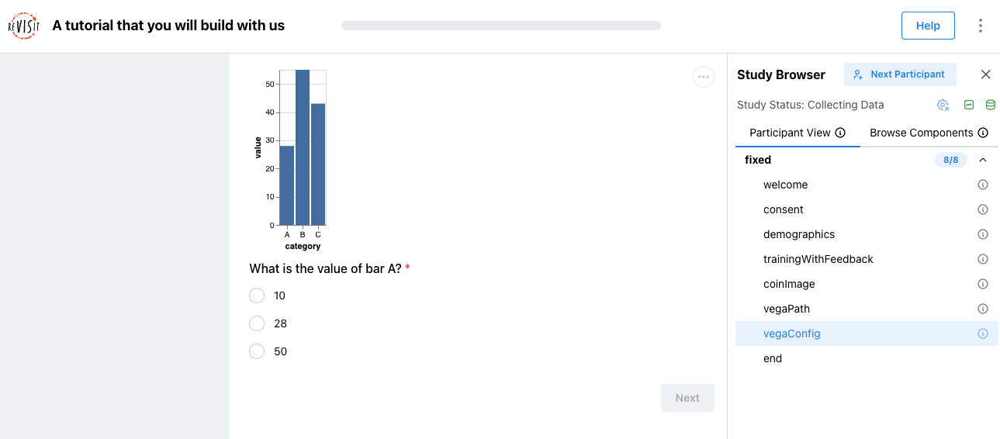
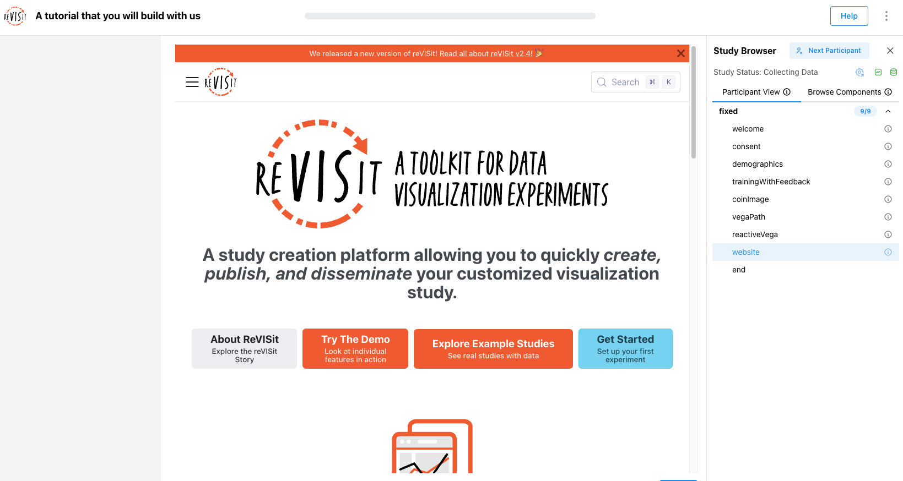
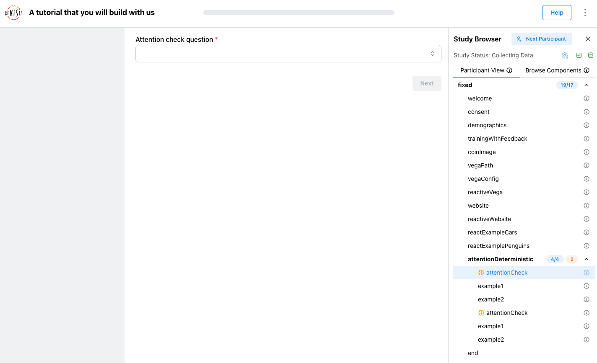
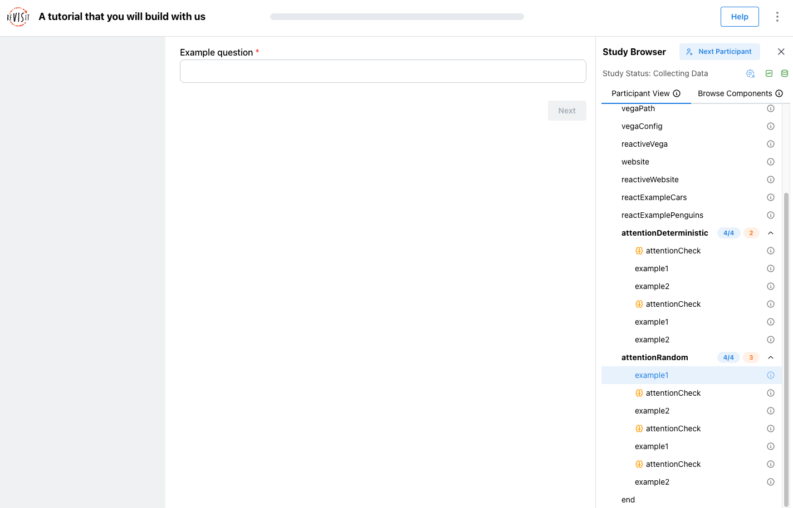
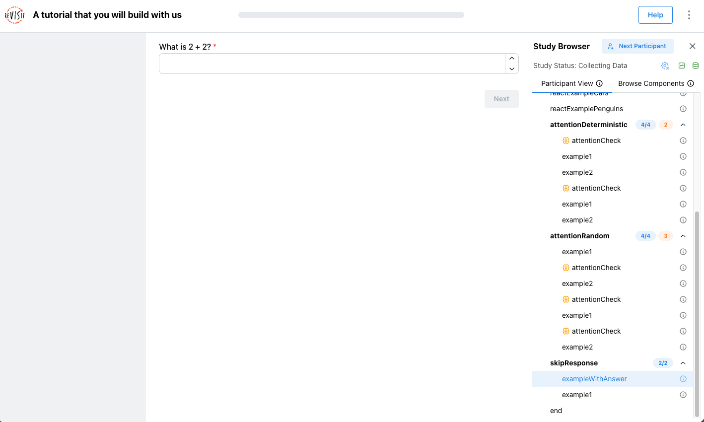

# config.json

In this part of the tutorial, you will build the [Study Config](../typedoc/interfaces/StudyConfig.md), [`public/tutorial/config.json`](https://github.com/revisit-studies/template/blob/main/public/tutorial/config.json). The completed version is [`public/tutorial/_answers/config.json`](https://github.com/revisit-studies/template/blob/main/public/tutorial/_answers/config.json). Use the completed version to check the step you just finished, not as something to copy all at once.

:::info
Before you start editing tutorial files, complete the [Installation guide](../getting-started/installation.md) using the **Starting from the Template Repository** workflow.
:::

## Step 1: Run the local server

Start the local server from the root of your template repository:

```bash
yarn serve
```

Before editing the tutorial Study Config, open [`public/global.json`](https://github.com/revisit-studies/template/blob/main/public/global.json). This file follows the [Global Config](../typedoc/interfaces/GlobalConfig.md) schema. The template should be empty for now.

Let's add a tutorial study here.

```json title="public/global.json"
{
  "$schema": "https://raw.githubusercontent.com/revisit-studies/study/v2.4.3/src/parser/GlobalConfigSchema.json",
  "configsList": [
    "tutorial"
  ],
  "configs": {
    "tutorial": {
      "path": "tutorial/config.json"
    }
  }
}
```

Open [http://localhost:8080](http://localhost:8080). You should see the tutorial study listed.


:::warning
At this point, the tutorial config should show a warning that the sequence is empty. You can ignore this warning for now. It is intentional because `public/tutorial/config.json` currently has an empty [`sequence.components`](../typedoc/interfaces/Sequence.md#components) array. If you enter the study now, reVISit may go directly to the study end page because no components have been added to the sequence yet.
:::

## Step 2: Add the welcome component

If you open the tutorial study right now, you will be directed straight to the end page, which should look like this.


Next, open [`public/tutorial/config.json`](https://github.com/revisit-studies/template/blob/main/public/tutorial/config.json). Inside the empty `components` object, add a basic [Markdown component](../typedoc/interfaces/MarkdownComponent.md) named `welcome`.

```json title="public/tutorial/config.json"
"components": {
  "welcome": {
    "type": "markdown",
    "path": "tutorial/assets/welcome.md",
    "response": []
  }
}
```

This component displays the Markdown file at [`public/tutorial/assets/welcome.md`](https://github.com/revisit-studies/template/blob/main/public/tutorial/assets/welcome.md).

Now add `welcome` to the sequence:

```json title="public/tutorial/config.json"
"sequence": {
  "order": "fixed",
  "components": [
    "welcome"
  ]
}
```

Refresh the local study or click "Next participant" to reload the Study Config and start a fresh preview. You should now see the welcome page.


:::warning
A common mistake is to add the component but forget the sequence entry. If the component exists in `components` but is not listed in `sequence.components`, the component will not show up.
:::

## Step 3: Add the consent component

Next, let’s add a consent page for participants to review before starting the study. Add a comma after the `welcome` component, then add a second Markdown component named `consent`. We have already written the consent markdown in [`public/tutorial/assets/consent.md`](https://github.com/revisit-studies/template/blob/main/public/tutorial/assets/consent.md), so let’s use that as the `path`.

```json title="public/tutorial/config.json"
"components": {
  "welcome": { ... },
  "consent": {
    "type": "markdown",
    "path": "tutorial/assets/consent.md",
    "nextButtonText": "I agree",
    "response": []
  }
}
```

The `nextButtonText` field changes the text on the next button, which is useful for consent pages.

Add `consent` after `welcome` in the sequence:

```json title="public/tutorial/config.json"
"sequence": {
  "order": "fixed",
  "components": [
    "welcome",
    "consent"
  ]
}
```

Refresh the study or click "Next participant". You should see the welcome page first, then the consent page with an "I agree" button.


## Step 4: Add demographics with several form elements

Add a questionnaire component named `demographics`. A [`questionnaire`](../typedoc/interfaces/QuestionnaireComponent.md) component is used to collect form-based answers from the participant, such as demographic information, survey responses, or post-task feedback.

ReVISit supports many [form response types](../designing-studies/forms.md) inside a questionnaire, including numerical inputs, Likert scales, dropdowns, checkboxes, sliders, dividers, and matrix questions. For the full list of available response types, see the [Response reference](../typedoc/type-aliases/Response.md).

```json title="public/tutorial/config.json"
"components": {
  "welcome": { ... },
  "consent": { ... },
  "demographics": {
    "type": "questionnaire",
    "response": [
      {
        "id": "age",
        "type": "numerical",
        "prompt": "What is your age?"
      },
      {
        "id": "health",
        "type": "likert",
        "prompt": "How would you rate your overall health?",
        "secondaryText": "1 being the worst health and 5 being the best health",
        "numItems": 5,
        "rightLabel": "Best health",
        "leftLabel": "Worst health"
      },
      {
        "id": "dividerResponse",
        "type": "divider",
        "location": "belowStimulus"
      },
      {
        "id": "fruits",
        "type": "matrix-checkbox",
        "prompt": "Which of these fruits do you like at each time of day?",
        "answerOptions": ["Breakfast", "Lunch", "Dinner"],
        "questionOptions": ["Banana", "Apple", "Orange", "Grapes", "Strawberry"]
      },
      {
        "id": "q-short-text",
        "type": "shortText",
        "prompt": "What is your favorite sports team?",
        "placeholder": "Enter your team here"
      },
      {
        "id": "operating-systems",
        "type": "checkbox",
        "prompt": "Which of these operating systems do you use?",
        "minSelections": 1,
        "maxSelections": 2,
        "options": ["Windows", "macOS", "Linux"],
        "withOther": true
      },
      {
        "id": "q-slider",
        "type": "slider",
        "prompt": "How would you rate this tutorial so far?",
        "secondaryText": "Your answer is not legally binding.",
        "startingValue": 50,
        "options": [
          { "label": "Bad", "value": 0 },
          { "label": "Alright", "value": 50 },
          { "label": "Good", "value": 100 }
        ]
      }
    ]
  }
}
```

This one component introduces several form elements: [numerical input](../typedoc/interfaces/NumericalResponse.md), [Likert scale](../typedoc/interfaces/LikertResponse.md), [divider](../typedoc/interfaces/DividerResponse.md), [matrix checkbox](../typedoc/interfaces/MatrixCheckboxResponse.md), [short text](../typedoc/interfaces/ShortTextResponse.md), [checkbox](../typedoc/interfaces/CheckboxResponse.md), and [slider](../typedoc/interfaces/SliderResponse.md).

Add `demographics` to the sequence:

```json title="public/tutorial/config.json"
"sequence": {
  "order": "fixed",
  "components": [
    "welcome",
    "consent",
    "demographics"
  ]
}
```

Click "Next participant" and confirm that the demographics page appears after consent.


## Step 5: Add training with feedback

Now, let’s learn how to add a correct answer and provide feedback with reVISit.
Add a questionnaire component named `trainingWithFeedback`.

```json title="public/tutorial/config.json"
"components": {
  "welcome": { ... },
  "consent": { ... },
  "demographics": { ... },
  "trainingWithFeedback": {
    "type": "questionnaire",
    "response": [
      {
        "id": "training",
        "type": "radio",
        "prompt": "Yes is the correct answer, click it",
        "options": ["Yes", "No"]
      }
    ],
    "correctAnswer": [
      {
        "id": "training",
        "answer": "Yes"
      }
    ],
    "provideFeedback": true,
    "trainingAttempts": 2,
    "allowFailedTraining": false,
    "nextButtonDisableTime": 5000
  }
}
```

- [`correctAnswer`](../typedoc/interfaces/Answer.md) says which answer is correct. The `id` must match the response id, `training`.
- `provideFeedback: true` tells reVISit to show feedback after the participant answers.
- `trainingAttempts: 2` gives the participant two attempts.
- `allowFailedTraining: false` prevents the participant from continuing after failing the allowed attempts.
- `nextButtonDisableTime: 5000` disables the next button after 5 seconds.

Add `trainingWithFeedback` to the sequence after `demographics`.

```json title="public/tutorial/config.json"
"sequence": {
  "order": "fixed",
  "components": [
    "welcome",
    "consent",
    "demographics",
    "trainingWithFeedback"
  ]
}
```

When you preview this page, the next button becomes a **Check answer** button. If the participant answers incorrectly twice, reVISit stops them from continuing. If they answer correctly, they can move forward.


## Step 6: Add the coin image component

In this step, we will add an [image component](../typedoc/interfaces/ImageComponent.md) named `coinImage`.

The image file is already available at [`public/tutorial/assets/coins.png`](https://github.com/revisit-studies/template/blob/main/public/tutorial/assets/coins.png). It shows the cost of making American coins.

Let’s add two questions in the sidebar to check whether participants can interpret the graph correctly.

```json title="public/tutorial/config.json"
"components": {
  "welcome": { ... },
  "consent": { ... },
  ...,
  "trainingWithFeedback": { ... },
  "coinImage": {
    "type": "image",
    "path": "tutorial/assets/coins.png",
    "nextButtonLocation": "sidebar",
    "response": [
      {
        "id": "cost-effective",
        "type": "radio",
        "prompt": "Which coin is most effective to produce?",
        "location": "sidebar",
        "options": ["Penny", "Nickel", "Dime", "Quarter", "Half Dollar"]
      },
      {
        "id": "cost-ineffective",
        "type": "dropdown",
        "prompt": "Which coin is least cost effective to produce?",
        "location": "sidebar",
        "options": ["Penny", "Nickel", "Dime", "Quarter", "Half Dollar"]
      }
    ]
  }
}
```

Add `coinImage` to the sequence after `trainingWithFeedback`.

```json title="public/tutorial/config.json"
"sequence": {
  "order": "fixed",
  "components": [
    "welcome",
    "consent",
    "demographics",
    "trainingWithFeedback",
    "coinImage"
  ]
}
```


## Step 7: Add Vega components

Now, let’s try adding a [Vega](https://vega.github.io/vega/) stimulus, which is one of the most popular visualization tools.

There are two ways to add a Vega component in reVISit: you can link to a separate Vega spec file from the Study Config or you can define the Vega spec directly in the Study Config.

### Linking Vega specs in the Study Config

Add [`vegaPath`](../typedoc/interfaces/VegaComponentPath.md), which loads a Vega chart from a separate file. In this tutorial, we will use [`public/tutorial/assets/simpleChart.json`](https://github.com/revisit-studies/template/blob/main/public/tutorial/assets/simpleChart.json).

```json title="public/tutorial/config.json"
"components": {
  "welcome": { ... },
  "consent": { ... },
  ...,
  "coinImage": { ... },
  "vegaPath": {
    "type": "vega",
    "path": "tutorial/assets/simpleChart.json",
    "response": [
      {
        "id": "simple-vega",
        "type": "radio",
        "prompt": "What is the value of bar A?",
        "options": ["10", "28", "50"]
      }
    ]
  }
}
```

Add `vegaPath` to the sequence.

```json title="public/tutorial/config.json"
"sequence": {
  "order": "fixed",
  "components": [
    "welcome",
    "consent",
    "demographics",
    "trainingWithFeedback",
    "coinImage",
    "vegaPath"
  ]
}
```


### Adding Vega specs directly to the Study Config

Then add [`vegaConfig`](../typedoc/interfaces/VegaComponentConfig.md), which puts the [Vega-Lite](https://vega.github.io/vega-lite/) chart definition directly in the Study Config.

```json title="public/tutorial/config.json"
"components": {
  "welcome": { ... },
  "consent": { ... },
  ...,
  "vegaPath": { ... },
  "vegaConfig": {
    "type": "vega",
    "config": {
      "$schema": "https://vega.github.io/schema/vega-lite/v5.json",
      "description": "A simple bar chart with embedded data.",
      "data": {
        "values": [
          { "category": "A", "value": 28 },
          { "category": "B", "value": 55 },
          { "category": "C", "value": 43 }
        ]
      },
      "mark": "bar",
      "encoding": {
        "x": {
          "field": "category",
          "type": "nominal",
          "axis": { "labelAngle": 0 }
        },
        "y": {
          "field": "value",
          "type": "quantitative"
        }
      }
    },
    "response": [
      {
        "id": "dynamic-vega",
        "type": "radio",
        "prompt": "What is the value of bar A?",
        "options": ["10", "28", "50"]
      }
    ]
  }
}
```

Add `vegaConfig` to the sequence.

```json title="public/tutorial/config.json"
"sequence": {
  "order": "fixed",
  "components": [
    "welcome",
    "consent",
    "demographics",
    "trainingWithFeedback",
    "coinImage",
    "vegaPath",
    "vegaConfig"
  ]
}
```



:::info
To learn more about Vega components, see the [Vega stimulus docs](../designing-studies/vega-stimulus.md). Use `path` when the visualization specification is easier to maintain in its own file. Use `config` when the chart is small enough to keep directly inside the Study Config.
:::

## Step 8: Add reactive Vega

Now that we have learned how to add a Vega component to the config, let’s try something a little more interactive.

We will add a reactive Vega stimulus using [`reactive.json`](https://github.com/revisit-studies/template/blob/main/public/tutorial/assets/reactive.json). A [reactive response](../typedoc/interfaces/ReactiveResponse.md) records an interaction from the visualization itself. In this example, the participant clicks a mark in the Vega chart, and that interaction becomes the response.

:::info
This works through the reserved Vega signal name `revisitAnswer`. When the participant clicks a bar in the chart, Vega updates the `revisitAnswer` signal, and reVISit records that interaction as a response. To learn more about handling user interactions in Vega components, see the [Vega stimulus docs](../../designing-studies/vega-stimulus/).
:::

Add `reactiveVega` to the `components`.

```json title="public/tutorial/config.json"
"components": {
  "welcome": { ... },
  "consent": { ... },
  ...,
  "vegaConfig": { ... },
  "reactiveVega": {
    "type": "vega",
    "path": "tutorial/assets/reactive.json",
    "response": [
      {
        "id": "reactiveResponse",
        "type": "reactive",
        "prompt": "What is the value of bar A? Click it to show here"
      }
    ]
  }
}
```

Add `reactiveVega` to the sequence.

```json title="public/tutorial/config.json"
"sequence": {
  "order": "fixed",
  "components": [
    ...,
    "vegaConfig",
    "reactiveVega"
  ]
}
```


## Step 9: Add website components

We can also embed a website in reVISit by adding a [website component](../typedoc/interfaces/WebsiteComponent.md). This displays the web page inside the study as an iframe.

```json title="public/tutorial/config.json"
"components": {
  "welcome": { ... },
  "consent": { ... },
  ...,
  "reactiveVega": { ... },
  "website": {
    "type": "website",
    "path": "https://revisit.dev",
    "response": []
  }
}
```

This is useful when a study asks participants to inspect a website or web-based visualization.

Add `website` to the sequence.

```json title="public/tutorial/config.json"
"sequence": {
  "order": "fixed",
  "components": [
    ...,
    "reactiveVega",
    "website"
  ]
}
```



Like we did for Vega, we can also add a reactive website component. Next, add a reactive website named `reactiveWebsite`. This time, we will use the prewritten [`bar-chart-interaction.html`](https://github.com/revisit-studies/template/blob/main/public/tutorial/assets/bar-chart-interaction.html).

```json title="public/tutorial/config.json"
"components": {
  "welcome": { ... },
  "consent": { ... },
  ...,
  "website": { ... },
  "reactiveWebsite": {
    "type": "website",
    "path": "tutorial/assets/bar-chart-interaction.html",
    "instructionLocation": "aboveStimulus",
    "description": "A trial for the user to click the largest bar",
    "instruction": "Click on the largest bar",
    "response": [
      {
        "id": "barChart",
        "prompt": "Your selected answer:",
        "location": "sidebar",
        "type": "reactive"
      }
    ],
    "parameters": {
      "barData": [0.32, 0.01, 1.2, 1.3, 0.82, 0.4, 0.3]
    }
  }
}
```

:::info
This component loads a local HTML page and passes `barData` into it through [`parameters`](../typedoc/interfaces/WebsiteComponent.md#parameters). The page uses those values to render the chart. Because the response is `reactive`, the HTML page can send the participant’s selection back to reVISit with `Revisit.postAnswers`.

To learn more about designing an HTML stimulus like this, see the [HTML stimulus documentation](../designing-studies/html-stimulus.md).
:::

Add `reactiveWebsite` to the sequence after `website`.

```json title="public/tutorial/config.json"
"sequence": {
  "order": "fixed",
  "components": [
    ...,
    "website",
    "reactiveWebsite"
  ]
}
```


## Step 10: Add reactExampleCars

Now, let’s try using a [React component](../typedoc/interfaces/ReactComponent.md). React components are useful when you want to build custom interactive stimuli that go beyond the built-in image, website, Markdown, or Vega components. They can also integrate with reVISit features such as [provenance tracking](../../designing-studies/provenance-tracking/), so participant interactions can be recorded and replayed later.

We have already written [`ReactExample.tsx`](https://github.com/revisit-studies/template/blob/main/src/public/tutorial/assets/ReactExample.tsx), which renders an interactive brushing visualization and saves the brush interaction history with provenance tracking.

Add the first React component trial.

```json title="public/tutorial/config.json"
"components": {
  "welcome": { ... },
  "consent": { ... },
  ...,
  "reactiveWebsite": { ... },
  "reactExampleCars": {
    "type": "react-component",
    "path": "tutorial/assets/ReactExample.tsx",
    "instruction": "How many cars from Japan have a Miles Per Gallon value greater than 35?",
    "response": [
      {
        "id": "response",
        "prompt": "Answer:",
        "location": "sidebar",
        "type": "numerical",
        "max": 100,
        "min": 0
      }
    ],
    "correctAnswer": [
      {
        "id": "response",
        "answer": 17
      }
    ],
    "parameters": {
      "dataset": "cars",
      "x": "Miles per Gallon",
      "y": "Weight (lbs)",
      "category": "Origin",
      "ids": "id",
      "brushType": "Rectangular Selection"
    }
  }
}
```

:::info
`ReactExample.tsx` uses [`BrushPlotWrapper.tsx`](https://github.com/revisit-studies/template/blob/main/src/public/tutorial/assets/BrushPlotWrapper.tsx), which wraps the existing brush plot implementation from [`example-brush-interactions/assets`](https://github.com/revisit-studies/template/tree/main/src/public/example-brush-interactions/assets).

For this trial, the component loads [`cars.csv`](https://github.com/revisit-studies/template/blob/main/public/tutorial/data/cars.csv), a dataset about car models, fuel efficiency, weight, year, and origin. The [`parameters`](../typedoc/interfaces/ReactComponent.md#parameters) object tells the React component which dataset to load and which fields to use for the visualization. In this example, the scatterplot uses `Miles per Gallon` on the x-axis, `Weight (lbs)` on the y-axis, and `Origin` as the category.

To learn more, see the [React stimulus documentation](../../designing-studies/react-stimulus/).
:::

Add `reactExampleCars` to the sequence.

```json title="public/tutorial/config.json"
"sequence": {
  "order": "fixed",
  "components": [
    ...,
    "reactiveWebsite",
    "reactExampleCars"
  ]
}
```

Try dragging a selection around points in the scatterplot; the selected points will be highlighted, and the bar chart below will update to show counts for the selected cars.


## Step 11: Add reactExamplePenguins

Next, let’s reuse the same React component for a different dataset and interaction style. This trial still renders [`ReactExample.tsx`](https://github.com/revisit-studies/template/blob/main/src/public/tutorial/assets/ReactExample.tsx), but the `parameters` object tells it to load the penguin dataset instead of the car dataset.

In this example, the scatterplot uses `Body Mass (g)` on the x-axis, `Flipper Length (mm)` on the y-axis, and `Species` as the category. We also switch the `brushType` to `Slider Selection`, so participants can use a slider-style interaction instead of drawing a rectangular brush.

Add a second React component trial named `reactExamplePenguins`.

```json title="public/tutorial/config.json"
"components": {
  "welcome": { ... },
  "consent": { ... },
  ...,
  "reactExampleCars": { ... },
  "reactExamplePenguins": {
    "type": "react-component",
    "path": "tutorial/assets/ReactExample.tsx",
    "instruction": "How many Gentoo penguins weigh less than 4.5k grams (g)?",
    "response": [
      {
        "id": "response",
        "prompt": "Answer:",
        "location": "sidebar",
        "type": "numerical",
        "max": 100,
        "min": 0
      }
    ],
    "correctAnswer": [
      {
        "id": "response",
        "answer": 15
      }
    ],
    "parameters": {
      "dataset": "penguin",
      "x": "Body Mass (g)",
      "y": "Flipper Length (mm)",
      "category": "Species",
      "ids": "id",
      "brushType": "Slider Selection"
    }
  }
}
```

This step shows why `parameters` are useful. The Study Config can reuse the same React component while changing the task, dataset, fields, and interaction style.

Add `reactExamplePenguins` to the sequence.

```json title="public/tutorial/config.json"
"sequence": {
  "order": "fixed",
  "components": [
    ...,
    "reactExampleCars",
    "reactExamplePenguins"
  ]
}
```

Try moving the slider handles to filter the scatterplot. The selected points will update, and the bar chart below will show the species counts for the current selection.


## Step 12: Add questionnaire examples: example1 and example2

Next, let's add two simple questionnaire components.

These components are intentionally simple. You will reuse them in the interruption examples in the next step.

```json title="public/tutorial/config.json"
"components": {
  "welcome": { ... },
  "consent": { ... },
  ...,
  "reactExamplePenguins": { ... },
  "example1": {
    "type": "questionnaire",
    "response": [
      {
        "id": "q-example-1",
        "type": "shortText",
        "prompt": "Example question"
      }
    ]
  },
  "example2": {
    "type": "questionnaire",
    "response": [
      {
        "id": "q-example-2",
        "type": "dropdown",
        "prompt": "Example question",
        "options": ["Option 1", "Option 2"]
      }
    ]
  }
}
```

:::note
You do not need to add `example1` and `example2` to the sequence yet. We will use them in the next step.
:::

## Step 13: Add attention checks and interruptions

[Attention checks and interruptions](../designing-studies/sequences/study-sequences.md#attention-checks-and-breaks) help you add quality-control moments without rewriting the main study flow. An attention check can catch participants who are not reading carefully, while an interruption can insert a check, break, or reminder between normal tasks.

A [sequence block](../typedoc/interfaces/ComponentBlock.md) can be `fixed`, `random`, or `latinSquare`. A fixed block shows components in the order you list them. A random block shuffles the components for each participant. A Latin square block balances ordering across participants. See the [study sequence guide](../designing-studies/sequences/study-sequences.md) for more sequence patterns.

:::info
You can also nest sequence blocks. For example, the following sequence keeps `welcome` and `consent` fixed, then randomizes later tasks:

```json title="public/tutorial/config.json"
"sequence": {
  "order": "fixed",
  "components": [
    "welcome",
    "consent",
    {
      "id": "randomizedTasks",
      "order": "random",
      "components": [
        "coinImage",
        "vegaPath",
        "reactiveVega"
      ]
    }
  ]
}
```
:::

First, add an `attentionCheck` component.

```json title="public/tutorial/config.json"
"components": {
  "welcome": { ... },
  "consent": { ... },
  ...,
  "example2": { ... },
  "attentionCheck": {
    "type": "questionnaire",
    "response": [
      {
        "id": "q-example-2",
        "type": "dropdown",
        "prompt": "Attention check question",
        "options": ["Option 1", "Option 2"]
      }
    ]
  }
}
```

Then add a [deterministic interruption](../typedoc/interfaces/DeterministicInterruption.md) block to the sequence. In this example, the `interruptions` block starts inserting `attentionCheck` at `firstLocation: 0`, then repeats it every `spacing: 2` components.

```json title="public/tutorial/config.json"
"sequence": {
  "order": "fixed",
  "components": [
    "welcome",
    "consent",
    ...,
    "reactExamplePenguins",
    {
      "id": "attentionDeterministic",
      "order": "fixed",
      "components": [
        "example1",
        "example2",
        "example1",
        "example2"
      ],
      "interruptions": [
        {
          "firstLocation": 0,
          "spacing": 2,
          "components": [
            "attentionCheck"
          ]
        }
      ]
    }
  ]
}
```



Now add a [random interruption](../typedoc/interfaces/RandomInterruption.md) block. Instead of placing the interruption at a fixed interval, this version uses `"spacing": "random"` and `numInterruptions` to choose how many times the attention check should appear within the block.

```json title="public/tutorial/config.json"
"sequence": {
  "order": "fixed",
  "components": [
    "welcome",
    "consent",
    ...,
    {
      "id": "attentionRandom",
      "order": "fixed",
      "components": [
        "example1",
        "example2",
        "example1",
        "example2"
      ],
      "interruptions": [
        {
          "spacing": "random",
          "numInterruptions": 3,
          "components": [
            "attentionCheck"
          ]
        }
      ]
    }
  ]
}
```



## Step 14: Add skip logic

[Skip logic](../designing-studies/sequences/study-sequences.md#skip-logic) lets a study respond to a participant's answer. You can use it to branch around questions that do not apply, end a block when someone fails an attention check, or send participants to a follow-up task. The exact skip condition shapes are listed in [`SkipConditions`](../typedoc/type-aliases/SkipConditions.md).

First, add `exampleWithAnswer`.

```json title="public/tutorial/config.json"
"components": {
  "welcome": { ... },
  "consent": { ... },
  ...,
  "attentionCheck": { ... },
  "exampleWithAnswer": {
    "type": "questionnaire",
    "response": [
      {
        "id": "q-example-1",
        "type": "numerical",
        "prompt": "What is 2 + 2?"
      }
    ]
  }
}
```

Then add a [`skip`](../typedoc/type-aliases/SkipConditions.md) block to the sequence:

```json title="public/tutorial/config.json"
"sequence": {
  "order": "fixed",
  "components": [
    "welcome",
    "consent",
    ...,
    {
      "id": "skipResponse",
      "order": "fixed",
      "components": [
        "exampleWithAnswer",
        "example1"
      ],
      "skip": [
        {
          "name": "exampleWithAnswer",
          "check": "response",
          "responseId": "q-example-1",
          "value": 4,
          "comparison": "notEqual",
          "to": "end"
        }
      ]
    }
  ]
}
```

This block asks the participant, “What is 2 + 2?” If the response is not equal to `4`, reVISit skips to the end of the study. If the response is `4`, the participant continues to `example1`.

The `responseId` must match the response `id` inside `exampleWithAnswer`.



## Step 15: Add the microphone library and audio settings

Finally, add the [microphone check library](../designing-studies/plugin-libraries.md) and turn on audio recording for the study. This is useful for running Think Aloud studies, where participants speak their thoughts while completing tasks. To learn more, see the [Think Aloud documentation](../../designing-studies/think-aloud/).

Add [`importedLibraries`](../typedoc/interfaces/StudyConfig.md#importedlibraries) after `studyMetadata`:

```json title="public/tutorial/config.json"
"studyMetadata": {
  ...
},
"importedLibraries": [
  "mic-check"
],
"uiConfig": {
  ...
}
```

Then add [`recordAudio`](../typedoc/interfaces/UIConfig.md#recordaudio) to [`uiConfig`](../typedoc/interfaces/UIConfig.md):

```json title="public/tutorial/config.json"
"uiConfig": {
  "contactEmail": "contact@revisit.dev",
  "helpTextPath": "tutorial/assets/help.md",
  "logoPath": "revisitAssets/revisitLogoSquare.svg",
  "withProgressBar": true,
  "autoDownloadStudy": false,
  "withSidebar": true,
  "recordAudio": true
}
```

Add the [microphone check component](https://github.com/revisit-studies/template/blob/main/public/libraries/mic-check/config.json) to the sequence after `consent`:

```json title="public/tutorial/config.json"
"sequence": {
  "order": "fixed",
  "components": [
    "welcome",
    "consent",
    "$mic-check.components.audioTest",
    "demographics",
    ...
  ]
}
```

:::info
The `${library-name}.components.{componentName}` syntax references a component defined in an imported library. The `$` prefix tells reVISit to look up the component in the library namespace rather than in your local `components` object. The same syntax works for sequences: `${library-name}.sequences.{sequenceName}`.
:::

`uiConfig.recordAudio` turns on audio recording for the whole study. If you want to turn off audio recording for specific parts, such as the welcome and consent pages, you can also add `"recordAudio": false` at the component level to turn off audio recording for specific components.

```json title="public/tutorial/config.json"
"components": {
  "welcome": {
    "type": "markdown",
    "path": "tutorial/assets/welcome.md",
    "response": [],
    "recordAudio": false
  },
  "consent": {
    "type": "markdown",
    "path": "tutorial/assets/consent.md",
    "nextButtonText": "I agree",
    "response": [],
    "recordAudio": false
  },
  ...
}
```

import StructuredLinks from '@site/src/components/StructuredLinks/StructuredLinks.tsx';

<StructuredLinks
    codeLinks={[
        {name: "config.json", url: "https://github.com/revisit-studies/template/blob/main/public/tutorial/config.json"},
        {name: "config.json Answer", url: "https://github.com/revisit-studies/template/blob/main/public/tutorial/_answers/config.json"}
    ]}
    referenceLinks={[
        {name: "Installation", url: "../../getting-started/installation/"}
    ]}
/>
