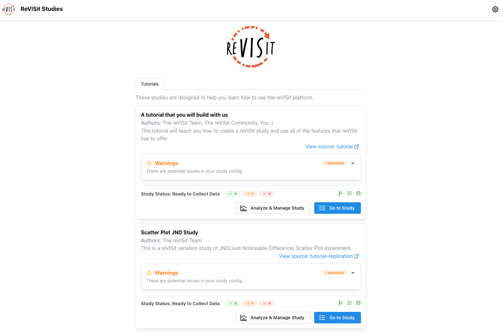
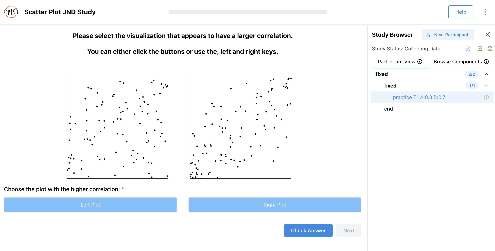
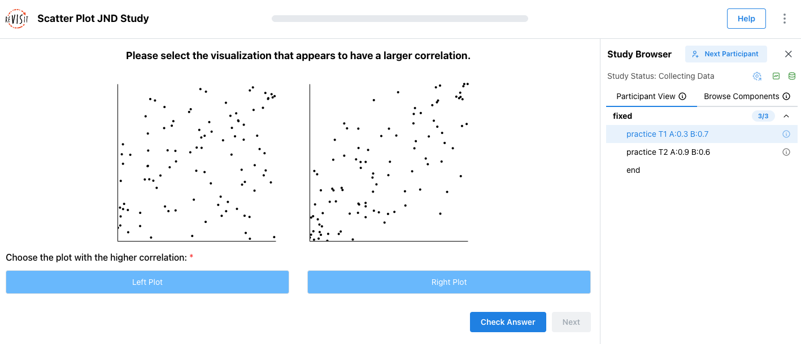
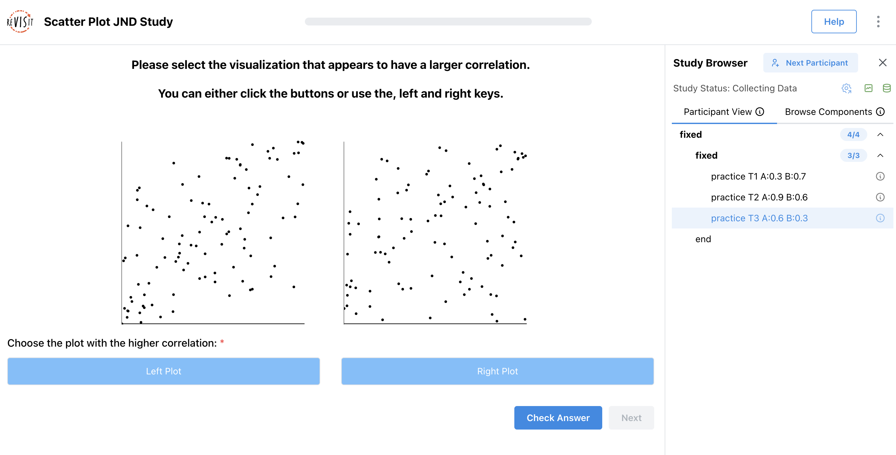
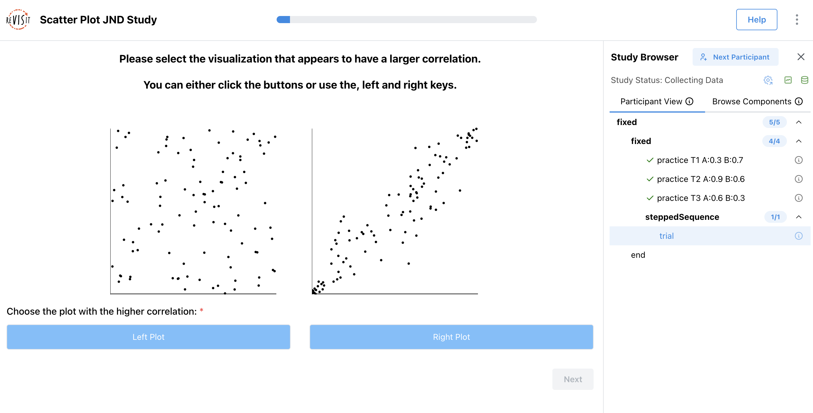

# replication-config.json

In this part of the tutorial, you will build a [Study Config](../typedoc/interfaces/StudyConfig.md) for a replication study, [`public/tutorial/replication-config.json`](https://github.com/revisit-studies/template/blob/main/public/tutorial/replication-config.json). The completed version is [`public/tutorial/_answers/replication-config.json`](https://github.com/revisit-studies/template/blob/main/public/tutorial/_answers/replication-config.json). Use the completed version to check the step you just finished, not as something to copy all at once.

:::info
Before you start editing tutorial files, complete the [Installation guide](../getting-started/installation.md) using the **Starting from the Template Repository** workflow.
:::

## Step 1: Run the local server and register the config

Start the local server from the root of your template repository:

```bash
yarn serve
```

Before editing the replication Study Config, open [`public/global.json`](https://github.com/revisit-studies/template/blob/main/public/global.json). Add `replication` to `configsList` and `configs`.

```json title="public/global.json"
{
  "$schema": "https://raw.githubusercontent.com/revisit-studies/study/v2.4.3/src/parser/GlobalConfigSchema.json",
  "configsList": ["tutorial", "replication"],
  "configs": {
    "tutorial": {
      "path": "tutorial/config.json"
    },
    "replication": {
      "path": "tutorial/replication-config.json"
    }
  }
}
```

Open [http://localhost:8080](http://localhost:8080). You should now see the replication study listed.



## Step 2: Add the reusable scatter plot base component

First, create the React wrapper that the Study Config will load. In `src/public/tutorial/assets/replication/`, add a file named `ScatterWrapper.tsx`.

```tsx title="src/public/tutorial/assets/replication/ScatterWrapper.tsx"
import {
  Center, Group, Stack, Text,
} from '@mantine/core';
import { Scatter } from './Scatter';
import { StimulusParams } from '../../../../store/types';

/**
 * Holds 2 Scatter Plots
 * @param param0 - r1 is the correlation value for 1, r2 is the correlation value for 2.
 * @returns 2 Scatter Plots
 */
export default function ScatterWrapper({ parameters }: StimulusParams<{ r1: number; r2: number }>) {
  const { r1, r2 } = parameters;
  const r1DatasetName = `dataset_${r1.toFixed(1)}_size_100.csv`;
  const r2DatasetName = `dataset_${r2.toFixed(1)}_size_100.csv`;

  return (
    <Stack style={{ width: '100%', height: '100%' }}>
      <Text style={{
        textAlign: 'center', paddingBottom: '0px', fontSize: '18px', fontWeight: 'bold',
      }}
      >
        Please select the visualization that appears to have a larger correlation.
      </Text>
      <Text style={{
        textAlign: 'center', paddingBottom: '24px', fontSize: '18px', fontWeight: 'bold',
      }}
      >
        You can either click the buttons or use the left and right arrow keys.
      </Text>
      <Center>
        <Group style={{ gap: '40px' }} mb="md">
          <Scatter r={r1} datasetName={r1DatasetName} />
          <Scatter r={r2} datasetName={r2DatasetName} />
        </Group>
      </Center>
    </Stack>
  );
}
```

This wrapper reads `r1` and `r2` from the component [`parameters`](../typedoc/interfaces/ReactComponent.md#parameters), turns them into dataset file names, and renders two scatter plots side by side.

Replace the empty [`baseComponents`](../typedoc/interfaces/StudyConfig.md#basecomponents) object with `scatterBase`.

```json title="public/tutorial/replication-config.json"
"baseComponents": {
  "scatterBase": {
    "type": "react-component",
    "path": "tutorial/assets/replication/ScatterWrapper.tsx",
    "response": [
      {
        "id": "buttonsResponse",
        "type": "buttons",
        "prompt": "Choose the plot with the higher correlation:",
        "required": true,
        "location": "belowStimulus",
        "options": [
          {
            "label": "Left Plot",
            "value": "left"
          },
          {
            "label": "Right Plot",
            "value": "right"
          }
        ]
      }
    ]
  }
}
```

`baseComponents` are templates. They are not added to the sequence directly. Other components inherit from them via `"baseComponent": "scatterBase"` and override only the fields that change, usually [`parameters`](../typedoc/interfaces/ReactComponent.md#parameters).

## Step 3: Add the first practice trial

Replace the empty [`components`](../typedoc/interfaces/StudyConfig.md#components) object with the first practice trial.

```json title="public/tutorial/replication-config.json"
"components": {
  "practice T1 A:0.3 B:0.7": {
    "baseComponent": "scatterBase",
    "parameters": {
      "r1": 0.3,
      "r2": 0.7
    },
    "correctAnswer": [
      {
        "id": "buttonsResponse",
        "answer": "right"
      }
    ],
    "provideFeedback": true
  }
}
```

This trial [inherits](../typedoc/type-aliases/InheritedComponent.md) the stimulus and response from `scatterBase`. The [`parameters`](../typedoc/interfaces/ReactComponent.md#parameters) values tell the React component which correlations to show in the left and right plots.

For this practice trial, `r2` is larger than `r1`, so the correct answer is `"right"`. The `id` in [`correctAnswer`](../typedoc/interfaces/Answer.md) must match the response id from the base component: `buttonsResponse`.

Add the first practice trial to the sequence:

```json title="public/tutorial/replication-config.json"
"sequence": {
  "order": "fixed",
  "components": [
    {
      "order": "fixed",
      "components": [
        "practice T1 A:0.3 B:0.7"
      ]
    }
  ]
}
```



## Step 4: Add the second practice trial

Add a comma after the first practice trial, then add the second practice trial.

```json title="public/tutorial/replication-config.json"
"components": {
  "practice T1 A:0.3 B:0.7": { ... },
  "practice T2 A:0.9 B:0.6": {
    "baseComponent": "scatterBase",
    "parameters": {
      "r1": 0.9,
      "r2": 0.6
    },
    "correctAnswer": [
      {
        "id": "buttonsResponse",
        "answer": "left"
      }
    ],
    "provideFeedback": true
  }
}
```

This trial uses the same base component, but with different correlation values. Here, `r1` is larger than `r2`, so the correct answer is `"left"`.

Add the second practice trial to the same fixed sequence block:

```json title="public/tutorial/replication-config.json"
"sequence": {
  "order": "fixed",
  "components": [
    {
      "order": "fixed",
      "components": [
        "practice T1 A:0.3 B:0.7",
        "practice T2 A:0.9 B:0.6"
      ]
    }
  ]
}
```



## Step 5: Add the third practice trial

Add the third practice trial after the second.

```json title="public/tutorial/replication-config.json"
"components": {
  "practice T1 A:0.3 B:0.7": { ... },
  "practice T2 A:0.9 B:0.6": { ... },
  "practice T3 A:0.6 B:0.3": {
    "baseComponent": "scatterBase",
    "parameters": {
      "r1": 0.6,
      "r2": 0.3
    },
    "correctAnswer": [
      {
        "id": "buttonsResponse",
        "answer": "left"
      }
    ],
    "provideFeedback": true
  }
}
```

Again, this trial inherits from `scatterBase`. The left plot has the higher correlation, so the answer is `"left"`.

Add the third practice trial to the sequence:

```json title="public/tutorial/replication-config.json"
"sequence": {
  "order": "fixed",
  "components": [
    {
      "order": "fixed",
      "components": [
        "practice T1 A:0.3 B:0.7",
        "practice T2 A:0.9 B:0.6",
        "practice T3 A:0.6 B:0.3"
      ]
    }
  ]
}
```

All three practice trials use [`provideFeedback`](../designing-studies/answers-trainings.md) so participants can learn what the task is asking before the study moves into the dynamic trial section.



## Step 6: Add the dynamic JND block

First, create the dynamic block function. In `src/public/tutorial/assets/replication/`, add a file named `JNDDynamic.tsx`.

```ts title="src/public/tutorial/assets/replication/JNDDynamic.tsx"
import { JumpFunctionParameters, JumpFunctionReturnVal, StoredAnswer } from '../../../../store/types';

const findLatestTrial = (allDynamicAnswers: StoredAnswer[]) => {
  const trials = allDynamicAnswers
    .sort((a, b) => parseInt(a.trialOrder.split('_').at(-1) || '0', 10) - parseInt(b.trialOrder.split('_').at(-1) || '0', 10));

  return trials.at(-1)!;
};

export default function func({ answers }: JumpFunctionParameters<{ r1: number, r2: number, counter: number }>): JumpFunctionReturnVal {
  const allDynamicAnswers = Object.values(answers)
    .filter((answer) => answer.componentName === 'trial');

  // First trial
  if (allDynamicAnswers.length === 0) {
    return {
      component: 'trial',
      parameters: {
        r1: 0.1,
        r2: 0.9,
      },
      correctAnswer: [{ id: 'buttonsResponse', answer: 'right' }],
    };
  }

  if (allDynamicAnswers.length === 9) {
    return { component: null };
  }

  const latestTrial = findLatestTrial(allDynamicAnswers);

  const right = latestTrial.parameters.r2 === 0.9;

  const approachingValue = right ? latestTrial.parameters.r1 + 0.1 : latestTrial.parameters.r2 + 0.1;

  const r1 = right ? 0.9 : approachingValue;
  const r2 = right ? approachingValue : 0.9;

  return {
    component: 'trial',
    parameters: {
      r1,
      r2,
    },
    correctAnswer: [{ id: 'buttonsResponse', answer: right ? 'left' : 'right' }],
  };
}
```

This function looks at the participant's previous dynamic trial answers. It starts with a large correlation difference, then moves the smaller correlation closer to `0.9` until the dynamic block has shown nine trials.

Then, inside the nested fixed block, add the [dynamic block](../typedoc/interfaces/DynamicBlock.md) after the three practice trials.

```json title="public/tutorial/replication-config.json"
"sequence": {
  "order": "fixed",
  "components": [
    {
      "order": "fixed",
      "components": [
        "practice T1 A:0.3 B:0.7",
        "practice T2 A:0.9 B:0.6",
        "practice T3 A:0.6 B:0.3",
        {
          "order": "dynamic",
          "id": "steppedSequence",
          "functionPath": "tutorial/assets/replication/JNDDynamic.tsx",
          "parameters": {}
        }
      ]
    }
  ]
}
```

The dynamic block calls the function at `tutorial/assets/replication/JNDDynamic.tsx`. That function decides what trial comes next and can pass `parameters` and `correctAnswer` into the next generated trial.



<!-- Importing links -->
import StructuredLinks from '@site/src/components/StructuredLinks/StructuredLinks.tsx';

<StructuredLinks
    codeLinks={[
        {name: "replication-config.json", url: "https://github.com/revisit-studies/template/blob/main/public/tutorial/replication-config.json"},
        {name: "replication-config.json Answer", url: "https://github.com/revisit-studies/template/blob/main/public/tutorial/_answers/replication-config.json"}
    ]}
    referenceLinks={[
        {name: "Installation", url: "../../getting-started/installation/"}
    ]}
/>
