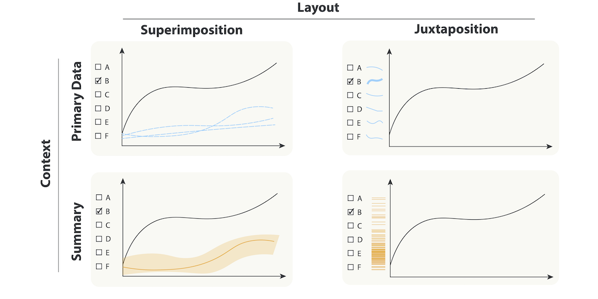

# Studies Using ReVISit

## Visualization Guardrails: Designing Interventions Against Cherry-Picking in Interactive Data Explorers



### Abstract

The growing popularity of interactive time series exploration platforms has made visualizing data of public interest more accessible to general audiences. At the same time, the democratized access to professional-looking explorers with preloaded data enables the creation of convincing visualizations with carefully cherry-picked items. Prior research shows that people use data explorers to create and share charts that support their potentially biased or misleading views on public health or economic policy and that such charts have, for example, contributed to the spread of COVID-19 misinformation. Interventions against misinformation have focused on post hoc approaches such as fact-checking or removing misleading content, which are known to be challenging to execute. In this work, we explore whether we can use visualization design to impede cherry-picking—one of the most common methods employed by deceptive charts created on data exploration platforms. We describe a design space of guardrails—interventions against cherry-picking in time series explorers. Using our design space, we create a prototype data explorer with four types of guardrails and conduct two crowd-sourced experiments. In the first experiment, we challenge participants to create cherry-picked charts. We then use these charts in a second experiment to evaluate the guardrails’ impact on the perception of cherry-picking. We find evidence that guardrails—particularly superimposing relevant primary data—are successful at encouraging skepticism in a subset of experimental conditions but come with limitations. Based on our findings, we propose recommendations for developing effective guardrails for visualizations.

### Citation

Maxim Lisnic, Zach Cutler, Marina Kogan, Alexander Lex
Visualization Guardrails: Designing Interventions Against Cherry-Picking in Interactive Data Explorers
Preprint, doi:10.31219/osf.io/4j9nr, 2024.

### BibTeX

```
@preprint{2024_preprint_guardrails,
  title = {Visualization Guardrails: Designing Interventions Against Cherry-Picking in Interactive Data Explorers},
  author = {Maxim Lisnic and Zach Cutler and Marina Kogan and Alexander Lex},
  booktitle = {Preprint},
  doi = {10.31219/osf.io/4j9nr},
  year = {2024}
}
```

### Acknowledgements

This work is supported by the National Science Foundation (IIS 2041136, IIS 1751238, and CNS 2213756).

<!-- Information Needed:

Title
Link
Abstract
Acknowledgements

 -->
