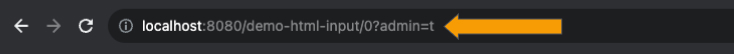
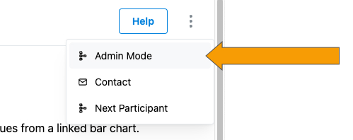
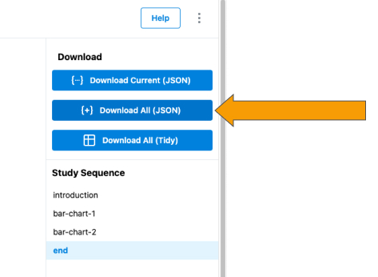

# Downloading User Data

reVISit allows you to download participant's data using an admin interface -- there is no need to interact with Firebase directly. To start, navigate to a study that you wish to download participants data from. Then, add `?admin=t` to the url like in the image below.

<!--  -->

Next, you should see three vertical dots next to the `Help` button in the upper right hand of the view. Clicking this will open up the dropdown menu to access admin mode.

Now that you are in admin mode, navigate to the end of the study. Once at the end, you should see options to download user data as shown below:

    

    Currently, only JSON data is able to be exported by reVISit. We have plans to support Tidy CSV in the near future. 
    

:::warning
Currently, only JSON data is able to be exported by reVISit. We have plans to support Tidy CSV in the near future. 
:::

The file downloaded is a JSON object containing information about the participant's answers, how they interacted with each component, and which config they were served. You can find more explicit documentation about the data structure [here](../typedoc/interfaces/ParticipantData).